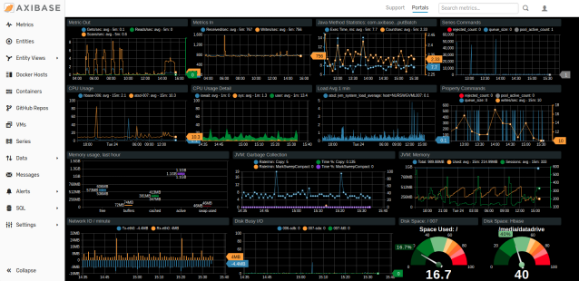
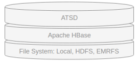

# Introduction

**Axibase Time Series Database** is a special-purpose database optimized for collecting and analyzing time-series data from IT infrastructure, industrial equipment, and [financial markets](./finance/README.md).



## Technology Stack

ATSD is supported on major Linux distributions in 64-bit mode.

In scale-out mode ATSD is deployed on [Apache HBase](https://hbase.apache.org/) on top of file systems such as [Hadoop](./installation/cloudera.md) (HDFS), [Amazon EMRFS](./installation/aws-emr-s3.md), and [Azure Storage](./installation/azure-hdinsight.md).



## Compute Scalability

A single-node ATSD instance can process up to 200,000 metrics per second without any loss of numeric precision. It can handle out-of-order writes and microsecond precision.

## Storage Scalability

Compared to [relational databases](./administration/compaction/README.md), ATSD requires up to **50 times** less disk space.

## Use Cases

* High-performance metrics backend.
* Consolidated statistics repository.
* Centralized monitoring system.
* Financial last trade and order statistics data store.

## Components

ATSD is a modular systems which includes the following components in addition to the core storage engine:

* [Rule Engine](./rule-engine/README.md)
* [SQL Engine](./sql/README.md)
* [Portal Server](./portals/README.md)
* [Charts Library](https://axibase.com/docs/charts)
* [Search Service](./search/README.md)
* [REST API](./api/data/README.md) Server
* [Network API](./api/network/README.md) Server
* [CSV Processor](./parsers/csv/README.md)

## Inserting Data

* Upload CSV.
* Stream CSV.
* Stream network commands via TCP/UDP.
* Stream network commands with Kafka.
* Insert data using REST API.
* Insert rows using [JDBC driver](https://github.com/axibase/atsd-jdbc/blob/master/insert.md).
* Use API clients or storage drivers.
* Install pre-integrated collectors/agents.
* Deploy [Axibase Collectors](https://axibase.com/docs/axibase-collector/) to copy data from relational databases, plant historians, and IT infrastructure using open and proprietary protocols.

> For more information about inserting data, refer to [Writing Data](./writing-data.md).

## Line Protocols

ATSD provides an optimized line protocol to insert high volumes of metrics with user-defined dimensions called [network commands](api/network/README.md).

```bash
echo "series e:sns-001 m:temperature=15.4 m:rpm=302 t:panel=front" \
  > /dev/tcp/atsd_hostname/8081
```

The commands can be streamed into ATSD on ports `8081/tcp`, `8082/udp` or uploaded to the [`/api/v1/command`](api/data/ext/command.md) REST API endpoint.

The following protocols are supported for extended compatibility:

* [`tcollector`](api/network/tcollector.md)
* [`graphite`](api/network/graphite.md)
* [`statsd`](api/network/statsd.md)
* [`osisoft pi`](api/network/picomp2.md)

## Schema

New entities and metrics are registered by the database automatically and support the collection of data from numerous different domain models in a single extensible schema.

The underlying tables are listed on the **Settings > Storage > Database Tables** page. Table schemas are **self-managed** by the database.

### Glossary

| Name | Description |
|---|---|
| `Entity` | Name of the object being monitored. |
| `Metric` | Name of the numeric attribute describing the object. |
| `Sample` | Timestamped numeric metric value, `time:value`. |
| `Series` | Sequence of `Samples`, identified by a composite key consisting of `Metric`, `Entity`, and optional `Tags`. |
| `Tag` | Custom attribute describing the `Metric`, `Entity`, or `Series`, and consisting of a name and a value, `name:value`. |

### Example

The commands listed below store temperature observations for the bioreactor enclosure `BR1740` located at site `SVL2` in Sunnyvale, as well as room temperature at the same site.

Metadata commands contain descriptive attributes sent initially and on change.

```elm
entity e:BR1740 t:type=Bioreactor t:city=Sunnyvale t:site=SVL2
entity e:SVL2   t:type=site       t:city=Sunnyvale
metric m:Temperature t:units=Celsius
```

Series commands carry the actual measurements and contain only the series key.

```elm
series d:2018-05-20T00:15:00Z e:BR1740 m:Temperature=70.5 t:part=enclosure
series d:2018-05-20T00:15:00Z e:SVL2   m:Temperature=25.2
series d:2018-05-20T00:16:00Z e:BR1740 m:Temperature=72.5 t:part=enclosure
series d:2018-05-20T00:16:00Z e:SVL2   m:Temperature=25.1
...
```

By separating **metadata** and **time series** data, each type of information is stored more efficiently. Both types of data are readily available and can be accessed in SQL queries and REST API requests.

```sql
SELECT datetime, value, entity
  FROM atsd_series
WHERE metric = 'Temperature'
  AND entity.tags.type = 'Bioreactor'
  ORDER BY datetime
```
