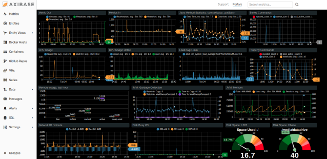
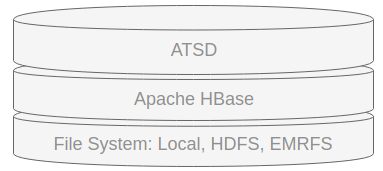

# Introduction



**Axibase Time Series Database** is a non-relational database optimized for collecting, storing, and analyzing temporal data from IT infrastructure, industrial equipment, smart meters, and IoT devices.

## Technology Stack



ATSD is written in Java, supported on Linux distributions in 64-bit mode, and requires a Java 8 runtime environment.

Underneath ATSD is [Apache HBase](https://hbase.apache.org/) which persists key-value pairs in the underlying file system such as `ext4`, [Hadoop Distributed File System](./installation/cloudera.md) (HDFS), and [Amazon EMRFS](./installation/aws-emr-s3.md).

Install ATSD via `deb` and `rpm` [packages](./installation/README.md#packages) or launch ATSD as a Docker [container](./installation/docker.md#start-container).

## Compute Scalability

A single-node ATSD instance can process up to 200,000 metrics per second with millisecond accuracy and handle out-of-order sample writes without any loss of numeric precision.

Scale the number of metrics inserted per second by adding **region servers** to the underlying HBase cluster.

## Storage Scalability

Storage efficiency ultimately determines how many metrics and individual series can be stored in the system.

Compared to traditional databases, ATSD requires up to **50 times** less disk space. Refer to [compression tests](./administration/compaction/README.md) for more details.

Scale storage capacity by adding data nodes to the underlying HDFS cluster. With ATSD and [AWS EMR](./installation/aws-emr-s3.md), storage capacity is right-sized automatically, completely independent of  processing capacity.

## Use Cases

* High-performance metrics backend.
* Consolidated statistics repository.
* Centralized monitoring system.
* EDM database.
* Data Lake component for time series data.
* Econometrics data store.

## Components

ATSD is a modular systems which includes the following components in addition to the core storage engine:

* [REST API](./api/data/README.md) Server
* [Network API](./api/network/README.md) Server
* [CSV Processor](./parsers/csv/README.md)
* [Rule Engine](./rule-engine/README.md)
* [SQL Engine](./sql/README.md)
* [Search Engine](./search/README.md)
* [Portal Server](./portals/README.md)

## Inserting Data

* Upload CSV.
* Stream CSV.
* Stream network commands via TCP/UDP.
* Stream network commands with Kafka.
* Insert data using REST API.
* Insert rows using [JDBC driver](https://github.com/axibase/atsd-jdbc/blob/master/insert.md).
* Use API clients or storage drivers.
* Install pre-integrated collectors/agents.
* Deploy [Axibase Collectors](https://axibase.com/docs/axibase-collector/).

## Line Protocols

ATSD provides an optimized line protocol to insert high volumes of metrics with user-defined dimensions called [network commands](api/network/README.md).

```bash
echo "series e:sns-001 m:temperature=15.4 m:rpm=302 t:panel=front" \
  > /dev/tcp/atsd_hostname/8081
```

Stream commands into ATSD on ports `8081/tcp`, `8082/udp` or upload commands directly to the [`/api/v1/command`](api/data/ext/command.md) REST API endpoint.

The following protocols are supported for extended compatibility:

* [`tcollector`](api/network/tcollector.md)
* [`graphite`](api/network/graphite.md)
* [`statsd`](api/network/statsd.md)
* [`osisoft pi`](api/network/picomp2.md)

## Schema

New entities and metrics are registered by the database automatically and support the collection of data from numerous different domain models in a single extensible schema.

View the list of underlying tables on the **Settings > Storage > Database Tables** page. Table schemas are self-managed by the database.

### Glossary

* `Entity`: Name of the object being monitored.
* `Metric`: Name of the numeric attribute describing the object.
* `Sample`: Timestamped metric value, `time:number`.
* `Series`: Sequence of Samples.
* `Tag`: Custom attribute describing the `Entity`, `Metric`, or `Series`, consists of a name and a value, `name:value`.

### Example

Store temperature observations for the bioreactor enclosure `BR1740` located at site `SVL2` in Sunnyvale, California, as well as room temperature at the same site then send these commands into ATSD.

Metadata commands contain descriptive attributes sent once initially and subsequently whenever the attribute changes.

```elm
entity e:BR1740 t:type=Bioreactor t:city=Sunnyvale t:site=SVL2
entity e:SVL2   t:type=site       t:city=Sunnyvale
metric m:Temperature t:units=Celsius
```

Series commands carry the actual measurements and contain only those attributes needed to identify the series.

```elm
series d:2018-05-20T00:15:00Z e:BR1740 m:Temperature=70.5 t:part=enclosure
series d:2018-05-20T00:15:00Z e:SVL2   m:Temperature=25.2
series d:2018-05-20T00:16:00Z e:BR1740 m:Temperature=72.5 t:part=enclosure
series d:2018-05-20T00:16:00Z e:SVL2   m:Temperature=25.1
...
```

By separating inserted data into metadata and time series data, each type of information is stored and processed separately and thus, more efficiently. Further, both types of data are readily available and seamlessly joined upon database query.

```sql
SELECT datetime, value, entity, entity.tags.type
  FROM atsd_series
WHERE metric = 'Temperature'
  AND entity = 'BR1740'
  ORDER BY datetime
```
