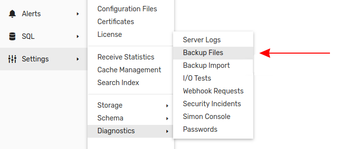
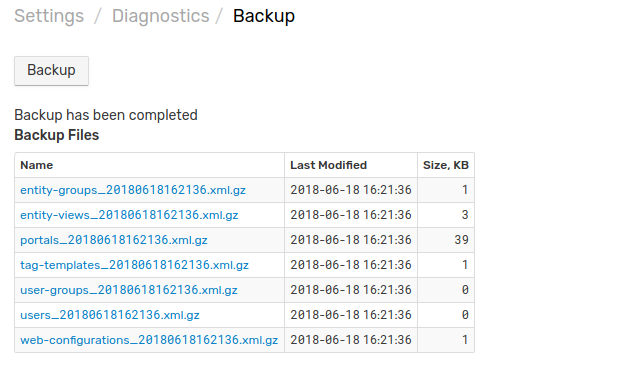
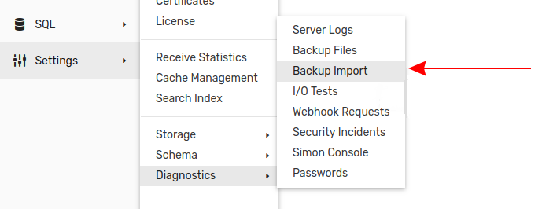
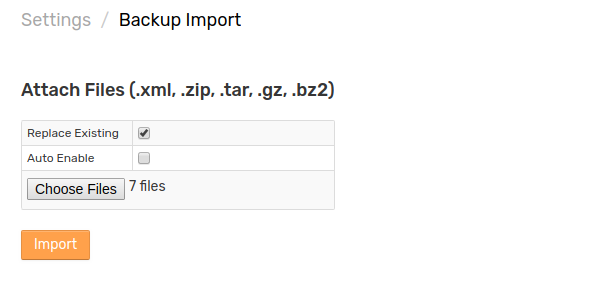

# Backup and Restore ATSD Data

This article describes how to create a backup of ATSD data and use the backup to restore ATSD.

## Create Backup in Web Interface

Open the **Settings** menu, expand the **Diagnostics** section and select **Backup Files**.



Create a new backup by clicking **Backup**. New backup files will appear in the **Backup Files** table alongside **Last Modified** and **Size, KB** information.



Download individual backup files in gzipped XML format by clicking the link in the **Name** column or access the `backup` folder at `/opt/atsd/atsd/backup`.

## Import Backup Files in Web Interface

Open the **Settings** menu, expand the **Diagnostics** section and select **Backup Import**.



Add the desired backup files by clicking **Choose Files**. If needed, select multiple files. Click **Import** to add the selected backup files to ATSD.



**Replace Existing** checkbox toggles whether or not ATSD deletes existing data which matches incoming data. If disabled, and matching data exists in the database, ATSD does not import matching incoming data.

**Auto Enable** setting toggles whether or not uploaded data is [enabled](./data_retention.md#disable-metric) by default.

## Configure Automatic Backup Schedule

The [**Server Properties**](./server-properties.md) page contains the `internal.backup.schedule` property. By default, ATSD creates a backup at `/opt/atsd/atsd/backup` every day at 11:30 PM server local time.

Configure the [`cron`](https://axibase.com/docs/axibase-collector/scheduling.html#cron-expressions) expression as needed to modify this schedule.

New backup files do not replace existing backup files.

## Node Replication

To replicate an ATSD master node to an slave node, follow the instructions in [Replication](./replication.md).

## Manual Copy

To manually copy ATSD files to a new location, follow these steps. Note that this method only applies to [standalone](../installation/README.md#packages) ATSD instances.

1. Stop ATSD.

    ```sh
    /opt/atsd/bin/atsd-all.sh stop
    ```

2. Copy the `/opt/atsd` directory to the desired location.

    ```sh
    cp -a /opt/atsd/  /new/directory/opt/atsd/
    ```

3. Start ATSD from the new directory.

    ```sh
    /new/directory/opt/atsd/bin/atsd-all.sh start
    ```

## HBase Backup

Axibase is built on [Apache HBase](../README.md#technology-stack), which supports separate [Backup and Restore](https://hbase.apache.org/book.html#backuprestore) functionality.

Follow the procedure shown below:

1. Choose backup location: within a cluster, using a dedicated cluster, to the cloud, or a storage vendor appliance.
1. Allow the `hbase` system user in [YARN](https://hbase.apache.org/book.html#br.initial.setup).
1. Modify the `hbase-site.xml` file to support backup by adding the following properties and restart HBase.

    ```java
    <property>
      <name>hbase.backup.enable</name>
      <value>true</value>
    </property>
    <property>
      <name>hbase.master.logcleaner.plugins</name>
      <value>org.apache.hadoop.hbase.backup.master.BackupLogCleaner,    ...</value>
    </property>
    <property>
      <name>hbase.procedure.master.classes</name>
      <value>org.apache.hadoop.hbase.backup.master.    LogRollMasterProcedureManager,...</value>
    </property>
    <property>
      <name>hbase.procedure.regionserver.classes</name>
      <value>org.apache.hadoop.hbase.backup.regionserver.    LogRollRegionServerProcedureManager,...</value>
    </property>
    <property>
      <name>hbase.coprocessor.region.classes</name>
      <value>org.apache.hadoop.hbase.backup.BackupObserver,...</value>
    </property>
    <property>
      <name>hbase.master.hfilecleaner.plugins</name>
      <value>org.apache.hadoop.hbase.backup.BackupHFileCleaner,...</value>
    </property>
    ```

1. Create an HBase backup image.

    ```sh
    hbase backup create <type> <backup_path>
    ```
1. Restore HBase from backup image.

    ```sh
    hbase restore <backup_path> <backup_id>
    ```