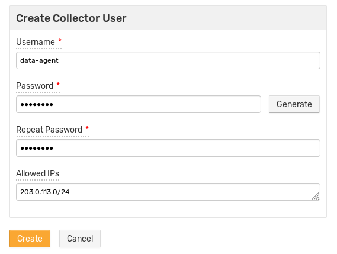
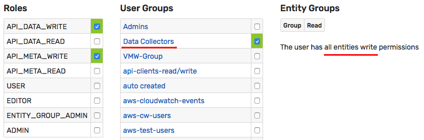

# Collector Account

Creating `collector` accounts with permissions limited to data collection is recommended for enhanced security.

This type of account is typically used by data collection agents, storage drivers, and scripts to insert data for all or specific entities, including new entities.

Such accounts must be granted both the `API_DATA_WRITE` and `API_META_WRITE` roles as well as entity `write` permissions.

## Create User Group

* Open the **Settings > Users > User Groups > Create** page.
* Create the `collectors` group with `All Entities: Write` permission.

## Create User

* Open the **Settings > Users > Create** page.
* Create a `collector` user with `API_DATA_WRITE` and `API_META_WRITE` roles.
* Check the `collectors` row in the User Groups table to add the user to the `collectors` group.

## Use Wizard

To simplify user management, the database provides a wizard to create a typical `collector` account.

To create a new user of this type, open the **Settings > Users** page and select **Create Collector User** option from the split button located below the **Users** table.

Specify an optional IP range to restrict the addresses from which the collector is allowed to connect to the database.

The wizard creates a new user account automatically and adds the user to the **Data Collectors** user group with permissions to collect data for all entities.

