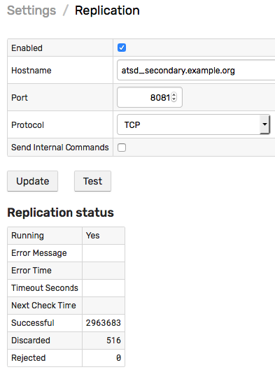
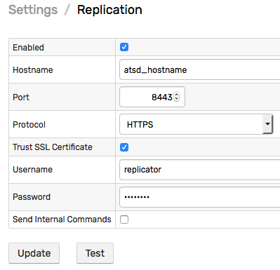
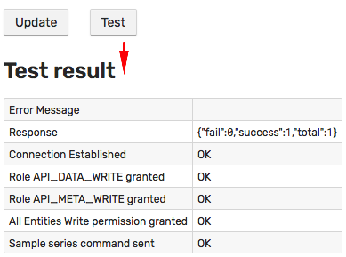
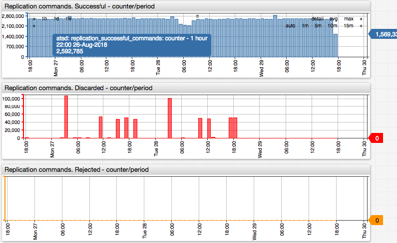

# Command Replication

To copy the received **data** commands to another ATSD instance, configure the destination on the **Settings > Replication** page.



## Protocols

Supported transport protocols:

* UDP
* TCP
* HTTPS



When **Send Internal Commands** is disabled, monitoring data generated by the `atsd` entity are not sent to the target ATSD server.

## Permissions

Permission checks are disabled for UPD and TCP protocols.

To send commands via HTTPS, specify credentials for a user account with the following [roles and permissions](user-authorization.md):

* `API_DATA_WRITE` Role.
* `API_META_WRITE` Role.
* `All Entities: Write` permission.

The permissions are checked when testing.



## Error Handling

The replicated commands are not resent in case of network or other errors.

## Monitoring

Replication status can be [monitored](monitoring.md) with the built-in metrics generated by entity `atsd`:

* `replication_successful_commands`
* `replication_discarded_commands`
* `replication_rejected_commands`

:::tip Note
Replication metrics are incrementing integer counters which are reset on database restart.
:::



Portal Configuration:

```ls
[configuration]
  title = ATSD Replication Status
  offset-right = 50
  height-units = 4
  width-units = 1
  timespan = 24 hour
  entity = atsd
  period = 5 minute
  statistics = counter
  mode = column
  server-aggregate = true
  display-panels = true
  expand-panels = true
  
[group]
  widgets-per-row = 1

[widget]
  type = chart
  title = Replication commands. Successful - counter/period

  [series]
    metric = replication_successful_commands

[widget]
  type = chart
  title = Replication commands. Discarded - counter/period
  [series]
    metric = replication_discarded_commands
    color = red

[widget]
  type = chart
  title = Replication commands. Rejected - counter/period
  [series]
    metric = replication_rejected_commands
    color = orange

[widget]
  type = chart
  title = Commands In - Per Second - Period Average
  statistics = avg
  mode = line
  label-format = javascript:keepBefore(metric, '_')

  [series]
    metric = metric_received_per_second
  
  [series]
    metric = property_received_per_second

  [series]
    metric = message_received_per_second
```