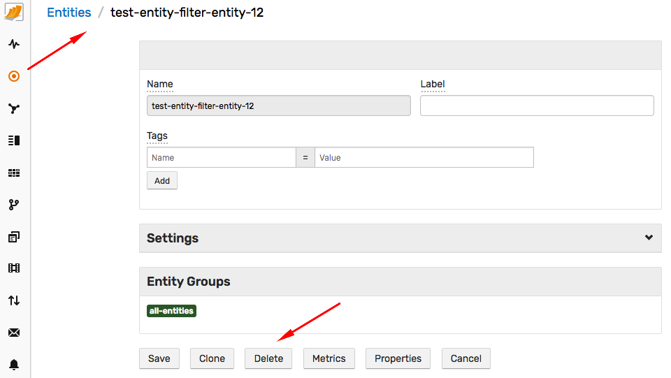
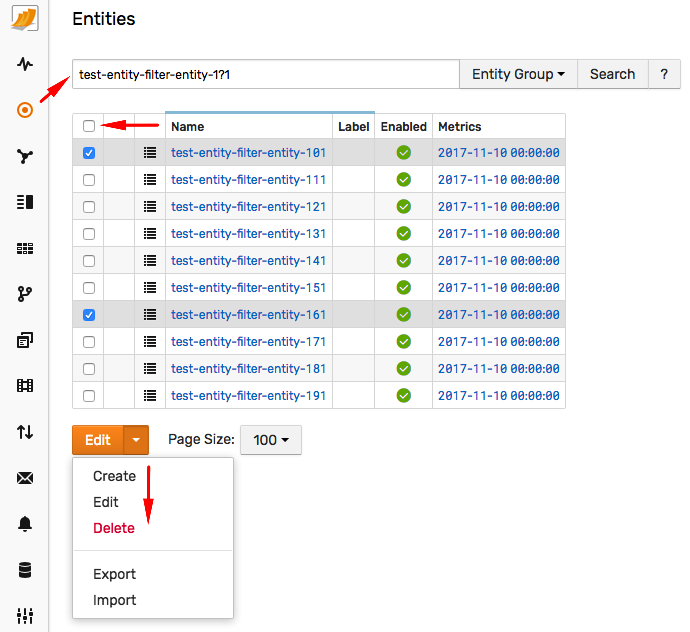

# Data Retention

Retention settings control database size by automatically removing old data as well as discarding unnecessary data before the records are stored on disk.

## Default Retention Settings

| **Data Type** | **Data Table Name** | **Retention** |
|---|---|---|
| Series | `atsd_d` | Not deleted. |
| Properties | `atsd_properties` | Not deleted. |
| Messages | `atsd_message` | [Deleted](../api/data/messages/delete.md) after `messages.timeToLive` seconds.<br>Default is 1 year. |

## Data Tables

Current data table sizes are displayed on the **Settings > Storage > Database Tables** page, in the **Store File Size** column.

The table which stores time series data is `atsd_d`.


Click **Store File Size** to view file size growth over time. The size of the `atsd_d` table varies throughout the day as compaction / pruning tasks defragment and delete data in the background.

 

To view daily changes in tabular format, open the ATSD portal in the top menu. The table widget in the bottom left corner contains both the current table size as well as the daily change.


## Space Usage Breakdown

While the breakdown of space usage within the `atsd_d` is not available, the database provides a top-N view consisting of most frequently collected series.

The **Top Inserts** table is accessible on the **Settings > Receive Statistics** page.


You can refer to this view to identify series with the largest amount of data being inserted.

## Retention Settings

The amount of time series data stored in the database is controlled using one of the following methods:

* [Disabling](#disable-metric) the metric.
* Disabling metric [persistence](#disable-persistence).
* Applying [filters](#set-persistence-filter) to discard values for matched series.
* Deleting [expired data](#delete-expired-data) outside a specified retention period.
* Deleting [expired series](#delete-expired-series) if no data has been received for the series within a specified retention period.

Since the data is deleted by staged [background tasks](#scheduled-tasks), it takes a few days for new settings to reduce disk usage to the full extent.

### Disable Metric

If the metric is **disabled**, the data for such metric is discarded when received. The data for disabled metrics is also **ignored** by the rule engine.

To disable a metric, open the **Metric Editor**, expand **Settings** section, set **Enabled** switch to **No**, and click **Save**.


Alternatively, use [group editor](#group-editor) to modify multiple metrics at once.

Discarded commands for disabled metrics are logged with `DISABLED_METRIC` token in the `commands_discarded.log` listed on the **Settings > Diagnostics > Server Logs** page:

```ls
2018-03-29 05:56:21,087;DISABLED_METRIC;series e:nurswgvml502 ms:1522302980000 t:collector=bosun.org/cmd/scollector/collectors.c_ipcount_linux t:os=linux m:scollector.collector.duration=0.003668194
```

> Note that existing data already stored in the database for a disabled metric is not removed from disk automatically.

### Disable Persistence

The data for **non-persistent** metrics is not stored on disk. Such metrics are still processed in the rule engine.

To disable persistence for a metric, open the **Metric Editor**, expand **Settings** section, set **Persistent** switch to **No**, and click **Save**.


Alternatively, use [group editor](#group-editor) to modify multiple metrics at once.

Discarded commands for non-persistent metrics are logged with a `NON_PERSISTENT_METRIC` token in the `commands_discarded.log`:

```ls
2018-03-29 05:56:21,518;NON_PERSISTENT_METRIC;series e:nurswgvml010 ms:1522302981000 t:remote=192.0.2.1 m:ntp.stratum=2
```

> Note that existing data already stored in the database for a non-persistent metric is not removed from disk automatically.

### Set Persistence Filter

To selectively discard some series generated by the metric, define a **persistence filter** [expression](../administration/metric-persistence-filter.md).

Only series that satisfy the condition are stored on disk. All series for this metric continue to be processed in the rule engine.

To set the filter for a metric, open the **Metric Editor**, expand the **Settings** section, enter an expression into the **Persistence Filter** field, and click **Save**.


Alternatively, use [group editor](#group-editor) to modify multiple metrics at once.

Discarded commands for metrics with persistence filters are logged with a `FILTERED_METRIC` token in the 'commands_discarded.log':

```ls
2018-03-29 05:56:28,075;FILTERED_METRIC;series e:nurswgvmw016 ms:1522302699000 t:method=copy t:site=DefaultWebSite m:iis.requests=0
```

> Note that existing data already stored in the database is **not** removed from disk automatically, even if the series no longer matches the filter.

#### Filter Examples

* Discard (do not persist) series with tag `site` equal to `DefaultWebSite`

```javascript
tags.site != `DefaultWebSite`
```

* Discard series with tag `id` starting with `lo`

```javascript
tags.id NOT LIKE 'lo*'
```

* Discard series with tag `disk` equal `/boot` or starting with `/run`

```javascript
tags.disk != '/boot' && tags.disk NOT LIKE '/run*'
```

* Discard series if tag `mount_point` matches any element in named collection `ignore-collector-mount-points`.

```javascript
!likeAny(tags.mount_point, collection('ignore-collector-mount-points'))
```

```txt
/boot
/dev*
/proc*
/run*
/var*
/sys/fs/cgroup
```

* Discard series if tag `id` is contained in named collection `filesystem_ignore`.

```javascript
!collection('filesystem_ignore').contains(tags.id)
```

```txt
/run
/run/shm
/dev
/run/lock
/boot
```

### Delete Expired Data

To delete **old data** beyond the retention period for the selected metric, open the **Metric Editor**, expand the **Settings** section, and set the **Retention Days** field to a positive integer, click **Save**.

To disable deletion, set the **Retention Days** field back to zero.


This causes the expired data, older than current time minus the specified retention period, to be deleted by a [background task](#scheduled-tasks) which is executed once a day during night-time hours.

#### Group Editor

To apply this setting to multiple metrics at once, open the Metrics tab and enter a pattern for matching multiple metrics by name.


Check individual records or select all records by checking the box in the header.


Open the group editor and modify the **Retention Days** setting. To disable deletion, set **Retention Days** to zero.


### Delete Expired Series

To delete **all data** for an old series, open the **Metric Editor**, expand the **Settings** section, and set the **Series Retention Days** field to a positive integer, click **Save**.

To disable deletion, set the **Series Retention Days** field back to zero.


Alternatively, use [group editor](#group-editor) to modify multiple metrics at once.

This setting causes all data to be deleted for those series which have not received new values for more than the specified number of days. If the series has recent data, no data for such a series is deleted. This setting cleans the database from old/discontinued series while retaining all data for active series.

If **Series Retention Days** is set to **1 year** in the example below, the database deletes three highlighted series that have not been updated since 2015/2016. The data for the remaining active series is left untouched.


The data is deleted by a [background task](#scheduled-tasks) which is executed once a day during off-peak hours.

## Scheduled Tasks

The expired data is deleted from the database on a schedule which is synchronized with other data management tasks.


The optimal sequence of tasks is as follows:

1. `delete.schedule`
2. `expired.series.removal.schedule`
3. `expired.data.removal.schedule`
4. `data.compaction.schedule`
5. `hbase.compaction.schedule`

Schedule the tasks to rune once a day during off-peak/night-time hours. Change the `hbase.compaction` task to tune once a week on large clusters.

To trigger these tasks manually, open **Settings > Storage > Delete Tasks** and execute them manually.


## Deleting with UI

### Deleting Entities

To delete a single entity, locate the entity, open the **Entity Editor** and click **Delete**.

This causes **all** series collected for the entity to be deleted.



To delete **multiple** entities, specify the search pattern on the Entities tab.

Select all or multiple matching entities using the checkbox controls, and click **Delete** in the split-button.



Series can be re-inserted for a new entity with the same name without any collisions. The new entity is assigned a unique identifier.


### Deleting Metrics

To delete a single metric, locate the metric, open the **Metric Editor** and click **Delete**.

This causes **all** series collected for the metric to be deleted.


To delete **multiple** metrics, specify the search pattern on the Metrics tab.

Select all or multiple matching metrics using the checkbox controls, and click **Delete** in the split-button.


Series can be re-inserted for a new metric with the same name without any collisions. The new metric is assigned a unique identifier.

### Deleting Series

> Only one series can be deleted at a time.

Locate the series.


Open the **Series Statistics** page. Click **Delete**.


Note that series removed with this method is masked with a [Delete](../api/data/series/delete.md#delete-markers) marker which prevents the data for the **same** series from being visible until the next HBase compaction.

### Deleting Properties

Open the **Properties** page for the specified entity.


Select the property keys to be deleted and choose **Delete** action from the split-button.


Note that properties removed with this method are masked with a [Delete](../api/data/series/delete.md#delete-markers) marker which prevents the data for the **same** property type and entity from being visible until the next HBase compaction.

### Deleting Messages

Not supported in the web interface.

## Deleting with API

* Metric [delete](../api/meta/metric/delete.md)
* Entity [delete](../api/meta/entity/delete.md)
* Series [delete](../api/data/series/delete.md)
* Properties [delete](../api/data/properties/delete.md)
* Message [delete](../api/data/messages/delete.md)

Note that series and properties removed with these methods are masked with [Delete](../api/data/series/delete.md#delete-markers) markers which prevents the data for the **same** series or property from being visible until the next HBase compaction.

## Deleting with API Clients

* Refer to Python client [examples](https://github.com/axibase/atsd-api-python#record-cleanup)

## Summarizing Expiring Data

To retain statistical averages based on expiring detailed data, use [scheduled SQL](../sql/scheduled-sql-store.md) queries with the **Store** option.

Schedule the queries to execute before the raw data is deleted.

In the example below, the query runs every night (at 00:15) to calculate hourly average and maximum for each series in the underlying metrics.


The derived metrics are then stored under new names.


```sql
SELECT datetime, entity, tags.*,
  -- specify derived metric names, for example {metric}_{function}_{period}
  ROUND(AVG(value), 0) AS "disk_used_avg_1h",
  ROUND(MAX(value), 0) AS "disk_used_max_1h"
  -- specify metric with raw data to summarize
FROM disk_used
  WHERE datetime >= previous_day AND datetime < current_day
  -- choose summarization period, such as 1-hour
GROUP BY entity, tags, PERIOD(1 HOUR)
```

## Understanding Data Growth

In addition to more data being collected for existing series, data is continuously inserted for new metrics, entities, and series.

To monitor these parameters, create a new [portal](../portals/portals-overview.md#create-portal) with the following table widget:


The widget displays the current number of records as well as weekly change.

`last.series.count.{period}` metrics display the number of updated series within the specified period.

```ls
[widget]
  type = table
  timespan = 1 week
  entity = atsd

  column-entity = null
  column-time = null

  [column]
    key = value
    label = Value
  [column]
    key = delta
    label = Weekly Change
    series-value = delta()

  [series]
    metric = last.metric.count
  [series]
    metric = last.entity.count
  [series]
    metric = last.series.count
  [series]
    metric = last.series.count.1h
  [series]
    metric = last.series.count.1d
  [series]
    metric = last.series.count.1w
```