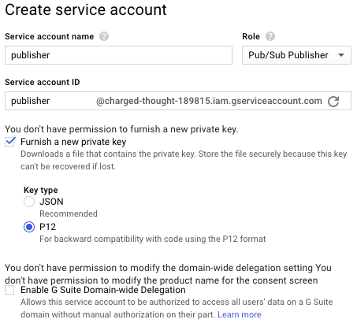

# Installing GCP Service Account Key

## Overview

To support integration with [GCP Pub/Sub Service](https://cloud.google.com/pubsub/), first create a service account in the API Console and then import a created key into ATSD keystore.

## Create Service Account

Create a service account with 'Pub/Sub Publisher' role as described in this [document](https://developers.google.com/identity/protocols/OAuth2ServiceAccount#creatinganaccount).

1. Open the [Service accounts page](https://console.developers.google.com/projectselector/iam-admin/serviceaccounts). If prompted, select a project.
2. Click **Create service account**.
3. In the **Create service account** window, enter a name for the service account, select a `Pub/Sub Publisher` role and select `Furnish a new private key` with `P12` key type. Then click **Create**.

For example, create a service account with name `publisher`:



When a service account will be created, the account's private key will be saved on your computer.

## Import Account's Private Key

Import the saved private key into the ATSD keystore.

```bash
keytool -v -importkeystore -srckeystore {P12_FILE_NAME} -srcstoretype PKCS12 -alias privatekey -srcstorepass notasecret -destkeystore /opt/atsd/atsd/conf/server.keystore -deststoretype JKS -destalias {GCP_KEY_ALIAS} -destkeypass {KEY_PASSWORD}
```

Replace `{P12_FILE_NAME}` with saved file name.<br/>
Replace `{GCP_KEY_ALIAS}` with your alias. The alias must start with `gcp` prefix.<br/>
Replace `{KEY_PASSWORD}` with your key manager password (The property `https.keyManagerPassword` in the `/opt/atsd/atsd/conf/server.properties` file. Before using the value of property, deobfuscate it).

Check the contents of the keystore:

```bash
keytool -list -keystore server.keystore
```

The output should contain at least 2 entries: atsd and gcp keys.

```bash
Keystore type: JKS
Keystore provider: SUN

Your keystore contains 2 entries

atsd, Dec 5, 2014, PrivateKeyEntry,
Certificate fingerprint (SHA1): ...
gcp_publisher, Dec 28, 2017, PrivateKeyEntry,
Certificate fingerprint (SHA1): ...
```
