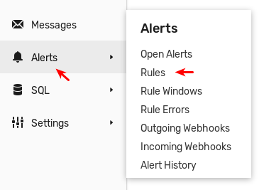
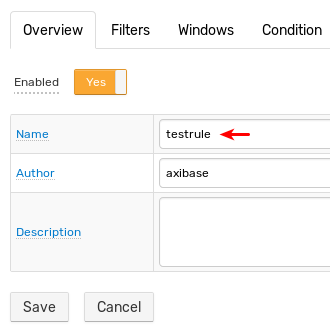
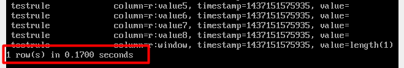

# HBase Replication

This guide describes how to configure replication at the HBase level to replay all changes from the primary cluster on the secondary cluster.

For the purpose of this document:

* `primary_hmaster_hostname` is the hostname of the HBase Master host on the _primary_ cluster.
* `primary_secondary_hostname` is the hostname of the HBase Master on the _secondary_ cluster.

:::tip Related Feature
To replicate the incoming data commands, enable [Command Replication](command-replication.md) option instead.
:::

## Requirements

:::warn
The replication can be enabled only for new ATSD installations.
Executing these steps leads to the loss of previously stored data on both the master and secondary clusters.
:::

* Both the primary and secondary servers must satisfy OS and hardware [requirements](../installation/requirements.md).
* The same HBase and ATSD co-processor versions must be installed on both servers.
* The secondary cluster must have no ATSD servers connected to it to prevent collisions.

## Installation

**Complete this step on both servers – primary and secondary.**

Stop ATSD and HBase components:

```sh
/opt/atsd/bin/atsd-all.sh stop
```

Add HMaster IP addresses to `/etc/hosts` file:

```elm
127.0.0.1    localhost
primary_hmaster_ip    primary_hmaster_hostname
secondary_hmaster_ip     secondary_hmaster_hostname
```

Example of a correct `hosts` file:

```elm
127.0.0.1    localhost
192.0.2.0    atsd_p
192.0.2.1    atsd_s
```

Enable replication in the `hbase-site.xml` file:

```xml
<property>
    <name>hbase.replication</name>
    <value>true</value>
</property>
```

**SECONDARY: Complete this process on the secondary HMaster server.**

Edit the `atsd-all.sh` file to disable ATSD startup:

```sh
sudo nano /opt/atsd/bin/atsd-all.sh
```

Comment out the following strings in the `start_all` function:

```bash
${ATSD_TSD} start
if [ ! $? -eq 0 ]; then
    return 1
fi
```

Result:

```bash
#   ${ATSD_TSD} start
#   if [ ! $? -eq 0 ]; then
#       return 1
#   fi
```

Start Hadoop and HBase:

```sh
/opt/atsd/bin/atsd-all.sh start
```

Run the replication configuration script:

```sh
/opt/atsd/hbase_util/configure_replication.sh slave
```

This command truncates all ATSD tables.

Verify that ATSD tables are present.

Start HBase shell and list tables:

```sh
echo "list" | /opt/atsd/hbase/bin/hbase shell 2>/dev/null | grep -v "\["
```

The output contains a list of ATSD tables, all starting with `atsd_`:


**PRIMARY: Complete this step on the primary HMaster server.**

Start Hadoop and HBase:

```sh
/opt/atsd/bin/atsd-dfs.sh start
```

```sh
/opt/atsd/bin/atsd-hbase.sh start
```

Add replication peer.

```sh
echo "add_peer '1', \"secondary_hmaster_hostname:2181:/hbase\"" | /opt/atsd/hbase/bin/hbase shell
```

Ensure that the peer is set.

```sh
echo "list_peers" | /opt/atsd/hbase/bin/hbase shell
```

```txt
PEER_ID CLUSTER_KEY STATE
1 secondary_hmaster_hostname:2181:/hbase ENABLED
1 row(s) in 0.0930 seconds
```

Run replication configuration script:

```sh
/opt/atsd/hbase_util/configure_replication.sh master
```

This command **truncates** all ATSD tables and enables replication on all ATSD column families.

Start ATSD:

```sh
/opt/atsd/bin/atsd-tsd.sh start
```

Verify that ATSD tables are present:

```sh
echo "list" | /opt/atsd/hbase/bin/hbase shell 2>/dev/null | grep -v "\["
```

Output contains a list of replicated ATSD tables, all starting with `atsd_`.


## Replication for New Tables

New tables created as part of product upgrades in the primary cluster are not automatically replicated. Enable replication for new tables manually as described below.

`atsd_new_table` is the name of the new table.

**PRIMARY: Complete this step on the primary HMaster server.**

Write the table schema to a file:

```sh
/opt/atsd/hbase_util/configure_replication.sh schema atsd_new_table > ts_schema.txt
```

Copy table schema file to the secondary HMaster server.

```sh
scp ts_schema.txt secondary_hmaster_hostname:/tmp
```

**SECONDARY: Complete this step on the secondary HMaster server.**

Create new tables in the secondary cluster:

```sh
/opt/atsd/hbase/bin/hbase shell < /tmp/ts_schema.txt
```

**PRIMARY: Complete this step on the primary HMaster server.**

Enable replication for the new table:

```sh
/opt/atsd/hbase_util/configure_replication.sh flag atsd_new_table
```

Verify that the new table is being replicated using the verification instructions below.

## Verifying Replication

### Option 1

**SECONDARY: Complete this step on the secondary HMaster server.**

Check HBase logs for replication activity:

```sh
tail -n 1000 /opt/atsd/hbase/logs/hbase-axibase-regionserver-atsd_slave.log | grep replicated
```

The output contains replication activity and the of amount tables replicated in the secondary cluster:

```txt
2015-07-17 16:39:22,926 INFO  regionserver.ReplicationSink (ReplicationS
ink.java:replicateEntries(158)) - Total replicated: 4
2015-07-17 16:39:24,019 INFO  regionserver.ReplicationSink (ReplicationS
ink.java:replicateEntries(158)) - Total replicated: 1
2015-07-17 16:39:25,083 INFO  regionserver.ReplicationSink (ReplicationS
ink.java:replicateEntries(158)) - Total replicated: 1
2015-07-17 16:39:31,122 INFO  regionserver.ReplicationSink (ReplicationS
ink.java:replicateEntries(158)) - Total replicated: 1
```

### Option 2

**PRIMARY: Complete this step on the primary HMaster server.**

Open the **Alert > Rules** page in the ATSD web interface.



Click **Create** and complete the following fields as specified below:

* `Name`: `testrule`
* `Metric`: `testrule`
* `Condition`: `true`

Click **Save**.




Scan the `atsd_rule` table and note down the amount of line contained in the
table:

```sh
echo "scan 'atsd_rule'" | /opt/atsd/hbase/bin/hbase shell
```



**SECONDARY: Complete this step on the secondary HMaster server.**

Scan the `atsd_rule` table and note down the amount of line contained in the
table:

```sh
echo "scan 'atsd_rule'" | /opt/atsd/hbase/bin/hbase shell
```

The output contains the same amount of rows as in the primary cluster:


## Recovery

If the primary cluster loses connection to the secondary cluster, it buffers the transactions for the duration of the connection loss and replays them once the connection is re-established. No data is lost in the process.