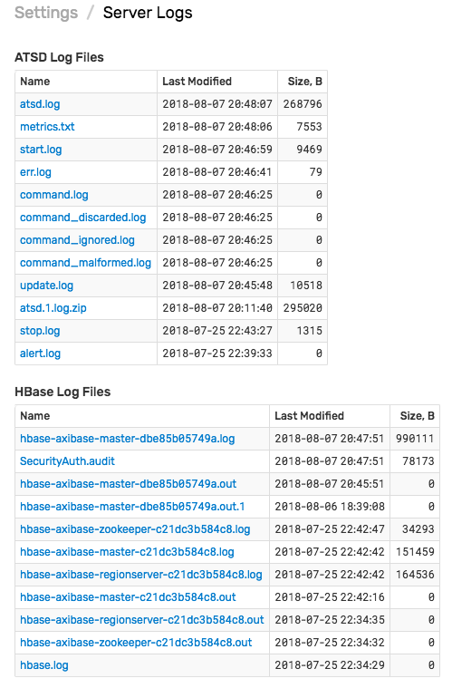
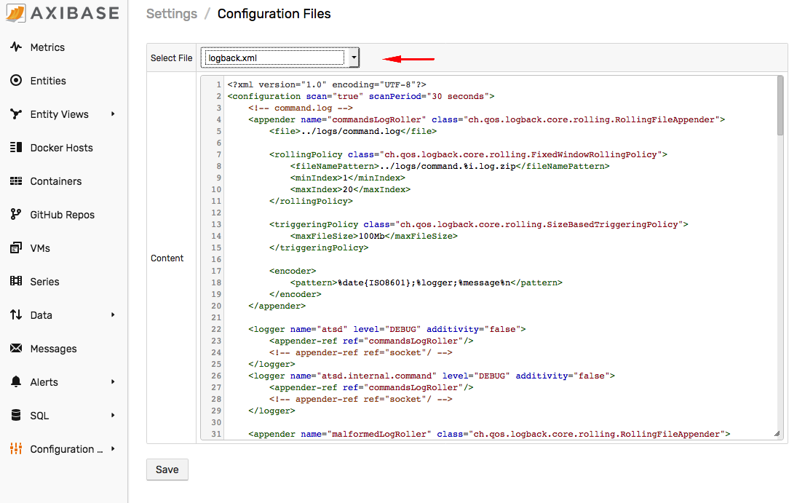
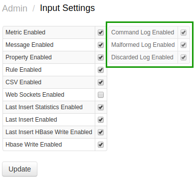

# Logging

Database logs are located in the `/opt/atsd/atsd/logs` directory.

Log files can be also downloaded from the **Settings > Server Logs** page.

Logs are rolled over and archived according to the retention settings in the `/opt/atsd/atsd/conf/logback.xml` file.

## ATSD Log Files

|**Log Name**|**Description**|
|---|:---|
|`atsd.log`| Main database log.|
|`command.log`| Received commands log.|
|`command_malformed.log`| Malformed commands log. Includes commands with invalid syntax.|
|`command_discarded.log`| Discarded commands log. Includes commands received for disabled entities/metrics.|
|`command_ignored.log`| Ignored commands log. |
|`update.log`| Update log. |
|`metrics.txt`| Snapshot of current database metrics. Refreshed every 15 seconds. |
|`start.log`| Start log.|
|`stop.log`| Stop log.|
|`err.log`| Standard error. |
|`alert.log`| Alert log. |

## HBase Log Files

:::tip Note
**HBase Log Files** section is visible in non-distributed installations where ATSD is co-located with HBase.
:::

|**Log Name**|**Description**|
|---|:---|
|`hbase-<user>-master-<hostname>.log`| `HMaster` log.|
|`hbase-<user>-regionserver-<hostname>.log`| `RegionServer` log.|
|`hbase-<user>-zookeeper-<hostname>.log`| `Zookeeper` log.|
|`hbase.log`| `HBase` default log.|
|`SecurityAuth.audit`| Security log.|

## HDFS Log Files

:::tip Note
**HDFS Log Files** section is visible in non-distributed installations where ATSD is co-located with HDFS.
:::

|**Log Name**|**Description**|
|---|:---|
|`hadoop-<user>-namenode-<hostname>.log`| `NameNode` log.|
|`hadoop-<user>-secondarynamenode-<hostname>.log`| `SecondaryNameNode` log.|
|`hadoop-<user>-datanode-<hostname>.log`| `DataNode` log.|
|`SecurityAuth.audit`| Security log.|



## Logging Properties

### File Count

To increase the number of files stored by a given logger, increase the value in the `maxIndex` tag.

```xml
<maxIndex>10</maxIndex>
```

:::warning Warning
The maximum value supported by `FixedWindowRollingPolicy` for `maxIndex` is `20`.
:::

### File Size

To increase the size of files rolled over by a given logger, increase the `maxFileSize` tag value. This setting determines the size of the file before the file is rolled over and compressed. The compressed file is typically 10-20 smaller than the original file.

```xml
<maxFileSize>100Mb</maxFileSize>
```

### File Name

To change the name of the current and archived files, change the `file` and `fileNamePattern` tags.

```xml
<file>../logs/command.log</file>
<fileNamePattern>../logs/command.%i.log.zip</fileNamePattern>
```

### Logging Level

To adjust tracing level, add a logging declaration containing the full class name and the level such as `DEBUG`, `INFO`, `WARN`, `ERROR`.

```xml
<logger name="com.axibase.tsd.service.MetricServiceImpl" level="DEBUG"/>
```

## Applying Changes

Logging properties can be modified in the `logback.xml` file located in the `/opt/atsd/atsd/conf` directory or using the [**Settings > Configuration Files**](./configuration-files.md) editor.

:::tip
Database restart is **not** required. The changes in `logback.xml` are automatically applied every 60 seconds, as specified in the `scanPeriod` tag.
:::



## Command Logging

For performance purposes, logging of incoming commands to `command*.log` files must be enabled both in the `logback.xml` file as well as with the **Command Log Enabled** setting on the **Settings > Input Settings** page.



The `command.log` file contains received `series`, `property`, and `message` data commands and is continuously appended with incoming commands.

```txt
2018-06-28 14:11:55,841;atsd.incoming.api.command.raw;series e:nurswgvml007 m:os.disk.fs.percent_used=45.62672958755293  t:disk=/
2018-06-28 14:11:55,849;atsd.incoming.api.command.raw;message e:nurswgvml008 ms:1530195115844 t:job_type="DOCKER" t:job_name="docker-hbs-to-nur" t:source="docker-hbs-to-nur" t:type="collector-job" t:status="COMPLETED"
2018-06-28 14:13:19,841;atsd.internal.command;property t:java_method e:atsd ms:1530195199841 k:host=NURSWGVML007 v:java_method_invoke_last=5
```

`command.log` file format:

```ls
date_received_iso;channel_type;command
```

Each message in the file contains the received date and the channel type, for example:

* `incoming.tcp.raw`
* `atsd.incoming.api.command.raw`
* `atsd.internal.command`.

The data command is printed out in the [Network API](../api/network/README.md) syntax and can be replayed on any ATSD instance by uploading the commands via TCP/UDP protocol, [`/api/v1/command`](../api/data/ext/command.md) endpoint, or on the **Data > Data Entry** page.

The retention settings for received commands can be modified by increasing the `maxIndex` or `maxFileSize` tags in the `logback.xml` file.

:::warning Warning
The maximum value supported by `FixedWindowRollingPolicy` for `maxIndex` is `20`.
:::

```xml
<!-- command.log -->
<appender name="commandsLogRoller" class="ch.qos.logback.core.rolling.RollingFileAppender">
    <file>../logs/command.log</file>

    <rollingPolicy class="ch.qos.logback.core.rolling.FixedWindowRollingPolicy">
        <fileNamePattern>../logs/command.%i.log.zip</fileNamePattern>
        <minIndex>1</minIndex>
        <maxIndex>10</maxIndex>
    </rollingPolicy>

    <triggeringPolicy class="ch.qos.logback.core.rolling.SizeBasedTriggeringPolicy">
        <maxFileSize>25Mb</maxFileSize>
    </triggeringPolicy>

    <encoder>
        <pattern>%date{ISO8601};%logger;%message%n</pattern>
    </encoder>
</appender>
```

To log the data commands without the received date and channel, remove the corresponding fields from the `pattern` tag.

```xml
<encoder>
    <pattern>%message%n</pattern>
</encoder>
```

The `%date{ISO8601}` token formats the date in ISO8601 format in local time zone.

```txt
2018-06-28 14:11:55,841
```

To customize the date pattern or the time zone, use the following pattern `%d{"yyyy-MM-ddTHH:mm:ss.SSSXXX",UTC}`.

```txt
2018-06-28T17:20:00.000Z
```
