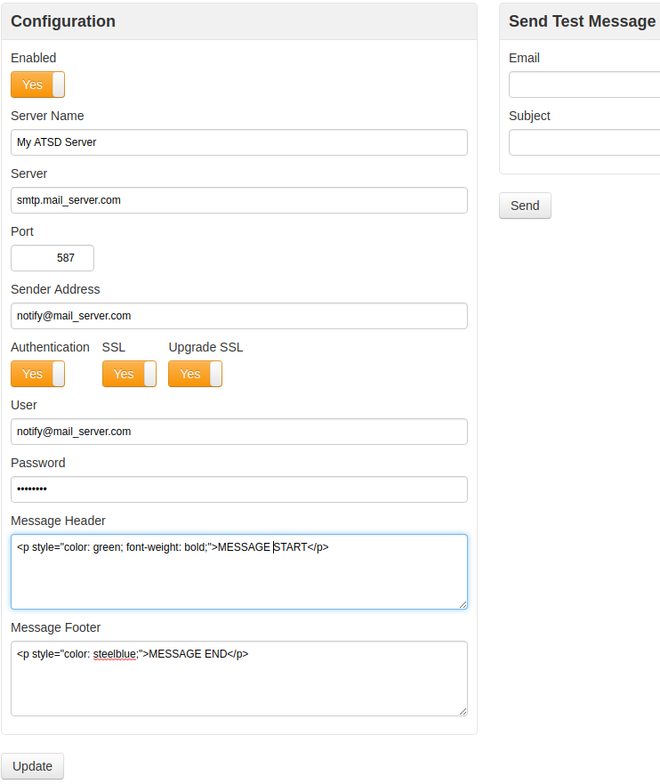
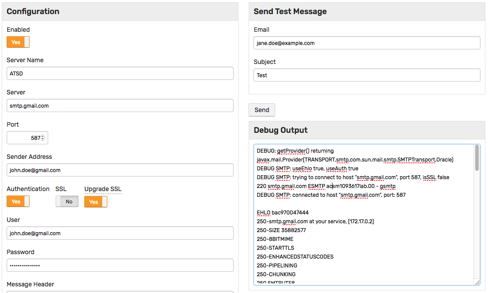
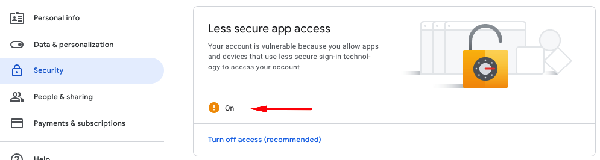

# Mail Client

## Overview

The mail client is used for sending email notifications generated by the rule engine as well as by scheduled export and SQL jobs.

To configure the client, open the **Settings > Mail Client** page and configure SMTP connection properties and account credentials.

To test the settings, specify a recipient address and click **Send Message**.

## Settings

| **Field** | **Description** |
| :--- | :--- |
| Enabled | Set to `Yes` to enable notifications. |
| Server | SMTP server hostname or IP address, for example `smtp.example.org`. |
| Port | SMTP server port, typically `465` or `587`. |
| SSL | Set to `Yes` to enable SSL encryption. |
| Upgrade SSL | Upgrade an insecure connection to a secure connection using SSL/TLS. |
| Authentication | Set to `Yes` to enable authentication. |
| Server Name | Sender name specified in the **From** field, for example `ATSD`. |
| Sender Address | Address specified in the **From** field, for example `user@example.org`. |
| User | Username of the mailbox user. |
| Password | Password of the mailbox user. |

## Examples

### SMTP Server



### GMail SMTP Server

The example below provides information on how to send emails via the [GMail SMTP server](https://support.google.com/a/answer/176600?hl=en).

* Server: `smtp.gmail.com`
* Port: `587`
* Authentication: `Yes`
* SSL: `No`
* Upgrade SSL: `Yes`
* Sender Address: `full GMail address`
* User: `full GMail address`



To [enable access](https://support.google.com/mail/answer/7126229?p=BadCredentials) from `less secure apps`, configure your account as follows:



## Header and Footer

The header and footer are optional and can be specified as plain text of HTML.

If enabled, they are appended to **all** messages. These message parts do not support any placeholders.

```html
<p style="color: #8db600; font-weight: bold; margin: 0px; padding: 0px;">Classification: UNCLASSIFIED</p>
```

```html
<p style="color: #8db600;">END of MESSAGE</p>
```


### Monitoring

The number of messages sent per minute can be monitored with the [`email_notifications_per_minute`](monitoring.md#rule-engine) setting collected by ATSD.

```elm
https://atsd_hostname:8443/portals/series?entity=atsd&metric=email_notifications_per_minute
```


