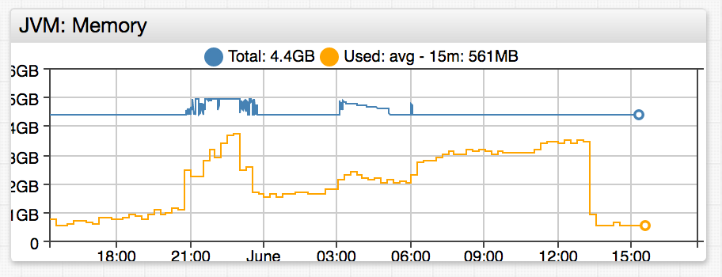
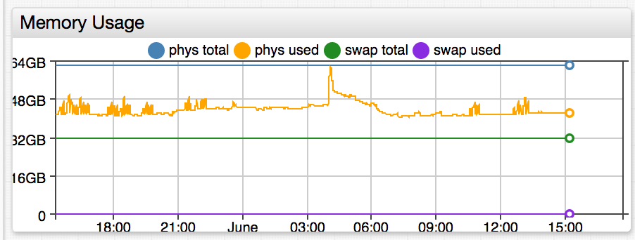

# Allocating Memory to Components

Distribute memory among the ATSD components using the following sizing guidelines based on available physical memory.

Component | Memory % | Minimum, GB | Maximum, GB
---|---:|---:|---:
ATSD Server | 20 | 1 | 8
HBase | 20 | 1 | 8
HDFS | 10 | 1 | 4

Example: **4 GB** of physical memory

Component | Heap Size, GB
---|---:
ATSD Server | 1
HBase | 1
HDFS | 1

Example: **16 GB** of physical memory

Component | Heap Size, GB
---|---:
ATSD Server | 3
HBase | 3
HDFS | 2

## ATSD Server Heap Size

Open the ATSD server environment file.

```sh
nano /opt/atsd/atsd/conf/atsd-env.sh
```

Modify the [`-Xmx`](https://docs.oracle.com/cd/E13150_01/jrockit_jvm/jrockit/jrdocs/refman/optionX.html) setting in the `JAVA_OPTS` parameter.

The format is `-Xmx<size>{G|M}`.

Examples:

* `-Xmx1024M`: 1024 megabytes
* `-Xmx2G`: 2 gigabytes.

:::warning Note
No space character must be present between the number and the unit.
:::

```txt
export JAVA_OPTS="-server -Xmx2048M -XX:+HeapDumpOnOutOfMemoryError -XX:HeapDumpPath="$atsd_home"/logs"
```

Restart ATSD

```sh
/opt/atsd/bin/atsd-tsd.sh stop
```

```sh
/opt/atsd/bin/atsd-tsd.sh start
```

## HBase Heap Size

Open the HBase environment file and uncomment the `export HBASE_HEAPSIZE` line.

```sh
nano /opt/atsd/hbase/conf/hbase-env.sh
```

Set new maximum memory size in **megabytes**.

```sh
export HBASE_HEAPSIZE=4096
```

The setting applies to both master and region servers.

Restart ATSD and HBase:

```sh
/opt/atsd/bin/atsd-tsd.sh stop
```

```sh
/opt/atsd/bin/atsd-hbase.sh stop
```

```sh
/opt/atsd/bin/atsd-hbase.sh start
```

```sh
/opt/atsd/bin/atsd-tsd.sh start
```

## HDFS Heap Size

Open the HDFS environment file and uncomment the `export HADOOP_HEAPSIZE` line.

```sh
nano /opt/atsd/hadoop/conf/hadoop-env.sh
```

Set new maximum memory size in **megabytes**.

```sh
export HADOOP_HEAPSIZE=4096
```

The setting applies to both Name and Data nodes.

Restart all services:

```sh
/opt/atsd/bin/atsd-all.sh stop
```

```sh
/opt/atsd/bin/atsd-all.sh start
```

## Verify Settings

View `Xmx` specified in process launch arguments.

```sh
ps aux | grep Xmx
```

Open the **ATSD** portal in the top menu and verify new settings on the memory charts.




