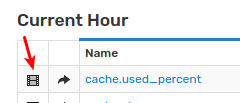
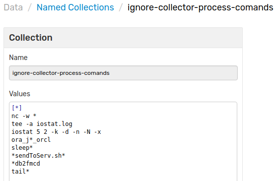
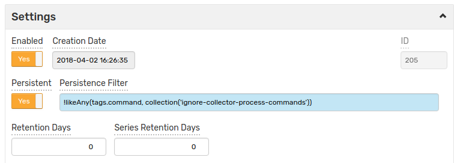

# Metric Persistence Filter

The metric persistence filter, configurable in the **Metric Editor**, can be used to discard incoming `series` commands according to a filter expression. Commands for which the expression returns `false` are not stored in the database.

## Expression Syntax

The filter is a boolean condition that can include fields, operators, and functions.

### Fields

| **Name** | **Type**| **Description** | **Example** |
|:---|:---|:---|:---|
| `entity` | string|Entity name. | `entity LIKE "?tsd"`|
| `value` | number|Numeric value. | `value > 0`|
| `message` | string|Text value (annotation). | `message = "a"`|
| `timestamp`| number| `series` command timestamp. |`timestamp < 1522683114614`|
| `tags.{name}` or `tags['name']` | string|Value of command tag with name `name`. <br>Tag names are case-**in**sensitive.<br> |`tags.location NOT IN ('a', 'b', 'c')`<br>`tags['fs'] LIKE "ext*"`. |

### Operators

Comparison operators: `=`, `==`, `!=`, `LIKE`.

Logical operators: `AND`, `OR`, `NOT` as well as `&&` , `||`, `!`

### Wildcards

* Wildcard `*` means zero or more characters.
* Wildcard `?` means any character.

### Functions

The following built-in functions can be used in the filter expression:

* [`collection`](#collection)
* [`list`](#list)
* [`likeAll`](#likeall)
* [`likeAny`](#likeany)
* [`matches`](#matches)
* [`startsWithAny`](#startswithany)
* [`contains`](#contains)
* [`collection_contains`](#collection_contains)
* [`collection_intersects`](#collection_intersects)
* [`upper`](#upper)
* [`lower`](#lower)
* [`size`](#size)
* [`isEmpty`](#isempty)
* [`IN`](#in)

Filter expression can also include [Math](https://docs.oracle.com/javase/8/docs/api/java/lang/Math.html) functions.

```javascript
Math.sin(Math.toRadians(value)) < 0.5
```

### `collection`

```javascript
  collection(string s) [string]
```

Returns an array of strings which have been loaded with the specified string `s`.

Named collections are listed on the **Data > Named Collections** page.

To check the size of the collection, use the `.size()` method.

To access the *n*-th element in the collection, use square brackets as in `[index]` or the `get(index)` method (starting with 0 for the first element).

```javascript
entity = collection('hosts')[0]

tags.request_ip = collection('ip_white_list').get(1)
```

### `list`

```javascript
  list(string s[, string p]) [string]
```

Splits string `s` using separator `p` (default is comma ',') into a collection of string values. The function discards duplicate items by preserving only the first occurrence of each element.

To access the n-th element in the collection, use square brackets as in `[index]` or the `get(index)` method (starting with 0 for the first element).

Examples:

```javascript
entity = list('atsd,nurswgvml007').get(0)
```

### `likeAll`

```javascript
  likeAll(object s, [string] c) boolean
```

Returns `true`, if the first argument `s` matches **every** element in the collection of patterns `c`. The collection `c` can be specified inline as an array of strings or reference a named collection.

Examples:

```javascript

likeAll(tags.request_ip, ['192.0.*', '192.0.2.?'])
```

### `likeAny`

```javascript
  likeAny(object s, [string] c) boolean
```

Returns `true`, if the first argument `s` matches **at least one** element in the collection of patterns `c`. The collection `c` can be specified inline as an array of strings or reference a named collection.

Examples:

```javascript
likeAny(tags.os, ['Ubuntu*', 'CentOS*'])

likeAny(tags.request_ip, collection('ip_white_list'))
```

### `matches`

```javascript
  matches(string p, [string] c) boolean
```

Returns `true` if one of the elements in collection `c` matches (satisfies) the specified pattern `p`.  The collection `c` can be specified inline as an array of strings or reference a named collection.

The pattern supports `?` and `*` wildcards.

Example:

```javascript
matches(entity, collection('hosts'))

matches(message, ['OK', 'stable'])
```

### `startsWithAny`

```javascript
  startsWithAny(object s, [string] c) boolean
```

Returns `true`, if the first argument `s` starts with any of strings from collection `c`. Collection `c` can be specified inline as an array of strings or reference a named collection.

Examples:

```javascript
startsWithAny(entity, ['a', 'nur'])
```

### `contains`

```javascript
  [string].contains(string s) boolean
```

Returns `true` if `s` is contained in the collection. The collection `c` can be specified inline as an array of strings or reference a named collection.

Example:

```javascript
collection('ip_white_list').contains(tags.request_ip)
```

### `collection_contains`

```javascript
  collection_contains(object v, [] c) boolean
```

Returns `true`, if collection `c` contains object `v`. The collection `c` can be specified inline as an array of strings or reference a named collection.

Examples:

```javascript
NOT collection_contains(tags['os'], collection('ignore_os'))
```

### `collection_intersects`

```javascript
  collection_intersects([] f, [] s) boolean
```

Returns `true`, if collection `f` has elements in common with collection `s`. The collections can be specified inline as an arrays of strings or reference a named collections.

Examples:

```javascript
collection_intersects(tags.values(), collection('ip_white_list'))
```

### `upper`

```javascript
  upper(string s) string
```

Converts `s` to uppercase letters.

### `lower`

```javascript
  lower(string s) string
```

Converts `s` to lowercase letters.

### `size`

```javascript
  [].size() integer
```

Returns the number of elements in the collection.

> This function can be applied to collections of any type (string, number) as well as maps.

Examples:

```javascript
tags.size() > 1
```

### `isEmpty`

```javascript
  [].isEmpty() boolean
```

Returns `true` if the number of elements in the collection is zero.

> This function can be applied to collections of any type (string, number) as well as maps.

Example:

```javascript
NOT tags.isEmpty()
```

### `IN`

```javascript
  string s IN (string a[, string b[...]]) boolean
```

Returns `true` if `s` is contained in the collection of strings enclosed in round brackets.

Examples:

```javascript
entity IN ('nurswgvml007', 'nurswgvml008')
```

```javascript
tags.location IN ('NUR', 'SVL')
```

## Using Persistence Filter

To reduce disk space utilization, open the **Settings > Receive Statistics** page to view metrics with the highest number of inserted commands.


The _Series_ icon opens a list of unique tags for the selected metric.



If some of the incoming data is of low value it can be ignored when received.


To stop storing such series, create a collection with filter patterns on the **Data > Named Collections** page.



Open the **Metric Editor** and create a filter expression to ignore matching series.

```javascript
!likeAny(tags.command, collection('ignore-collector-process-commands'))
```



As a result, the number of stored series is reduced.


