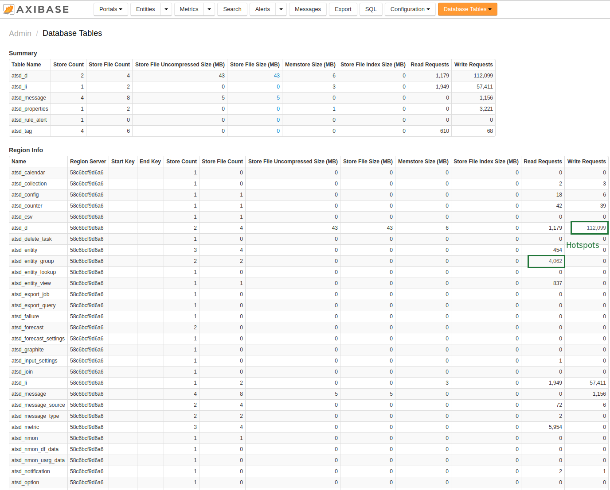

# Monitoring Metrics using Database Tables

Database Table statistics can be viewed in the ATSD web interface on the
**Settings > Storage > Database Tables** page.

The page contains table usage statistics.

* Size of individual tables and their partitions, both in memory and on disk.
* Number of read and write requests to identify 'hot spots', or regions of the table receiving a disproportionate amount of queries.

