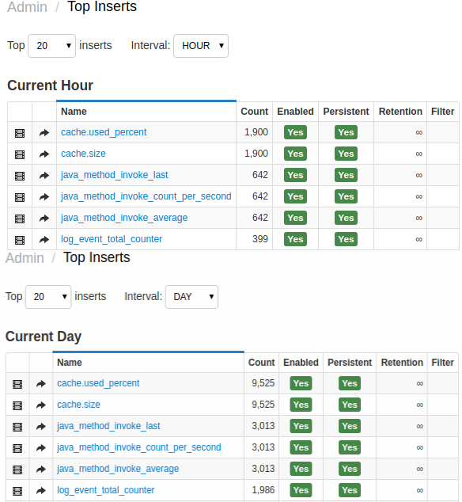

# Monitoring Incoming Data

The **Settings > Receive Statistics** page displays top metrics received by database, measured by the number of samples.

The number of displayed `top-N` rows can be adjusted.

The statistics allows you to:

* View top-N metric and entities for up to the last 24
    hours ranked by the number of samples inserted into the database.
* Configure metric [filters](../metric-persistence-filter.md) to discard particular entity/metric/tag
    combinations from being stored in the database.
* Enable metric retention intervals (default is unlimited retention) to reduce the amount of storage used by deleting old data.
* Classify some metrics as non-persistent to use them only in the
    rule engine without storing the data on disk.

