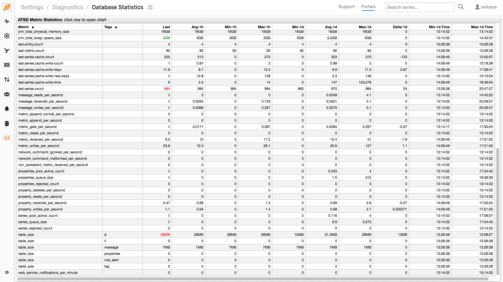

# Monitoring Metrics using ATSD Portals

A daily summary of all ATSD metrics is presented on the **Settings > Diagnostics > Database Metrics** page.

Additionally, the key database metrics are displayed in the pre-installed **ATSD** portal listed under the **Portals** tab in the top menu.

