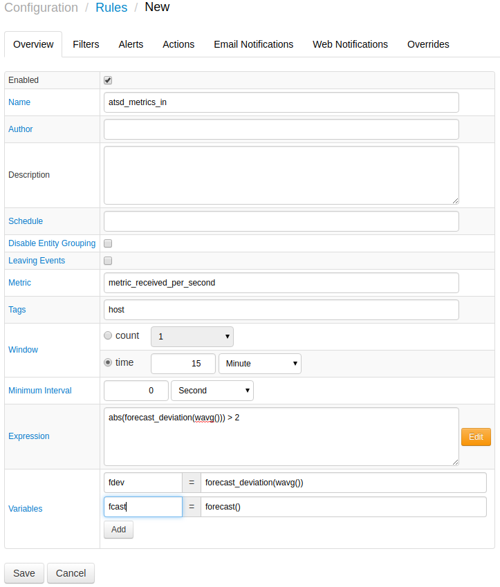

# Monitoring Metrics using Rule Engine

Rule Engine can monitor ATSD metrics to raise alerts in case of abnormal deviations.

For example:

Monitoring the `metric_received_per_second` metric can be done by comparing incoming samples with the forecast. Based on this forecast, a rule condition can be expressed without hard coding any thresholds:

```javascript
abs(forecast_deviation(avg())) > 2
```

The above condition triggers an alert if the 15 minute moving average deviates from the forecast by more than 2 standard deviations.

Email notifications can be setup for alerts delivered when the rule is triggered.



Below is an example email alert.


