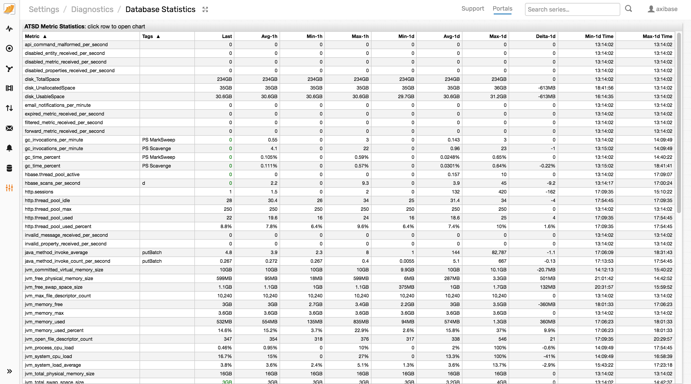

# Monitoring

ATSD performance metrics can be retrieved via JMX, read from a plain text file, or retrieved from an HTTP endpoint in JSON format.

The metrics are updated at a regular interval and can be used to monitor
the database state and the status of its individual components, such as the
amount of data received, memory usage, and read/write throughput.

Example: [Disk Space monitoring](data_retention.md#disk-space-monitoring)

You can access the metrics using the following methods:

* [JMX in JSON format](monitoring-metrics/json.md)
* [JMX](monitoring-metrics/jmx.md)
* [File](monitoring-metrics/file.md)
* [Rule Engine](monitoring-metrics/rule-engine.md)
* [Incoming Data Statistics](monitoring-metrics/ingestion-statistics.md)
* [Database Tables](monitoring-metrics/database-tables.md)
* [I/O Tests](monitoring-metrics/io-tests.md)
* [HBase Write Test](monitoring-metrics/hbase-write-test.md)
* [Portals](monitoring-metrics/portals.md)

## Example

Retrieving the list of collected metrics in JSON format.

```elm
https://atsd_hostname:8443/jmx?query=com.axibase.tsd:name=metrics
```

## Collected metrics

### Memory

| **Metric** | **Description** |
|:--- | :--- |
|`jvm_committed_virtual_memory_size` |Committed virtual memory, in bytes.|
|`jvm_free_physical_memory_size` |Free physical memory on the server, in bytes.|
|`jvm_free_swap_space_size` | Free swap space on the server, in bytes.|
|`gc_invocations_per_minute` |Number of the Java garbage collection calls.|
|`gc_time_percent` |The percentage of cpu time used by the Java garbage collector.|
|`jvm_memory_free` | Free memory available to the JVM, in bytes. |
|`jvm_memory_max` | Maximum memory available to the JVM, in bytes. |
|`jvm_memory_used` | Memory used by the JVM, in bytes. |
|`jvm_memory_used_percent` | Percentage of memory used by the JVM. |
|`jvm_memorypool_used` | JVM memory pool usage, in bytes.|

### Queues

| **Metric** | **Description** |
|:--- | :--- |
|`properties_pool_active_count` | Number of active threads writing property records.|
|`properties_queue_size` | Number of `property` commands in the queue.|
|`properties_rejected_count` | Number of `property` commands discarded due to absence of free space in the queue.|
|`series_pool_active_count` |Number of active threads which are series records.|
|`series_queue_size` |Number of series samples in the queue.|
|`series_rejected_count` |Number of series samples discarded due to absence of free space in the queue.|

### Cache

| **Metric** | **Description** |
|:--- | :--- |
|`cache.size` | Number of records kept in cache. Displayed on the **Settings>Cache Management** page.|
|`cache.used_percent` | Cache used percentage. Displayed on the **Settings>Cache Management** page.|
|`last.series.cache.count` | Number of records in the `last insert` cache. |
|`last.series.cache.write-count` | Number of writes to the `last insert` table made during the period. |
|`last.series.cache.write-keys` | Number of series keys written to the `last insert` table during the period.|
|`last.series.cache.write-new-keys` | Number of new series keys written to the `last insert` table during the period.|
|`last.series.cache.write-time` | Time spent writing to the `last insert` table during the period, in milliseconds.|

### HTTP Server

| **Metric** | **Description** |
|:--- | :--- |
|`http.sessions` |Number of HTTP sessions.|
|`http.thread_pool_idle` |Number of HTTP server threads in waiting state. |
|`http.thread_pool_max` |The maximum number of HTTP server threads.|
|`http.thread_pool_used` |Number of HTTP server threads that are in use.|
|`http.thread_pool_used_percent` |Percentage of used HTTP server threads.|

### Load

| **Metric** | **Description** |
|:--- | :--- |
|`jvm_process_cpu_load` | CPU used by the JVM process.|
|`jvm_system_cpu_load` | CPU busy on the server.|
|`jvm_system_load_average` | 1-minute system load average on the server. |
|`jvm_total_physical_memory_size` | Amount of physical memory on the server, in bytes. |
|`jvm_total_swap_space_size` | Amount of swap space on the server, in bytes.|

### Replication

| **Metric** | **Description** |
|:--- | :--- |
|`replication_successful_commands` | Number of commands successfully transmitted to the target ATSD server.|
|`replication_discarded_commands` | Number of commands discarded due to errors.|
|`replication_rejected_commands`| Number of commands rejected because the receiving target server was too slow. |

:::tip Note
Replication metrics are incrementing integer counter which are reset on database restart.
:::

### Disk & File

| **Metric** | **Description** |
|:--- | :--- |
|`jvm_max_file_descriptor_count` |The maximum number of file descriptors.|
|`jvm_open_file_descriptor_count` | Number of open file descriptors.|
|`disk_totalspace` |Total size of the file system where ATSD service is installed, in bytes.|
|`disk_unallocatedspace` |Space available (free) on the file system where ATSD service is installed, in bytes.|
|`disk_usablespace` |Space available (free) **to ATSD** on the file system where ATSD service is installed, in bytes.|
|`disk_tmp_totalspace` |Total size of the `/tmp` file system, in bytes.<br>The metric is collected if `/tmp` file system is different from the the file system where ATSD service is installed.|
|`disk_tmp_unallocatedspace` |Space available (free) on the `/tmp` file system, in bytes.<br>The metric is collected if `/tmp` file system is different from the the file system where ATSD service is installed.|
|`disk_tmp_usablespace` |Space available (free) **to ATSD** on the `/tmp` file system, in bytes.<br>The metric is collected if `/tmp` file system is different from the the file system where ATSD service is installed.|
|`table_region_server_count` |Number of region servers assigned to process the given data table.|
|`table_size` |Total size on disk for the given table, in megabytes.|

### General

| **Metric** | **Description** |
|:--- | :--- |
|`hbase.thread_pool_active` |Number of active clients writing into HBase.|
|`hbase_scans_per_second` |Number of HBase scans. |
|`java_method_invoke_average` | Average execution time for a Java method in a given period, in milliseconds. |
|`java_method_invoke_count_per_second` | Number of Java method invocations during the period. |
|`java_method_invoke_last` | Last execution time for the Java method during the period, in milliseconds. |

### Rule Engine

| **Metric** | **Description** |
|:--- | :--- |
|`email_notifications_per_minute` |Number of email notifications sent. |
|`web_service_notifications_per_minute` | Number of webhooks sent.|
|`expired_metric_received_per_second` |Number of `series` commands with timestamp earlier than specified by Time Filter ignored by the rule engine. |
|`forward_metric_received_per_second` |Number of `series` commands with timestamp greater than specified by Time Filter ignored by the rule engine. |

### Activity

| **Metric** | **Description** |
|:--- | :--- |
|`api_command_malformed_per_second` | Number of malformed (invalid) API commands discarded.|
|`disabled_entity_received_per_second` |Number of series samples for disabled entity received.|
|`disabled_metric_received_per_second` |Number of series samples for disabled metric received.|
|`disabled_properties_received_per_second` |Number of `property` commands received when **Property Enabled** is checked on **Settings > Input Settings** page.|
|`filtered_metric_received_per_second` |Number of series samples discarded due to **Invalid Value Action**.|
|`invalid_message_received_per_second` | Number of invalid `message` commands received. |
|`invalid_property_received_per_second` | Number of invalid `property` commands received.|
|`message_gets_per_second` |Number of requests to `/messages` endpoint.|
|`message_reads_per_second` |Number of messages read.|
|`message_received_per_second` | Number of messages received. |
|`message_writes_per_second` | Number of messages written. |
|`metric_append_concat_per_second` | Number of series samples received with option `append = true` where annotation is concatenated.|
|`metric_append_per_second` | Number of series samples received with option `append = true`.|
|`metric_reads_per_second` | Number of HBase rows read from `d` table. |
|`metric_received_per_second` | Number of series samples received. |
|`metric_writes_per_second` | Number of series samples written. |
|`network_command_ignored_per_second` | Number ignored commands.|
|`network_command_malformed_per_second` | Number of malformed commands.|
|`non_persistent_metric_received_per_second` | Number of non-persisted series samples.|
|`property_deleted_per_second` | Number of properties records deleted.|
|`property_reads_per_second` | Number of property records read. |
|`property_received_per_second` | Number of `property` commands received.|
|`property_writes_per_second` |Number of properties records written. |

## Database Statistics

The daily summary for all metrics collected by the database are displayed on the **Settings > Diagnostics > Database Statistics** page.

