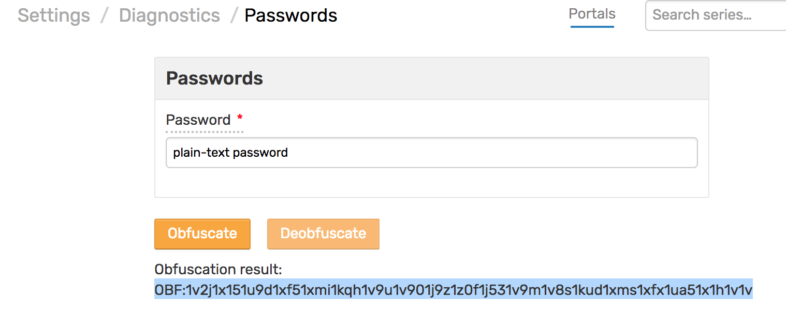
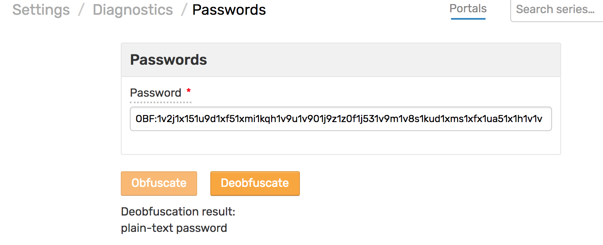

# Passwords Obfuscation

## Password Obfuscation using ATSD

To generate an obfuscated password using ATSD, go to `Settings / Diagnostics / Passwords`. Type the plain text password and press the `Obfuscate` button. Insert the result into the `server.properties` file.

## Passwords Obfuscation without ATSD

Follow the [guide](https://docs.oracle.com/cd/E35822_01/server.740/es_admin/src/tadm_ssl_jetty_passwords.html) to obfuscate the password before ATSD started.

## Deobfuscation

To generate a plain-text password from obfuscated one, go to `Settings / Diagnostics / Passwords`. The deobfuscation candidate should have `OBF:` prefix and be created using this form or [Jetty Passwords](http://www.eclipse.org/jetty/documentation/current/configuring-security-secure-passwords.html) utility.

