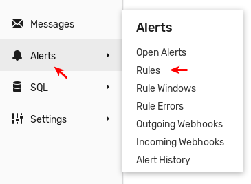
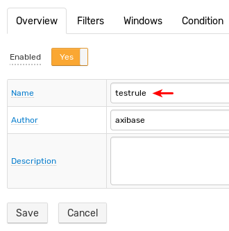
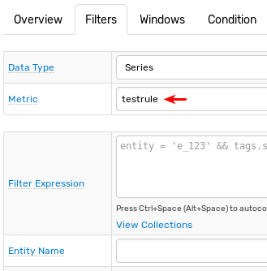
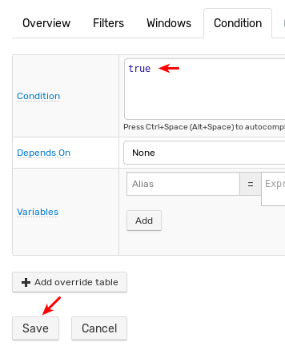
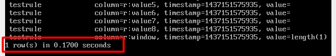

# Replication

This guide describes how to configure master-to-slave replication at the HBase level where all changes on the master cluster are replayed on the slave cluster.

`atsd_master` is the hostname of the HBase Master host on the _master_ cluster and
`atsd_slave` is the hostname of the HBase Master on the _slave_ cluster.

## Requirements

This guide applies only on new ATSD installations.
Executing this guide on an existing ATSD installation leads to the
loss of all stored data on both the master and slave machines.

Both the master and slave machines must have static a IP addresses in the
local network.

Both machines must have identical hardware configurations. Review [ATSD
Requirements](../installation/requirements.md).

The same versions of ATSD must be installed on both machines. [See ATSD
installation
guides.](../installation/README.md "ATSD Install Guides")

## Installation

**MASTER & SLAVE: Complete this process on both machines
– master and slave.**

Stop ATSD and all components:

```sh
/opt/atsd/bin/atsd-all.sh stop
```

Change `/etc/hosts` to form:

```sh
sudo nano /etc/hosts
```

```elm
127.0.0.1    localhost
master_ip    master_hostname
slave_ip     slave_hostname
```

> Note: the following lines must not be contained in the `hosts` file.
This is the case for both master and slave.

```elm
127.0.1.1    atsd_master
```

```elm
127.0.1.1    atsd_slave
```

Example of a correct `hosts` file:

```elm
127.0.0.1    localhost
172.30.0.66    atsd_master
172.30.0.78    atsd_slave
```

Add the `hbase.replication` property to the `configuration` tag in the
`hbase-site.xml` file:

```xml
<property>
    <name>hbase.replication</name>
    <value>true</value>
</property>
```

**SLAVE: Only complete this process on the slave
machine.**

Edit the `atsd-all.sh` file to disable ATSD startup:

```sh
sudo nano /opt/atsd/bin/atsd-all.sh
```

Comment out the following strings in the `start_all` function:

```bash
${ATSD_TSD} start
if [ ! $? -eq 0 ]; then
    return 1
fi
```

Result:

```bash
#   ${ATSD_TSD} start
#   if [ ! $? -eq 0 ]; then
#       return 1
#   fi
```

Start Hadoop and HBase:

```sh
/opt/atsd/bin/atsd-all.sh start
```

Run the replication configuration script:

```sh
/opt/atsd/hbase_util/configure_replication.sh slave
```

This command truncates all ATSD tables.

Verify that ATSD tables are present.

Start HBase shell and list tables:

```sh
echo "list" | /opt/atsd/hbase/bin/hbase shell 2>/dev/null | grep -v "\["
```

The output contains a list of ATSD tables, all starting with `atsd_`:


**MASTER: Only complete this process on the
master machine.**

Start Hadoop and HBase:

```sh
/opt/atsd/bin/atsd-dfs.sh start
```

```sh
/opt/atsd/bin/atsd-hbase.sh start
```

Add replication peer.

```sh
echo "add_peer '1', \"atsd_slave:2181:/hbase\"" | /opt/atsd/hbase/bin/hbase shell
```

Ensure that the peer is set.

```sh
echo "list_peers" | /opt/atsd/hbase/bin/hbase shell
```

```txt
PEER_ID CLUSTER_KEY STATE
1 atsd_slave:2181:/hbase ENABLED
1 row(s) in 0.0930 seconds
```

Run replication configuration script:

```sh
/opt/atsd/hbase_util/configure_replication.sh master
```

This command truncates all ATSD tables and enables replication on all
ATSD column families.

Start ATSD:

```sh
/opt/atsd/bin/atsd-tsd.sh start
```

Verify that ATSD tables are present: list tables

```sh
echo "list" | /opt/atsd/hbase/bin/hbase shell 2>/dev/null | grep -v "\["
```

Output contains a list of ATSD tables, all starting with `atsd_`.


## Replication for New Tables

New tables created in the source cluster are not automatically replicated. Configure the replication for new tables as described below.

> MASTER: Only complete this process on the MASTER server.

Write the table schema to a file:

```sh
/opt/atsd/hbase_util/configure_replication.sh schema atsd_new > atsd_new_schema.txt
```

Copy table schema file to the slave machine:

```sh
scp atsd_new_schema.txt atsd_slave:/tmp
```

> SLAVE: Only complete this process on the slave machine.

Create the new table in the slave database:

```sh
/opt/atsd/hbase/bin/hbase shell < /tmp/atsd_new_schema.txt
```

> MASTER: Only complete this process on the master machine.

Enable replication for the new table:

```sh
/opt/atsd/hbase_util/configure_replication.sh flag atsd_new
```

Verify that the new table is being replicated using the verification
instructions below.

## Verifying Replication

### Option 1

> SLAVE: Only complete this process on the slave machine.

Check HBase logs for replication activity:

```sh
tail -n 1000 /opt/atsd/hbase/logs/hbase-axibase-regionserver-atsd_slave.log | grep replicated
```

The output contains replication activity and the of amount tables replicated on the slave machine:

```txt
2015-07-17 16:39:22,926 INFO  regionserver.ReplicationSink (ReplicationS
ink.java:replicateEntries(158)) - Total replicated: 4
2015-07-17 16:39:24,019 INFO  regionserver.ReplicationSink (ReplicationS
ink.java:replicateEntries(158)) - Total replicated: 1
2015-07-17 16:39:25,083 INFO  regionserver.ReplicationSink (ReplicationS
ink.java:replicateEntries(158)) - Total replicated: 1
2015-07-17 16:39:31,122 INFO  regionserver.ReplicationSink (ReplicationS
ink.java:replicateEntries(158)) - Total replicated: 1
```

### Option 2

> MASTER: Only complete this process on the master machine.

Open the **Alert > Rules** page in the ATSD web interface.



Click **Create** and complete the following fields as specified below:

* `Name`: `testrule`
* `Metric`: `testrule`
* `Condition`: `true`

Click **Save**.





Scan the `atsd_rule` table and note down the amount of line contained in the
table:

```sh
echo "scan 'atsd_rule'" | /opt/atsd/hbase/bin/hbase shell
```

Output:



> SLAVE: Only complete this process on the slave machine.

Scan the `atsd_rule` table and note down the amount of line contained in the
table:

```sh
echo "scan 'atsd_rule'" | /opt/atsd/hbase/bin/hbase shell
```

The output contains the same amount of rows as on the master:


## Recovery

If the master loses connection to the slave, it buffers the transactions for the duration of the connection loss and replays them once the connection is re-established. No data is lost in the process.