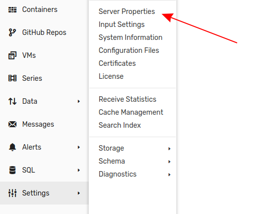
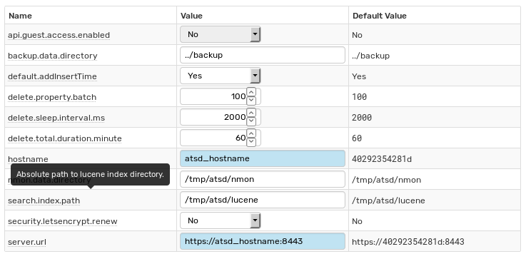
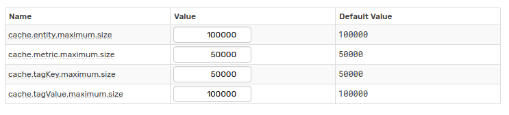
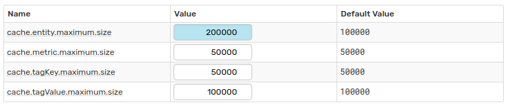
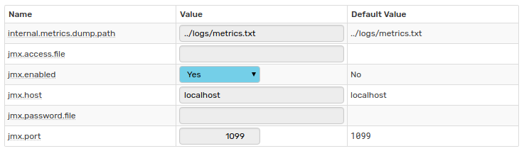
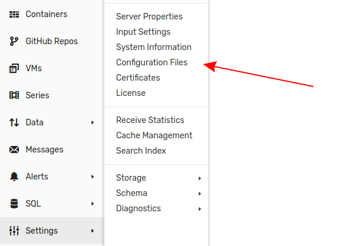
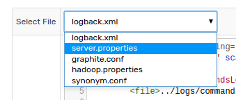
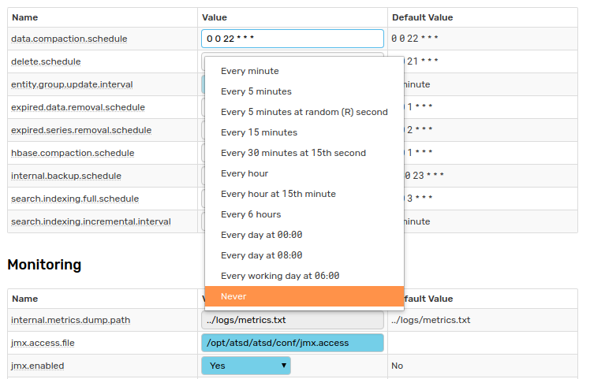
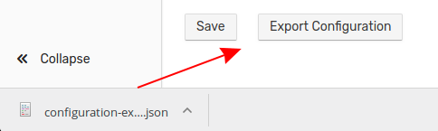

# ATSD Server Properties

Modify the configuration of [ATSD](https://axibase.com/docs/atsd/) on the **Server Properties** page. Open the page by expanding the **Settings** menu and selecting **Server Properties**.



There are nine tables present on the **Server Properties** page which contain the settings for each part of the database:

* [HBase](#hbase)
* [Scheduled Tasks](#scheduled-tasks)
* [Monitoring](#monitoring)
* [Network](#network)
* [SQL](#sql)
* [Cache](#cache)
* [User Interface](#user-interface)
* [Rule Engine](#rule-engine)
* [Other](#other)

Modifications performed on the **Server Properties** page apply instantly after clicking **Save**.

## Tooltips

Each parameter in every table has a tooltip which describes the specific setting. Tooltips appear upon mouseover.



## Default Values

Each table has a **Default Value** column, which shows the original value of a given property.



Whenever a value deviates from the default, the database displays the field highlighted in blue.



## Server Properties Requiring Restart

Some server properties may only be enabled, disabled, or modified in the `server.properties` file or on the **Configuration Files** page by certain users because a database restart is required. The **Value** field for such properties is gray and uneditable on the **Server Properties** page, unless it deviates from the [default value](#default-values).



All properties shown here require database restart and therefore may not be modified by a user on the **Server Properties** page.

### Access via Shell

To access the `server.properties` file via shell, a user must have access to the server on which ATSD is running, and be logged in as a superuser or as the user who launched ATSD.

Open the `server.properties` file:

```sh
nano ~/opt/atsd/atsd/conf/server.properties
```

Perform the desired modifications and [restart](https://axibase.com/docs/atsd/administration/restarting.html) the database to enable the changes.

### Access via **Configuration Files** Page

To modify `server.properties` on the **Configuration Files** page a user must have the [`ADMIN`](https://axibase.com/docs/atsd/administration/user-authorization.html#user-interface-roles) role in the ATSD user interface.

Open the **Settings** menu and select **Configuration Files**.



Select `server.properties` from the drop-down list.



Modify the desired properties in the **Content** window and [restart](https://axibase.com/docs/atsd/administration/restarting.html) the database to enable the change.

## Disabling Scheduled Tasks

To disable a scheduled task, remove the [`cron`](https://axibase.com/docs/axibase-collector/scheduling.html#cron-expressions) expression from the **Value** field and click **Save**. Alternatively, use the drop-down list to select **Never** for the desired task.



## Export Configuration

Export the current database configuration in JSON format by clicking **Export Configuration** at the bottom of the page.



## Properties

**Bolded** property names may only be modified in the [`server.properties`](#server-properties-requiring-restart) file by a qualified user.

### HBase

Property | Default Value | Description
---|---|---
`entity.countToUseFilter` | 2 | Applies to Data API queries with entity [wildcard](https://axibase.com/docs/atsd/api/data/#wildcards) (*). If entity count is greater than `entity.countToUseFilter`, one scan with skips is used. Otherwise a separate scan is executed for each query.
`hbase.compaction.list` | d properties message li tag forecast | List of HBase tables for which the major compaction will be triggered by the task triggered with `hbase.compaction.schedule`. The list of tables contains most ATSD-managed tables containing data.
**`hbase.compression.type`** | none | HBase-level compression. Supported options: none, `gz`, `lzo`, `snappy`, `lz4`, and `zstd`.
**`hbase.compression.type.raw`** | none | HBase-level compression applied to raw time series data. Supported options are: none, `gz`, `lzo`, `snappy`, `lz4`, and `zstd`.
**`hbase.table.prefix`** | `atsd_` | Prefix added to all HBase tables created by ATSD. |
`htable.executor.corePoolSize` | 16 | Minimum number of worker threads performing HBase queries such as scans. This pool does not include series and properties write threads. |
`htable.executor.maxPoolSize` | 32 | Maximum number of worker threads performing HBase queries such as scans. This pool does not include series and properties write threads.
`last.insert.cache.max.size` | 100,000 | Maximum number of series records kept in the **Last Insert** cache. If the limit is reached by the cache, records older than ten minutes, based on received time, are removed. If the cache remains more than 75% full, messages older than one minute are removed.|
`last.insert.write.period.seconds` | 15 | Interval at which updated series from the **Last Insert** cache are persisted to the database.
**`messages.timeToLive`** | 31,536,000 | Number of seconds after which records are deleted from the `atsd_message` table. This TTL is based on the insertion time, not the record timestamp. The default is 365 days.|
`properties.batch.size` | 512 | Number of property records sent to HBase in each PUT command. |
`properties.queue.limit` | 8192 | Maximum number of property records waiting in memory to be inserted into HBase. |
`properties.queue.pool.size` | 4 | Maximum number of work threads sending property records into HBase. |
`properties.queue.rejection.policy` | BLOCK | Policy that controls the behavior when the number of property records in memory reaches the `properties.queue.limit`. BLOCK policy slows down clients. DISCARD policy deletes most recent records in case of overflow.
`scan.caching.size` | 2,048 | Number of rows sent to ATSD HBase in each RPC request. Setting the property to a low value may cause unnecessary round-trips to the region server, while setting it to a large value requires more memory on the client and may cause unnecessary rows to be sent to the client via RPC request. |
`series.batch.size` | 1,024 | Number of series samples sent to HBase in each PUT command. |
`series.queue.limit` | 32,768 | Maximum number of series samples waiting in memory to be inserted into HBase. |
`series.queue.pool.size` | 4 | Maximum number of worker threads sending series samples into HBase.
`series.queue.rejection.policy` | BLOCK | Policy that controls the behavior when the number of series samples in memory reaches the `series.queue.limit`. BLOCK policy slows down clients, DISCARD policy deletes most recent samples in case of overflow.|

### Scheduled Tasks

Property | Default Value | Description
---|---|---
`data.compaction.schedule` | `0 0 22 * * *` | Schedule for launching a data compaction task. The task compresses raw values into a smaller number of daily rows. |
`delete.schedule` | `0 0 21 * * *` | Schedule for running a task to remove deleted entities, metrics, and properties. The task masks deleted data by placing **Delete** markers that hide the data from reading scans. |
`entity.group.update.interval` | 1 minute | Interval at which entity groups with expression-based memberships are re-evaluated in order to add new entities and remove non-matching members from the group. Specify the interval in seconds, minutes, or hours.|
`expired.data.removal.schedule` | `0 0 1 * * *` | Schedule for running a task to automatically delete series samples for metrics with a configured retention interval. This task masks deleted data by placing **Delete** markers that hide the data from reading scans.|
`expired.series.removal.schedule` | `0 0 2 * * *` | Schedule for running a task to automatically delete expired time series for metrics with a configured series retention interval. This task masks deleted data by placing **Delete** markers that hide the data from reading scans. |
`hbase.compaction.schedule` | `0 0 1 * * *` | Schedule for triggering a major compaction in HBase. A major compactions removes **Delete** markers and that data is hidden. The compaction also re-writes storage files for optimal storage.|
`internal.backup.schedule` | `0 30 23 * * *` | Schedule for backing up ATSD configuration records to XML files in `./atsd/backup` directory. |
`search.indexing.full.schedule` | `0 0 3 * * *` | Schedule at which the **Series Search** index is rebuilt.|
`search.indexing.incremental.interval` | 5 minute | Interval at which the **Series Search** index is refreshed. Specify the interval in seconds, minutes, or hours.|

### Monitoring

Property | Default Value | Description
---|---|---
**`internal.metrics.dump.path`** | `../logs/metrics.txt` | Absolute or relative path to a file containing current database monitoring parameters. Relative path must be relative to base ATSD directory. The file is refreshed every 15 seconds.
**`jmx.access.file`** | None | Absolute path to JMX access file containing the list of users and their read and write permissions.|
**`jmx.enabled`** | No | JMX service status. |
**`jmx.host`** | localhost | Hostname returned by the JMX service for **Data** connections.
**`jmx.password.file`** | None | Absolute path to JMX password file. |
**`jmx.port`** | `1099` | Port on which JMX service will be listening. |

### Network

Property | Default Value | Description
---|---|---
**`http.port`** | `8088` | Port for plaintext HTTP protocol.|
**`https.keyManagerPassword`** | None | [Java SSL Key Manager](https://axibase.com/docs/atsd/administration/ssl-self-signed.html) password.|
**`https.keyStorePassword`** | None | [Java SSL Key Store](https://axibase.com/docs/atsd/administration/ssl-self-signed.html) password.|
**`https.port`** | `8443` | Port for secure HTTP protocol.|
**`https.trustStorePassword`** | None | [Java SSL Trust Store](https://axibase.com/docs/atsd/administration/ssl-self-signed.html) password.|
`input.disconnect.on.error` | Yes | Terminate the TCP connection if a malformed command is received. Applies to [Network API](https://axibase.com/docs/atsd/api/network/) series, [property](https://axibase.com/docs/atsd/api/network/property.html), and [message](https://axibase.com/docs/atsd/api/network/message.html) commands.|
**`input.port`** | `8081` | TCP port for sending [Network API](https://axibase.com/docs/atsd/api/network/) commands.|
**`input.socket.keep-alive`** | Yes | Enable keepalive for TCP sockets open on `input.port`|
**`input.socket.receive-buffer-size`** | -1 | Network memory buffer for processing commands received on the `input.port`.|
**`pickle.port`** | `8084` | TCP for sending commands serialized in [Python pickle format](https://docs.python.org/2/library/pickle.html).|
`series.processing.pool.size`| 2 | Number of thread processing series commands received over TCP.|
**`udp.input.port`** | `8082` | UDP port for sending [Network API](https://axibase.com/docs/atsd/api/network/) commands. |

### SQL

Property | Default Value | Description
---|---|---
`sql.metric.like.limit` | 50 | Maximum number of metrics matched by [`metric LIKE`](https://axibase.com/docs/atsd/sql/examples/select-atsd_series.html#metric-like-condition) expression in [`atsd_series`](https://axibase.com/docs/atsd/sql/examples/select-atsd_series.html#select-from-atsd-series-table) tables. |
`sql.tmp.storage.max_rows_in_memory` | 51,200 | Maximum number of rows to be processed in memory by [grouping](https://axibase.com/docs/atsd/sql/#grouping) and [ordering](https://axibase.com/docs/atsd/sql/#ordering) queries. The limit is shared by all concurrently executing queries. If a query selects more rows than remain in shared memory, the query is processed by ATSD using a temporary table which may result in increased response times.|

### Cache

Cache usage statistics are available as [`cache.size`](https://axibase.com/docs/atsd/administration/monitoring.html#cache) and [`cache.used_percent`](https://axibase.com/docs/atsd/administration/monitoring.html#cache) metrics, and on the **Settings > Cache Management** page.

Property | Default Value | Description
---|---|---
`cache.entity.maximum.size` | 100,000 | Maximum number of entity records to keep in server memory cache.|
`cache.metric.maximum.value`| 50,000 | Maximum number of metric records to keep in server memory cache.|
`cache.tagKey.maximum.size` | 50,000 | Maximum number of tag names to keep in server memory cache.|
`cache.tagValue.maximum.size` | 100,000 | Maximum number of tag values to keep in server memory cache.|

### User Interface

Property | Default Value | Description
---|---|---
`entity-group.display.tags` | None | List of [entity group tags](https://axibase.com/docs/atsd/api/data/properties/examples/entity-tags-for-entitygroup.html) displayed on the Entity Group list.|
`scollector.ignore.tags` | Environment Role | List of tags ignored from series commands received from [scollector](https://axibase.com/docs/atsd/integration/scollector/) agents.|

### Rule Engine

Property | Default Value | Description
---|---|---
`cancel.on.rule.change` | No | Trigger actions when a rule is saved or deleted.|
`system.commands.enabled` | Yes | Enable system command execution by [Rule Engine](https://axibase.com/docs/atsd/rule-engine/).|
`system.commands.timeout.seconds` | 15 | Interval in seconds after which the system command execution terminates.|
`webdriver.chromebrowser.path` | None | Path to the `google-chrome` binary.|
`webdriver.chromedriver.path` | None | Path to the [`chromedriver`](https://sites.google.com/a/chromium.org/chromedriver/) binary.|
`webdriver.phantomjs.path` | None | Path to [`phantomjs`](http://phantomjs.org/) binary.|
`webdriver.pool.size` | 4 | Number of worker threads taking screenshots using [Web Driver](https://axibase.com/docs/atsd/rule-engine/notifications/web-driver.html).|
`webdriver.screenshots.enable` | Yes | Enable screenshot features in [Rule Engine](https://axibase.com/docs/atsd/rule-engine/).|

### Other

Property | Default Value | Description
---|---|---
**`api.guest.access.enabled`** | No | Enable anonymous access to [Data API](https://axibase.com/docs/atsd/api/data/#data-api-endpoints) and [Meta API](https://axibase.com/docs/atsd/api/data/#meta-api-endpoints) query methods.|
`delete.sleep.interval.ms` | 2,000 | Millisecond interval to wait between 10-second deletion tasks.|
`delete.total.duration.minutes` | 60 | Maximum amount of time in minutes spent executing pending deletion tasks.|
`hostname`| `nurswgvml007` | Hostname of the ATSD server determined automatically by executing the `hostname` command.|
`nmon.data.directory` | `tmp/atsd/nmon` | Absolute path to a directory where [`nmon`](https://axibase.com/docs/atsd/integration/nmon/) agents are stored. |
`search.index.path` | `tmp/atsd/lucene` | Absolute path to [Lucene](https://lucene.apache.org/core/) index directory.|
`security.letsencrypt.renew` | No | Enable daily check of [Let's Encrypt certificate](https://axibase.com/use-cases/tutorials/workshop/lets-encrypt.html) and attempt to renew.
`server.url` | `https://nurswgvml007:8443` | Server URL specified in email notification links, by default set to `hostname`.|