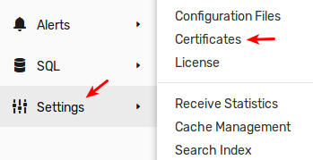
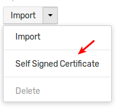
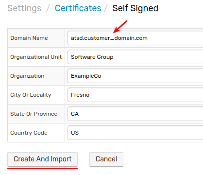

# Installing Self-signed SSL Certificate

## Overview

The default certificate installed in ATSD is generated for DNS name (`commonName`) `atsd`. This document describes the process of creating and installing a self-signed SSL certificate to match the actual DNS name (fully qualified hostname) at which the ATSD server is accessible.

<!-- markdownlint-enable MD032 -->
:::warning Note
Once replaced, the new certificate does not eliminate security warnings in user browsers and requires passing `--insecure` parameter when connecting to the database using `curl` and similar tools to skip certificate validation.
:::

:::tip Validated Certificates

* To install an SSL certificate validated by a certificate authority, refer to [CA-signed Certificate](ssl-ca-signed.md) installation guide.
* To automate the SSL certificate renewal, consider deploying [Let's Encrypt](ssl-lets-encrypt.md) certificates.

:::
<!-- markdownlint-disable MD032 -->

## Create and Import Certificate

There are two options to create and import self-signed certificates into ATSD:

* [Web Interface](#web-interface)
* [Endpoint Request](#endpoint-request)

The certificates are installed without restarting the database.

### Web Interface

Log into ATSD as a user with administrative privileges.

Open the **Settings > Certificates** page and click **Self Signed Certificate** in the split-button:





Enter the certificate information and click **Create And Import**. Only the **Domain Name** field is required.



> **Country Code** must contain two letters if specified.

### Endpoint Request

Replace `{USR}` and `{PWD}` with administrator credentials, `{atsd_hostname}` with the hostname or IP address of the ATSD server and specify appropriate parameters in the command below.

```sh
curl -k -u {USR}:{PWD} https://{atsd_hostname}:8443/admin/certificates/self-signed \
  -d "domainName=atsd.customer_domain.com"
  -w "\n%{http_code}\n"
```

The expected response status code is `2xx` or `3xx`.

You can specify additional fields if necessary. The `countryCode` field must contain two letters if specified.

```bash
curl -v -k -u {USR}:{PWD} https://{HOST}:8443/admin/certificates/self-signed \
  -d "domainName=atsd.customer_domain.com" \
  -d "organizationalUnit=Software Group" \
  -d "organization=ExampleCo" \
  -d "cityOrLocality=Fresno" \
  -d "stateOrProvince=CA" \
  -d "countryCode=US" \
  -w "\n%{http_code}\n"
```

## Verify Certificate

Log in to ATSD by entering DNS name in the browser address bar.

Review the new certificate on the **Settings > Certificates** page and check the **Days to Expiration** field, which is set to 364 days from now.

Untrusted certificates are highlighted in orange.
