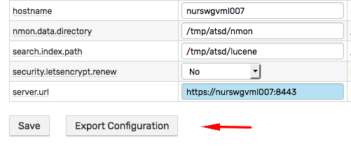
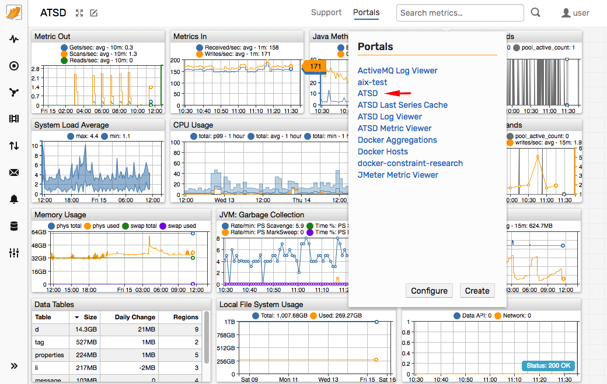
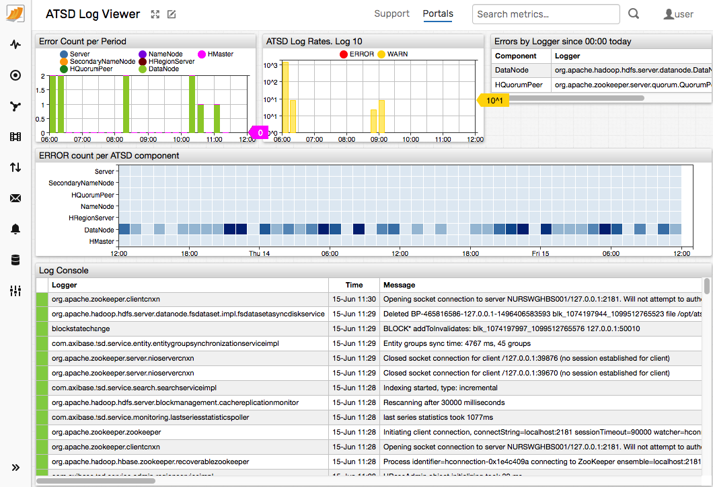
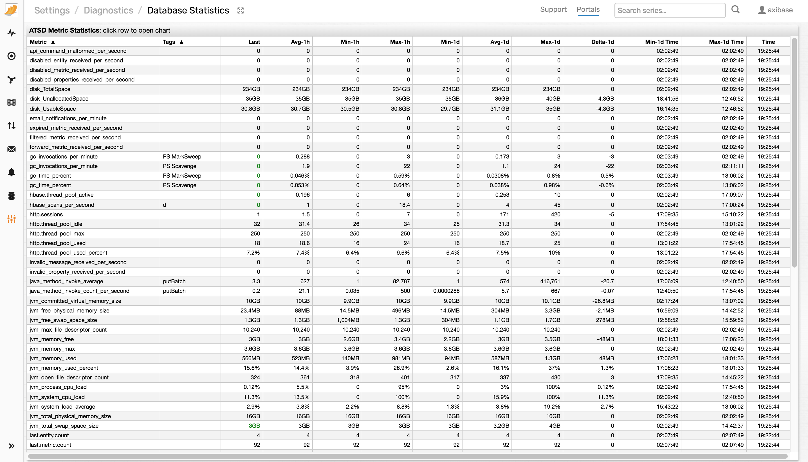
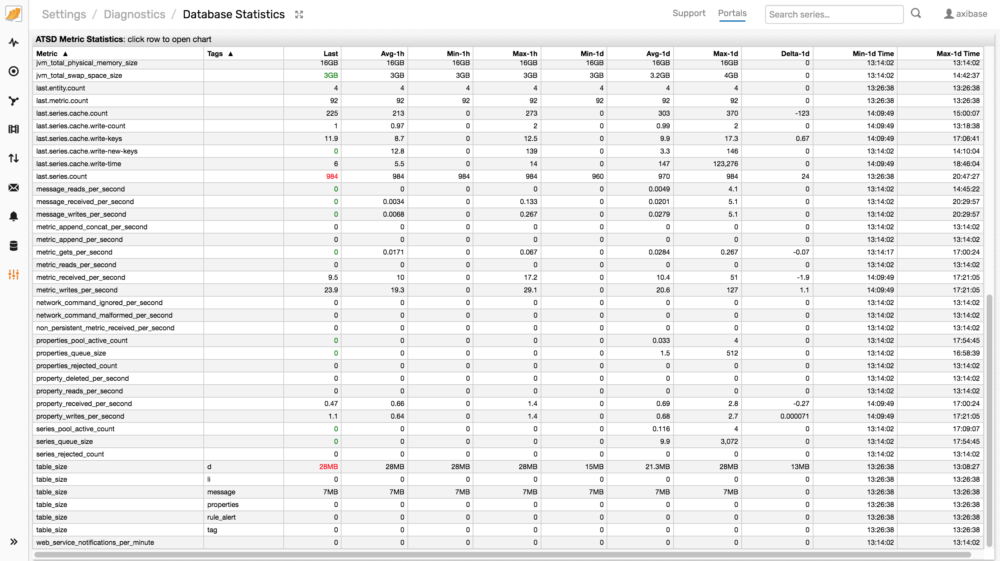

# Support

This document helps you submit a well-prepared support ticket so we can resolve it faster.

**Commercial** Support:

* Open a ticket in our [Support Desk](https://axibase.zendesk.com/home) to expedite processing.

**Community** Support:

* Contact us at `support-atsd@axibase.com`.

Use the below guidelines to attach relevant details to the ticket. Skip sections `2-6` if not applicable.

## 1. Database Information

Open **Settings > Server Properties** page.

Click **Export Configuration**.



The `configuration-export.json` file contains key database and operating system information, including:

* Operating system name and version.
* Database build and version details.
* JVM parameters.
* Java environment variables.
* Current database metrics.
* Database properties.

Review the sample [configuration file](./resources/configuration-export.json).

## 2. ATSD Log Files

The files in the `/opt/atsd/atsd/logs/` directory can be downloaded from the **Settings > Diagnostics > Server Logs** page.

1. Error log `/opt/atsd/atsd/logs/err.log`.

2. Archive (tar.gz) of `*.log` and `*.zip` files in the `/opt/atsd/atsd/logs` directory.

    ```bash
    tar czfv atsd_support.tar.gz \
      /opt/atsd/atsd/logs/*.log \
      /opt/atsd/atsd/logs/*.zip \
      /opt/atsd/atsd/logs/*.out
    ```

## 3. Extended Log Files

1. Archive (tar.gz) of the local `/opt/atsd/hbase/logs/` directory or from the HBase `HRegion` Servers.

2. Archive (tar.gz) of the local `/opt/atsd/hadoop/logs/` directory or from the HDFS Data Nodes.

3. Archive (tar.gz) of the most recent `java_pid<pid>.hprof` heap dump file in the `/opt/atsd/atsd/logs` directory, if such file is present.

## 4. Performance Statistics

1. Screenshot of the **Portals > ATSD** portal for the time period covering the issue.

    

2. Screenshot of the **Portals > ATSD Log Viewer** portal for the time period covering the issue.

    
    
3. Screenshots of the **Settings / Diagnostics / Database Statistics** table.

    

    

4. CSV Export of the below query generated in the [SQL Console](../sql/sql-console.md). Modify the `datetime` condition to match the hour when the issue occurred.

```sql
SELECT t1.datetime, t1.value AS api_cm, t2.value AS dis_mtr, t3.value AS exp_mtr, t4.value AS flt_mtr, t5.value AS fwd_mtr,
  t6.value AS hbs_scan, t7.value AS hsess, t8.value AS hpool, t9.value AS hpool_pct, t10.value AS jvm_com_vs,
  t11.value AS jvm_fr_pmem, t12.value AS jvm_fr_swap, t13.value AS max_file, t14.value AS mem_free, t15.value AS mem_max,
  t16.value AS mem_used, t17.value AS mem_used_pct, t18.value AS open_file, t19.value AS proc_load, t20.value AS sys_cpu_load,
  t21.value AS sys_loadavg, t22.value AS tot_phys_mem, t23.value AS tot_swap, t24.value AS mtr_gets, t25.value AS mtr_reads,
  t26.value AS mtr_recv, t27.value AS mtr_writes, t28.value AS net_cmd_ign, t29.value AS net_cmd_malf, t30.value AS non_pers,
  t31.value AS ser_pool_active, t32.value AS ser_queue, t33.value AS ser_rejc
  FROM api_command_malformed_per_second t1
  JOIN disabled_metric_received_per_second t2
  JOIN expired_metric_received_per_second t3
  JOIN filtered_metric_received_per_second t4
  JOIN forward_metric_received_per_second t5
  JOIN using entity hbase_scans_per_second t6
  JOIN http.sessions t7
  JOIN http.thread_pool_used t8
  JOIN http.thread_pool_used_percent t9
  JOIN jvm_committed_virtual_memory_size t10
  JOIN jvm_free_physical_memory_size t11
  JOIN jvm_free_swap_space_size t12
  JOIN jvm_max_file_descriptor_count t13
  JOIN jvm_memory_free t14
  JOIN jvm_memory_max t15
  JOIN jvm_memory_used t16
  JOIN jvm_memory_used_percent t17
  JOIN jvm_open_file_descriptor_count t18
  JOIN jvm_process_cpu_load t19
  JOIN jvm_system_cpu_load t20
  JOIN jvm_system_load_average t21
  JOIN jvm_total_physical_memory_size t22
  JOIN jvm_total_swap_space_size t23
  JOIN metric_gets_per_second t24
  JOIN metric_reads_per_second t25
  JOIN metric_received_per_second t26
  JOIN metric_writes_per_second t27
  JOIN network_command_ignored_per_second t28
  JOIN network_command_malformed_per_second t29
  JOIN non_persistent_metric_received_per_second t30
  JOIN series_pool_active_count t31
  JOIN series_queue_size t32
  JOIN series_rejected_count t33
WHERE t1.entity = 'atsd'
  AND t1.datetime BETWEEN '2018-05-01T08:00:00Z' AND '2018-05-01T09:00:00Z'
WITH INTERPOLATE(1 MINUTE)
```

## 5. Portal Configuration

Attach this if the problem is related to charts and portals.

1. Screenshot of the affected portal.

2. Portal configuration text.