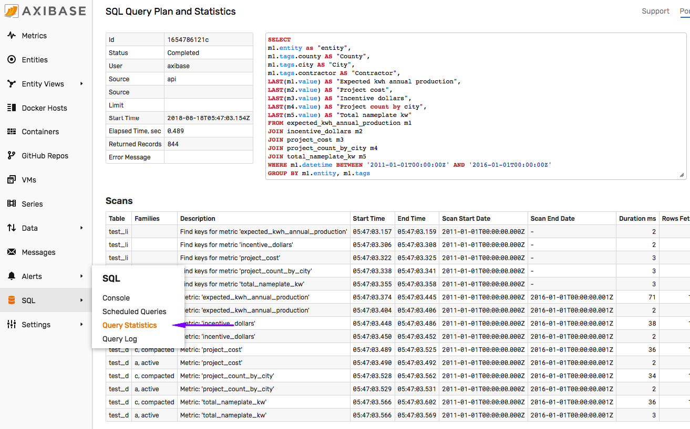

# Support

## Support Options

* **Commercial** Support:

  Open a ticket in our [Support Desk](https://axibase.zendesk.com/home) to expedite processing.

* **Trial Period** Support:

  Email us at `support-atsd@axibase.com`.

## Overview

This document helps you submit a well-prepared support ticket to ensure Axibase staff can resolve it faster.

Use the below guidelines to attach relevant details to the ticket.

Section `1` is **required**. Skip sections `2` - `8` if not applicable.

## 1. Database Information

Open [**Settings > Server Properties**](./server-properties.md) page.

Click **Export Configuration**.


The `configuration-export.json` file contains key database and operating system information, including:

* Operating system name and version.
* Database build and version details.
* JVM parameters.
* Java environment variables.
* Current database metrics.
* Database properties.

Review the sample [configuration file](./resources/configuration-export.json).

:::warning Note
If the database fails to start, provide the `.tar.gz` archive of the `/opt/atsd/atsd/conf` directory instead.
:::

:::tip Note
For distributed installations, attach output of the `status` command in HBase shell.
:::

## 2. Database Log Files

The files in the `/opt/atsd/atsd/logs/` directory can be downloaded from the **Settings > Diagnostics > Server Logs** page.

1. Error log `/opt/atsd/atsd/logs/err.log`.

2. Archive (`.tar.gz`) of `*.log` and `*.zip` files in the `/opt/atsd/atsd/logs` directory.

    ```bash
    tar czfv atsd_support.tar.gz \
      /opt/atsd/atsd/logs/*.log \
      /opt/atsd/atsd/logs/*.zip \
      /opt/atsd/atsd/logs/*.out
    ```

## 3. Extended Log Files

:::tip Note
HBase and HDFS log files are accessible from the **Settings > Diagnostics > Server Logs** page if ATSD is running in [standalone](../installation/packages.md) mode.
:::

1. Archive (`.tar.gz`) of the `/opt/atsd/hbase/logs/` directory if ATSD is running in [standalone](../installation/packages.md) mode.

2. Archive (`.tar.gz`) of the `/var/log/hbase/` directory from the HBase HMaster server if ATSD is running in distributed mode.

3. Archive (`.tar.gz`) of the `/opt/atsd/hadoop/logs/` directory if ATSD is running in [standalone](../installation/packages.md) mode.

4. Archive (`.tar.gz`) of the most recent `java_pid<pid>.hprof` heap dump file in the `/opt/atsd/atsd/logs` directory, if such file is present.

## 4. Performance Statistics

1. Screenshot of the **Portals > ATSD** portal for the time period covering the issue.

    

2. Screenshot of the **Portals > ATSD Log Viewer** portal for the time period covering the issue.

    

3. Screenshots of the **Settings > Diagnostics > Database Statistics** table.

    

    

4. CSV Export of the below query generated in the [SQL Console](../sql/sql-console.md). Modify the `datetime` condition to match the hour when the issue occurred.

    ```sql
    SELECT t1.datetime, t1.value AS api_cm, t2.value AS dis_mtr, t3.value AS exp_mtr, t4.value AS flt_mtr, t5.value AS fwd_mtr,
    t6.value AS hbs_scan, t7.value AS hsess, t8.value AS hpool, t9.value AS hpool_pct, t10.value AS jvm_com_vs,
    t11.value AS jvm_fr_pmem, t12.value AS jvm_fr_swap, t13.value AS max_file, t14.value AS mem_free, t15.value AS mem_max,
    t16.value AS mem_used, t17.value AS mem_used_pct, t18.value AS open_file, t19.value AS proc_load, t20.value AS sys_cpu_load,
    t21.value AS sys_loadavg, t22.value AS tot_phys_mem, t23.value AS tot_swap, t24.value AS mtr_gets, t25.value AS mtr_reads,
    t26.value AS mtr_recv, t27.value AS mtr_writes, t28.value AS net_cmd_ign, t29.value AS net_cmd_malf, t30.value AS non_pers,
    t31.value AS ser_pool_active, t32.value AS ser_queue, t33.value AS ser_rejc
    FROM api_command_malformed_per_second t1
    JOIN disabled_metric_received_per_second t2
    JOIN expired_metric_received_per_second t3
    JOIN filtered_metric_received_per_second t4
    JOIN forward_metric_received_per_second t5
    JOIN using entity hbase_scans_per_second t6
    JOIN http.sessions t7
    JOIN http.thread_pool_used t8
    JOIN http.thread_pool_used_percent t9
    JOIN jvm_committed_virtual_memory_size t10
    JOIN jvm_free_physical_memory_size t11
    JOIN jvm_free_swap_space_size t12
    JOIN jvm_max_file_descriptor_count t13
    JOIN jvm_memory_free t14
    JOIN jvm_memory_max t15
    JOIN jvm_memory_used t16
    JOIN jvm_memory_used_percent t17
    JOIN jvm_open_file_descriptor_count t18
    JOIN jvm_process_cpu_load t19
    JOIN jvm_system_cpu_load t20
    JOIN jvm_system_load_average t21
    JOIN jvm_total_physical_memory_size t22
    JOIN jvm_total_swap_space_size t23
    JOIN metric_gets_per_second t24
    JOIN metric_reads_per_second t25
    JOIN metric_received_per_second t26
    JOIN metric_writes_per_second t27
    JOIN network_command_ignored_per_second t28
    JOIN network_command_malformed_per_second t29
    JOIN non_persistent_metric_received_per_second t30
    JOIN series_pool_active_count t31
    JOIN series_queue_size t32
    JOIN series_rejected_count t33
    WHERE t1.entity = 'atsd'
    AND t1.datetime BETWEEN '2018-05-01T08:00:00Z' AND '2018-05-01T09:00:00Z'
    WITH INTERPOLATE(1 MINUTE)
    ```

## 5. Portal Configuration

Attach the following inputs if the problem is related to charts, widgets, and portals.

1. Screenshot of the affected portal.

1. Portal configuration text from the **Portals > Configure** page.

1. Series query response [captured](https://axibase.com/docs/charts/troubleshooting/capture_response.html) using Developer Tools in the browser.

## 6. Client Libraries

1. API Client name and version.

1. Execution environment such as Python version and dependency module versions.

1. Error message reported by the client application.

## 7. JDBC Driver

1. Driver version.

    The driver version can be obtained from the [`atsd-jdbc-*.jar`](https://github.com/axibase/atsd-jdbc/releases) file name, for example `atsd-jdbc-1.4.0-DEPS.jar` or from the `POM` file.

    ```xml
    <dependency>
        <groupId>com.axibase</groupId>
        <artifactId>atsd-jdbc</artifactId>
        <version>1.4.0</version>
    </dependency>
    ```

1. Confirm that the driver version is [compatible](https://github.com/axibase/atsd-jdbc#compatibility) with the ATSD version.

1. [JDBC URL](https://github.com/axibase/atsd-jdbc#jdbc-url) including any [connection properties](https://github.com/axibase/atsd-jdbc#jdbc-connection-properties-supported-by-driver) specified when connecting to the database.

1. JVM version of the Java application executing the driver.

1. Java stack trace of the exception intercepted by the Java application.

## 8. SQL Queries

Provide the following details if an SQL query returns unexpected errors or incomplete/wrong results.

1. SQL query text.

1. Query results in CSV format exported in the [SQL console](../sql/sql-console.md#export) or using the [SQL bash client](../sql/client/README.md).

    ```bash
    ./sql.sh -i query.sql -f csv -o results.csv
    ```

    Compress the CSV file to a `zip` or `gzip` archive to reduce the attachment size.

1. SQL query plan screenshot from the **SQL > Query Statistics** page.

    