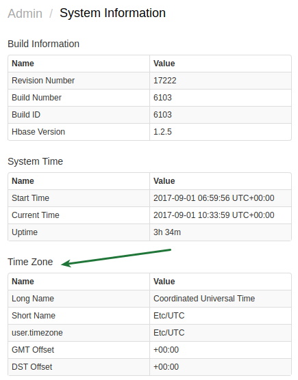

# Timezone

The timezone in which the database runs determines how [endtime](../end-time-syntax.md) keywords are evaluated and how the intervals are split into DAY-based [periods](../api/data/series/period.md).

By the default, the timezone is inherited from the timezone of the operating system on which ATSD is running.

## Viewing the Time Zone

The current timezone is displayed on the **Admin > System Information** page.



## Changing the Time Zone

* Select Timezone ID from the following [list](../api/network/timezone-list.md), for example, "US/Pacific".

* Open /opt/atsd/atsd/conf/atsd-env.sh

```bash
#!/bin/bash

export JAVA_OPTS="-server -Xmx1024M -XX:+HeapDumpOnOutOfMemoryError -XX:HeapDum$

# Uncomment to set custom timezone
#TIME_ZONE=US/Pacific
#export JAVA_PROPERTIES="-Duser.timezone=${TIME_ZONE} $JAVA_PROPERTIES"

# Uncomment to enable Kerberos debug
#export JAVA_PROPERTIES="-Dsun.security.krb5.debug=true $JAVA_PROPERTIES"

# Uncomment to enable ATSD output logging
#export outLog="${atsd_home}/logs/out.log"
```

* Uncomment TIME_ZONE and export JAVA_PROPERTIES below:

```bash
#!/bin/bash

export JAVA_OPTS="-server -Xmx1024M -XX:+HeapDumpOnOutOfMemoryError -XX:HeapDum$

# Uncomment to set custom timezone
TIME_ZONE=US/Pacific
export JAVA_PROPERTIES="-Duser.timezone=${TIME_ZONE} $JAVA_PROPERTIES"

# Uncomment to enable Kerberos debug
#export JAVA_PROPERTIES="-Dsun.security.krb5.debug=true $JAVA_PROPERTIES"

# Uncomment to enable ATSD output logging
#export outLog="${atsd_home}/logs/out.log"
```

* Restart ATSD.

```bash
/opt/atsd/atsd/bin/stop-atsd.sh
/opt/atsd/atsd/bin/start-atsd.sh
```

* Open the **Admin > System Information** page and verify that the new timezone setting is set.
