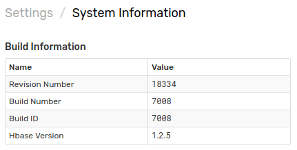

# Manual Update

## Log in to ATSD Server

```sh
su axibase
```

```sh
cd /opt/atsd
```

## Download the Latest ATSD Distribution Files

Open [ATSD Download Page](https://www.axibase.com/public/atsd_update_latest.htm).

The archive contains the latest ATSD release with the revision number included in the file name, for example `atsd.19925.tar.gz`.

Alternatively, download the archive using `curl`.

```sh
curl -O https://axibase.com/public/atsd.tar.gz
```

Copy the archive to the ATSD server.

## Unpack the Archive

```sh
tar xzf atsd.{revision}.tar.gz
```

View Files in the Archive

```sh
ll target
```

```sh
atsd.<revision number>.jar
atsd-hbase.<revision number>.jar
calendars
```

## Stop ATSD

```sh
/opt/atsd/bin/atsd-all.sh stop
```

## Replace JAR Files

```sh
rm -rf /opt/atsd/hbase/lib/atsd*jar
```

```sh
mv atsd-hbase* /opt/atsd/hbase/lib/
```

```sh
rm -rf /opt/atsd/atsd/bin/atsd*jar
```

```sh
mv atsd* /opt/atsd/atsd/bin/
```

```sh
mkdir -p calendars/
mv calendars/* /opt/atsd/atsd/conf/calendars/
```
## Start ATSD

```sh
/opt/atsd/bin/atsd-all.sh start
```

It can take up to 5 minutes for the database to initialize.

## Log in to ATSD web interface

```sh
https://atsd_hostname:8443/
```

* Open the **Settings > System Information** page.
* Verify that the Revision Number has been updated.



## Remove the Archive

```markdown
rm /opt/atsd/atsd.tar.gz
```
