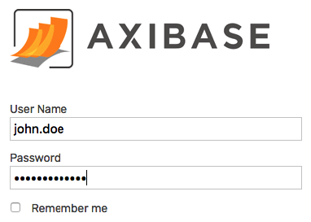
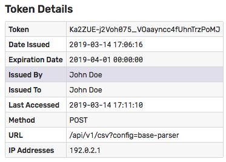
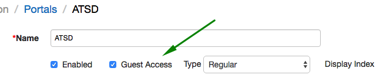
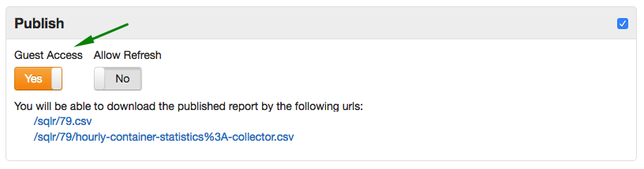

# User Authentication

Authentication mechanisms implemented in ATSD control how users present and verify their identity when accessing protected resources such as web pages or API endpoints.

Supported authentication mechanisms:

* Form Authentication
* Basic Authentication
* Token Authentication

## Authentication Mechanisms

### Form Authentication

Accessing the web interface requires the user to provide the correct username and password on the login page.

  

The user is granted access if the account for the specified username exists, the password is correct, and the account is not locked or expired.

When activated, the **Remember Me** option on the login form stores the submitted username in the user's browser cache.

### Basic Authentication

An HTTP request to an API URL starting with `/api/` is required to include an `Authorization` header with type `Basic`. See [examples](#http-basic-authorization-examples) below.

If the `Authorization` header is missing, the client is prompted to provide username and password.

Once credentials are verified, subsequent API requests within the same session can be executed without the `Authorization` header.

This type of authentication is suited for client programs that need to perform a wide array of API requests.

```bash
curl https://atsd_hostname:8443/api/v1/series/query \
  --insecure \
  --user {username}:{password} \
  --header "Content-Type: application/json" \
  -d '[{"metric":"mpstat.cpu_busy", "entity":"nurswgvml007", "startDate":"previous_day", "endDate": "now"}]' > response.json
```

Requests authenticated with **Basic Authentication** are subject to the same permission checks as the underlying user account.

### Token Authentication

An HTTP request to a specific API URL starting with `/api/` can be authenticated by including the `Authorization` header with type `Bearer`.

```sh
--header "Authorization: Bearer <API-TOKEN>"
```

> Passing the token in the URL is not supported because of the security [weaknesses](https://tools.ietf.org/html/rfc6750#section-2.3).

The token allows access to a **specific** URL, consisting of path and query parameters. The URL and the HTTP method are fixed at the time the token is created. The order of query parameters and the URL-encoding scheme is not important.

To allow access to a variable URL with placeholders, where parameter value or path parts can be substituted at request time, use the `<>` syntax.

```ls
/api/v1/portal/export?id=<>
  Allows:
  - /api/v1/portal/export?id=1
  - /api/v1/portal/export?id=2
  - /api/v1/portal/export?id=abc

/api/v1/csv/<>
  Allows:
  - /api/v1/csv/export
  - /api/v1/csv/import
```

Users can issue and revoke tokens on the Account Settings page. The tokens can be set to automatically expire and be subject to IP address restrictions.

  

Token authentication does not require sharing username and password with client programs and is suited for automation scripts that need to execute a limited set of actions such as uploading a CSV file.

```bash
curl https://atsd_hostname:8443/api/v1/csv?config=base-parser \
  --insecure --request POST \
  --header "Authorization: Bearer <API-TOKEN>" \
  --header "Content-Type: text/csv" \
  --form "data=@daily.csv"
```

IP address restrictions set for the token override any IP address restrictions set for the underlying user account.

Requests authenticated with **Token Authentication** are subject to the same permission checks as the underlying user account.

## User Account Types

User accounts are stored in the database.

The user account can be configured to use either **Local** or **LDAP** authentication.

### Local Accounts

When using **Local** authentication, the database stores the hashcode of the user password in the underlying HBase database.

The user identity is verified if the hashcode of the submitted password matches the stored hashcode for the specified username.

The password is subject to the requirements outlined [below](#password-requirements).

### LDAP Accounts

When using **LDAP** authentication, the database verifies that the account exists in the database and the password is confirmed by submitting an authentication request to the remote LDAP server.

If the LDAP server locates the specified account and confirms its password, the user is allowed to access the database.

The access is denied if the LDAP server cannot find the account or if the LDAP account is locked, disabled, or requires password change.

## Password Requirements

The following password rules apply to **Local** accounts:

* Password must contain at least **six** (`6`) characters by default.

* Adjust the default minimum length in the `server.properties` file with the `user.password.min.length` setting.

* Passwords are **case-sensitive**.

* Password can contain the following characters:

  * Any Unicode character categorized as an alphanumeric character.

  * Special characters:

```txt
~ ! @ # $ % ^ & * _ - + = ` | \ ( ) { } [ ] : ; ” ‘ < > , . ? / " '
```

## Built-in Account

* When accessed for the first time after installation, the database presents a configuration web page for the default administrator account. This account is granted an `ADMIN` role with `All Entities: Read` and `All Entities: Write` permissions.

## Changing Password

* Users with Local accounts can modify their password by clicking on the user icon in the top menu.

* Users are not allowed to change their own type, roles, group membership, or entity permissions.

## Resetting Password

* User passwords for Local accounts are stored as hashcodes. As a result, recovering a lost password is not supported.

* To reset the password for a user account:
  * Open the `server.properties` file.
  * Add `user.password.reset.username={username}` and `user.password.reset.password={new-password}` settings and save the file.
    * Restart the database.
    * Remove the above settings from the `server.properties` file to prevent password resets on subsequent restarts.

* If the account being reset is configured as LDAP type, the type is changed to Local.

## Guest Access to Data API

To enable anonymous access to Data API query methods, set `api.guest.access.enabled=true` in the `server.properties` file and restart the database.

## Guest Access to Portals

To expose the portal to non-authenticated visitors, open the **Portals** tab in the top menu, click **Configure**, open the portal editor and check **Guest Access**.

Since charts displayed in the portals are loaded via Data API, the **Guest Access** option is available only when Data API is configured for anonymous access.



## Guest Access to SQL Reports

To make SQL query results visible to non-authenticated visitors, check **Guest Access** on the query configuration page.



:::tip Note
Guest access to Data API is not required in this case.
:::

## HTTP Basic Authorization Examples

* Java Example:

```java
URL url = new URL("http://192.0.2.6:8088/api/v1/series");
HttpURLConnection conn = (HttpURLConnection) url.openConnection();
conn.setDoOutput(true);
conn.setRequestMethod("POST");
conn.setRequestProperty("charset", "utf-8");

String authString = userName + ":" + password;
String authEncoded = DatatypeConverter.printBase64Binary(authString.getBytes());
conn.setRequestProperty("Authorization", "Basic " + authEncoded);
```

* `curl` Example:

```bash
curl https://atsd_hostname:8443/api/v1/properties/query \
  --insecure --user {username}:{password} \
  --header "Content-Type: application/json" \
  --data '[{"type":"disk","entity":"nurswgvml007","startDate":"2016-05-25T04:00:00Z","endDate":"now"}]'
```

## Authentication and Authorization Errors

**Code** | **Description**
---|---
`01` | General Server Error
`02` | Username Not Found
`03` | Bad Credentials
`04` | Disabled LDAP Service
`05` | Corrupted Configuration
`06` | MS Active Directory
`07` | Account Disabled
`08` | Account Expired
`09` | Account Locked
`10` | Logon Not Permitted At Time
`11` | Logon Not Permitted At Workstation
`12` | Password Expired
`13` | Password Reset Required
`14` | Wrong IP Address
`15` | Access Denied
`16` | Authorization Token Expired
