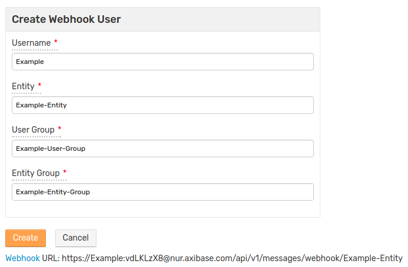
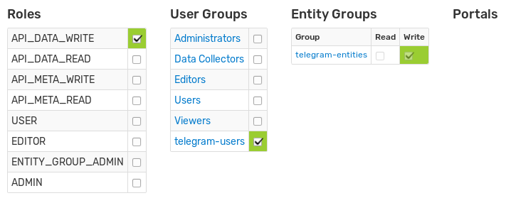
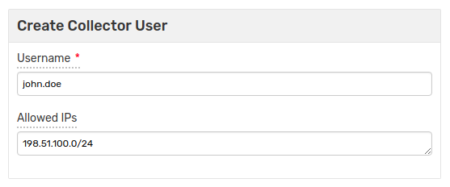
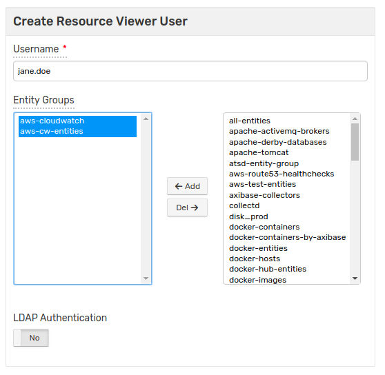
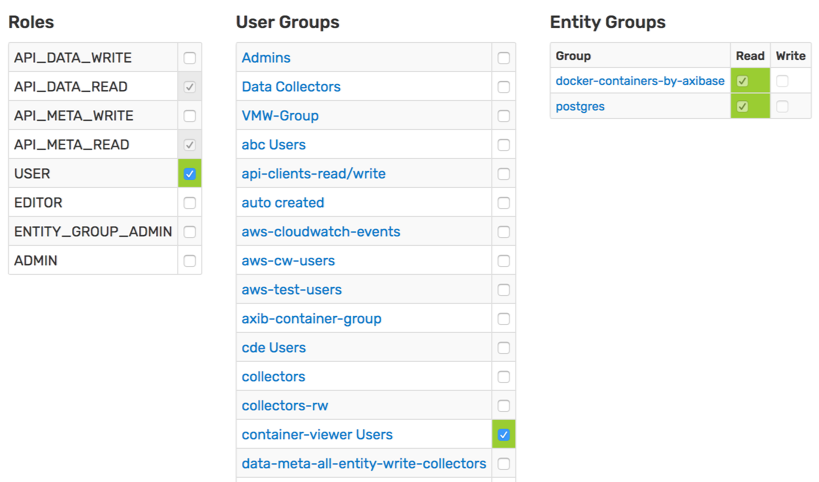

# User Authorization

ATSD implements roles and permissions to authorize access to protected information.

## Role Based Access Control

Authenticated users are allowed to access protected resources based on their role. The role determines which URLs the user can request. Each user can be granted multiple roles.

### API Roles

| Role | Description |
| --- | --- |
|`API_DATA_READ` | Query Data API to read series, properties, messages, and alerts from the database.|
|`API_DATA_WRITE` | Submit Data API requests to insert series, properties, and messages into the database.|
|`API_META_READ` | Query Meta Data API to read metric, entity, and entity group settings.|
|`API_META_WRITE` | Submit Meta Data API requests to change metric and entity settings.  Requests to change entity groups or add/remove members require an `ENTITY_GROUP_ADMIN` role.|

### User Interface Roles

| Role | Description |
| --- | --- |
| `USER` | View information on all pages except configuration and settings pages.  Includes `API_DATA_READ` and `API_META_READ` roles. |
| `EDITOR` | View and edit information on all pages except settings pages.  Includes `USER` role. |
| `ENTITY_GROUP_ADMIN` | Edit [Entity Groups](../configuration/entity_groups.md).  Includes `USER` role. |
| `ADMIN` | View and edit information on all pages.  Includes all roles. |

## Entity Permissions

Permissions to read and write data for entities in a particular Entity Group are granted at the **User Group level**.

> Granting permissions to a particular entity is **not supported**. To facilitate access controls, an entity must be added to an Entity Group.

Effective permissions are calculated as the union of all user groups permissions given to groups to which the user belongs.

To read data for an entity, the user must have the `API_DATA_READ` role and be a member of the user group with `read` permission to the Entity Group containing the target entity.

To insert or modify data for an entity, the user must have the `API_DATA_WRITE` role and be a member of the User Group with `write` permission to the Entity Group containing the target entity.

In the below diagram, to read data for `entity-30`, the user must be a member of `user-group-C`, or reading `entity-group-3` must be allowed for `user-group-B` or `user-group-A`.

### All Entities Permissions

As an alternative to specific entity group permissions, user groups can be granted the `All Entities: Read` or `All Entities: Write` permission, which allows reading or writing data for any entity, including entities that do not belong to any entity group. Users inherit `All Entities` permissions from the User Groups to which they belong.

The permissions to read and write data for all entities is automatically granted to users with `ADMIN` role.

### Inserting Data for New Entities

Since non-existent entities cannot be assigned to a group, the `All Entities: Write` permission is required to create
entities either in the web interface or by inserting data via API. Users with the `API_DATA_WRITE` role but without the
`All Entities: Write` permission are able to insert data only for existing entities.

### Wildcard Requests

Users without `All Entities: Read` permission are allowed to query Data API using wildcards as part of entity name as well as execute SQL queries without entity name conditions. However in both cases, the results are filtered based on the effective permissions of that particular user, therefore different users can see different results for the same API request or SQL query depending on their entity permissions.

## Entity View Permissions

The user is authorized to access an [Entity View](../configuration/entity_views.md) if the user has `read` permissions to one of the Entity Groups to which the view is linked.

The permissions to access all entity views is automatically granted to users with `ADMIN` role.

## Portal Permissions

The portal permissions define which portals the user is authorized to view.

Permissions to view a portal are granted at the User Group level.

Permissions are enforced for both template portals and regular portals.

### All Portals Permission

A user group can be granted `All Portal` permission whereby its members are authorized to view all portals.

The permission to view all portals is automatically granted to users with `ADMIN` role.

## User Wizards

To simplify the process of creating user account for typical use cases, the database provides wizards to create a **webhook** user, a **collector** user, and a **resource viewer** user.

To create a new user with a wizard, navigate to **Settings > Users** and select one of the **Create User** options from the split-button located below the **Users** table.

### Webhook User

The **webhook** user inserts messages through the [`/api/v1/webhook`](../api/data/messages/webhook.md) endpoint and is granted the `API_DATA_WRITE` role and `write` permissions for **one** specific entity.

The wizard automatically creates a new user account, user and entity groups and grants necessary permissions.

### Collector User

The **collector** user inserts data of all types (series, properties, and messages) for many entities, including new entities, and is granted the `API_DATA_WRITE` and `API_META_WRITE` roles and `write` permissions for **all** entities.

The instruments inserting data under the **collector** account are typically located within a specific network segment and an option to specify the allowed IP range can be used to enhance access security.

The wizard creates a new user account automatically and makes it a member of the `Data Collectors` user group with `All Entities: Write` permission.

### Resource Viewer User

This user is created with the `USER` role and random-generated password. A corresponding user group with `read` permissions to entity groups selected on the wizard form is created automatically.

## Implementation Notes

User role, group membership, and entity permissions are cached while the user session is active. The session is invalidated in case the user authorization is changed by an administrator, in which case the user has to re-login.
