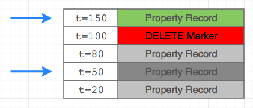
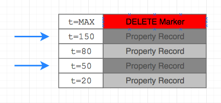

# Properties: delete

## Description

Deletes property records that match specified filters.

## Deletion Process

Property records deleted with this method are not instantly removed from the disk.

Instead, records are masked with a `DELETE` marker timestamped when the delete operation is initiated. The `DELETE` marker masks all properties recorded with an earlier timestamp and thus are not visible to reading applications.

As a result, re-inserting property records with a timestamp earlier than the `DELETE` marker is not possible until the marker is removed.

In the example below, the records are deleted at time `t=100`. The `DELETE` marker hides all records with time earlier than `100`. When new records are inserted with timestamps `t=80` and `t=150`, only the second record is visible to clients.



When an entire entity is deleted, the `DELETE` marker has a `Long.MAX_VALUE` time and hides all properties for the given entity regardless of timestamp.

In the example below, the `DELETE` marker hides all records, including new records with timestamps `t=80` and `t=150`.



The actual deletion from the disk, which removes both the `DELETE` markers as well as the masked records, occurs in the background as part of a scheduled HBase procedure called [`major compaction`](../../../administration/compaction.md).

To identify pending `DELETE` markers for a given type and entity, run:

```sh
echo "scan 'atsd_properties', {'LIMIT' => 3, RAW => true, FILTER => \"PrefixFilter('\\"prop_type\\":\\"entity_name\\"')\"}" | /opt/atsd/hbase/bin/hbase shell
```

To remove all `DELETE` markers ahead of schedule, trigger a `major compaction` task on the `atsd_properties` table manually.

```sh
echo "major_compact 'atsd_properties'" | /opt/atsd/hbase/bin/hbase shell
```

Once the `DELETE` markers are deleted, new records can be created with any timestamps.

## Request

| Method | Path | `Content-Type` Header|
|:---|:---|---:|
| `POST` | `/api/v1/properties/delete` | `application/json` |

### Parameters

None.

### Fields

An array of objects containing fields for filtering records for deletion.

| **Field**  | **Type** | **Description**  |
|:---|:---|:---|
| `type` | string | **[Required]** Property type name. <br>This method does not support the removal of reserved `$entity_tags`.|
| `entity` | string | **[Required]** Entity name. <br>Set entity to wildcard `*` to delete records for all entities.|
| `startDate` | string | **[Required]** [ISO formatted](../../../shared/date-format.md#supported-formats) date or [calendar](../../../shared/calendar.md) keyword. <br>Delete records updated at or after the specified time. |
| `endDate` | string | **[Required]** [ISO formatted](../../../shared/date-format.md#supported-formats) date or [calendar](../../../shared/calendar.md) keyword.<br>Delete records updated before the specified time. |
| `key` | object | Object with `name=value` fields, for example `{"file_system": "/"}`.<br>Deletes records with **exact** or **partial** key fields based on the `exactMatch` parameter.|
| `exactMatch` | boolean | If `exactMatch` is `true`, only one record with exactly the same `key` as in the request is deleted.<br>If `exactMatch` is `false`, all records which **contain** fields in the request `key` are deleted.<br>If `exactMatch` is `false` and no `key` is specified, all records for the specified type and entity are deleted.<br>Default: `true`.|

* Key and tag names are case-**insensitive**.
* Key and tag values are case-**sensitive**.

## Response

### Fields

| **Name**  | **Type** | **Description**  |
|:---|:---|:---|
| `deleted` | number | Number of deleted properties. |

### Errors

None.

## Key Match Example

The following property records `A`,`B`,`C`, and `D` are present in the database.

```ls
| record | type   | entity | key-1 | key-2 |
|--------|--------|--------|-------|-------|
| A      | type-1 | e-1    | val-1 | val-2 |
| B      | type-1 | e-2    | val-1 |       |
| C      | type-1 | e-3    |       | VAL-3 |
| D      | type-1 | e-4    |       |       |
```

The table illustrates which records are deleted for the corresponding `exactMatch` and `key` parameters in the `result` column.

```ls
| exactMatch | key                     | result  |
|------------|-------------------------|---------|
| true       |                         | D       |
| false      |                         | A;B;C;D |
| true       | key-1=val-1             | B       |
| false      | key-1=val-1             | A;B     |
| true       | key-1=val-1;key-2=val-2 | A       |
| false      | key-1=val-1;key-2=val-2 | A       |
| false      | key-2=val-3             |         |
| false      | key-2=VAL-3             | C       |
```

## Example

### Request

#### URI

```elm
POST /api/v1/properties/delete
```

#### Payload

```json
[{
    "type":"disk",
    "entity":"nurswgvml007",
    "key":{"file_system":"/","name":"sda1"}
},{
    "type":"disk",
    "entity":"nurswgvml006",
    "exactMatch": false
}]
```

#### curl

```bash
curl https://atsd_hostname:8443/api/v1/properties/delete \
  -k --user {username}:{password} \
  --header "Content-Type: application/json" \
  --data '[{ "type":"disk", "entity":"nurswgvml007", "key":{"file_system":"/","name":"sda1"} }]'
```
