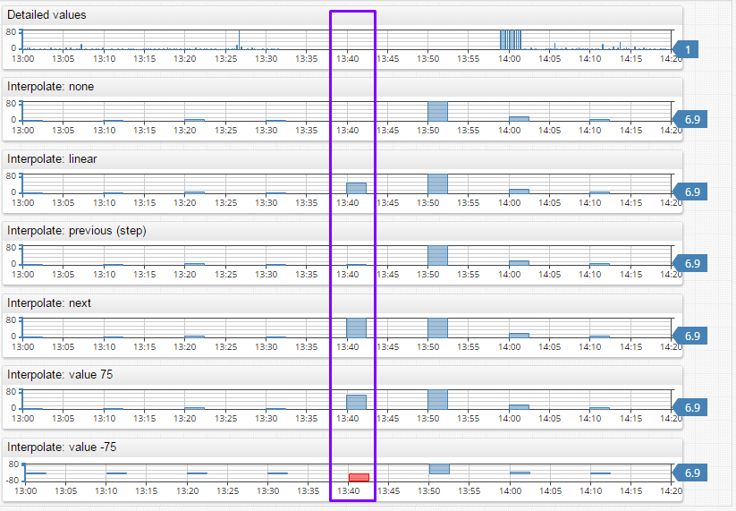

# Aggregate Processor

## Overview

Aggregate Processor splits an interval into periods and calculates statistics for each period. If no period is specified in the request, statistics are computed for the entire interval.

The aggregation process is implemented as follows:

1. Load detailed data within the specified `startDate` and `endDate` into each series separately. <br>`startDate` is inclusive and `endDate` is exclusive.
2. Split each series `time:value` array into periods based on an [alignment](period.md#alignment) parameter.<br>If `period` parameter is not specified, all series data belongs to a single period from `startDate` until `endDate`.
3. Discard periods whose start time is earlier than `startDate`.
4. Apply [statistical function](../../../api/data/aggregation.md) to values in each period and return a modified `time:value` array for each series where `time` is the period start time and `value` is the result of the statistical function.

## Fields

| **Name** | **Type**  | **Description**   |
|:---|:---|:---|
| `type`  | string        | **[Required]** [Statistical function](../aggregation.md) applied to detailed values in the period, such as `AVG`, `SUM`, or `COUNT`. |
| `types` | array          | Array of [statistical functions](../aggregation.md).<br>Either `type` or `types` field are required in each query. |
| `period`  | object     | Regular [period](#period) specified with count and time unit, for example `{ "count": 1, "unit": "HOUR" }`. |
| `interpolate`  | object  | Fill values in empty periods using an [interpolation function](#interpolation) such as `PREVIOUS` or `LINEAR`.   |
| `threshold`    | object  | Object containing the minimum and maximum range for `THRESHOLD_*` functions.  |
| `calendar`     | object  | Calendar settings for `THRESHOLD_*` functions. |
| `workingMinutes` | object | Working minutes settings for `THRESHOLD_*` functions.  |
| `order`         | integer           | Controls the processing sequence of the `group`, `rate` and `aggregate` stages. The stage with the smallest order is executed first. If the stages have the same order, the default order is: `group`, `rate`, `aggregate`.<br>Default: `0`. |

### Period

[Period](period.md) is a repeating time interval used to group detailed values within some timespan to apply a statistical function.

| **Name**  | **Type** | **Description** |
|:---|:---|:---|
| `unit`  | string | [Time unit](time-unit.md) such as `MINUTE`, `HOUR`, `DAY`. |
| `count`  | number | Number of time units contained in the period. |
| `align` | string | Alignment of the period start/end time.<br>Allowed values: `CALENDAR`, `START_TIME`, `END_TIME`, `FIRST_VALUE_TIME`.<br>Default: `CALENDAR`.|
| `timezone` | string | [Time Zone ID](../../../shared/timezone-list.md) for aligning timestamps in [`CALENDAR`](period.md#calendar-alignment) mode.<br>The default value is equal to the database time zone displayed at **Settings > System Information**.|

Example: `{ "count": 1, "unit": "HOUR" }` or `{ "count": 15, "unit": "MINUTE", "align": "END_TIME" }`.

### calendar

| **Name** | **Type**| **Description** |
|:---|:---|:---|
| `name` | string | Custom calendar name |

Example: `{ "name": "au-nsw-calendar" }`.

### threshold

* Either `min` or `max` is **required**.

| **Name** | **Type**| **Description** |
|:---|:---|:---|
| `min`  | number | Minimum threshold. |
| `max`  | number | Maximum threshold. |

Example: `{ "max": 80 }` or `{ "min": 100, "max": 150 }`.

### Working Minutes

| **Name** | **Type**| **Description** |
|:---|:---|:---|
| `start` | number | **[Required]** Working date start time, in minutes. If working day starts at 9:30 then `start` can be specified as `570` (`9 * 60 + 30`). |
| `end`   | number | **[Required]** Working date end time, in minutes.  |

## Examples

* 1-hour Average

```json
{
    "aggregate" : {
        "type": "AVG",
        "period": {"count": 1, "unit": "HOUR"}
    }
}
```

* 15-minute Average and Maximum

```json
{
    "aggregate": {
        "types": [ "AVG", "MAX" ],
        "period": { "count": 15, "unit": "MINUTE" }
    }
}
```

* Average and Count for the Entire Interval

```json
{
    "aggregate": {
        "types": [ "AVG", "COUNT" ]
    }
}
```

### Interpolation

By default, if the period does not contain any detailed values, the period is excluded from results.

Configure this behavior with an interpolation function which fills a missing period with data calculated based on previous and next period aggregate values.

<!-- markdownlint-enable MD032 -->
:::tip Note
Missing period values are interpolated from aggregate values of neighboring periods and not from raw values.
:::
<!-- markdownlint-disable MD031 MD032 -->

#### Interpolation Fields

| **Name** | **Type**  | **Description**   |
|:---|:---|:---|
| `type`  | string | **[Required]** Interpolation [function](#interpolation-functions). |
| `value` | number | **[Required by `value` function]** Constant number returned for empty periods. |
| `extend`  | boolean | Add missing periods at the beginning and end of the selection interval.<br>Default: `false`. |

Values added by the `extend` setting are determined as follows:

* If the `VALUE {n}` interpolation function is specified, the `extend` option sets empty leading and trailing period values equal to `{n}`.
* Without the `VALUE {n}` function, the `extend` option adds missing periods at the beginning and end of the selection interval using `NEXT` and `PREVIOUS` interpolation functions.

#### Interpolation Functions

| **Type** | **Description** |
|:---|:---|
| `NONE` | No interpolation. Periods without raw values are excluded from results. |
| `PREVIOUS` | Set value for the period based on the previous period value. |
| `NEXT` | Set value for the period based on the next period value. |
| `LINEAR` | Calculate period value using linear interpolation between previous and next period values. |
| `VALUE` | Set value for the period to a specific number. |

#### Examples

**PREVIOUS**:

```json
"aggregate" : {
   "type": "AVG",
   "period": {"count": 1, "unit": "HOUR"},
   "interpolate" : {
      "type": "PREVIOUS"
   }
}
```

**LINEAR**:

```json
"aggregate" : {
   "type": "AVG",
   "period": {"count": 1, "unit": "HOUR"},
   "interpolate" : {
      "type": "LINEAR"
   }
}
```

**VALUE WITH EXTEND**:

```json
"aggregate" : {
   "type": "SUM",
   "period": {"count": 1, "unit": "HOUR"},
   "interpolate" : {
      "type": "VALUE",
      "value": 0,
      "extend": true
   }
}
```

[Additional Interpolation Examples](examples/query-aggr-interpolation.md)

[ChartLab Examples](https://apps.axibase.com/chartlab/d8c03f11/3/)


