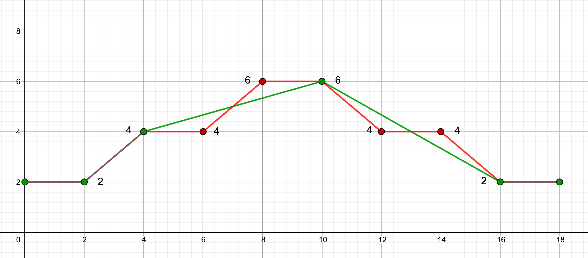
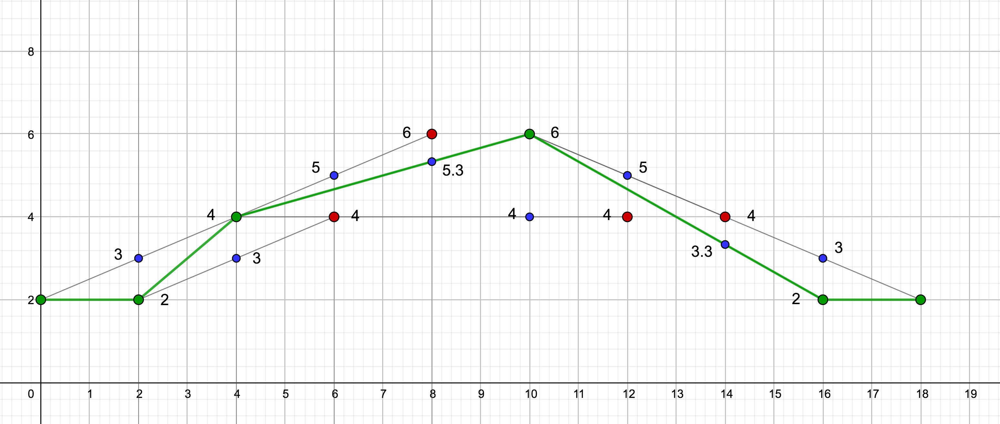
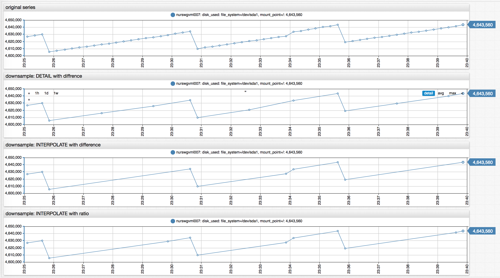

# Downsampling

## Overview

Downsampling transformation reduces time series density by filtering out sequentially duplicate samples from a response.

### Basic Example

```json
"downsample": {
  "difference": 0
}
```

The configuration excludes samples that are equal to the previous and next values.

### Advanced Example

```json
"downsample": {
  "algorithm": "INTERPOLATE",
  "difference": 10
}
```

The configuration excludes samples that are within `±10` of an interpolated value.

## Parameters

| **Name** | **Type**  | **Description**   |
|:---|:---|:---|
| [`algorithm`](#algorithm) | string | Downsampling algorithm determines which values to discard as duplicate.<br>Possible values: `DETAIL` or `INTERPOLATE`.<br>Default: `DETAIL`. |
| `difference` | number | The sample is classified as duplicate if the current value deviates by more than the specified difference, in absolute terms, from the estimated value produced by downsampling algorithm.<br>Minimum value: `0`.<br>Default: `0`. |
| `ratio` | number | The sample is classified as duplicate if the ratio of the current value and the value produced by downsampling algorithm or the inverse exceed the specified ratio.<br>Minimum value: `1`. <br>Default: `none`. |
| [`gap`](#gap) | object | Maximum distance between subsequent samples in the transformed series. Specified as count and [time unit](time-unit.md).<br>Default: `none`.|
| `order` | integer | Controls the order of downsampling in the sequence of other [transformations](./query.md#transformation-fields).<br>Default: `0`.|

> The `difference` and `ratio` parameters **cannot** be specified simultaneously.

## Gap

If the `gap` parameter is specified, and the time distance between the current and last returned sample exceeds the gap, the current sample is always included in the result.

| **Name**  | **Type** | **Description** |
|:---|:---|:---|
| `count`  | number | Number of time units. |
| `unit`  | string | [Time unit](time-unit.md), for example `MINUTE`. |

```json
"gap": {"count": 2, "unit": "MINUTE"}
```

The `gap` parameter prevents a time series from becoming too sparse as a result of downsampling.

## Processing

The samples in the input series are evaluated sequentially in ascending time order.

The following samples are **always included** in the result, even if classified as duplicate by the downsampling algorithm.

* The first and the last samples.
* Annotated samples: Sample with a non-empty [text field](./query.md#value-object).
* Samples with `NaN` value.
* Samples whose previous or next sample value is `NaN`.

The remaining samples are checked by the algorithm which excludes them from the results if classified as duplicates and the provided `gap` condition is satisfied.

> If the query retrieves [versioned](./versions.md) series, the algorithm evaluates the latest version. If the latest version is classified as a duplicate, then all versions with the same timestamp are classified as such.

## Algorithm

The `DETAIL` and `INTERPOLATE` algorithms use different formulas to classify samples as duplicates.

This documentation references the following keywords and definitions:

* `sample`: Current evaluated sample.
* `last_sample`: Last returned series sample included in the result.
* `next_sample`: Sample following current `sample`.

The timestamps of these samples are `time`, `last_time`, `next_time`, and their values are `value`, `last_value`, `next_value`.

In addition, the `INTERPOLATE` algorithm performs linear interpolation between the `last_sample` and the `next_sample` to calculate `interpolated_value` with a timestamp equal to `time`.

### Ratio Check

When the `ratio` parameter is set, the algorithms calculate several multiples.

* `DETAIL` algorithm:
  * `value/last_value`
  * `last_value/value`
  * `value/next_value`
  * `next_value/value`

* `INTERPOLATE` algorithm:
  * `value/interpolated_value`
  * `interpolated_value/value`

The sample is classified as a duplicate if all multiples do not exceed the specified `ratio`.

> To avoid division by zero, the algorithm compares `x/ratio > y` instead of `x/y > ratio`.

### Difference Check

If the `ratio` parameter is not set, the algorithm uses absolute difference to classify the sample. If the difference `parameter` is not set, it defaults to `0`. The algorithm classifies the sample as duplicate if the following expressions return `true`.

* `DETAIL` algorithm:

```javascript
abs(value - last_value) <= difference AND abs(value - next_value) <= difference
```

If the difference is `0`, the sample is a duplicate if it is equal both to the last and the next value:

```javascript
value == last_value AND value == next_value
```

* `INTERPOLATE` algorithm:

```javascript
abs(value - interpolated_value) <= difference
```

## Examples

### Default Downsampling

```json
"downsample": {}
```

Result:

```txt
|       | input  | downsampled |
| time  | series |   series    |
|-------|--------|-------------|
| 07:00 |   1    |      1      | first sample
| 08:00 |   1    |      -      |
| 09:00 |   1    |      -      |
| 10:00 |   1    |      -      |
| 11:00 |   1    |      -      |
| 12:00 |   1    |      1      | differs from next sample
| 13:00 |   2    |      2      | differs from last returned sample
| 14:00 |   2    |      -      |
| 15:00 |   2    |      2      | differs from next sample
| 16:00 |   3    |      3      | differs from last returned sample
| 17:00 |   3    |      -      |
| 18:00 |   3    |      -      |
| 19:00 |   3    |      -      |
| 20:00 |   3    |      3      | last sample
```

### `DETAIL` downsampling with `difference` and `gap`

```json
"downsample": {
    "difference": 1.5,
    "gap": {"count": 4, "unit": "HOUR"}
}
```

Result:

```txt
|       | input  | downsampled |
| time  | series |   series    |
|-------|--------|-------------|
| 07:00 |   1    |      1      | first sample
| 08:00 |   1    |      -      |
| 09:00 |   1    |      -      |
| 10:00 |   1    |      -      |
| 11:00 |   1    |      -      |
| 12:00 |   1    |      1      | time gap with last returned sample exceeds 4 hours
| 13:00 |   2    |      -      |
| 14:00 |   2    |      -      |
| 15:00 |   2    |      -      |
| 16:00 |   3    |      3      | differs from last returned sample (1.0 at 12:00) by 2.0
| 17:00 |   3    |      -      |
| 18:00 |   3    |      -      |
| 19:00 |   3    |      -      |
| 20:00 |   3    |      3      | last sample
```

### `INTERPOLATE` downsampling

```json
"downsample": {
    "algorithm": "INTERPOLATE"
}
```

Result:

```txt
|       | input  | downsampled |
| time  | series |   series    |
|-------|--------|-------------|
| 07:00 |   1    |      1      | first sample
| 08:00 |   3    |      -      |
| 09:00 |   5    |      -      |
| 10:00 |   7    |      -      |
| 11:00 |   9    |      9      | last sample
```

### `INTERPOLATE` downsampling with `ratio`

```json
"downsample": {
    "algorithm": "INTERPOLATE",
    "ratio": 1.25
}
```

Result:

```txt
|       | input  | downsampled | interpolated |       |
| time  | series |   series    |   value      | ratio |
|-------|--------|-------------|----------------------|
|   00  |   2    |      2      |      -       |   -   | first sample
|   02  |   2    |      2      |      3       | 1.50  | ratio exceeds threshold
|   04  |   4    |      4      |      3       | 1.30  | ratio exceeds threshold
|   06  |   4    |      -      |      5       | 1.25  |
|   08  |   6    |      -      |     5.3      | 1.13  |
|   10  |   6    |      6      |      4       | 1.50  | ratio exceeds threshold
|   12  |   4    |      -      |      5       | 1.25  |
|   14  |   4    |      -      |     3.3      | 1.21  |
|   16  |   2    |      2      |      3       | 1.50  | ratio exceeds threshold
|   18  |   2    |      2      |      -       |   -   | last sample
```

Charts of the original and downsampled series. Accepted series samples are green, rejected samples are red.


This graph illustrates how the algorithm calculates interpolated values. Interpolated values colored blue.


### ChartLab example of both algorithms

