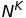

# Group Processor

The transformation groups multiple input series and applies a statistical function to grouped values, producing new series.

The transformation is implemented as follows:

1. Load detailed data for each series separately (input series).

1. Combine input series into groups based on the `groupByEntityAndTags` setting.

1. Split each group into subgroups based on the `place` setting.

1. Create multi-value series for each subgroup. Multi-value series is a list of pairs: `(timestamp, samples of several series)` ordered by timestamps. The way series is constructed depends on the `period` setting.

    a. The `period` is specified explicitly in the query.
    <br>
    Split each series `time:value` array into periods.
    Discard periods with start time earlier than `startDate` or greater than `endDate`.
    For each period create the pair
    `(timestamp, collection of samples)`
    and add it to the multi-valued series.
    The `timestamp` equals to the period start time.
    The `collection of samples` consists of multiple series samples within the period.
    Thus a series sample belongs to the `collection of samples` if its timestamp belongs to the period.

    b. The `period` is not specified.
    <br>
    In this case the multi-value series consists of pairs `(timestamp, multiple series samples with given timestamp)`, for each `timestamp` present in the input series within the subgroup.

1. Interpolate each multi-value series according to the `interpolate` field.

1. Truncate each multi-value series if `truncate` field is `true`.

1. Calculate aggregated series for each specified [statistical function](../../../api/data/aggregation.md), and each multi-value series. Statistical functions are set in the `type`, or `types` setting. To build aggregated series, the statistical function is applied to the samples for each pair in a multi-value series. Thus aggregated series contains sample `(timestamp, aggregated value)` per each pair `(timestamp, samples)` of multi-value series. The `aggregated value` is value of the statistical function applied to the `samples`.

## Fields

| **Name** | **Type** | **Description**  |
|:---|:---|:---|
| `groupByEntityAndTags`  | array        | Array of tag names which determines how series are [grouped](#series-grouping).<br>Default: `null`.|
| `type`  | string        | **[type or types is Required]** [Statistical function](#grouping-functions) applied to values with the same timestamp or within the same period, if the period is specified.<br>The `type` can be set to `DETAIL` in which case no grouping is performed and the underlying series is returned unchanged. |
| `types` | array          | **[type or types is Required]** Array of [statistical functions](#grouping-functions). Each function in the array produces a separate grouped series. If one of the functions is set to `DETAIL`, its result contains the underlying series. |
| `period`      | object           | [Period](period.md). Splits the merged series into periods and applies the statistical function to values in each period separately. |
| `interpolate`   | object           | [Interpolation](#interpolation) function to fill gaps in input series (no period) or in grouped series (if period is specified). |
| `truncate`      | boolean           | Discards samples at the beginning of the interval until values for all input series are established.<br>Default: `false`.  |
| `place`      | object           | Allocate grouped series to subgroups based on constraints and the objective function specified in the [place](#place) object. <br>Default: `null`. |

## Series Grouping

If the `groupByEntityAndTags` setting is **not set** in the request, all input series are placed into a **single** group.

If the array is **empty**, the input series are placed in the same group if they have the **same** entity.

```json
"groupByEntityAndTags": []
```

If the array of tag names is **not empty**, any two series belong to the same group if and only if they have the same entity, and for each specified tag name either both series have the same value of the tag, or both do not have the tag.

```json
"groupByEntityAndTags": ["tag-name-1", "tag-name-2"]
```

### Grouping Example

Consider a set of series with the following entities and tags:

```ls
| index | entity | tag-name-1  | tag-name-2  |
|-------|--------|-------------|-------------|
| 1     | e-1    |             |             |
| 2     | e-1    | tag-value-1 |             |
| 3     | e-1    |             | tag-value-1 |
| 4     | e-1    | tag-value-1 | tag-value-2 |
| 5     | e-1    | tag-value-2 |             |
| 6     | e-2    |             |             |
| 7     | e-2    |             | tag-value-1 |
```

The request groups series by entity and tag with name `tag-name-1`:

```json
"groupByEntityAndTags": ["tag-1-name"]
```

The result contains `4` groups:

* `{1, 3}` - Same entity `e-1` and no `tag-1-name`
* `{2, 4}` - Same entity `e-1` and same `tag-1-name` value
* `{5}` - Only one series with a different `tag-name-1` value
* `{6, 7}` - Same entity `e-2` and no `tag-1-name`

View the full [example](../../../api/data/series/examples/query-group-by-entity-and-tags.md) for more details.

## Grouping Functions

* `COUNT`
* `MIN`
* `MAX`
* `AVG`
* `SUM`
* `PERCENTILE(n)`
* `MEDIAN`
* `STANDARD_DEVIATION`
* `MEDIAN_ABS_DEV`
* `FIRST`
* `LAST`
* `MIN_VALUE_TIME`
* `MAX_VALUE_TIME`

## Interpolation

### Interpolation Fields

| **Name** | **Type**  | **Description**   |
|:---|:---|:---|
| `type`  | string | [**Required**] Interpolation [function](#interpolation-functions). |
| `value` | number | [**Required by `VALUE` function**] Constant number used to set value for the missing periods. |
| `extend`  | boolean | Add missing periods at the beginning and the end of the selection interval. Default: `false`. |

Values added by `extend` setting are determined as follows:

* If the `VALUE {n}` interpolation function is specified, the `extend` option sets empty leading/trailing period values to equal `{n}`.
* Without the `VALUE {n}` function, the `extend` option adds missing periods at the beginning and end of the selection interval using the `NEXT` and `PREVIOUS` interpolation functions.

### Interpolation Functions

| **Type** | **Description** |
|:---|:---|
| `NONE` | No interpolation. Periods without any detailed values are excluded from results. |
| `PREVIOUS` | Set value for the period based on the previous period value. |
| `NEXT` | Set value for the period based on the next period value. |
| `LINEAR` | Calculate period value using linear interpolation between previous and next period values. |
| `VALUE` | Set value for the period to a specific number. |

## Examples

### Data

#### Detailed Data by Series

```ls
| entity | datetime             | value |
|--------|----------------------|-------|
| e-1    | 2016-06-25T08:00:00Z | 1     |
| e-2    | 2016-06-25T08:00:00Z | 11    |
| e-1    | 2016-06-25T08:00:05Z | 3     | e-1 only
| e-1    | 2016-06-25T08:00:10Z | 5     | e-1 only
| e-1    | 2016-06-25T08:00:15Z | 8     |
| e-2    | 2016-06-25T08:00:15Z | 8     |
| e-1    | 2016-06-25T08:00:30Z | 3     |
| e-2    | 2016-06-25T08:00:30Z | 13    |
| e-1    | 2016-06-25T08:00:45Z | 5     |
| e-2    | 2016-06-25T08:00:45Z | 15    |
| e-2    | 2016-06-25T08:00:59Z | 19    | e-2 only
```

#### Detailed Data Grouped by Timestamp

```ls
| datetime             | e1.value | e2.value |
|----------------------|----------|----------|
| 2016-06-25T08:00:00Z | 1        | 11       |
| 2016-06-25T08:00:05Z | 3        | -        |
| 2016-06-25T08:00:10Z | 5        | -        |
| 2016-06-25T08:00:15Z | 8        | 8        |
| 2016-06-25T08:00:30Z | 3        | 13       |
| 2016-06-25T08:00:45Z | 5        | 15       |
| 2016-06-25T08:00:59Z | -        | 19       |
```

### No Aggregation

When aggregation is disabled, the `group` function is applied to values for all unique timestamps in the merged series.

In the example below, the `SUM` function returns `12 = (1+11)` at `2016-06-25T08:00:00Z` as a total of `e-1` and `e-2` series values, both of which have samples this timestamp.

On the other hand, the `SUM` returns `3 = (3 + null->0)` at `2016-06-25T08:00:05Z` because only `e-1` series has a value at that timestamp.

```json
[
  {
    "startDate": "2016-06-25T08:00:00Z",
    "endDate":   "2016-06-25T08:01:00Z",
    "entities": ["e-1", "e-2"],
    "metric": "m-1",
    "group": {
      "type": "SUM"
    }
  }
]
```

```json
[{"entity":"*","metric":"m-1","tags":{},"entities":["e-1","e-2"],"type":"HISTORY",
    "aggregate":{"type":"DETAIL"},
    "group":{"type":"SUM"},
  "data":[
    {"d":"2016-06-25T08:00:00Z","v":12.0},
    {"d":"2016-06-25T08:00:05Z","v":3.0},
    {"d":"2016-06-25T08:00:10Z","v":5.0},
    {"d":"2016-06-25T08:00:15Z","v":16.0},
    {"d":"2016-06-25T08:00:30Z","v":16.0},
    {"d":"2016-06-25T08:00:45Z","v":20.0},
    {"d":"2016-06-25T08:00:59Z","v":19.0}
]}]
```

```ls
| datetime             | e1.value | e2.value | SUM |
|----------------------|----------|----------|-----|
| 2016-06-25T08:00:00Z | 1        | 11       | 12  |
| 2016-06-25T08:00:05Z | 3        | -        | 3   |
| 2016-06-25T08:00:10Z | 5        | -        | 5   |
| 2016-06-25T08:00:15Z | 8        | 8        | 16  |
| 2016-06-25T08:00:30Z | 3        | 13       | 16  |
| 2016-06-25T08:00:45Z | 5        | 15       | 20  |
| 2016-06-25T08:00:59Z | -        | 19       | 19  |
```

### Truncation

Truncation discards timestamps at the beginning of the interval until all of the merged values have a value.

The example below uses `startDate` of `2016-06-25T08:00:01Z`.

The first time is `MAX(MIN(series_sample_time))`, the last time is `MIN(MAX(series_sample_time))`.

`MAX(MIN(series_sample_time))` = `2016-06-25T08:00:15Z`.

`MIN(MAX(series_sample_time))` = `2016-06-25T08:00:45Z`.

```ls
| datetime             | e1.value | e2.value | SUM |
|----------------------|----------|----------|-----|
| 2016-06-25T08:00:05Z | 3        | -        | 3   | discarded because time < MAX(MIN(series_sample_time))
| 2016-06-25T08:00:10Z | 5        | -        | 5   | discarded because time < MAX(MIN(series_sample_time))
| 2016-06-25T08:00:15Z | 8        | 8        | 16  |
| 2016-06-25T08:00:30Z | 3        | 13       | 16  |
| 2016-06-25T08:00:45Z | 5        | 15       | 20  |
| 2016-06-25T08:00:59Z | -        | 19       | 19  | discarded because time > MIN(MAX(series_sample_time))
```

Samples for series `e-1` at `2016-06-25T08:00:05Z` and at `2016-06-25T08:00:10Z` are discarded because there is no value for series e-2 until `2016-06-25T08:00:15Z`.

Sample for series `e-2` at `2016-06-25T08:00:59Z` is discarded because there is no value for series `e-1` after `2016-06-25T08:00:45Z`.

```json
[
  {
    "startDate": "2016-06-25T08:00:01Z",
    "endDate":   "2016-06-25T08:01:00Z",
    "entities": ["e-1", "e-2"],
    "metric": "m-1",
    "group": {
      "type": "SUM",
      "truncate": true
    }
  }
]
```

```json
[{"entity":"*","metric":"m-1","tags":{},"entities":["e-1","e-2"],"type":"HISTORY",
    "aggregate":{"type":"DETAIL"},
    "group":{"type":"SUM","truncate":true},
"data":[
    {"d":"2016-06-25T08:00:15Z","v":16.0},
    {"d":"2016-06-25T08:00:30Z","v":16.0},
    {"d":"2016-06-25T08:00:45Z","v":20.0}
]}]
```

```ls
| datetime             | e1.value | e2.value | SUM |
|----------------------|----------|----------|-----|
| 2016-06-25T08:00:15Z | 8        | 8        | 16  |
| 2016-06-25T08:00:30Z | 3        | 13       | 16  |
| 2016-06-25T08:00:45Z | 5        | 15       | 20  |
```

### Extend

An opposite operation to truncation, extend adds missing values at the beginning and end of the interval to ensure that all merged series have values when the `group` function is applied.

```ls
| datetime             | e1.value | e2.value | SUM |
|----------------------|----------|----------|-----|
| 2016-06-25T08:00:05Z | 3        | 8 +      | 11  | e2.value extended to start at the beginning of the interval
| 2016-06-25T08:00:10Z | 5        | 8 +      | 13  | e2.value extended to start at the beginning of the interval
| 2016-06-25T08:00:15Z | 8        | 8        | 16  |
| 2016-06-25T08:00:30Z | 3        | 13       | 16  |
| 2016-06-25T08:00:45Z | 5        | 15       | 20  |
| 2016-06-25T08:00:59Z | 5 +      | 19       | 24  | e1.value extended until the end of the interval
```

```json
[
  {
    "startDate": "2016-06-25T08:00:01Z",
    "endDate":   "2016-06-25T08:01:00Z",
    "entities": ["e-1", "e-2"],
    "metric": "m-1",
    "group": {
      "type": "SUM",
      "interpolate": {
        "type": "NONE",
        "extend": true
      }
    }
  }
]
```

```json
[{"entity":"*","metric":"m-1","tags":{},"entities":["e-1","e-2"],"type":"HISTORY",
    "aggregate":{"type":"DETAIL"},
    "group":{"type":"SUM","interpolate":{"type":"NONE","value":0.0,"extend":true}},
"data":[
    {"d":"2016-06-25T08:00:05Z","v":11.0},
    {"d":"2016-06-25T08:00:10Z","v":13.0},
    {"d":"2016-06-25T08:00:15Z","v":16.0},
    {"d":"2016-06-25T08:00:30Z","v":16.0},
    {"d":"2016-06-25T08:00:45Z","v":20.0},
    {"d":"2016-06-25T08:00:59Z","v":24.0}
]}]
```

Extend is similar to interpolation where missing values at the beginning of in interval are interpolated with `NEXT` type, and missing values at the end of the interval are interpolated with `PREVIOUS` type.

```ls
| datetime             | e1.value | e2.value | SUM |
|----------------------|----------|----------|-----|
| 2016-06-25T08:00:05Z | 3        | 8 +(NEXT)| 11  |
| 2016-06-25T08:00:10Z | 5        | 8 +(NEXT)| 13  |
| 2016-06-25T08:00:15Z | 8        | 8        | 16  |
| 2016-06-25T08:00:30Z | 3        | 13       | 16  |
| 2016-06-25T08:00:45Z | 5        | 15       | 20  |
| 2016-06-25T08:00:59Z | 5 +(PREV)| 19       | 24  |
```

Since `extend` is performed prior to truncation, `truncate` setting has no effect on extended results.

### Interpolation

Interpolation fills the gaps in the detailed series. Its behavior depends on the `period` parameter specified in the group processor.

#### `period` parameter is not specified

The `interpolate` function is applied to two consecutive samples of the same series to calculate an interim value for a known timestamp.

Query:

```json
[{
    "startDate": "2016-06-25T08:00:00Z",
    "endDate":   "2016-06-25T08:01:00Z",
    "entities": ["e-1", "e-2"],
    "metric": "m-1",
    "group": {
      "type": "SUM",
      "interpolate": { "type": "PREVIOUS" }
    }
}]
```

Response:

```json
[{"entity":"*","metric":"m-1","tags":{},"entities":["e-1","e-2"],"type":"HISTORY",
    "aggregate":{"type":"DETAIL"},
    "group":{"type":"SUM","interpolate":{"type":"PREVIOUS","value":0.0,"extend":false}},
"data":[
    {"d":"2016-06-25T08:00:00Z","v":12.0},
    {"d":"2016-06-25T08:00:05Z","v":14.0},
    {"d":"2016-06-25T08:00:10Z","v":16.0},
    {"d":"2016-06-25T08:00:15Z","v":16.0},
    {"d":"2016-06-25T08:00:30Z","v":16.0},
    {"d":"2016-06-25T08:00:45Z","v":20.0},
    {"d":"2016-06-25T08:00:59Z","v":19.0}
]}]
```

Two interpolated values are added to the second series:

```ls
| datetime             | e1.value | e2.value | SUM |
|----------------------|----------|----------|-----|
| 2016-06-25T08:00:00Z | 1        | 11       | 12  |
| 2016-06-25T08:00:05Z | 3        | 11 (PREV)| 14  |
| 2016-06-25T08:00:10Z | 5        | 11 (PREV)| 16  |
| 2016-06-25T08:00:15Z | 8        | 8        | 16  |
| 2016-06-25T08:00:30Z | 3        | 13       | 16  |
| 2016-06-25T08:00:45Z | 5        | 15       | 20  |
| 2016-06-25T08:00:59Z | -        | 19       | 19  |
```

#### `period` parameter is specified

Assume that `t1`, `t2`, `t3` are timestamps of consecutive periods, and the series has no samples in the `t2` period. Then interpolated value of the `t2` period is calculated based on two samples: `(t1, v1)` and `(t3, v3)`, where `v1` - is the last series value within the `t1` period, and `v3` is the first series value within the `t3` period.

Query:

```json
[ {
    "startDate": "2016-06-25T08:00:00Z",
    "endDate":   "2016-06-25T08:01:00Z",
    "entities": ["e-1", "e-2"],
    "metric": "m-1",
    "group": {
      "type": "SUM",
      "period": {"count": 10, "unit": "SECOND"},
      "interpolate": {"type": "PREVIOUS"}
    }
}]
```

Response

```json
[{
    "entity": "*", ...,
    "data": [
      {"d": "2016-06-25T08:00:00Z", "v": 15},
      {"d": "2016-06-25T08:00:10Z", "v": 21},
      {"d": "2016-06-25T08:00:20Z", "v": 16},
      {"d": "2016-06-25T08:00:30Z", "v": 16},
      {"d": "2016-06-25T08:00:40Z", "v": 20},
      {"d": "2016-06-25T08:00:50Z", "v": 19}
    ]
}]
```

Interpolated values added to each of the grouped series:

```ls
|                      |          |          | group                | e1 grouped   | e2 grouped   |     |
| datetime             | e1.value | e2.value | timestamp            | interpolated | interpolated | SUM |
|----------------------|----------|----------|-----------------------------------------------------------
| 2016-06-25T08:00:00Z | 1        | 11       | 2016-06-25T08:00:00Z | 1, 3         | 11           | 15  |
| 2016-06-25T08:00:05Z | 3        | -        |                      |              |              |     |
| 2016-06-25T08:00:10Z | 5        | -        | 2016-06-25T08:00:10Z | 5, 8         | 8            | 21  |
| 2016-06-25T08:00:15Z | 8        | 8        |                      |              |              |     |
| 2016-06-25T08:00:20Z | -        | -        | 2016-06-25T08:00:20Z | 8 (PREV)     | 8 (PREV)     | 16  |
| 2016-06-25T08:00:30Z | 3        | 13       | 2016-06-25T08:00:30Z | 3            | 13           | 16  |
| 2016-06-25T08:00:40Z | -        | -        | 2016-06-25T08:00:40Z | 5            | 15           | 20  |
| 2016-06-25T08:00:45Z | 5        | 15       |                      |              |              |     |
| 2016-06-25T08:00:50Z | -        | -        | 2016-06-25T08:00:50Z | -            | 19           | 19  |
| 2016-06-25T08:00:59Z | -        | 19       |                      |              |              |     |
```

### Group Aggregation

By default, the `group` function is applied to all unique sample times from the merged series.
To split values into periods, specify a period.

```json
[
  {
    "startDate": "2016-06-25T08:00:00Z",
    "endDate":   "2016-06-25T08:01:00Z",
    "entities": ["e-1", "e-2"],
    "metric": "m-1",
    "group": {
      "type": "SUM",
        "period": {"count": 10, "unit": "SECOND"}
    }
  }
]
```

```json
[{"entity":"*","metric":"m-1","tags":{},"entities":["e-1","e-2"],"type":"HISTORY",
    "aggregate":{"type":"DETAIL"},
    "group":{"type":"SUM","period":{"count":10,"unit":"SECOND","align":"CALENDAR"}},
"data":[
    {"d":"2016-06-25T08:00:00Z","v":15.0},
    {"d":"2016-06-25T08:00:10Z","v":21.0},
    {"d":"2016-06-25T08:00:30Z","v":16.0},
    {"d":"2016-06-25T08:00:40Z","v":20.0},
    {"d":"2016-06-25T08:00:50Z","v":19.0}
]}]
```

This is equivalent to `Group <-> Aggregation` processing in case of `SUM`+`SUM` functions.

```json
[
  {
    "startDate": "2016-06-25T08:00:00Z",
    "endDate":   "2016-06-25T08:01:00Z",
    "entities": ["e-1", "e-2"],
    "metric": "m-1",
    "aggregate": {
      "type": "SUM",
      "period": {"count": 10, "unit": "SECOND"}
    },
    "group": {
      "type": "SUM",
      "period": {"count": 10, "unit": "SECOND"}
    }
  }
]
```

### Aggregation -> Group

The `Aggregation -> Group` order creates aggregate series for each of the merged series and then performs grouping of the aggregated series.

The timestamps used for grouping combine period start times from the underlying aggregated series.

```ls
| 10-sec period start  | e1.COUNT | e2.COUNT | SUM |
|----------------------|----------|----------|-----|
| 2016-06-25T08:00:00Z | 2        | 1        | 3   |
| 2016-06-25T08:00:10Z | 2        | 1        | 3   |
| 2016-06-25T08:00:20Z | -        | -        | -   | Period not created because there are no detailed values in the [00:20-00:30) period for any series.
| 2016-06-25T08:00:30Z | 1        | 1        | 2   |
| 2016-06-25T08:00:40Z | 1        | 1        | 2   |
| 2016-06-25T08:00:50Z | 0        | 1        | 1   |
```

```json
[
  {
    "startDate": "2016-06-25T08:00:00Z",
    "endDate":   "2016-06-25T08:01:00Z",
    "entities": ["e-1", "e-2"],
    "metric": "m-1",
    "aggregate": {
      "type": "COUNT",
      "period": {"count": 10, "unit": "SECOND"}
    },
    "group": {
      "type": "SUM"
    }
  }
]
```

```json
[{"entity":"*","metric":"m-1","tags":{},"entities":["e-1","e-2"],"type":"HISTORY",
"aggregate":{"type":"COUNT","period":{"count":10,"unit":"SECOND","align":"CALENDAR"}},
"group":{"type":"SUM"},
"data":[
    {"d":"2016-06-25T08:00:00Z","v":3.0},
    {"d":"2016-06-25T08:00:10Z","v":3.0},
    {"d":"2016-06-25T08:00:30Z","v":2.0},
    {"d":"2016-06-25T08:00:40Z","v":2.0},
    {"d":"2016-06-25T08:00:50Z","v":1.0}
]}]
```

### Group -> Aggregation

The `Group -> Aggregation` merges series first, and then splits the merged series into periods.

At the first stage, grouping produces the following `SUM` series:

```json
[
  {
    "startDate": "2016-06-25T08:00:00Z",
    "endDate":   "2016-06-25T08:01:00Z",
    "entities": ["e-1", "e-2"],
    "metric": "m-1",
    "group": {
      "type": "SUM"
    }
  }
]
```

```ls
| datetime             | e1.value | e2.value | SUM |
|----------------------|----------|----------|-----|
| 2016-06-25T08:00:00Z | 1        | 11       | 12  |
| 2016-06-25T08:00:05Z | 3        | -        | 3   |
| 2016-06-25T08:00:10Z | 5        | -        | 5   |
| 2016-06-25T08:00:15Z | 8        | 8        | 16  |
| 2016-06-25T08:00:30Z | 3        | 13       | 16  |
| 2016-06-25T08:00:45Z | 5        | 15       | 20  |
| 2016-06-25T08:00:59Z | -        | 19       | 19  |
```

The grouped `SUM` series is then aggregated into periods.

> Note that if period is not specified, the `group` function automatically applies aggregation for the same period as the `aggregate` function.<br>To avoid this, specify `"period": {"count": 1, "unit": "MILLISECOND"}` in `group`.

```json
[
  {
    "startDate": "2016-06-25T08:00:00Z",
    "endDate":   "2016-06-25T08:01:00Z",
    "entities": ["e-1", "e-2"],
    "metric": "m-1",
    "aggregate": {
      "type": "COUNT",
      "period": {"count": 10, "unit": "SECOND"}
    },
    "group": {
      "type": "SUM",
      "period": {"count": 1, "unit": "MILLISECOND"}
    }
  }
]
```

```ls
| datetime             | COUNT(SUM(value)) |
|----------------------|-------------------|
| 2016-06-25T08:00:00Z | 2                 |
| 2016-06-25T08:00:10Z | 2                 |
| 2016-06-25T08:00:30Z | 1                 |
| 2016-06-25T08:00:40Z | 1                 |
| 2016-06-25T08:00:50Z | 1                 |
```

```json
[{"entity":"*","metric":"m-1","tags":{},"entities":["e-1","e-2"],"type":"HISTORY",
    "aggregate":{"type":"COUNT","period":{"count":10,"unit":"SECOND","align":"CALENDAR"}},
    "group":{"type":"SUM","period":{"count":1,"unit":"MILLISECOND","align":"CALENDAR"}},
"data":[
    {"d":"2016-06-25T08:00:00Z","v":2.0},
    {"d":"2016-06-25T08:00:10Z","v":2.0},
    {"d":"2016-06-25T08:00:30Z","v":1.0},
    {"d":"2016-06-25T08:00:40Z","v":1.0},
    {"d":"2016-06-25T08:00:50Z","v":1.0}
]}]
```

## Place

The `place` setting specifies how to place grouped series into subgroups based on constraints and the objective function.
The operation supports two placement types: [partitioning](#partitioning) and [packing](#packing).

### Place Fields

| **Name** | **Type**  | **Description**   |
|:---|:---|:---|
| `count`  | integer | Maximum number of subgroups. The response can contain less than the maximum. |
| `constraint` | string | Boolean expression that series in each subgroup must satisfy, for example `max() < 10`. |
| `minimize` | string | Objective function calculated for each subgroup. Partitioning into subgroups is performed to minimize the **sum** of function values. |
| `method` | string | The algorithm used to solve the [packing](#packing) problem. Allowed values: `greedy_simple` (default), or `greedy_correlations`.|
| `entities` | array | Entities containing group-specific information using entity tags with numeric characteristics of a subgroup. |
| `entityGroup` | string | Alternative to `entities` setting using an [entity group](../../../api/meta/entity-group/README.md) name. |
| `entityExpression`  | string | Alternative to `entities` setting using an [expression](../../../api/data/filter-entity.md#entityexpression-syntax). |

### Functions Available in the Place Context

* `stdev()`
* `median_abs_dev()`
* `max()`
* `min()`
* `sum()`
* `count()`
* `median()`
* `avg()`
* `percentile(p)`

### Partitioning

The algorithm finds the best partitioning of a given group of time series into no more than the specified number of subgroups.

The best combination is determined such that each group satisfies the `constraint` condition and the objective function value is minimal. Objective function is the sum of values of the `minimize` formula for all subgroups.

The maximum number of subgroups is limited by the `count` setting.

To find the exact solution the algorithm iterates over all possible combinations, and calculates the objective function for each combination as follows:

* Create aggregated series for each subgroup, using the specified `type`, `period`, `interpolate`, and `truncate` settings.

* Check boolean `constraint` expression for each aggregated series. Discard the partitions for which the `constraint` is `false` for one of the subgroups. The `constraint` expression can include [statistical functions](#functions-available-in-the-place-context) applied to aggregated series.

* For each subgroup calculate the value of the `minimize` expression, which can also reference the same [statistical functions](#functions-available-in-the-place-context).

* Calculate the value of the objective function as sum of values calculated at the previous step.

The combination with the lowest objective function value and the smallest number of subgroups is selected as the best partitioning.

#### Partitioning Algorithm Complexity

The algorithm checks **all** combinations of the `N` input series subject to the `count` limit. The total number of combinations equals `S(N, 1) + S(N, 2) + ... + S(N, count)` where `S` is the [Stirling](https://en.wikipedia.org/wiki/Stirling_numbers_of_the_second_kind) number.
This sum grows extremely fast, for example, there are over `16` trillion combinations to check if the number of input series is `20` and they are allocated to no more than `7` subgroups.
The implementation expects `N` to not exceed `64`, and throws an error if number of partitions exceeds `1,000,000`.

#### Query Example

```json
[{
  "startDate": "2019-02-01T00:00:00Z",
  "endDate":   "2019-08-08T00:00:00Z",
  "entity": "*",
  "metric": "cpu_usage",
  "group": {
    "type": "SUM",
    "period": {"count": 1, "unit": "HOUR"},
    "interpolate": {"extend": false, "type": "NONE"},
    "place": {
      "count": 3,
      "constraint": "max() < 10",
      "minimize": "stdev()"
    }
  },
  "limit": 2
}]
```

#### Response

The response contains information about each subgroup: grouped series keys, the `minimize` expression value for the subgroup as `groupScore`, the objective function value as `totalScore`, and aggregated series for the subgroup as the `data`.

```json
[
  {
    "entity": "*",
    "metric": "lp_usage",
    "exactMatch": false,
    "type": "HISTORY",
    "meta": {
      "groupScore": 0.0021842975376114887,
      "series": [
        {"entity": "lp_1", "tags": {}, "label": "lp_1"},
        {"entity": "lp_2", "tags": {}, "label": "lp_2"},
        {"entity": "lp_3", "tags": {}, "label": "lp_3"}
      ],
      "name": "lp_1 lp_2 lp_3",
      "totalScore": 0.0021842975376114887
    },
    "transformationOrder": ["GROUP"],
    "group": {
      "series": [
        {"entity": "lp_1", "tags": {}, "label": "lp_1"},
        {"entity": "lp_2", "tags": {}, "label": "lp_2"},
        {"entity": "lp_3", "tags": {}, "label": "lp_3"}
      ],
      "groupScore": 0.0021842975376114887,
      "totalScore": 0.0021842975376114887,
      "type": "SUM",
      "period": {"count": 1, "unit": "HOUR", "align": "CALENDAR"},
      "interpolate": {"type": "NONE", "extend": false},
      "truncate": false,
      "place": {"count": 3, "constraint": "max() < 10", "minimize": "stdev()"}
    },
    "data": [
      {"d": "2019-02-07T22:00:00.000Z", "v": 4.998999189242195},
      {"d": "2019-02-07T23:00:00.000Z", "v": 5.000519124198814}
    ]
  },
  {
    "entity": "*",
    "metric": "lp_usage",
    "exactMatch": false,
    "type": "HISTORY",
    "meta": {
      "groupScore": 0,
      "series": [
        {"entity": "lp_6", "tags": {}, "label": "lp_6"},
        {"entity": "lp_7", "tags": {}, "label": "lp_7"}
      ],
      "name": "lp_6 lp_7",
      "totalScore": 0.0021842975376114887
    },
    "transformationOrder": ["GROUP"],
    "group": {
      "series": [
        {"entity": "lp_6", "tags": {}, "label": "lp_6"},
        {"entity": "lp_7", "tags": {}, "label": "lp_7"}
      ],
      "groupScore": 0,
      "totalScore": 0.0021842975376114887,
      "type": "SUM",
      "period": {"count": 1, "unit": "HOUR", "align": "CALENDAR"},
      "interpolate": {"type": "NONE", "extend": false},
      "truncate": false,
      "place": {"count": 3, "constraint": "max() < 10", "minimize": "stdev()"}
    },
    "data": [
      {"d": "2019-02-07T22:00:00.000Z", "v": 5},
      {"d": "2019-02-07T23:00:00.000Z", "v": 5}
    ]
  },
  {
    "entity": "*",
    "metric": "lp_usage",
    "exactMatch": false,
    "type": "HISTORY",
    "meta": {
      "groupScore": 0,
      "series": [
        {"entity": "lp_4", "tags": {},"label": "lp_4"},
        {"entity": "lp_5", "tags": {}, "label": "lp_5"}
      ],
      "name": "lp_4 lp_5",
      "totalScore": 0.0021842975376114887
    },
    "transformationOrder": ["GROUP"],
    "group": {
      "series": [
        {"entity": "lp_4", "tags": {},"label": "lp_4"},
        {"entity": "lp_5", "tags": {}, "label": "lp_5"}
      ],
      "groupScore": 0,
      "totalScore": 0.0021842975376114887,
      "type": "SUM",
      "period": {"count": 1, "unit": "HOUR", "align": "CALENDAR"},
      "interpolate": {"type": "NONE", "extend": false},
      "truncate": false,
      "place": {"count": 3, "constraint": "max() < 10", "minimize": "stdev()"}
    },
    "data": [
      {"d": "2019-02-07T22:00:00.000Z", "v": 5},
      {"d": "2019-02-07T23:00:00.000Z", "v": 5}
    ]
  }
]
```

### Packing

The packing algorithm divides series into the smallest number of subgroups, where each subgroup satisfies the `constraint`.

The objective function is **ignored** by the packing algorithm, but the `constraint` expression can use numeric parameters specific for each subgroup, and numeric parameters specific for each series.

Each entity specified in the `entities`, or `entityGroup`, or `entityExpression` holds numeric parameters of single subgroup as values of its tags. These values are available in the `constraint` expression by the tag names.

#### Subgroup Parameters Example

Assume the following entities with tags `cpu_limit` and  `memory_limit`.

```ls
| entity name/tags | cpu_limit | memory_limit |
|------------------|-----------|--------------|
| lp_group_1       |        10 |           20 |
| lp_group_2       |         8 |           40 |
| lp_group_3       |        12 |           10 |
| lp_group_4       |        14 |           20 |
| lp_group_5       |         8 |           10 |
```

The `constraint` expression can reference the `cpu_limit` variable which resolves to the `cpu_limit` entity tag for the given entity.

```json
"constraint": "max() < cpu_limit"
```

When the above expression is evaluated for the subgroup corresponding to the entity `lp_group_3`, the value of `cpu_limit` is `12`.

Each series can also store numeric parameters in series entity tags.
To reference these parameters in the `constraint` expression use tag name prepended by the `series.` prefix.

#### Series Parameters Example

Following series entities have tag `memory_allocated`:

```ls
| entity name/tags | memory_allocated |
|------------------|------------------|
| lp_1             |                4 |
| lp_2             |                4 |
| lp_3             |                4 |
| lp_4             |                8 |
| lp_5             |                4 |
| lp_6             |                2 |
| lp_7             |                4 |
```

The following `constraint` checks that sum of `memory_allocated` parameters of all series in a subgroup is less than 14:

```json
"constraint": "sum(series.memory_allocated) < 14"
```

#### Subgroup and Series Parameters Example

Series with entities `lp_2, lp_3, lp_6` are placed in a group associated with entity `lp_group_1`. Consider the constraint:

```json
"constraint": "max() < cpu_limit && sum(series.memory_allocated) < memory_limit"
```

It checks that maximum value of aggregated series computed for `lp_2, lp_3, lp_6` is less than `cpu_limit` which equals `10`, and sum of memory allocated to each series `sum(series.memory_allocated) = 4 + 4 + 2` is
less that `memory_limit` which equals `20`.

#### Packing Algorithm

The exact solution of the packing algorithm requires checking

combinations where `N` is the number of series and `K` is the maximum number of subgroups.
This is computationally unfeasible if `N` and `K` are sufficiently large.
As a workaround, the database applies the following heuristics:

1. Sort entities by name.
2. Check each entity, and build a subgroup for the given entity.
3. If all entities are checked and there are still unassigned series, place them into a special subgroup.

The subgroup containing unassigned series is formed depends on the `method` setting.

#### Method `greedy_simple`

The method sorts series lexicographically by key which contains entity and tags.
Unassigned series are iterated and inserted into the current group if the `constraint` is not violated.

#### Method `greedy_correlations`

1. Select the first series in the subgroup. Iterate over unassigned series sorted by series name and select the first series that satisfies the `constraint`.

2. For series that are already assigned to subgroups calculate the aggregation function, specified in the `type` parameter. Calculate correlations between assigned series and unassigned series (both aggregated). Sort unassigned series by correlation in the ascending order. Iterate over unassigned series starting with series with the lowest correlation, and add the series to the subgroup. With the series added, repeat all calculations: recalculate aggregated series, the correlations coefficients, and add next series to the subgroup. The step is completed if no more series can be added to the subgroup.

#### Approximate Query Example

```json
[{
  "startDate": "2019-02-01T00:00:00Z",
  "endDate":   "2019-02-08T00:00:00Z",
  "entity": "*",
  "metric": "lp_usage",
  "group": {
    "type": "SUM",
    "period": {"count": 1, "unit": "HOUR"},
    "interpolate": {"extend": true, "type": "LINEAR"},
    "place": {
      "entities": ["lp_group_1", "lp_group_2", "lp_group_3", "lp_group_4", "lp_group_5"],
      "constraint": "max() < cpu_limit && sum(series.memory_allocated) < memory_limit",
      "method": "greedy_correlations"
    }
  }
}]
```

#### Approximate Query Response

```json
[
  {
    "metric": "lp_usage",
    "entity": "*",
    "exactMatch": false,
    "type": "HISTORY",
    "meta": {
      "groupScore": 0,
      "series": [
        {"entity": "lp_1", "tags": {}, "label": "lp_1"},
        {"entity": "lp_2", "tags": {}, "label": "lp_2"},
        {"entity": "lp_3", "tags": {}, "label": "lp_3"},
        {"entity": "lp_5", "tags": {}, "label": "lp_5"}
      ],
      "name": "lp_1 lp_2 lp_3 lp_5",
      "group-entity": "lp_group_1",
      "grouping-tags": {
        "cpu_limit": "10",
        "memory_limit": "20"
      },
      "totalScore": 0
    },
    "transformationOrder": ["GROUP"],
    "group": {
      "series": [
        {"entity": "lp_1", "tags": {}, "label": "lp_1"},
        {"entity": "lp_2", "tags": {}, "label": "lp_2"},
        {"entity": "lp_3", "tags": {}, "label": "lp_3"},
        {"entity": "lp_5", "tags": {}, "label": "lp_5"}
      ],
      "entity": "lp_group_1",
      "tags": {"cpu_limit": "10", "memory_limit": "20"},
      "type": "SUM",
      "period": {"count": 1, "unit": "HOUR", "align": "CALENDAR"},
      "interpolate": {"type": "LINEAR", "extend": true},
      "truncate": false,
      "place": {
          "count": 0,
        "constraint": "max() < cpu_limit && sum(series.memory_allocated) < memory_limit"
      }
    },
    "data": [
      {
        "d": "2019-02-07T23:00:00.000Z",
        "v": 9.000519124198814
      },
      {
        "d": "2019-02-08T00:00:00.000Z",
        "v": 9.000519124198814
      }
    ]
  },
  ...
]
```
