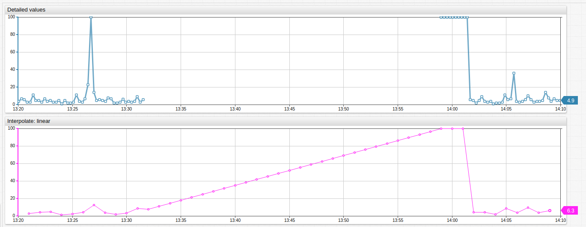

# Interpolation

## Overview

Interpolation transforms an input time series to a regularized series by calculating values at evenly spaced intervals using a linear or step function.

The interpolation process performed by the database is outlined below:

1. Load samples for the selection interval specified with `startDate` and `endDate` parameters.
2. If `OUTER` boundary mode is enabled, load one value before and one value after the selection interval to interpolate leading and trailing values.
3. Create evenly spaced timestamps within the selection interval. Timestamps can be aligned to a calendar or start/end time of the selection interval.
4. For each timestamp, calculate the value from the two nearest neighbor samples using `linear` or `step` interpolation function.
5. If `fill` parameter is enabled, add missing leading and trailing values.

## Fields

| **Name** | **Type**  | **Description**   |
|:---|:---|:---|
| [`period`](#period) | object | **[Required]** Time interval used for interpolation. |
| [`function`](#function) | string | **[Required]** `PREVIOUS`, `LINEAR`, or `AUTO`. |
| [`boundary`](#boundary) | string | Enable values outside of the selection interval. |
| [`fill`](#fill) | string | Creates missing leading and trailing values. |

### `period`

[Period](period.md) is a repeating time interval used to create evenly spaced timestamps.

**Examples**:

* `{ "count": 1, "unit": "HOUR" }`
* `{ "count": 15, "unit": "MINUTE", "align": "START_TIME" }`
* `{ "count": 1, "unit": "DAY", "align": "CALENDAR", "timezone": "US/Pacific" }`

### `function`

| **Name** | **Description**   |
|:---|:---|
| `LINEAR`  | Calculate interpolated value by adding the difference between neighboring detailed values proportional to their time difference. |
| `PREVIOUS`  | Set interpolated value equal to the previous value. |
| `AUTO`  | Apply the interpolation function specified by the metric [`interpolate`](../../meta/metric/list.md#fields) setting. Default: `LINEAR`.  |

> Detailed values with timestamps equal to interpolated timestamps are included in the response unchanged.
> The `LINEAR` function returns an interpolated value only if both the preceding and the following value is present.
> The `PREVIOUS` function requires a preceding value. The last detailed value is used to calculate a final interpolated value in the response.

### `boundary`

| **Name** | **Description**   |
|:---|:---|
| `INNER`  | **[Default]** Data outside of the selection interval is not loaded by the database. |
| `OUTER`  | One value before and one value after the selection interval is loaded by the database to interpolate leading and trailing values. |

**Examples**:

* `{ "boundary": "OUTER" }`

### `fill`

The `fill` parameter eliminates gaps at the beginning and end of a selection interval. If `boundary` is `OUTER` and there are values on both sides of the selection interval, the `fill` parameter is not applied.

| **Name** | **Description**   |
|:---|:---|
| `false`  | **[Default]** Do not add missing values. |
| `true`  | Add missing leading values by setting the values equal to the first available detailed value.<br>Add missing trailing values by setting the values equal to the last available detailed value.|
| `{n}`  | Add missing leading and trailing values by setting the values equal to the specified number `{n}`.<br>The number `{n}` can be any decimal number as well as `NaN` string (Not a Number). |

Examples:

* `{ "fill": false }`
* `{ "fill": true }`
* `{ "fill": 0 }`
* `{ "fill": "NaN" }`

## Examples

**Dataset**:

```ls
series e:nurswgvml007 m:cpu_busy=-1 d:2016-12-31T23:30:00Z
series e:nurswgvml007 m:cpu_busy=0  d:2017-01-01T00:30:00Z
series e:nurswgvml007 m:cpu_busy=2  d:2017-01-01T02:30:00Z
series e:nurswgvml007 m:cpu_busy=3  d:2017-01-01T03:30:00Z
```

```ls
| datetime         | value |
|------------------|-------|
| 2016-12-31 23:30 | -1    |
| 2017-01-01 00:30 | 0     |
| 2017-01-01 01:30 | ...   | -- Sample at 01:30 is missing.
| 2017-01-01 02:30 | 2     |
| 2017-01-01 03:30 | 3     |
```

### Fill Gaps with `LINEAR` Function

```json
[{
  "startDate": "2017-01-01T00:00:00Z",
  "endDate":   "2017-01-01T05:00:00Z",
  "entity": "nurswgvml007",
  "metric": "cpu_busy",
  "interpolate" : {
    "function": "LINEAR",
    "period": {"count": 1, "unit": "HOUR"}
  }
}]
```

**Response**:

With default `INNER` mode, values outside of the selection interval are ignored.

```ls
| datetime         | value |
|------------------|-------|
| 2017-01-01 01:00 | 0.5   |
| 2017-01-01 02:00 | 1.5   |
| 2017-01-01 03:00 | 2.5   |
```

```json
[{"entity":"nurswgvml007","metric":"cpu_busy","tags":{},"type":"HISTORY","aggregate":{"type":"DETAIL"},
"data":[
    {"d":"2017-01-01T01:00:00Z","v":0.5},
    {"d":"2017-01-01T02:00:00Z","v":1.5},
    {"d":"2017-01-01T03:00:00Z","v":2.5}
]}]
```



[](https://apps.axibase.com/chartlab/cebdf97a)

### `LINEAR` Function: 30 Minute Period

```json
[{
  "startDate": "2017-01-01T00:00:00Z",
  "endDate":   "2017-01-01T05:00:00Z",
  "entity": "nurswgvml007",
  "metric": "cpu_busy",
  "interpolate" : {
        "function": "LINEAR",
        "period": {"count": 30, "unit": "MINUTE"}
    }
}]
```

**Response**:

```ls
| datetime         | value |
|------------------|-------|
| 2017-01-01 00:30 | 0.0   |
| 2017-01-01 01:00 | 0.5   |
| 2017-01-01 01:30 | 1.0   |
| 2017-01-01 02:00 | 1.5   |
| 2017-01-01 02:30 | 2.0   |
| 2017-01-01 03:00 | 2.5   |
| 2017-01-01 03:30 | 3.0   |
```

### Fill Gaps with `PREVIOUS` Function

```json
[{
  "startDate": "2017-01-01T00:00:00Z",
  "endDate":   "2017-01-01T05:00:00Z",
  "entity": "nurswgvml007",
  "metric": "cpu_busy",
    "interpolate" : {
        "function": "PREVIOUS",
        "period": {"count": 1, "unit": "HOUR"}
    }
}]
```

**Response**:

With default `INNER` mode, values outside of the selection interval are ignored.

```ls
| datetime         | value |
|------------------|-------|
| 2017-01-01 01:00 | 0.0   |
| 2017-01-01 02:00 | 0.0   |
| 2017-01-01 03:00 | 2.0   |
| 2017-01-01 04:00 | 3.0   |
```


[](https://apps.axibase.com/chartlab/127d547c)

### `LINEAR` Interpolation with `OUTER` Boundary

```json
[{
  "startDate": "2017-01-01T00:00:00Z",
  "endDate":   "2017-01-01T05:00:00Z",
  "entity": "nurswgvml007",
  "metric": "cpu_busy",
  "interpolate" : {
        "function": "LINEAR",
        "period": {"count": 1, "unit": "HOUR"},
        "boundary": "OUTER"
    }
}]
```

**Response**:

With `OUTER` mode, values outside of the selection interval are used to interpolate leading and trailing values.

```ls
| datetime         | value |
|------------------|-------|
| 2017-01-01 00:00 | -0.5  |
| 2017-01-01 01:00 | 0.5   |
| 2017-01-01 02:00 | 1.5   |
| 2017-01-01 03:00 | 2.5   |
```

### `LINEAR` Interpolation with `START_TIME` Alignment

```json
[{
  "startDate": "2017-01-01T00:15:00Z",
  "endDate":   "2017-01-01T05:00:00Z",
  "entity": "nurswgvml007",
  "metric": "cpu_busy",
  "interpolate" : {
        "function": "LINEAR",
        "period": {"count": 1, "unit": "HOUR", "align": "START_TIME"}
    }
}]
```

**Response**:

```ls
| datetime         | value |
|------------------|-------|
| 2017-01-01 01:15 | 0.75  |
| 2017-01-01 02:15 | 1.75  |
| 2017-01-01 03:15 | 2.75  |
```

### `LINEAR` Interpolation, Leading/Trailing Values Filled

```json
[{
  "startDate": "2017-01-01T00:00:00Z",
  "endDate":   "2017-01-01T05:00:00Z",
  "entity": "nurswgvml007",
  "metric": "cpu_busy",
  "interpolate" : {
        "function": "LINEAR",
        "period": {"count": 1, "unit": "HOUR"},
        "fill": true
    }
}]
```

Response:

```ls
| datetime         | value |
|------------------|-------|
| 2017-01-01 00:00 | 0.0   |
| 2017-01-01 01:00 | 0.5   |
| 2017-01-01 02:00 | 1.5   |
| 2017-01-01 03:00 | 2.5   |
| 2017-01-01 04:00 | 3.0   |
```

### `LINEAR` Interpolation, Leading/Trailing Values Filled with `NaN`

```json
[{
  "startDate": "2017-01-01T00:00:00Z",
  "endDate":   "2017-01-01T05:00:00Z",
  "entity": "nurswgvml007",
  "metric": "cpu_busy",
  "interpolate" : {
        "function": "LINEAR",
        "period": {"count": 1, "unit": "HOUR"},
        "fill": "NaN"
    }
}]
```

Response:

```ls
| datetime         | value |
|------------------|-------|
| 2017-01-01 00:00 | null  |
| 2017-01-01 01:00 | 0.5   |
| 2017-01-01 02:00 | 1.5   |
| 2017-01-01 03:00 | 2.5   |
| 2017-01-01 04:00 | null  |
```