# Time Series Smoothing

## Overview

Smoothing leaves out noise from time series.
For each timestamp of the original series the smoothed value is calculated in two steps.
First select group of consecutive observations of the original series.
This group depends on timestamp and is commonly called a rolling window.
Then calculate value of smoothing function for selected series samples.

### Example

```json
"smooth": {
  "type": "AVG",
  "interval": {"count": 1, "unit": "HOUR"}
}
```

This example performs moving average smoothing with 1-hour sliding window.

## Parameters

There are three group of parameters - parameters common for all smoothing types,
parameters used to set up rolling window,
and parameters specific for given type of smoothing function.
Consult section devoted to specific smoothing function for the list of available settings.

### Common Parameters

| **Name** | **Type**  | **Description**   |
|:---|:---|:---|
| `type` | string | [**Required**] Type of smoothing function. Available functions: [`AVG`](#average), [`WAVG`](#weighted-average), [`WTAVG`](#weighted-time-average), [`EMA`](#exponential-moving-average). |
| `order` | integer | Controls the order of smoothing in the sequence of other series [transformations](./query.md#transformations).<br>Default: `0`.|

### Rolling Window Settings

Each smoothing except for the `EMA` uses either [count based](#count-based-window) or [time based](#time-based-window) window. The [smoothing process](#smoothing-process) section describes how series samples are grouped into window.

| **Name** | **Type**  | **Description**   |
|:---|:---|:---|
| `count` | number | Specifies number of series samples in [count based window](#count-based-window). |
| `interval` | object | Specifies [time based window](#time-based-window) duration in terms of `count` and time `unit`. For example: `"interval": {"count": 1, "unit": "HOUR"}`. Supported time units: `MILLISECOND`, `SECOND`, `MINUTE`, `HOUR`.|
| `minimumCount` | number | Threshold which triggers calculation of the smoothing function for a window. View the [smoothing process](#smoothing-process) section for details. <br> Default value is `0` for time based window, and `count` for count based window. |
| `generateNaNs` | boolean | Regulates `NaN` value generation for window which has not enough samples to calculate smoothing function. If `generateNaNs = true` then smoothed series has value `NaN` for the window, otherwise smoothed series has no value for the window. In the latter case smoothed value is not calculated for some timestamps of original series. <br>Default value: `false`.|

## Smoothing Process

All smothing types except for the [`EMA`](#exponential-moving-average) follow the same processing schema described here.

The samples of input series are processed sequentially in ascending time order.
A set of consecutive samples is maintained during processing.
This set is called **rolling window** or **window** for short.
Initially the window is empty.
For each series sample the following steps are executed in order:

* Decide if the window has enough samples to calculate smoothing function. [Time based](#time-based-window) and [count based](#count-based-window) windows make the decision differently.
* Set `v` equal either to the value of smoothing function over the window, or to the `NaN` (not a number) depends on decision made on previous step.
* If value `v` is not `NaN` or `generateNaNs` flag is `true`, then write out the sample `(t, v)` to the output series, where `t` is timestamp of the latest sample in the window.
* Add the current sample to the window.
* While window is overflown, remove oldest sample from the window. Again [time based](#time-based-window) and [count based](#count-based-window) windows have their own sense of overflow.

After all series samples are processed write smoothed value for the last window.

## Time Based Window

Denote:

* `u` - first timestamp in the window.
* `v` - last timestamp in the window.
* `w` - first timestamp after the window.
* `n` - number of samples in the window.

Smoothing function is calculated for the window if `w - u > interval && n > minimalCount`.
The window is overflown if `v - u > interval`.

## Count Based Window

If number of samples in the window exceeds `minimalCount` then smoothing function is calculated for the window.
If the number of samples is more than `count` then the window considered as overflown.

## Smoothing Functions

### Average

This function has type `AVG`. It calculates mean of values within rolling window, that is sum of values divided by number of values.

### Weighted Average

This function has type `WAVG`.
It uses count or time based rolling window, so one of `count` or `interval` parameter is required.
Weighted average for window which contains series values

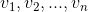

is calculated by the formula

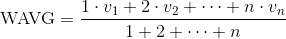

### Weighted Time Average

This function has type `WTAVG`.
It uses count or time based rolling window, so one of `count` or `interval` parameter is required.
If window contains series samples

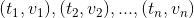

then weighted time average is

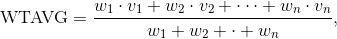

where

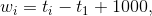

and timestamp are measured in milliseconds.

### Exponential Moving Average

This function has type `EMA`, and also known under the name [exponential smoothing](https://en.wikipedia.org/wiki/Exponential_smoothing).
Exponential smoothing uses window which consists of all series observations up to current timestamp, therefore it does not need window settings.
To calculate `EMA` specify one of following parameters.

| **Name** | **Type**  | **Description**   |
|:---|:---|:---|
| `factor` | number | Smoothing factor - number in interval (0 , 1). Use this parameter to smooth evenly spaced time series. When smoothing factor tends to 1 the smooting series tends to original series. The smaller factor gives more smoothing. |
| `range` | number | Regulates the smoothing function steepnes. Use this parameter for smoothing irregular series.|

#### Smoothing algorithm

Let original series consists of samples


Smoothed series has the same timestamps:

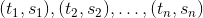

For evenly spaced series smoothed values are calculated by the formulas:

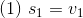

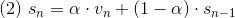

where  is value of the smoothing `factor`.

For irregular series the calculations are the same,
but smoothing factor is calculated based on series timestamps:

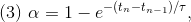

where 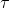 is value of the `range` parameter, and timestamps are measured in milliseconds.

These formulas imply that contribution of a sample to smoothed value decreases exponentially as sample's timestamp goes to the past.
A smaller value of the range parameter lead to faster attenuation.

For regular time series with time interval 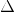 between consecutive observations the `range` parameter is expressed in terms of smoothing `factor` by the formula:

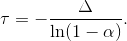

#### Example of Calculation

If interval between samples is 1000 mulliseconds, and smoothing factor 0.5, then this formula give `range` value 1443.

#### References

* A. Eckner, Algorithms for Unevenly Spaced Time Series: Moving Averages and Other Rolling Operators, section 4.1, EMA_next.
* U. Muller, Specially Weighted Moving Averages with Repeated Application of the EMA Operator, formulas 2.7-2.14.
