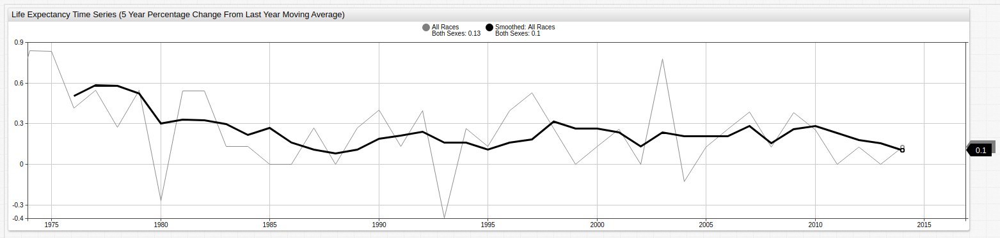

# Smoothing Time Series



## Overview

Smoothing eliminates noise from time series.
For each timestamp in an underlying series, the smoothed value is calculated in two steps:

1. Select a group of consecutive samples from the underlying series based on timestamp. This group is commonly called a rolling window.
1. Calculate the new value based on a smoothing function for the selected series samples.

### Syntax

```json
"smooth": {
  "type": "AVG",
  "interval": {"count": 1, "unit": "HOUR"}
}
```

This example performs moving average smoothing with a `1 HOUR` rolling window.

## Parameters

There are three groups of parameters:

* [**Common Parameters**](#common-parameters): Common to all smoothing methods.
* [**Function Specific Parameters**](#function-specific-parameters): Specific to a given smoothing method.
* [**Window Parameters**](#window-parameters): Define rolling window boundaries.

### Common Parameters

| **Name** | **Type**  | **Description**   |
|:---|:---|:---|
| `type` | string | **[Required]** Smoothing function.<br>Available functions: [`AVG`](#average), [`WAVG`](#weighted-average), [`WTAVG`](#weighted-time-average), [`EMA`](#exponential-moving-average). |
| `order` | integer | Controls the smoothing order in the sequence of other [transformations](./query.md#transformations).<br>Default: `0`.|

### Function Specific Parameters

| **Name** | **Type**  | **Description**   |
|:---|:---|:---|
| `count` | number | Specifies the number of series samples in [count based window](#count-based-window). |
| `interval` | object | Specifies [time based window](#time-based-window) duration `count` and time `unit`.<br>For example: `"interval": {"count": 1, "unit": "HOUR"}`.<br>Supported time units: `MILLISECOND`, `SECOND`, `MINUTE`, `HOUR`.|

### Window Parameters

Each smoothing method except for the `EMA` uses either [count based](#count-based-window) or [time based](#time-based-window) window. [Smoothing Process](#smoothing-process) describes how series samples are grouped into a window.

| **Name** | **Type**  | **Description**   |
|:---|:---|:---|
| `minimumCount` | number | Threshold which triggers smoothing function calculation for a given window.<br>View [Smoothing Process](#smoothing-process) for details. <br> Default value is `0` for time based window, and `count` for count based window. |
| `generateNaNs` | boolean | Regulates `NaN` value generation for window which does not have enough samples to calculate smoothing function.<br>If `generateNaNs = true`, smoothed series value is `NaN` in such cases, otherwise smoothed series contains no value.<br>In the latter case no smoothed value is calculated timestamps of original series. <br>Default value: `false`.|

## Smoothing Process

Input series samples are processed sequentially in ascending time order.
A set of consecutive samples is maintained during processing.
This set is called the **rolling window** or **window**. Initially the window is empty.

For each series sample the following steps are executed sequentially:

1. Determine whether calculation conditions are satisfied.
    * [Time based](#time-based-window) and [count based](#count-based-window) windows make this determination differently.
1. Smoothing function returns:
    * Calculated numerical value if function-specific calculation conditions are satisfied.
    * `NaN` if function-specific calculation conditions are not satisfied and `generateNaNs = true`.
    * No value if function-specific calculation conditions are not satisfied and `generateNaNs = false`.
1. Returned values retain the timestamp from the underlying series.
1. Newly or original calculated samples are added to the rolling window.
1. Upon window overflow, oldest samples are removed.
    * [Time based](#time-based-window) and [count based](#count-based-window) windows define window overflow differently.
1. After processing all series samples,  smoothing function writes final value for the window as last sample.

## Time Based Window

Calculation conditions are satisfied if the amount of time between the first timestamp **inside** the rolling window and the first timestamp **outside** the rolling window exceed the defined `interval` **and** the number of sample exceeds the defined `minimumCount`.

Denote:

* `u`: First timestamp inside window.
* `v`: Final timestamp inside window.
* `w`: First timestamp outside window.
* `n`: Number of samples in window.

If `w - u > interval && n > minimalCount`, calculation conditions are satisfied.

Window overflow limit is defined by the `interval` parameter. If the amount of time between the **first** and **final** timestamps inside the rolling window exceed the defined `interval`, superfluous samples are removed. Oldest samples are removed first.

Denote:

* `u`: First timestamp inside window.
* `v`: Final timestamp inside window.

If `v - u > interval`, window overflow limit is exceeded.

## Count Based Window

Calculation conditions are satisfied if number of samples in the rolling window exceeds the defined `minimumCount`.

Window overflow limit is defined by the `count` parameter. If the number of samples **inside** the window exceeds the defined `count`, superfluous samples are removed. Oldest samples are removed first.

## Smoothing Functions

### Average

`type = AVG`

* Calculates value mean within rolling window, sum of values divided by number of values.

### Weighted Average

`type = WAVG`

* Count or time based rolling window.
* Either `count` or `interval` parameter is required.
* Weighted average for window which contains series values.

Window values:


Are calculated by the formula:


### Weighted Time Average

`type = WTAVG`.

* Count or time based rolling window.
* Either `count` or `interval` parameter is required.

For window containing series samples:


Weighted time average is calculated by the formula:


Where,


> Timestamps are measured in milliseconds.

### Exponential Moving Average

`type = EMA`

* [Exponential smoothing](https://en.wikipedia.org/wiki/Exponential_smoothing) uses a window which consists of all series observations up to current timestamp, therefore  does not require Window Parameters.

### `EMA` Specific Parameters

| **Name** | **Type**  | **Description**   |
|:---|:---|:---|
| `factor` | number | Smoothing factor: A number between **exclusive** interval `0` and `1`.<br>Use this parameter to smooth evenly spaced time series.<br>As smoothing factor approaches `1`, smoothed series approaches original series. |
| `range` | number | Regulates steepness of smoothing function.<br> Use this parameter for smoothing irregular series.<br>A [larger smoothing factor](https://en.wikipedia.org/wiki/Exponential_smoothing#Basic_exponential_smoothing) decreases series variance.

Original series consists of samples:


Smoothed series retains the same timestamps:


For evenly spaced series smoothed values are calculated by the following formulas:


where  is the value of smoothing `factor`.

For irregular series calculations identical, but smoothing `factor` is calculated based on series timestamps:


where  is the value of `range`, and timestamps are measured in milliseconds.

These formulas imply that contribution of a sample to smoothed value decreases exponentially as sample timestamp travels further into the past.
A lower `range` parameter value leads to faster attenuation.

For regular time series with time interval  between consecutive observations `range` is expressed via smoothing `factor` by the formula:


#### Example Calculation

If interval between samples is `1000` milliseconds, and smoothing factor is `0.5`, this formula returns `range` value `1443`.

#### References

* A. Eckner, Algorithms for Unevenly Spaced Time Series: Moving Averages and Other Rolling Operators, Section 4.1, `EMA_next`.
* U. Muller, Specially Weighted Moving Averages with Repeated Application of the EMA Operator, Formulas `2.7`-`2.14`.
