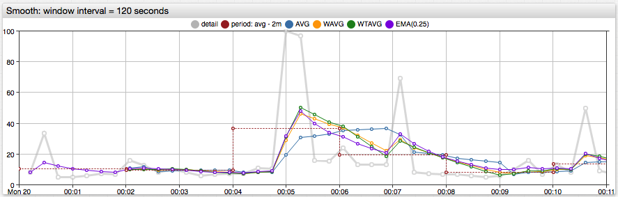
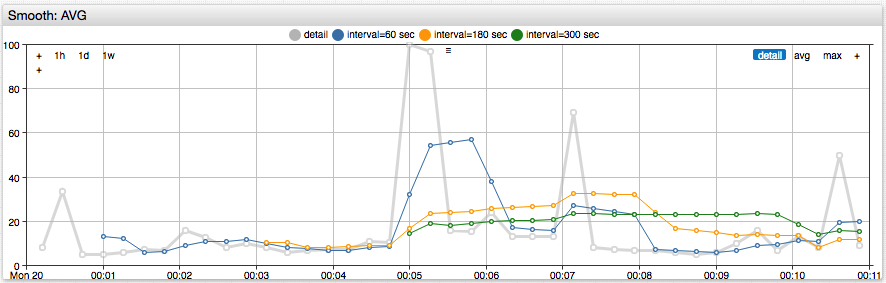
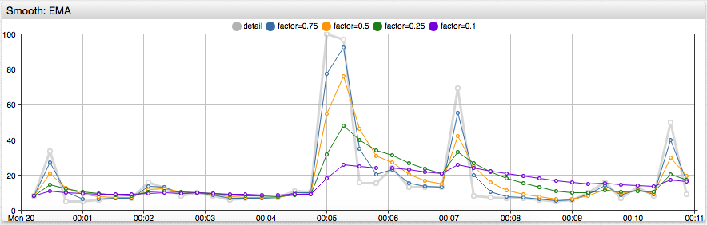

# Smoothing Time Series



[](https://apps.axibase.com/chartlab/3734bd35/4)

## Overview

Smoothing is a transformation that reduces the noise in an underlying time series. Unlike [period aggregation](aggregate.md) which returns a new regularized series, smoothing retains the original timestamps.

For each timestamp in the underlying series, the smoothed value is calculated in two steps:

* A sequence of preceding samples up to the current timestamp is retrieved from the underlying series. This sequence ends with the current sample and is called a **rolling window**.
* New value at the current timestamp is calculated by applying a smoothing function to the retrieved sequence.

The size of the rolling window can be based on duration or the number of samples and is controlled with the `interval` and `count` settings. The smoothing function is set in the `type` field.

The example below calculates simple moving average using a 15-minute rolling window.

```json
"smooth": {
  "type": "AVG",
  "interval": {"count": 15, "unit": "MINUTE"}
}
```

The implemented smoothing functions - `AVG`, `WAVG`, `WTAVG`, and `EMA` - differ by how they assign weight to samples in the sliding window. While simple average `AVG` assigns equal weight to all samples, the weighted average functions take the sample index or the distance between samples into account and typically assign greater weight to the most recent samples.

## Fields

| **Name** | **Type**  | **Description**   |
|:---|:---|:---|
| `type` | string | **[Required]** Smoothing function.<br>Available functions: [`AVG`](#average), [`WAVG`](#weighted-average), [`WTAVG`](#weighted-time-average), [`EMA`](#exponential-moving-average). |
| `count` | number | Number of samples in the count-based rolling window. |
| `interval` | object | Duration of the time-based window specified with `count` and time [`unit`](time-unit.md).<br>For example: `{"count": 3, "unit": "HOUR"}`.|
| `minimumCount` | number | Minimum number of samples in the window to apply the smoothing function.<br>Default value is `1` for time-based windows, and `count` for count-based windows.<br>If the window is incomplete (sample count is below minimum), the smoothing function returns `incompleteValue` for the current timestamp. |
| `incompleteValue` | string | Number to return for the current timestamp if the sample count is below `minimumCount` (incomplete window). Possible values: `null` (default), `NaN`, or a constant numeric value. `null` values are omitted from the response.|

> Parameters `count` and `interval` are ignored by the `EMA` function which weighs all loaded samples.

The longer the time window, the more smooth is the returned series.



## Smoothing Process

Received series samples are processed sequentially in ascending time order.
The ordered sequence is called the **rolling window** or a **sliding window**. Initially the window is empty.

For each series sample the following steps are executed sequentially:

1. If the sample value is `NaN`, include the sample in the response unchanged. Skip remaining steps.
1. Append the sample at the end of the window.
1. Remove outdated samples:
   * For time-based windows. Remove any samples with timestamp equal or earlier than current timestamp minus the interval.
   * For count-based windows. Remove the first (oldest) sample if window length exceeds `count`.
1. If the number of samples is below `minimumCount`, return the value specified in the `incompleteValue` parameter.
1. Return the value calculated by the smoothing function.

The timestamp of the returned samples is the same as the timestamp of the input sample.

## Smoothing Functions

### Average

`type = AVG`

Calculates average value within rolling window. Sum of values divided by number of values.

Window values:


Calculation formula:


### Weighted Average

`type = WAVG`

Calculates weighted average where the weight of the value equals sample index.

Window values:


Calculation formula:


### Weighted Time Average

`type = WTAVG`.

Calculates weighted average where the weight of the sample value is equal to the distance between the first timestamp and the sample timestamp.

Window samples, with timestamps are measured in milliseconds:


Calculation formula:


The function returns sample value  if .

### Exponential Moving Average

`type = EMA`

Calculates [exponentially smoothed](https://en.wikipedia.org/wiki/Exponential_smoothing) weighted average. The function uses a window which consists of **all** samples preceding the current timestamp, therefore it does not require `count` and `interval` parameters. The contribution of a sample to the calculated smoothed value decreases exponentially for more distant samples.

#### `EMA` Specific Fields

| **Name** | **Type**  | **Description**   |
|:---|:---|:---|
| `factor` | number | Smoothing factor. A number within the `(0, 1)` range.<br>A [smaller smoothing factor](https://en.wikipedia.org/wiki/Exponential_smoothing#Basic_exponential_smoothing) decreases variance.<br>Default value: `0.25`|
| `range` | number | Controls steepness of the smoothing function.<br> Typically used to smooth irregular series. <br>A larger range decreases variance.



Input series samples:


The smoothed series contains samples with the same timestamps:


* Calculations using `factor`

    

    

    where  is the value of smoothing `factor`.

* Calculations using `range`

    The calculation applies the same formulas (1) and (2) using `factor` calculated based on series timestamps and the specified `range`:

    

    where  is the value of `range`.

    For regular series, `range` can be calculated from `factor`:

    

    where  is the time interval between consecutive samples, measured in milliseconds.

    If interval between samples is `1000` milliseconds, and smoothing factor is `0.5`, the `range` is `1443`.

#### References

* A. Eckner, Algorithms for Unevenly Spaced Time Series: Moving Averages and Other Rolling Operators, Section 4.1, `EMA_next`.
* U. Muller, Specially Weighted Moving Averages with Repeated Application of the EMA Operator, Formulas `2.7`-`2.14`.
