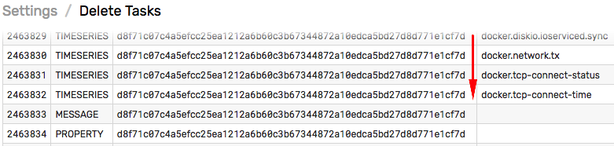
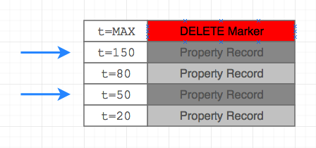

# Entity: delete

## Description

Deletes the specified entity and removes the entity from any entity groups it belongs to.

## Data Removal

In addition to removing the entity itself, this operation creates background tasks to delete time series, properties, and messages collected by the entity.

The tasks are added to a database-persisted queue and are executed on a schedule controlled with the `delete.schedule` [server property](../../../administration/server-properties.md#scheduled-tasks).

Pending tasks are displayed on the **Settings > Storage > Delete Tasks** page.



When the entity is deleted, the database creates one `MESSAGE` task, one `PROPERTY` task and multiple `TIMESERIES` tasks for each metric collected by the entity.

Due to the storage schema, the `PROPERTY` task does not instantly remove property records from the disk. Instead, the task inserts a `DELETE` marker with `Long.MAX_VALUE` time which hides all property records for the given entity name regardless of timestamp. As a result, re-inserting property records for a new entity with the same name is not possible until the marker is removed.

In the example below, the `DELETE` marker hides all records, including records with timestamps `t=80` and `t=150` for a new entity with the same name.



`DELETE` markers and the data they mask are removed in the background by a compaction process. Refer to the property [delete endpoint](../../data/properties/delete.md#deletion-process) for additional details on compaction.

## Request

| Method | Path | `Content-Type` Header|
|:---|:---|---:|
| `DELETE` | `/api/v1/entities/{entity}` | `application/json` |

### Path Parameters

|**Name**|**Type**|**Description**|
|:---|:---|:---|
| `entity` |string|Entity name.|

## Response

### Fields

None.

## Example

### Request

#### URI

```elm
DELETE /api/v1/entities/nurswgvml001
```

#### curl

```bash
curl https://atsd_hostname:8443/api/v1/entities/nurswgvml001 \
  --insecure --include --user {username}:{password} \
  --request DELETE
```

### Response

None.
