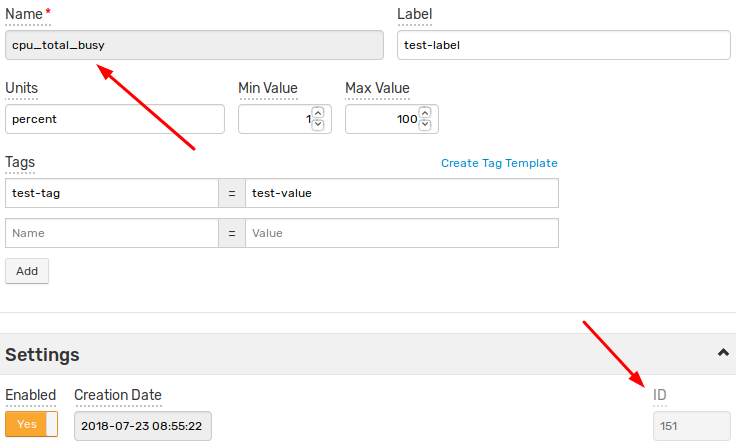

# Metric: rename

## Description

Renames metric: modifies the name, whereas the identifier, the series data (datetime, value), the metric metadata (tags, fields) are retained.

New commands with the old metric name are stored under a new metric with the old name and a new identifier.

Rules applied to the metric name:

* Characters with ASCII codes from 0x0 to 0x20 are forbidden.
* Upper-case letters are treated as lower-case.
* The new name of metric must not match any other present metric name.

## Request

| **Method** | **Path** | **`Content-Type` Header** |
|:---|:---|---:|
| `POST` | `/api/v1/metrics/{old_name}/rename` | `application/json` |

### Path Parameters

| **Name** | **Description** |
|:---|:---|
| `old_name` | **[Required]** Old metric name. |

### Fields

| **Name** | **Type** | **Description** |
|:---|:---|---:|
| `name` | string | **[Required]** New metric name. Must be unique. |

## Response

### Fields

None.

## Example

### Request

#### URI

```elm
POST /api/v1/metrics/old_name/rename
```

#### Payload

```json
{
  "name": "new_name"
}
```

#### curl

```bash
curl https://atsd_hostname:8443/api/v1/metrics/old_name/rename \
  --insecure --include --user {username}:{password} \
  --header "Content-Type: application/json" \
  --data '{"name":"new_name"}'
```

### Response

None.

## Additional Examples

### Screenshots

Metric editor page before and after the renaming operation:



