# Monthly Change Log: December 2016

## ATSD

| **Issue**     | **Category**        | **Type**     | **Subject**                                                                    |
|-----------|-----------------|----------|----------------------------------------------------------------------------|
| [3737](#issue-3737) | sql         | Bug     | Fixed issue with long scan, followed by a timeout for an entity that does not collect the specified metric. |
| [3735](#issue-3735) | sql         | Bug     | Math functions do not accept arithmetic expressions in the `WHERE` clause. Updated error message to read `IllegalArgumentException: Aggregate functions are not supported in the WHERE clause`. |
| 3731 | api-rest    | Bug     | Fixed issue with property queries (`addMeta`:`true`) not returning metadata if the property type is set to `$entity_tags`. |
| 3729 | api-rest    | Bug     | Updated error URL and message text for requests to non-existent URLs. |
| [3727](#issue-3727) | api-network | Feature | Optimized TCP handler for faster processing of `series` commands streamed by a single TCP client. |
| [3725](#issue-3725) | sql         | Bug     | Optimized queries with `ORDER BY` and `LIMIT` clauses. |
| [3719](#issue-3719) | sql         | Feature | Optimized [windowing](../../sql/README.md#last_time-syntax) queries by narrowing the requested timespan based on minimum last insert date. |
| 3718 | UI          | Bug     | Changed metric form to prevent users from saving metric names without metric name validation. |
| 3715 | UI          | Feature | Updated styles on the account create page displayed post-installation. |
| 3714 | UI          | Bug     | Fixed errors with the Decimal Precision input in the [SQL Console](../../sql/sql-console.md). |
| [3713](#issue-3713) | sql         | Bug     | Fixed number format error raised in queries with the `WHERE` clause. |
| [3703](#issue-3703) | sql         | Feature | Added capability to display first/last sample time in windowing queries. |
| [3697](#issue-3697) | sql         | Feature | Modified processing sequence to ensure that the `HAVING` filter is applied after period interpolation. |
| [3696](#issue-3696) | sql         | Bug     | Fixed issue with `ORDER BY [column-index]`. |
| [3694](#issue-3694) | sql         | Bug     | Optimized execution of `JOIN` queries by applying tag filters to all tables. |
| 3693 | UI          | Bug     | Fixed navigation issue between Query console and Query Plan. |
| [3689](#issue-3689) | sql         | Feature | Added support for the `SELECT 1` validation query. |
| 3687 | UI          | Bug     | Corrected User Group link on the Admin menu. |
| [3672](#issue-3672) | sql         | Feature | Added new details to query plan: start and end dates for each HBase scan and scans to atsd_li table. |
| [3555](#issue-3555) | sql         | Feature | Implemented [`LOOKUP`](../../sql/README.md#lookup) function to translate the key into a value using the specified replacement table. |
| [3421](#issue-3421) | sql         | Feature | Implemented the `searched case` variant of the [`CASE`](../../sql/README.md#case-expression) expression. |
| 3710     | install         | Feature         | Added support for an embedded collector account with `All Entities: Read` and `All Entities: Write` permission.                                      |
| [3704](#issue-3704)     | sql             | Bug             | Fixed 50% percentile division error where percentile is specified in denominator.                              |
| [3702](#issue-3702)     | sql             | Bug             | Modified syntax error message in case an non-grouped column is included in a `SELECT` expression.                          |
| [3701](#issue-3701)     | sql             | Feature         | Optimized processing of partitioning queries using the Last Insert table.                        |
| [3325](#issue-3325)     | sql             | Bug             | Allowed for columns other than `value` and `*` in the `COUNT` function.
| 3698 | administrator       | Support     | Increased the default maximum Java heap value from 512 MB to 1 GB. This change is required to accommodate increased requirements for in-memory processing by the SQL engine. |
| [3690](#issue-3690) | security    | Feature | Modified how role/membership/permission changes are applied. When changes are made to a user account, current active sessions are now automatically invalidated. The user cannot continue using sessions with previously cached `ACLs`. |
| [3688](#issue-3688) | sql         | Feature     | Added support for `GROUP BY value` to calculate unique occurrences of the `value` over the specified timespan. This is useful for metrics that measure discrete characteristics, such as status codes, error codes, digital states etc. |
| 3679 | email       | Feature     | Cleaned up the email notification template to hide irrelevant statistics if the sample in the window is less than 1. |
| 3678 | UI          | Bug     | Placed the Name and Label fields on separate lines in the metric and entity forms to account for long names. |
| [3675](#issue-3675) | sql         | Feature     | Added the capability to replace numeric [`NaN`](../../sql/README.md#null) with another integer with the `ISNULL` function.|
| 3662 | csv         | Support     | Identified an issue with schema-based CSV parsers. A schema-based CSV parser fails if ATSD is launched under Java 8+.|
| [3650](#issue-3650) | UI          | Feature | Consolidated multiple pages under the **Settings** menu into one page. |
| 3646 | UI          | Bug     | Return `4xx` error number instead of `500` on the **SQL Query Plan** page if the query is no longer found by id, which occurs when the server is restarted, or the query plan is evicted from cache. |
| 3642 | api-rest    | Bug     | Not all entities for the metric are visible on the **Entities** page. |
| [3631](#issue-3631) | sql         | Bug     | `NaN` numbers and `null` strings interpolated consistently (using the `PREVIOUS` function), similar to the PI server. |
| 3552 | rule engine | Feature | Implemented the `coalesce` function in the rule engine to substitute missing tags, for example `coalesce([entity.label, entity.tags.name])`. |
| [3516](#issue-3516) | sql         | Feature     | `IS NULL` operator supports `metric.label`. |
| [3515](#issue-3515) | sql         | Feature     | `IS NULL` operator supports metric tags. |
| [3463](#issue-3463) | sql         | Bug     | `WITH INTERPOLATE` correctly interpolates the `text` column in JOIN queries. |
| [3677](#issue-3677)      | sql             | Feature      | Added support for `date_format` function in `WHERE`, `GROUP BY` and `ORDER BY` clauses . |
| [3674](#issue-3674)      | sql             | Bug      | Fixed slow execution time for queries with table aliases. |
| [3673](#issue-3673)      | sql             | Bug      | Added `WEEK` interval type in the `PERIOD` function. |
| 3671      | metric          | Bug      | Fixed issues with values being discarded if Min Value and Max Value are specified and Invalid Action set to `NO ACTION`. |
| [3670](#issue-3670)      | sql             | Bug      | Fixed incorrect results with `ROW_MEMORY_THRESHOLD OPTION` compared to temporary table processing. |
| [3665](#issue-3665)      | sql             | Bug      | Added error message in case of excessive tag combinations fetched by a query. |
| 3660      | jdbc            | Bug      | Hide unused driver properties in DbVisualizer . |
| 3647      | core            | Bug      | Fixed error log download issue if the file is modified during the download process. |
| [3645](#issue-3645)      | rule engine     | Feature  | Exclude unused statistics from the details table in the email notification. |
| 3640      | api-rest        | Bug      | Fixed NullPointerException in alert-history-entity query. |
| 3618      | api-rest        | Bug      | Fixed incorrect status code in case an invalid entity expression is submitted. |
| 3617      | UI              | Bug      | Corrected date parsing issue on Export Data page. |
| [3615](#issue-3615)      | api-network     | Feature  | Added the new fields `minValue` and `maxValue` to the Metric class. |
| [3601](#issue-3601)      | sql             | Bug      | Optimized execution time for queries with arithmetic expressions. |
| 3600      | sql             | Bug      | Fixed different results of aggregation functions with and without the `LIMIT` clause. |
| [3592](#issue-3592)      | security        | Feature  | Added Trust SSL Certificate field to LDAP configuration form. |
| [3583](#issue-3583)      | security        | Feature  | Added **Create Accounts** integration feature to LDAP. |
| 3582      | security        | Feature  | Enabled copying user account attributes from ATSD into LDAP. |
| 3570      | api-network     | Bug      | Corrected failure to insert metric command for a re-created metric.   |
| 3560      | api-network     | Feature  | Added new field `Units` to the **Metric** class. |
| [3470](#issue-3470)      | sql             | Feature  | Added support for `text` column in the `SELECT` expression and the `WHERE` clause. |
| [3465](#issue-3465)      | api-rest        | Feature  | Added `addMeta` series and property methods in Data API. |
| [3438](#issue-3438)      | security        | Feature  | Modified Enterprise Edition to support LDAP authentication. |
| [3309](#issue-3309)      | grafana        | Support  | Implemented ATSD storage driver for Grafana `3.x`. |

---

## Charts

| **Issue**     | **Category**        | **Type**     | **Subject**                                                                    |
|-----------|-----------------|----------|----------------------------------------------------------------------------|
| 3523      | property        | Bug      | Set format-number to `false` by default to allow users enable it explicitly at the widget or column level. |

### Issue 3737

```sql
SELECT entity, tags.*, value, datetime
  FROM disk_used
WHERE datetime > now - 1 * day
  AND entity = 'nurswgvml501'
  WITH ROW_NUMBER(entity, tags ORDER BY time DESC) <= 1
```

---

## Collector

| **Issue**     | **Category**        | **Type**     | **Subject**                                                                    |
|-----------|-----------------|----------|----------------------------------------------------------------------------|
| 3732 | core        | Feature | Modified Collector start-up routine to wait until ATSD is ready when running jobs from the `docker-compose` file. |
| 3724 | core        | Feature     | Created a `docker-compose` file to launch `socrata-cdc` and the ATSD/Collector container bundle, used for computing statistics. |
| 3723 | data-source | Bug     | Added missing Avatica package dependencies to the ATSD JDBC driver. |
| 3722 | core        | Feature | Send `property` command with collector details to ATSD after a startup is completed. |
| 3686 | core        | Support | Added a list of pre-configured jobs and their XML files [here](https://axibase.com/docs/axibase-collector/job-autostart.html). |
| 3571 | administrator       | Bug     | Modified Dockerfile to speed up Collector application startup at the expense of a slight larger image size. |
| [3717](#issue-3717)     | docker          | Feature         | Set container label from environment variable `CONTAINER_NAME` for Mesos compatibility. |
| 3716     | docker          | Bug             | Fixed malformed label for images without a parent image. |
| 3700     | docker          | Bug             | Replaced textarea with an Item List containing name expressions of processes to be excluded from the `top` process collection and count. |
| 3699     | docker          | Bug             | Eliminated duplicate container names when setting volume labels.      |
| 3692     | UI              | Bug             | Raised an error when the job is executed manually and the storage driver is not `successful` at that time. |
| [3685](#issue-3685)     | docker          | Feature         | Added a setting to remove deleted records from ATSD after a period of time. Containers can be removed after a certain number of days, images/volumes/networks can removed instantly. |
| 3684     | UI              | Bug             | Added **Enable/Disable/Run** buttons on the job list page to change status or run multiple jobs at a time using checkboxes.                             |
| [3664](#issue-3664) | docker      | Feature | Added new Docker container metrics for process count monitoring: `docker.process.all` and `docker.process.filtered`. |
| [3559](#issue-3559) | jdbc        | Feature | Extended JDBC job to ensure that PI server `PIPoint` metadata can be offloaded into ATSD. |
| 3663      | jdbc            | Feature  | Added tooltips for MESSAGE type: message column, type, source, and severity. |
| 3655      | json            | Bug      | Applied missing metric prefixes. |
| [3644](#issue-3644)      | collection      | Feature  | Implemented New Item List type to load data from property records in ATSD. |
| 3638      | docker          | Bug      | Fixed startup issues with the Collector Docker container. |
| 3621      | docker          | Bug      | Added checker to synchronize Docker-engine objects and statuses with ATSD. |
| 3405      | docker          | Bug      | Fixed issue with missing Docker statistics. |

---

### Issue 3735

```sql
SELECT entity, avg(value), ABS((last(value) / avg(value) - 1)*100)
  FROM cpu_busy
WHERE datetime > previous_minute
  AND ABS(value) > 0
GROUP BY entity
  HAVING ABS((last(value) / avg(value) - 1)*100) > 0
```

### Issue 3727

The TCP handler, running on the default port `8081`, optimized for faster processing of `series` commands streamed by a single TCP client. The new implementation provides a pool of
threads instead of a single one to offload parsing and processing from the TCP handler. The size of the pool is controlled with the `series.processing.pool.size` parameter on the
**Settings > Server Properties** page. The default value is 2 and is recommended to be set to the number of cores on the server.

As a result, the TCP processing and parsing throughput (measured in commands per second) has increased by 40% on average.

### Issue 3725

Previously, execution of queries with the `LIMIT` clause involved copying selected rows into a temporary table, even if only a small subset of the rows, restricted with `LIMIT`, are required.
Both `ASC` and `DESC` ordered results are optimized by reducing the number of rows copied into a temporary table. The following queries experienced a 90% speedup in execution time.

```sql
SELECT *
  FROM mpstat.cpu_busy tot
  ORDER BY datetime DESC
LIMIT 10
```

```sql
SELECT *
  FROM mpstat.cpu_busy tot
  ORDER BY datetime
LIMIT 10
```

### Issue 3719

Added an optimization to narrow the start date in [windowing](../../sql/README.md#last_time-syntax) queries which is now determined as the minimum (last insert date) for all series.
Prior to this change, the start date is not applied if it is not specified explicitly in the query.

```sql
SELECT date_format(time, 'yyyy-MM-dd') as 'date',
  tags.city, tags.state, sum(value)
FROM "dmv.incidents"
  GROUP BY entity, tags, datetime
WITH time = last_time
  ORDER BY sum(value) desc
```

The above query scans data with a start date determined as the earliest of all the matching series.
For example, if you have 3 series with the following last insert dates:

* A: 2016-12-21
* B: 2016-10-05
* C: 2016-12-20

The SQL optimizer adds a condition `AND datetime >= '2016-20-05T00:00:00Z'`, even if the interval condition is not included in the query.

### Issue 3713

```sql
SELECT tot.datetime, tot.tags.city as 'city', tot.tags.state as 'state',
 tot.value - t1.value - t24.value - t44.value - t64.value - t64o.value as 'other_deaths',
 t1.value as 'infant_deaths',
 t24.value as '1-24_deaths',
 t44.value as '25-44_deaths',
 t64.value as '45-64_deaths',
 t64o.value as '64+_deaths',
 tot.value as 'all_deaths'
FROM cdc.all_deaths tot
 JOIN cdc._1_year t1
 JOIN cdc._1_24_years t24
 JOIN cdc._25_44_years t44
 JOIN cdc._54_64_years t64
 JOIN cdc._65_years t64o
WHERE tot.entity = 'mr8w-325u'
 AND tot.tags.city = 'New York'
 AND tot.datetime > '2016-08-27T00:00:00Z'
 AND (tot.value - t1.value - t24.value - t44.value - t64.value - t64o.value) != 0
OPTION (ROW_MEMORY_THRESHOLD 500000)
```

### Issue 3703

Now aggregate functions such as `MAX`, `MIN`, and `DELTA` can be applied to the `time` column, which returns the sampling time as Unix time in milliseconds.
One of the use cases is to display the most recent time in windowing queries where the [last_time](../../sql/README.md#last_time-syntax) function can be utilized to select data for a sliding interval, such as the most recent 4 weeks for each series in the example below.

```sql
SELECT tags.city, tags.state, sum(value), date_format(max(time)) as Last_Date
  FROM dmv.incidents
GROUP BY entity, tags
  WITH time > last_time - 2*week
ORDER BY max(time)
```

```ls
| tags.city    | tags.state | sum(value) | Last_Date                |
|--------------|------------|------------|--------------------------|
| Fort Worth   | TX         | 411        | 2009-01-31T00:00:00.000Z |
| Philadelphia | PA         | 53882      | 2012-11-24T00:00:00.000Z |
| Pittsburgh   | PA         | 38926      | 2015-06-27T00:00:00.000Z |
| New Haven    | CT         | 13311      | 2016-07-16T00:00:00.000Z |
| Washington   | DC         | 41937      | 2016-08-06T00:00:00.000Z |
```

### Issue 3697

Modification of the sequence of period interpolation and period filtering with the [`HAVING`](../../sql/README.md#having-filter) clause.
Now, the `HAVING` filter is applied after [`PERIOD` interpolation](../../sql/README.md#interpolation).

```sql
SELECT date_format(period(1 MONTH)), count(value)
  FROM dmv.incidents
WHERE tags.city = 'Boston'
  AND datetime >= '2016-09-01T00:00:00Z' AND datetime < '2016-12-01T00:00:00Z'
GROUP BY period(1 MONTH, VALUE 0)
  HAVING count(value) > 0
ORDER BY datetime
```

Assuming no detailed records for this series in October 2016, the current result looks as follows:

```ls
| date_format(period(1 MONTH)) | sum(value) | count(value) |
|------------------------------|------------|--------------|
| 2016-09-01T00:00:00.000Z     | 537.0      | 4.0          |
| 2016-11-01T00:00:00.000Z     | 234.0      | 4.0          |
```

Previous result:

```ls
| date_format(period(1 MONTH)) | sum(value) | count(value) |
|------------------------------|------------|--------------|
| 2016-09-01T00:00:00.000Z     | 537.0      | 4.0          |
| 2016-10-01T00:00:00.000Z     | 0.0        | 0.0          | <- this period was added by interpolation set in period(1 MONTH, VALUE 0), after HAVING.
| 2016-11-01T00:00:00.000Z     | 234.0      | 4.0          |
```

### Issue 3696

```sql
SELECT date_format(period(1 MONTH)), sum(value), count(value)
  FROM cdc.all_deaths tot
WHERE tags.city = 'Boston'
  AND datetime >= '2016-01-01T00:00:00Z'
GROUP BY period(1 MONTH)
  HAVING count(value) >= 4
ORDER BY 1
```

### Issue 3694

Modified the query optimizer to apply tag filter specified in `JOIN` queries on one of the tables to the remaining tables, since
[joins](../../sql/README.md#joins) in ATSD merge rows on time, entity, and series tags anyway. Prior to this change, the tag filter
only applied to those tables without explicitly set filter.

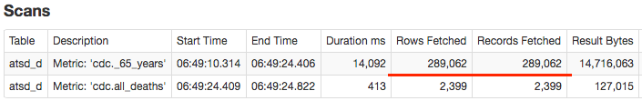

### Issue 3689

Implemented the special `SELECT 1` query, which is typically used to [test connectivity](../../sql/api.md#connection-query) and validate open
connections in the shared connection pool in active state.

### Issue 3672

SQL Query Plan is used for diagnosing slow query response times. The plan now includes the following features:

1) Display start and end dates for each HBase scan.</br>
2) Display scans to the atsd_li (last insert) table, which are used to add additional filters and to determine optimal query plan.</br>

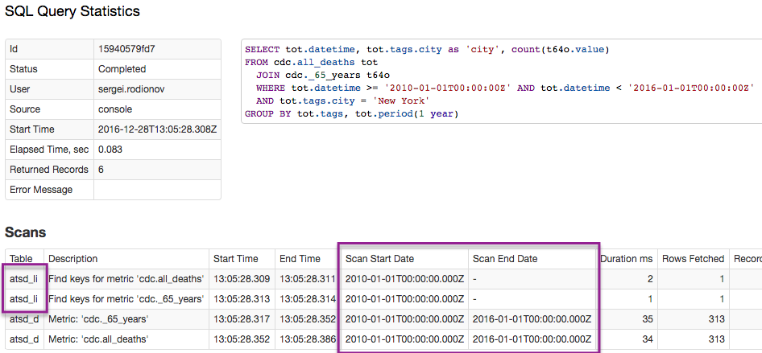

### Issue 3555

Implemented the [LOOKUP](../../sql/README.md#lookup) function, which translates the key into a value using the specified replacement table.

The primary purpose of a replacement table is to act as a dictionary for decoding series tags/values.

```sql
SELECT datetime, entity, value, LOOKUP('tcp-status-codes', value)
  FROM 'docker.tcp-connect-status'
WHERE datetime > now - 5 * MINUTE
  AND LOOKUP('tcp-status-codes', value) NOT LIKE '*success*'
LIMIT 10
```

```ls
| datetime                 | entity   | value | LOOKUP('tcp-status-codes',value) |
|--------------------------|----------|-------|----------------------------------|
| 2016-12-28T13:06:11.085Z | 1f4faa42 | 1     | Connection Error                 |
| 2016-12-28T13:06:11.085Z | 131b6339 | 1     | Connection Error                 |
| 2016-12-28T13:06:11.085Z | 37dc00da | 2     | No Route To Host                 |
```

### Issue 3421

Implemented the `searched case` variant of the [CASE](../../sql/README.md#case-expression) expression.

The `CASE` expression evaluates a sequence of boolean expressions and returns a matching result expression.

```sql
CASE
     WHEN search_expression THEN result_expression
     [ WHEN search_expression THEN result_expression ]
     [ ELSE result_expression ]
END
```

Refer to [examples](../../sql/examples/case.md) for additional information.

```sql
SELECT entity, avg(value),
    CASE
      WHEN avg(value) < 20 THEN 'under-utilized'
      WHEN avg(value) > 80 THEN 'over-utilized'
      ELSE 'right-sized'
    END AS 'Utilization'
  FROM cpu_busy
WHERE datetime > current_hour
  GROUP BY entity
```

```ls
| entity       | avg(value) | Utilization    |
|--------------|------------|----------------|
| nurswgvml006 | 6.2        | under-utilized |
| nurswgvml007 | 80.8       | over-utilized  |
| nurswgvml010 | 3.8        | under-utilized |
```

### Issue 3704

```sql
SELECT tavg.tags.type,
    median(tmed.value),
    last(tmed.value),
    last(tmed.value)/median(tmed.value)
FROM "jmeter.ok.avg" tavg
    JOIN "jmeter.ok.pct50" tmed
WHERE tavg.entity = "test.example.org"
    AND tavg.datetime >= current_day - 10*day
GROUP BY tavg.tags.type
  ORDER BY last(tmed.value) DESC
```

### Issue 3702

```sql
SELECT date_format(time, 'yyyy-MM-dd') as 'date',
  tags.city, tags.state, tags.region, sum(value)
FROM cdc.all_deaths
  WHERE entity = 'mr8w-325u' AND tags.city IS NOT NULL
GROUP BY entity, tags
  WITH time >= last_time - 4*week
ORDER BY sum(value) desc
```

### Issue 3701

In this issue, we took a look at optimizing [partitioning queries](../../sql/README.md#partitioning), leveraging the fact that we can narrow the start and end date for a scan based on the last times in the Last
Insert Table. Consider the below query as an example.

```sql
SELECT tags.city, tags.state, value
  FROM cdc.all_deaths
WHERE entity = 'mr8w-325u' AND tags.city IS NOT NULL
  AND tags.region = '2'
WITH ROW_NUMBER(tags ORDER BY datetime desc) <= 1
  ORDER BY value DESC
```

Since the timespan is not defined in the `WHERE` clause, no date filter is applied to scanned records.
To optimize the query we now perform a lookup of the minimum insert time for the specified metric, entity, and series tags.
Since the minimum insert time in the above example is `1972-05-27T00:00:00Z`, we can now use it to apply time filter within the scan. For example, a condition `ROW_NUMBER(tags ORDER BY datetime desc) <= 1` means we
only need the last value for each combination of tags. We can therefore skip values with a timestamp less than the minimum last insert time.

### Issue 3325

```sql
SELECT count(*), count(value), count(entity) FROM cpu_busy WHERE datetime > previous_minute GROUP BY entity
```

### Issue 3685

Recently added to the [`docker`](https://axibase.com/docs/axibase-collector/jobs/docker.html) job in Collector is the ability to remove deleted records in ATSD for objects that no longer exist in Docker itself.

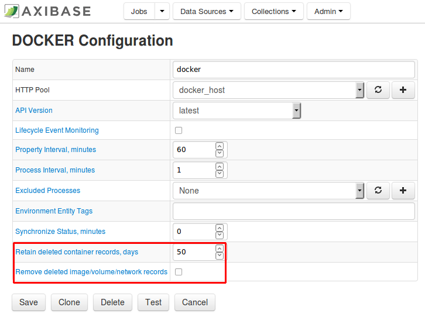

This capability is useful to purge ATSD of containers that no longer exist in Docker, for instance containers that existed only for a few minutes during image build stage, or containers
that executed short-term tasks before being removed with the `docker rm` command. Containers with a `deleted` status are initially retained in ATSD for the specified time interval (for
example 50 days in the above image). The status of these containers is marked as `deleted`, as shown in the image below.

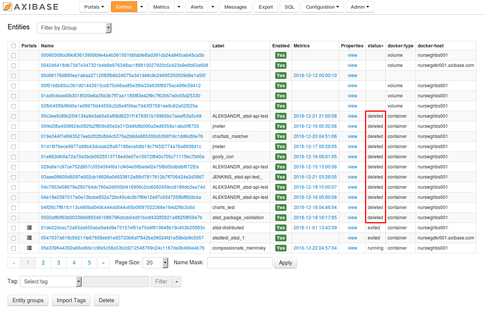

By default such records with the status `deleted` are not automatically removed from ATSD, potentially leaving unnecessary records in ATSD. To delete containers after a certain number of days, enter in a positive integer.

* **Retain deleted container records, days** : containers with a `deleted` status are initially retained in ATSD for the specified time interval. The status of these containers is marked as `deleted`. After the interval has passed, the containers are permanently removed from ATSD.

To remove deleted image/volume/network records, enable the **Retain deleted image/volume/network records** checkbox.

* **Remove deleted image/volume/network records** : removes images/volumes/networks with a `deleted` status from ATSD.

The deletion occurs at the same time as the property check interval. All deletions are logged to collector file.

### Issue 3690

In previous versions of ATSD, the user role, group membership, and entity permissions are cached while the user session is active. If the user authorization is changed by an
administrator, the setting is not applied until the active sessions timed out or until the user re-logged into the application. ATSD updated to invalidate active sessions instantly if the authorization is changed by an administrator. As a result, the administrator does not have to manually request the user to logout to apply any new settings. In addition, the administrator is now able to view which users are online.

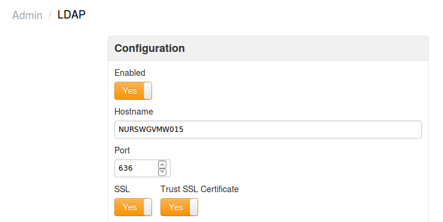

### Issue 3688

```sql
SELECT value AS 'code', ISNULL(LOOKUP('tcp-status-codes', value), value) AS 'name', COUNT(value)
  FROM 'docker.tcp-connect-status'
WHERE datetime > now - 15 * MINUTE
  GROUP BY value
```

### Issue 3675

```sql
SELECT ISNULL(value, -1)
FROM test_is_null
```

### Issue 3650

The administrative interface in ATSD has been simplified by consolidating multiple pages into one view:

1. **Build Information**

   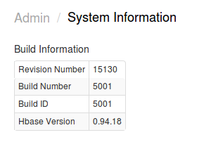

   The section provides information about the installed ATSD version (Revision Number), as well as the HBase compatibility version. The ATSD revision number is an
   incrementing counter (no semantic versioning). Each change to the ATSD code increments the revision number. Note that the revision number of the ATSD
   HBase jar file deployed on the HBase region server in the `/hbase/lib` directory is incremented separately from the ATSD revision number. When upgrading a distributed version of ATSD,
   follow [these steps](../../installation/cloudera.md#updating-atsd). If you are installing an ATSD version with a higher revision number and
   if the `atsd-hbase.*.jar` version is the same, skip the region server deployment stage altogether and upgrade just ATSD itself, without restarting your region servers.

2. **JVM System Properties**

   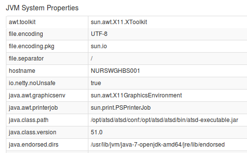

   JVM system properties contains detailed settings for the Java Virtual Machine including JMX, IO, User, and Operating System settings.

3. **JVM Environment Variables**

   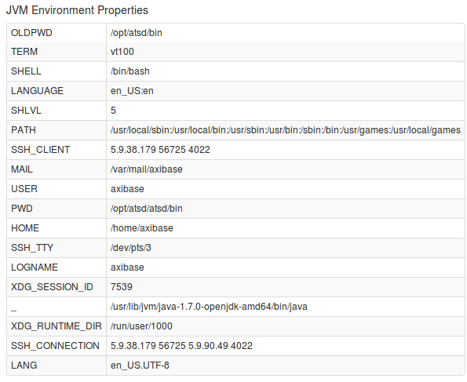

   This section provides a list of environment variables for the user, under which the ATSD java process is running.

4. **System Time**

   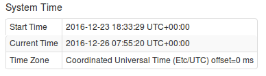

   The section displays Current and Start times, as well as the applicable Time Zone.

### Issue 3631

```sql
SELECT datetime, value FROM 'interpTest'
WHERE datetime BETWEEN '2016-11-22T17:50:00Z' AND '2016-11-22T17:55:00Z'
WITH INTERPOLATE(15 SECOND, LINEAR, OUTER, EXTEND)
```

### Issue 3516

```sql
SELECT metric.label
FROM "cpu.busy"
WHERE metric.label IS NULL
LIMIT 3
```

### Issue 3515

```sql
SELECT tags FROM disk_used
WHERE tags IS NOT NULL and datetime > now -1*minute
```

### Issue 3463

```sql
SELECT t1.datetime, t1.entity, t1.value, t2.value, t3.value, t4.value, t5.value, t5.text, t6.text
  FROM 'SV6.PACK:R01' t1
  JOIN 'SV6.PACK:R03' t2
  JOIN 'SV6.PACK:R04' t3
  JOIN 'SV6.Elapsed_Time' t4
  JOIN 'SV7.Unit_BatchID' t5
  JOIN 'SV7.Unit_Procedure' t6
WHERE t1.datetime >= '2016-10-04T02:00:00Z' AND t2.datetime <= '2016-10-04T02:10:00Z'
WITH INTERPOLATE(60 SECOND, AUTO, OUTER, EXTEND, START_TIME)
```

### Issue 3677

The `date_format` function can now be used in the `WHERE`, `GROUP BY`, and `HAVING` clauses to filter and group dates by month name, day name, or hour number.

```sql
SELECT date_format(time, 'MMM'), sum(value)
  FROM cdc.pneumonia_and_influenza_deaths
WHERE entity = 'mr8w-325u' AND tags.city = 'Boston'
  GROUP BY tags.region, date_format(time, 'MMM')
ORDER BY date_format(time, 'MM')
```

```ls
| date_format(time,'MMM') | sum(value) |
|-------------------------|------------|
| Jan                     | 4000       |
| Feb                     | 3636       |
| Mar                     | 3802       |
| Apr                     | 3236       |
| May                     | 2966       |
| Jun                     | 2727       |
| Jul                     | 2619       |
| Aug                     | 2589       |
| Sep                     | 2461       |
| Oct                     | 2775       |
| Nov                     | 2817       |
| Dec                     | 3063       |
```

Refer to [diurnal](../../sql/examples/diurnal.md) query examples.

### Issue 3674

```sql
SELECT count(t1.value)
  FROM cdc.all_deaths t1
WHERE t1.entity = 'mr8w-325u'
  AND t1.tags.city = 'Baton Rouge'
```

### Issue 3673

We fixed the [PERIOD](../../sql/README.md#period) function by adding the `WEEK` interval type.
The list of interval types supported by `PERIOD` now includes:

* YEAR
* QUARTER
* MONTH
* WEEK
* DAY
* HOUR
* MINUTE
* SECOND
* MILLISECOND

The `WEEK` interval type, along with `DAY`, `MONTH`, `QUARTER`, and `YEAR` are aligned to the server calendar by default.
In particular, the `WEEK` period, when calendar-aligned, starts on the first Monday in the initial year in the specified timespan, and is incremented forward.
For example, the first Monday in 2016 is January 4th and the 2-week periods begins on that date.

```sql
SELECT date_format(time, 'yyyy-MM-dd eeee') as 'date', sum(value)
  FROM dmv.instances
WHERE tags.city = 'New York'
  AND datetime >= '2016-09-01T00:00:00Z'
GROUP BY PERIOD(2 WEEK)
```

```ls
| date              | sum(value) |
|-------------------|------------|
| 2016-09-12 Monday | 1971       |
| 2016-09-26 Monday | 987        |
```

> Note that empty periods and periods with a start date outside of the requested timespan are NOT included in the result set.

As an alternative to a `CALENDAR` alignment, specify `START_TIME` as the second argument to the `PERIOD` function to align periods to the beginning of the timespan.

```sql
SELECT date_format(time, 'yyyy-MM-dd eeee') as 'date', sum(value)
  FROM dmv.instances
WHERE tags.city = 'New York'
  AND datetime >= '2016-09-01T00:00:00Z'
GROUP BY PERIOD(2 WEEK, START_TIME)
```

```ls
| date              | sum(value) |
|-------------------|------------|
| 2016-09-01 Monday | 1567       |
| 2016-09-14 Monday | 1450       |
```

### Issue 3670

The `ROW_MEMORY_THRESHOLD` option allows in-memory processing of result sets. It must not affect the returned records in any way. The issue provided a fix for a query that produced
different results in two modes: in-memory and temporary table.

### Issue 3665

Changed the query executor to raise an error if too many tag combinations are located for one of the metric and entities specified in the query. The limit is 1,000. If the limit is
exceeded, the following error message is returned to the client to ensure that the user can refactor the query and add conditions to the `WHERE` clause to reduce the number of series.
Previously, an error is not raised and the result set is truncated behind the scenes, which can lead to unexpected results.

```txt
IllegalStateException: Too many tags combinations for metric 'df.disk_used' and entity 'nurswghbs001'. Limit: 1000.
```

### Issue 3645

We cleaned-up email alert template by removing rows from alert details that are not relevant if window count = 1.

### Issue 3615

Continuing the extension of the ATSD schema, new fields `minValue` and `maxValue` added to the **Metric** class to support commonly used metadata about metrics being described with
fields, as opposed to tags because fields provide validation, dictionaries, and ease-of-use for users when editing metrics.

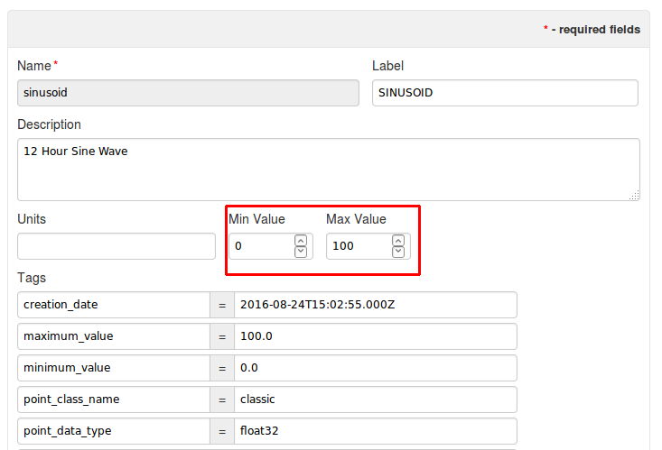

### Issue 3601

Fix added to support the execution of queries with arithmetic expressions nearly as fast as queries without such expressions:

```sql
select avg(value+0) from mpstat.cpu_busy
```

```sql
select avg(value) from mpstat.cpu_busy
```

### Issue 3592

The Trust SSL Certificate setting, when enabled, allows encrypted connections to LDAP servers with self-signed SSL certificates.

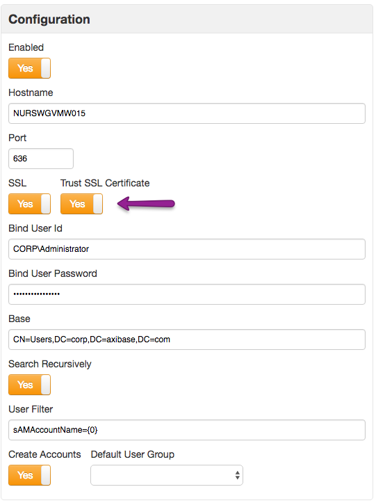

### Issue 3583

The new LDAP integration feature, **Create Accounts**, makes it possible to self-register user accounts in ATSD if the new user account exists in LDAP and the user is able to successfully
authenticate. The new account settings, such as username, email, and first/last name, are inherited from LDAP attributes.

If the **Default User Group** is specified, the new self-registered users are automatically added to this group and inherit its permissions.

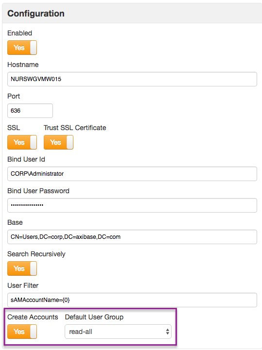

### Issue 3470

A new [`text` column](../../sql/examples/select-text-value.md) is available in the `SELECT` expression and the `WHERE` clause to display string annotations in the result set along with numeric values. Select the `text` column in a simple or `JOIN` query.

```sql
SELECT entity, datetime, value, text
  FROM atsd_series
WHERE metric IN ('temperature', 'status') AND datetime >= '2016-10-13T08:00:00Z'
```

```ls
| entity   | datetime             | value | text                           |
|----------|----------------------|-------|--------------------------------|
| sensor-1 | 2016-10-13T08:00:00Z | 20.3  | null                           |
| sensor-1 | 2016-10-13T08:15:00Z | 24.4  | Provisional                    |
| sensor-1 | 2016-10-13T10:30:00Z | NaN   | Shutdown by adm-user, RFC-5434 |
```

### Issue 3465

Added the new parameter `addMeta` to [series](../../api/data/series/query.md) and property methods
to ensure that clients can retrieve entity and metric fields and tags in one request, saving an additional round-trip. Another advantage is that the `addMeta` parameter does not require the user to
have a Meta API READ role.

Request:

```json
[{
  "startDate": "previous_minute",
  "endDate":   "now",
  "entity": "nurswgvml007",
  "metric": "cpu_busy",
  "addMeta": true
}]
```

Response:

```json
[{
  "entity":"nurswgvml007","metric":"cpu_busy","type":"HISTORY",
  "meta":{
    "metric":{"name":"cpu_busy","enabled":true,"dataType":"FLOAT","counter":false,"label":"CPU Busy %","persistent":true,"tags":{"source":"iostat","table":"System"},"timePrecision":"MILLISECONDS","retentionDays":0,"minValue":0.0,"maxValue":100.0,"invalidAction":"TRANSFORM","versioned":false,"interpolate":"LINEAR","timeZone":"US/Eastern"},
   "entity":{"name":"nurswgvml007","enabled":true,"timeZone":"PST","tags":{"alias":"007"},"interpolate":"LINEAR","label":"NURswgvml007"}
  },
  "data":[
    {"d":"2016-12-28T15:57:04.000Z","v":6},
    {"d":"2016-12-28T15:57:20.000Z","v":5.1},
    {"d":"2016-12-28T15:57:36.000Z","v":5}
  ]
}]
```

### Issue 3438

The Enterprise Edition now supports LDAP authentication to simplify and centralize credentials management in large organizations:


### Issue 3309

[https://github.com/axibase/grafana-data-source](https://github.com/axibase/grafana-data-source)

### Issue 3644

Implemented a new **Item List** type to load data from property records in ATSD. This allows automating monitoring and data collection jobs, for example, to TCP-check open ports for a
list of containers retrieved by the Docker job.

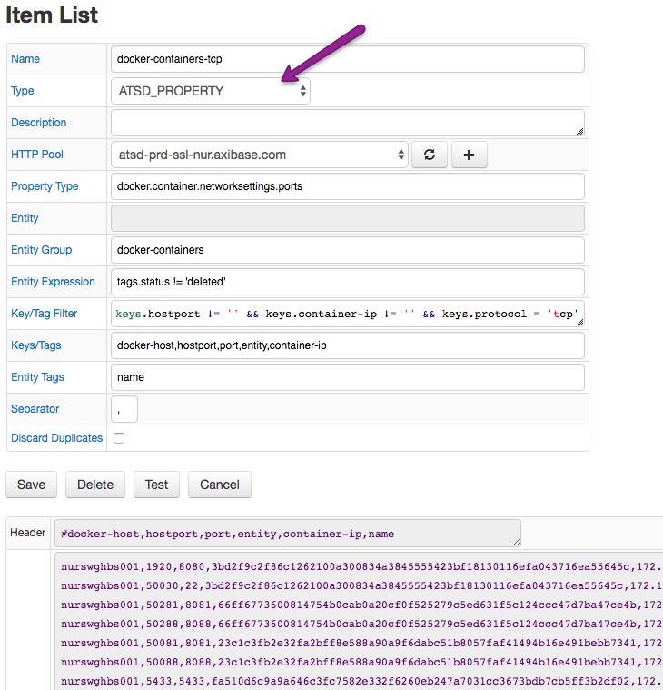

## Collector

### Issue 3717

While Axibase Collector gathers container properties and statistics using full Docker identifiers, it sends container names as entity labels into ATSD. This makes it possible to refer
to human-readable container names in graphs and alerts. There are however several orchestration frameworks which use container names to store their own identifiers, for
instance [Mesos](https://mesos.apache.org/):

* Mesos Container ID:

```json
"Id": "02cb3257b06ef11adc1b2633db55c94e2646f84e7b84cc665c28d710dc2f986c"
```

* Mesos Container Name:

```json
"Name": "/mesos-cd2d0996-558b-4a49-88a0-79c41aeb098a-S2.0a36b7d9-5dfc-4963-b8ac-0e7656103782"
```

In this case neither the container id nor the name are user-friendly or human-readable. To handle these kinds of scenarios, we added a small bit of heuristics to inherit the container
label from the `CONTAINER_NAME` environment variable which is set by Mesos.

As a result, the below container has a label `ref-api-front` instead of `mesos-cd2d0996-558b-4a49-88a0-79c41aeb098a-S2.0a36b7d9-5dfc-4963-b8ac-0e7656103782`.

Docker `inspect` snippet for a Mesos-managed container:

```json
"Env": [
           "JAVA_OPTS=-Xmx512m",
           "MARATHON_APP_VERSION=2016-11-18T10:55:00.823Z",
           "HOST=axinode12",
           "SPRING_PROFILES_ACTIVE=unstable",
           "MARATHON_APP_RESOURCE_CPUS=0.1",
           "SERVICE_NAME=ref-api",
           "MARATHON_APP_RESOURCE_GPUS=0",
           "SPRING_CLOUD_CONSUL_CONFIG_PROFILESEPARATOR=:",
           "TZ=GMT",
           "CONTAINER_NAME=ref-api-front",
           "SPRING_CLOUD_CONSUL_ENABLED=true",
           "SPRING_APPLICATION_NAME=ref-api-front",
           "WLS_SUFFIX=_rf",
           "SPRING_CLOUD_CONSUL_CONFIG_PREFIX=config/ref-api",
           "MARATHON_APP_DOCKER_IMAGE=docker.corp.example.org/ref-api-front:2.0.3",
           "WAS_SUFFIX=_rf",
           "SPRING_CLOUD_CONSUL_CONFIG_DEFAULTCONTEXT=commons",
           "MESOS_TASK_ID=ref-api-front.76d43a20-ad8d-13e6-a98e-bb1ee0814583",
           "LOGSTASH_PORT=5959",
           "WS_SUFFIX=_rf",
           "PORT=18745",
           "SERVICE_HOST=${HOST}",
           "MARATHON_APP_RESOURCE_MEM=512.0",
           "PORTS=18745",
           "SPRING_CLOUD_CONSUL_HOST=${HOST}",
           "MARATHON_APP_RESOURCE_DISK=0.0",
           "MARATHON_APP_LABELS=",
           "PORT_8080=18745",
           "MARATHON_APP_ID=/ref/api/api-front",
           "PORT0=18745",
           "MESOS_SANDBOX=/mnt/mesos/sandbox",
           "MESOS_CONTAINER_NAME=mesos-bvnd0996-567b-4a49-97a0-79c41aeb034a-S2.0a36b7d9-5dfc-4963-b8ac-0e7656103782",
           "PATH=/usr/local/sbin:/usr/local/bin:/usr/sbin:/usr/bin:/sbin:/bin",
           "HOME=/root",
           "JAVA_HOME=/usr/lib/jvm/java-8-oracle"
       ]
```

### Issue 3664

In Collector, added the following metrics for each active container. These metrics are collected only when the Docker command `TOP` is enabled.

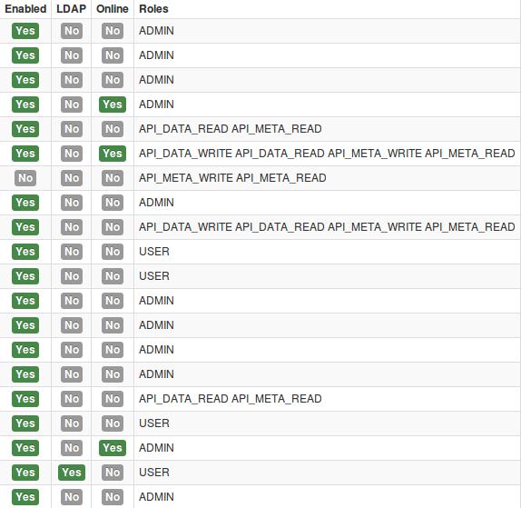

If the container is running in a prior iteration, and is not running in the next iteration, `0` is sent for both all and filtered metrics.

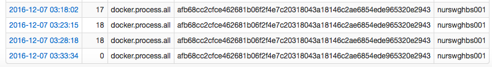

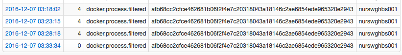

### Issue 3559

`METRIC` and `ENTITY` commands have been implemented in the JDBC job to allow you to configure collected metrics and entities in ATSD.

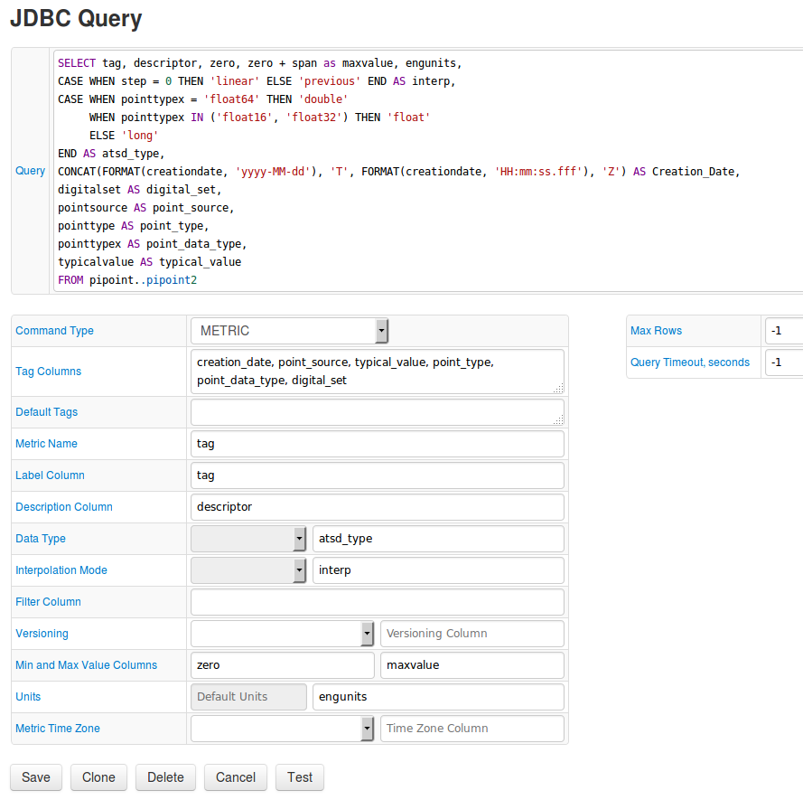

Additional web interface improvements on the JDBC configuration page:

* Tooltips added to help describe form fields.
* The number of iterated rows now does not exceed 1000 in a test run, even if the JDBC driver does not support setting the `maxRows` parameter.
* Unified number formatting: unnecessary zeroes in the fractional part of floating-point numbers are not shown.
* Metric names are converted to lower-case in line with ATSD schema.

As a result, PI tags can be retrieved using the JDBC job, and a [tutorial](https://axibase.com/docs/axibase-collector/jobs/examples/pi/export-metrics.html) is provided showing you how to configure the task.

#### PI Server Tag Information

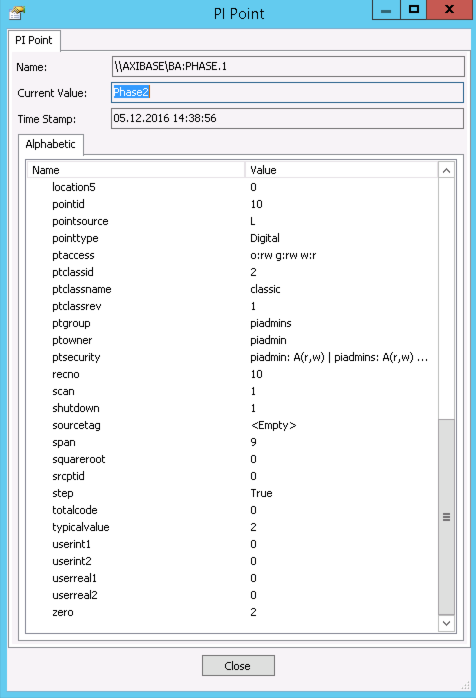

#### ATSD Metric Information

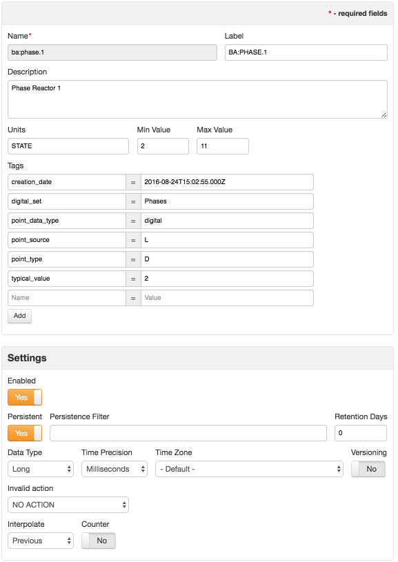