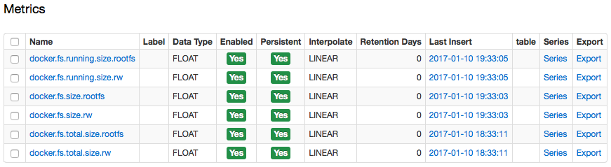

Weekly Change Log: January 09 - January 15, 2017
================================================

### ATSD

| Issue         | Category        | Tracker | Subject                                                                             |
|---------------|-----------------|---------|-------------------------------------------------------------------------------------|
| [3773](#issue-3773) | sql             | Bug     | Implemented rules for numeric precedence. If several metrics with different datatypes are queried, no data will be lost by api clients because of a lack of precision. |
| 3770 | api-rest        | Bug     | Removed exact match flags in series queries, which was resulting in empty result sets. |
| [3769](#issue-3769) | sql             | Bug     | Updated the `LOOKUP` function to accept series, entity, and metric tags as parameters. |
| [3768](#issue-3768) | sql             | Feature | Revised the `CONCAT` function to accept numeric arguments without `CAST`-ing. |
| [3767](#issue-3767) | sql             | Feature | Updated the `CAST` function to convert numeric arguments to strings. |
| [3764](#issue-3764) | sql             | Bug     | For created metrics without any data, updated the query response from NPE to return an empty result set. |
| [3763](#issue-3763) | sql             | Bug     | Updated the `SELECT 1` query to return exactly one column containing rows included in the `SELECT` expression. |
| [3480](#issue-3480) | api-rest        | Feature | Added support for text fields for series in HTTP API. |

### Charts

| Issue         | Category        | Tracker | Subject                                                                             |
|---------------|-----------------|---------|-------------------------------------------------------------------------------------|
| [3481](#issue-3481) | widget-settings | Feature | Updated `getTags` and `getSeries` requests for metadata for metrics and entities. Now tags or series can be provided in JSON format. | 
| [3078](#issue-3078) | widget-settings | Feature | Add new series query settings `exact-match` and `interpolate-extend`. |
| [2928](#issue-2928) | widget-settings | Feature | Changed setting name from `interpolate` to `fill-value`. |

### Collector

| Issue         | Category        | Tracker | Subject                                                                             |
|---------------|-----------------|---------|-------------------------------------------------------------------------------------|
| [3755](#issue-3755) | docker          | Feature | Added new metrics for the Docker container: `docker.fs.size.rw` and `docker.fs.size.rootfs`. | 
| 3752 | docker          | Bug     | Implemented the removal of old, stored properties (from a local database) for Docker entities when their most recent properties are being requested. Added the initialization of entity tags (container, status) when properties are being requested. | 
| 3734 | docker          | Bug     | Fixed issue with stopped container status not being instantly updated. | 
| 3733 | docker          | Bug     | Eliminated Docker lock, which resulted in the collection all statistics being stopped. |


### Issue 3769
--------------

Fixed the `LOOKUP` function so that now it can accept series, metric, and entity tags as parameters. 

```sql
SELECT datetime, value, metric, metric.tags.digital_set 
  ,LOOKUP('BatchAct', value) AS VAL
  ,LOOKUP(metric.tags.digital_set, value) AS VALTAG
FROM 'ba:active.1' 
  LIMIT 10
```

```ls
| datetime                 | value  | metric      | metric.tags.digital_set | VAL      | VALTAG   | 
|--------------------------|--------|-------------|-------------------------|----------|----------| 
| 2016-11-02T18:00:06.000Z | -65536 | ba:active.1 | BatchAct                | Inactive | Inactive | 
| 2016-11-02T18:10:06.000Z | -65537 | ba:active.1 | BatchAct                | Active   | Active   | 
```

### Issue 3768
--------------

Revised the `CONCAT` function to accept numeric arguments without `CAST`-ing. Multiple strings are able to be joined into a single string. This function accepts numeric values, 
which are converted to strings using a `#.##` pattern. 

```sql
SELECT datetime, value, metric, metric.tags.digital_set
,LOOKUP('pi-all', concat('BatchAct:', value))
FROM 'ba:active.1' 
  LIMIT 10
```

### Issue 3767
--------------

The `CAST` function transforms a string into a number, or a number into a string. `CAST`-ing numbers to strings is required so that you can pass numeric values as arguments into string 
functions for series that collect discrete codes. Applying `CAST` to string returns a string for a numeric value formatted with a `#.##` pattern.

```sql
SELECT datetime, value, metric, metric.tags.digital_set
  ,LOOKUP('pi-all', concat('BatchAct:', CAST(value as string)))
FROM 'ba:active.1' 
  LIMIT 10
```

### Issue 3763
--------------

Previously, the `SELECT 1` query only returned one row in a column. 

| 1 |
|---|

The `SELECT 1` query has been updated to return multiple rows in a single column included in the `SELECT` expression.

| 1 |
|---|
| 1 |

### Issue 3480
--------------

Support was added for the text field (named `x`) in HTTP API for series queries and insert requests. Previously, `t`, `d`, `v`, and `s` were the allowable inputs. Now ATSD is capable of 
processing and saving `x` as text for a series sample. The empty string `""` is also supported and will be stored as `""`. 

```ls
{"d":"2016-06-01T12:08:42Z", "x": "Shutdown"}
``` 
 
### Issue 3481
--------------

`getTags()` and `getSeries()` functions now make simultaneous request to `/api/v1/metrics/{metric}/series`, which is described in further detail in
 https://github.com/axibase/atsd-docs/blob/master/api/meta/metric/series.md
 
`getSeries()` returns a list of series from a given response (in JSON). `getTags()` processes a list of series from a given response and returns a list of unique values for the 
specified `tag`.

```ls
getTags( metric, tagName [, entity, [ , minInsertDate [ , maxInsertDate [ , url ] ] ] ] )
```

```ls
getSeries( metric, [, entity, [ , minInsertDate [ , maxInsertDate [ , url ] ] ] ] )
```

https://apps.axibase.com/chartlab/e452655a

### Issue 3078
--------------

Added new query settings `exact-match` and `interpolate-extend`. `exact-match` selects series with exactly the same `tags` as requested, with the default set to `false`. `interpolate-extend` 
adds missing periods at the beginning and the end of a selection interval, with the default also being `false`.

https://apps.axibase.com/chartlab/dada4561

### Issue 2928
--------------

To cut back on overloading, the `interpolate` setting was renamed to `fill-value`, which is an interpolation mode applied to computed series in case the values are irregularly spaced. 
If set to true, the missing samples are filled with interpolated values. When `fill-value` is set to the `interpolate` keyword, the missing value is linearly interpolated from the 
previous and preceding values.

https://apps.axibase.com/chartlab/e377b59a/3/

### Issue 3755
--------------

The following aggregate metrics for Docker container sizes were added:

* `docker.fs.total.size.rw`: the total size of all the files for all containers, in bytes. 
* `docker.fs.total.size.rootfs` - the size of the files which have been created or changed for all containers. 
* `docker.fs.running.size.rw` - the total size of all the files for all running containers, in bytes. 
* `docker.fs.running.size.rootfs` - the size of the files which have been created or changed for running containers. 

The following metrics are collected at the docker-host level.

https://apps.axibase.com/chartlab/81932cd6

The metrics are collected at 'Container Size Interval' for running containers and at 'Property Refresh Interval' for all containers.



### Issue 3773
--------------

```sql
SELECT datetime, entity, metric, value
 FROM atsd_series
WHERE metric IN ('tst-metric-short',
                'tst-metric-integer',
                'tst-metric-long',
                'tst-metric-float',
                'tst-metric-double',
                'tst-metric-decimal')
```                

### Issue 3764
--------------

```sql
SELECT * FROM test_new_metric_without_data
```