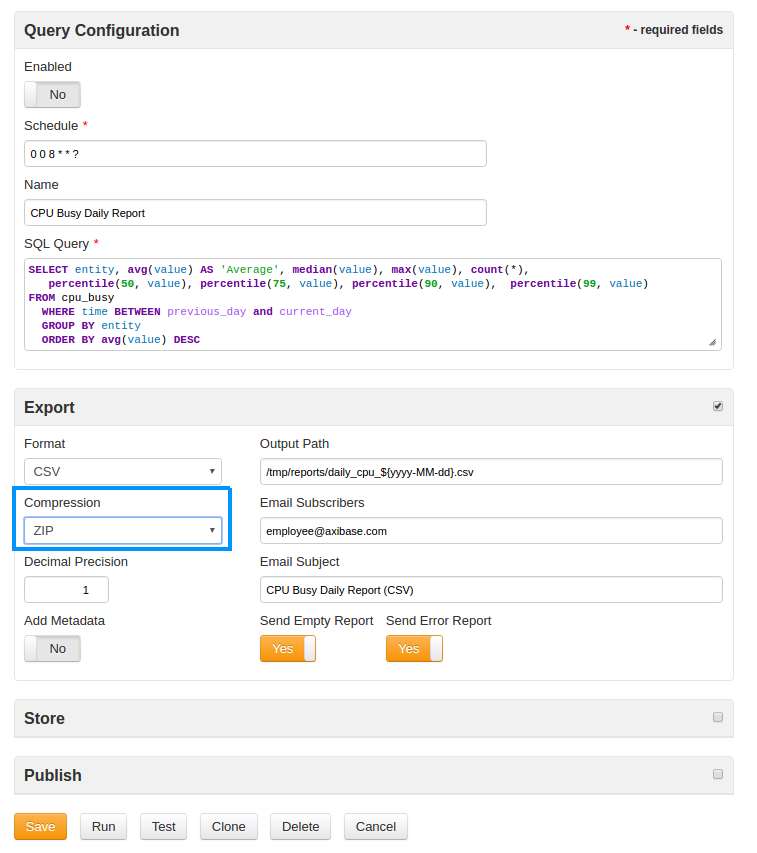

Weekly Change Log: July 24, 2017 - July 30, 2017
==================================================

### ATSD

| Issue| Category    | Type    | Subject              |
|------|-------------|---------|----------------------|
| 4419 | sql | Bug | IndexOutOfBoundsException fixed for queries that refer to a non-existent metric. |
| 4417 | sql | Bug | Fixed a NullPointerException in the [SQL Console](https://github.com/axibase/atsd/tree/master/api/sql#overview) |
| [4416](#Issue-4416) | api-network | Feature | `Invalid Action (a)` string field added to the [`metric`](https://github.com/axibase/atsd/blob/master/api/network/metric.md#metric-command) command
| 4413 | api-rest | Bug| ***** It looks like this issue was closed with no changes made ***** |
| 4403 | sql | Bug | Fixed an unexpected behavior when [`IN`](https://github.com/axibase/atsd/tree/master/api/sql#where-clause) clause is used with incorrect syntax. |
| 4377 | sql | Bug | Fixed an error which returned an extra empty column when wildcard option [`*`](https://github.com/axibase/atsd/tree/master/api/sql#match-expressions) is used with a pre-scheduled BI tools query. |
| [4361](#Issue-4361) | export | Feature | Enhanced support for .zip compression of scheduled query exports in the [SQL Console](https://github.com/axibase/atsd/tree/master/api/sql#overview) |
| 3918 | api-rest | Bug | ***** Data API: URL query returns no data with last=true ***** |

### ATSD

#### Issue 4416

**[`metric`](https://github.com/axibase/atsd/blob/master/api/network/metric.md#metric-command) Command Syntax**:

```css
metric m:{metric} b:{enabled} p:{data-type} l:{label} d:{description} i:{interpolate} u:{units} f:{filter} z:{timezone} v:{versioning} a:{invalid_action} min:{minimum_value} max:{maximum_value} t:{tag-1}={text} t:{tag-2}={text}
```

#### Issue 4361

Follow the path **Configuration** > **SQL Queries** to view this window, use the Compression dropdown menu to select ZIP.

