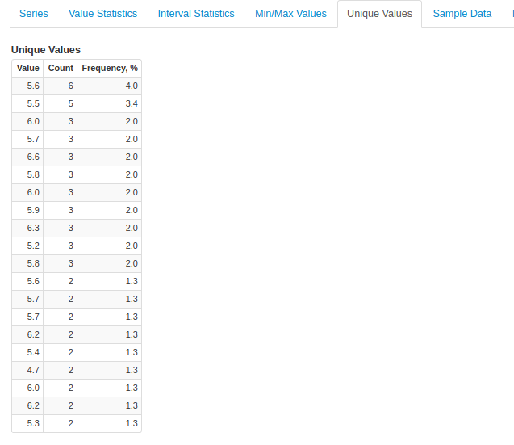

Weekly Change Log: August 07, 2017 - August 13, 2017
==================================================

### ATSD

| Issue| Category    | Type    | Subject              |
|------|-------------|---------|----------------------|
| 4470 | admin | Feature | Support added for the following [ATSD collected metrics](https://github.com/axibase/atsd/blob/master/administration/monitoring.md#collected-metrics): disk_TotalSpace, disk_UnallocatedSpace, disk_UsableSpace |
| 4467 | api-rest | Bug | ** Meta API: /api/v1/entity-groups/{group}/entities requires authentication ** |
| 4466 | metric | Bug | ** Network Command: Support missing fields in metric command ** |
| 4465 | metric | Bug | Fixed a bug which caused unexpected behavior when Transform was selected for [Invalid Action](https://github.com/axibase/atsd/blob/master/api/meta/metric/list.md#invalid-actions) through network command |
| 4464 | api-rest | Bug | ** Data API: slow series query with tag expression ** (It seems this ticket was closed with no modifications) |
| 4461 | sql | Bug | NullPointerException repaired when querying a defined [dictionary](https://github.com/axibase/atsd/tree/master/api/sql#lookup) |
| 4456 | security | Bug | ** Security: Dependencies with known security issues ** (I've never seen a security tag before, are these included in change logs?)|
| 4454 | api-rest | Bug | ** Data API: period align with YEAR unit ** | 
| 4453 | security | Bug | ** Security: User without permissions can see series on Search tab ** |
| 4446 | documentation | Bug | ** Replace HBase shell commands ** |
| 4445 | message | Bug | Fixed a bug which caused message retention to preform unexpected behavior |
| 4434 | security | Feature | ** Security: add option for admin to impersonate another account ** |
| 4424 | UI | Bug | Repaired an XML serialization encoding error for characters that are not UTF8 |
| 4407 | search | Bug | Repaired a memory error which caused unexpected shutdown of server slave nodes |
| [4386](#issue-4386) | sql | Feature | Support for querying datetime column using standard Timestamp format 'yyyy-MM-dd[ HH:mm:SS' added. |
| [4382](#issue-4382) | UI | Feature | Unique Values metric added to supported Series Statistics |

### ATSD

##### Issue 4386

##### Issue 4382

