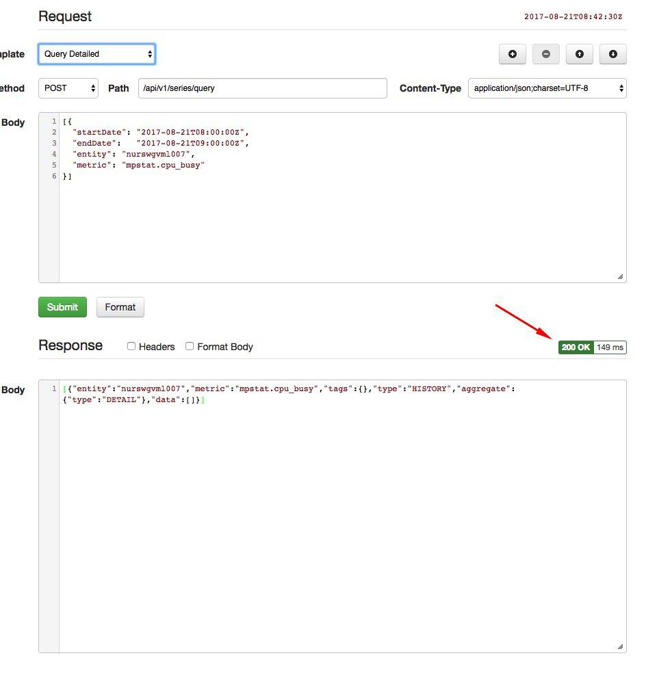

Weekly Change Log: August 14, 2017 - August 20, 2017
==================================================

### ATSD

| Issue| Category    | Type    | Subject              |
|------|-------------|---------|----------------------|
| 4498 | core | Bug | Handling added for TableExistsException to [clear Zookeeper cache](https://github.com/axibase/atsd/blob/master/administration/restarting.md#zookeeper-cache). |
| 4496 | entity_views | Bug | Fixed an error which created redundant and erroneous copies of entites upon intial ATSD startup. |
| 4494 | api-rest | Bug | ** SeriesQueryEntityExpressionTest: Illegal name ** |
| 4491 | UI | Bug | Pagination repaired for Entity Viewer |
| 4487 | core | Bug | ** atsd_d reporter fails ** |
| 4481 | core | Bug | Stack overflow repaired that occured if a parent template chain contains a loop |
| [4480](#issue-4480) | entity_views | Feature | `formatInterval` function enabled in Entity Views. |
| 4479 | UI | Bug | User Interface features standardized |
| 4478 | entity | Bug | Support for entity names containing commas added to **Entity Groups** input table. |
| [4476](#issue-4476) | api-rest | Feature | Support for [`limit`](https://github.com/axibase/atsd/tree/master/api/sql#limiting) function added to [forecast queries](https://github.com/axibase/atsd/blob/master/api/data/series/examples/query-named-forecast.md).
| [4460](#issue-4460) | UI | Feature | Execution time measured and reported by ATSD |
| 4450 | UI | Bug | Removed erroneous validation for ARIMA method in [forecast configuration](https://github.com/axibase/atsd/tree/master/forecasting#data-forecasting) |
| [4415](#issue-4415) | UI | Feature | Additional fields added to Group Editor |
| 4408 | UI | Bug | Bugs under the Metrics tab user interface repaired. |
| [4362](#issue-4362) | client | Feature | Support for HEAD method enabled in ATSD ** I can't find anything about the HEAD method in atsd docs please advise **. |
| 4317 | sql | Feature | Support enabled to publish [SQL Console](https://github.com/axibase/atsd/tree/master/api/sql) data to a defined URL. ** please advise on photo **|
| 4297 | sql | Feature | ** SQL: store query results as derived series ** |

### ATSD

#### Issue 4480:

Follow the path **Configuration** > **Entity Views**, open an entity view:


The Formatting column supports string expressions of time such as the following:

```ls
formatInterval(elapsedTime(value)) + " ago"
```

#### Issue 4467:

Sample forecast query:

```ls
[{"entity":"nurswgvml007","metric":"cpu_busy","type":"FORECAST","startDate":"2016-10-01T00:00:00Z","endDate":"2016-11-01T00:00:00Z", "limit": 1}]
```

The Limit setting controls the number of sample contained in the returnset.

#### Issue 4460:



Query execution time highlighted above.

#### Issue 4415

Newly supported fields:

* Enabled
* Units
* Min Value
* Max Value
* Time Zone
* Versioning
* Interpolate


#### Issue 4362


