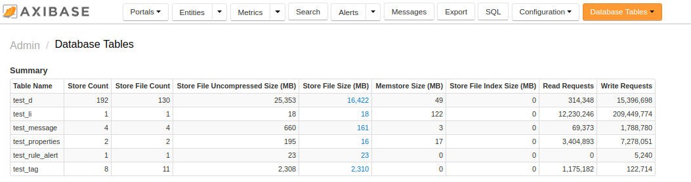

Weekly Change Log: May 22, 2017 - May 28, 2017
==================================================

### ATSD

| Issue| Category    | Type    | Subject              |
|------|-------------|---------|----------------------|
| [4532](#issue-4532) | security | Feature | Guest access option enabled for portals to allow unauthenticated users the ability to view selected portals via a direct URL, for example. |
| 4531 | api-rest | Bug | Bug fixed whereby message inserts were displayed as series commands. |
| 4528 | statistics | Bug | ** Series Statistics: schedule is incorrect ** |
| [4525](#issue-4525) | UI | Feature | Summary Table added to "Database Tables" page, helpful for monitoring and measuring compression. |
| 4519 | core | Feature | ** License: compression ** |
| 4503 | UI | Bug | Data modification disabled for non-authenticated users. |
| 4502 | sql | Bug | Add the `encodeTags` parameter to [SQL Console](https://github.com/axibase/atsd/tree/master/api/sql) |
| 4477 | core | Feature | ** Coprocessor configuration ** |
| 4410 | Bug | Java API | ** Client: metric and series issues ** |
| 4351 | jdbc | Feature | ResultSet extended with `getTags()` method. |

### ATSD

#### Issue 4532

Follow the path **Configuration** > **Portals** to the list of portal configurations. In a given portal configuration, the
"Guest Access" check box controls unauthenticated access to a desired portal.

#### Issue 4525

Follow the path **Configuration** > **Database Tables** to view the Summary Table. 

