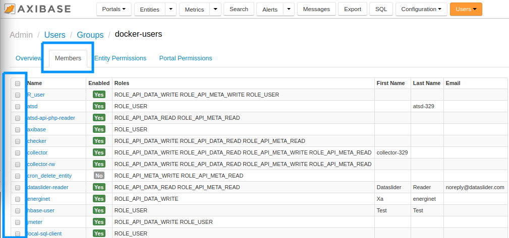
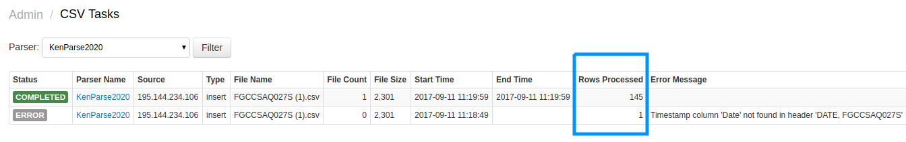

Weekly Change Log: September 04, 2017 - September 10, 2017
==================================================

### ATSD

| Issue| Category    | Type    | Subject              |
|------|-------------|---------|----------------------|
| 4545 | sql | Bug | Support added for standard [wildcards](https://github.com/axibase/atsd/tree/master/api/sql#match-expressions) |
| 4537 | search | Bug | Fixed an IndexNotFoundException to return a warning statement instead. |
| 4536 | core | Bug | Development mode flag |
| [4533](#issue-4533) | UI | Feature | User Group Membership form refactored to include adding/removing members with newly-added checkbox. |
| 4524 | core | Feature | Manually trigger a collection of table_size metric | **
| 4516 | core | Feature | Coprocessor validation at startup | **
| 4511 | UI | Feature | Entity Views: format functions |
| 4506 | security | Bug | Bug fixed which allowed unauthorized users to preform data exports. |
| 4501 | UI | Bug | UI: Format stack trace in SQL console |
| 4488 | csv | Bug | CSV Parser: fixed length split broken |
| 4307 | sql | Bug | Error fixed which caused dates occurring before January 1, 1970 (Epoch Date) to be read and ordered incorrectly. |
| 4235 | api-rest | Feature | New aggregators added to [Grouping Functions](https://github.com/axibase/atsd/blob/master/api/data/series/group.md#grouping-functions) |
| [3422](#issue-3422) | sql | Feature | Support for `GROUP BY` entity tag |
| [3303](#issue-3303) | sql | Feature | Results of scheduled queries now include the option to be stored as a new series. |
| 3203 | sql | Feature | Support for series value number filtering added |
| 2792 | api-rest | Bug | `counter` field deprecated. | **
| 2627 | UI | Bug | Change url paths as in breadcrumb | **
| 2605 | UI | Bug | UI: CSV parser issues | **
| 2595 | data-in | Feature | Storage drivers: atsd-url | **
| 2264 | entity | Bug | entity-group fields make empty after save | **
| 2263 | entity | Bug | entity group incorrect expression: http error 500 | **
| 2176 | security | Feature | Multitenancy support | **
| [2060](#issue-2060) | rule engine | Feature | Several currentTime functions added to [Rule Engine](https://github.com/axibase/atsd/tree/master/rule-engine#rule-engine) |
| 1844 | export | Feature | Result filter added to export options. |
| 1749 | UI | Bug | Metrics List page optimized to avoid potential OOM error. |
| [1202](#issue-1202) | csv | Feature | CSV Task Page updated to include the number of rows read, and number of rows skipped. |
| 1052 | data-in | Feature | Derived metrics can now be computed from incoming metrics	|

### ATSD

#### Issue 4533:

Group membership can be modified using the checkbox at the left of the screen, under the **Members** Tab.



#### Issue 3422:

Sample syntax:

```sql
SELECT datetime, entity.tags.environment, count(value)
  FROM cpu_busy
WHERE datetime > previous_hour
  GROUP BY entity.tags.environment
```

#### Issue 3303:

Create a series with the metric name `hourly_average`, entity `all-servers`, and series tag `source-metric`.

```sql
SELECT previous_hour, avg(value) as hourly_average, 'all-servers', metric AS "source-metric"
FROM cpu_busy WHERE datetime >= previous_hour and datetime < current_hour
```

#### Issue 2060:

New `currentTime` functions are:

* `currentSecond()`: Returns the value of the `SECOND` field (0 to 59)
* `currentMinute()`: Returns the value of the `MINUTE` field (0 to 59)
* `currentHour()`: Returns the value of the `HOUR_OF_THE_DAY` field (0 to 23)
* `currentDay()`: Returns the value of the `DAY_OF_THE_MONTH` field (0 to a maximum 31)
* `currentDayOfWeek()`: Returns the value of the `DAY_OF_THE_WEEK` field (1 = Monday, 7 = Sunday)
* `currentMonth()`: Returns the value of the `MONTH` field (1 = January, 12 = December)


#### Issue 1202:

Follow the path **Admin** > **CSV Tasks** to view active CSV reports.


