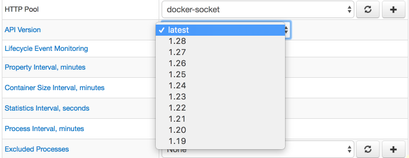
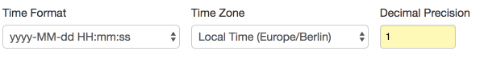
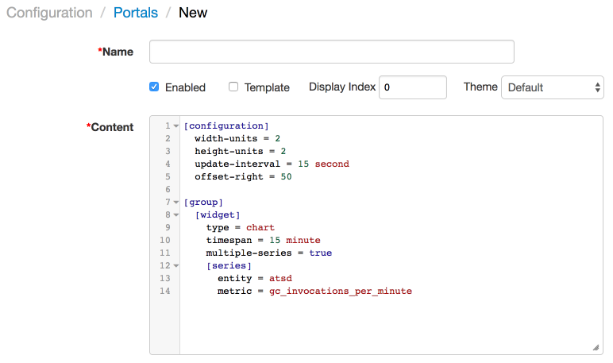
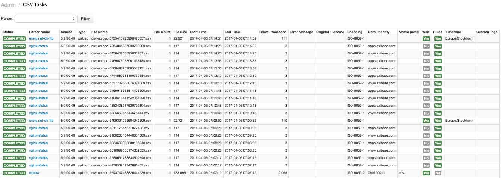
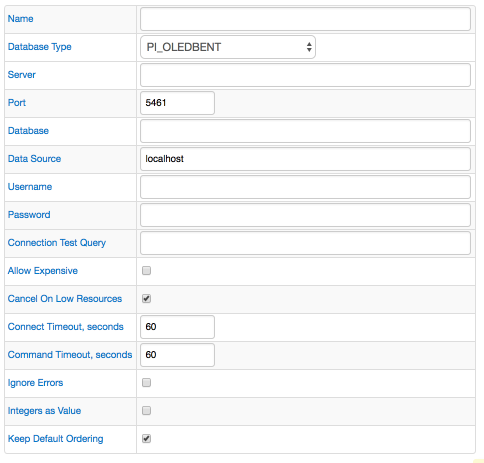
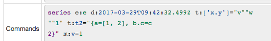
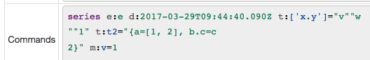
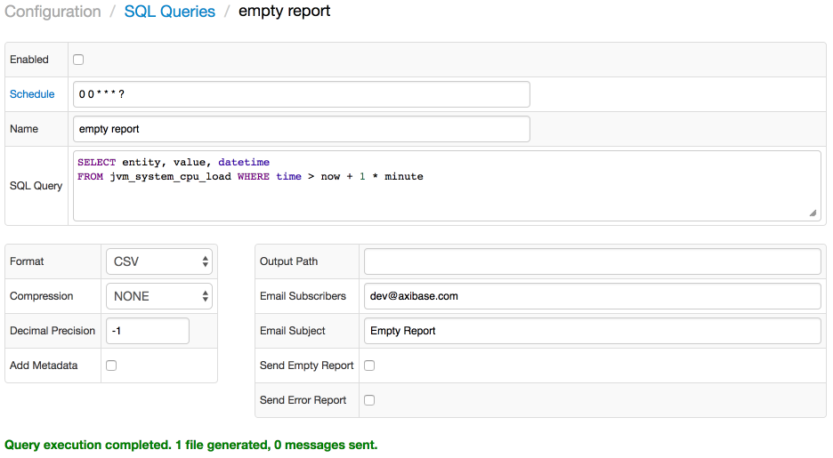
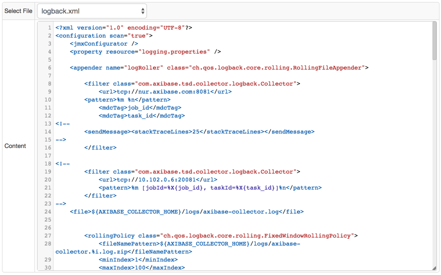

# Monthly Change Log: April 2017

## ATSD

| Issue| Category    | Type    | Subject                                                             |
|------|-------------|---------|---------------------------------------------------------------------|
| [4085a](#issue-4085a) | UI | Feature | Add date formatting options in the [SQL Console](../../sql/sql-console.md). |
| 4085b | UI | Feature | Implement client-side number and date formatting in the [SQL Console](../../sql/sql-console.md) to avoid reloading the result set. |
| 4148 | UI | Bug | Fix formatting errors in the [SQL Console](../../sql/sql-console.md) related to `datetime` columns incorrectly qualified as numeric. |
| 4137 | UI | Bug | Fix parsing of non-numeric values in the [SQL Console](../../sql/sql-console.md). |
| 4114 | UI | Bug | Add a prefix to custom query names stored in local storage by the **Data > API Client**.  |
| 4119 | api-rest | Bug | Optimize [series query](../../api/data/series/query.md) with `limit = 1` and `entity = "*"`. |
| [4134](#issue-4134) | portal | Feature | Add boilerplate charge configuration code new portals. |
| 4120 | sql | Bug | Speed up queries with `PREVIOUS` interpolation. |
| 4102 | jdbc | Feature | Add support for BOOLEAN data type in ATSD JDBC driver. |
| 4101 | sql | Bug | Enforce 1970-01-01 UTC as the minimal interval start for [PERIOD](../../sql/README.md#period) function. |
| [4100](#issue-4100) | sql | Feature | Add support for custom time zones in [PERIOD](../../sql/README.md#period) aggregation.  |
| 4096 | UI | Bug | Fix HTML escaping on the **CSV Parsers** page. |
| 4064 | core | Support | Deprecate the `logging.properties` configuration file. |
| 4052 | sql | Bug | Return human-readable errors for queries with unsupported syntax. |
| [4050](#issue-4050) | sql | Feature | Add the [`date_parse`](../../sql/README.md#date_parse) function to parse literal timestamp string into milliseconds in Unix time. |
| 4039 | sql | Bug | Improve performance for queries with no entity specified in the `WHERE` clause. |
| [4032](#issue-4032) | sql | Feature | Add support for [`LEAD`](../../sql/README.md#lead) and [`LAG`](../../sql/README.md#lag) functions in the `SELECT` expression. |
| 4031 | UI | Feature | Add syntax highlighting to the `Data Entry` text area. |
| 4020 | sql | Feature | Support implicit conversion to number in function arguments and `WHERE` clauses. |
| 3998 | email | Bug | Add context information to error log on email send error. |
| [3993](#issue-3993) | sql | Feature | Add the [`CORREL`](../../sql/README.md#correl) function to calculate the Pearson correlation between two series. |
| [3991](#issue-3991) | sql | Feature | Extend the `BETWEEN` operator to work with any literal values. |
| 3939 | sql | Bug | Fix error with missing result rows in `JOIN USING ENTITY` query after inserting new series. |
| 3935 | sql | Bug | Improve performance of queries with several [`JOIN USING ENTITY`](../../sql/README.md#join-syntax) clauses. |
| 3856 | sql | Feature | Support implicit conversion to number in the `LAST` and `FIRST` aggregation functions. |
| [2911](#issue-2911) | UI | Feature | Show user-specified parameters on the **Data > CSV Tasks** page. |
| [3739](#issue-3739) | sql | Feature | Add options for sending empty or failed results for scheduled SQL reports. |
| 2880 | UI | Bug | Add HTML-escaping for all forms in the web interface. |
| 4000 | sql | Bug | Standardize `NaN` and `NULL` processing in aggregation functions: [`min_value_time`](../../sql/README.md#aggregation-functions) and [`max_value_time`](../../sql/README.md#aggregation-functions). |
| [4057](#issue-4057) | sql | Feature | Add support for conditions containings multiple expressions in `CASE`. |
| [4083](#issue-4083) | sql | Feature | Allow `metric LIKE` condition in [`atsd_series`](../../sql/README.md#atsd_series-table) queries. |
| 4082 | sql | Bug | Fix issued with failing query cancellation requests. |
| 4081 | api-network | Bug | Fix processing of commands with multiline text containing lines starting with `time` keyword. |
| 4075 | sql | Bug | Optimize queries with [`metrics()`](../../sql/README.md#metrics) function by pushing down predicates into the subquery. |
| 4079 | sql | Bug | Metric/entity `timeZone` field must return time zone name instead of toString output. |
| 4067 | sql | Bug | [`SELECT 1`](../../sql/api.md#connection-query) query fails to return both header row and one data row. |
| 4074 | sql | Bug | Fix NullPointerException when ordering by `null` tag with [`ROW_MEMORY_THRESHOLD 0`](../../sql/README.md#row_memory_threshold-option) option |
| 4066 | log_aggregator | Bug | Eliminate duplicate log aggregator instances when logback configuration is reloaded.  |
| 4070 | sql | Bug | Optimize processing of `OR datetime` condition. |
| [4060](#issue-4060) | sql | Feature | Add support for [`LAG`](../../sql/README.md#lag) and [`LEAD`](../../sql/README.md#lead) functions in the `BETWEEN` operator. |
| 4058 | sql | Bug | Fix NullPointerException in partitioned [`OUTER JOIN`](../../sql/README.md#outer-join) queries with externally sorted results. |
| 4047 | sql | Bug | Fix error raised when using `IN` operator in `WHERE` condition containing [`LAG`](../../sql/README.md#lag) and [`LEAD`](../../sql/README.md#lead) functions. |
| 4051 | rule engine | Feature | Rename `date` function to [date_parse](../../rule-engine/functions-date.md#date_parse). |
| 4069 | sql | Bug | Fix interpolation issues in queries with overlapping periods. |

---

## Charts

| Issue| Category    | Type    | Subject                                                             |
|------|-------------|---------|---------------------------------------------------------------------|
| 4126 | box | Feature | Add **Last** to the tooltip in box chart |
| 4122 | widget-settings | Bug | Remove colon suffix in labels when `add-meta` is used and `legend-last-value = false` |
| [4043](#issue-4043) | widget-settings | Bug | Fix color assignment for wildcard series. |
| [3850](#issue-3850) | widget-settings | Bug | Fix `end-time` calculation to increment month if it has fewer days than the current month. |

---

## Collector

| Issue| Category    | Type    | Subject                                                             |
|------|-------------|---------|---------------------------------------------------------------------|
| 4095 | socrata | Bug | Fix Collector freeze while processing malformed JSON files.  |
| 4092 | docker | Bug | Skip file system metric collection for stopped containers. |
| 4090 | jdbc | Bug | Avoid logging error if `InterpolateType` value is `NULL`. |
| 4078 | core | Bug | Fix parsing `series` commands with '=' symbol in the text field.  |
| 4061 | file | Bug | Save error messages if FTP connection fails. |
| [4063](#issue-4063) | core | Feature | Implement a configuration file editor with syntax highlighting. |
| 4036 | jdbc | Bug | Fix column order in Test SQL result table. |
| [4094](#issue-4094) | docker | Feature | Upgrade supported Remote API versions from 1.21 to 1.28.  |
| 4048 | jdbc | Bug | Allow import of job XML files without a data source. |
| 4046 | jdbc | Bug | Consolidate `series` commands with the same time and different metrics into one command. |
| 4045 | file | Bug | Fix NullPointerException in case of FTP connection timeout. |
| [4041](#issue-4041) | data-source | Feature | Add the `PI OLEDB Enterprise` data source. |
| [4012](#issue-4012) | json | Feature | Add syntax highlighting to the **Custom Commands** text area and improve the ATSD network commands highlighting. |
| 3987 | socrata | Bug | Add heuristics to automatically classify and ignore fields in Socrata data sources. |
| 3973 | collection | Feature | Add the `URL` Item List type. |
| 4044 | docker | Bug | Handle HTTP request timeouts for Unix socket. |

---

### Issue 4100

```sql
SELECT datetime,
  date_format(time, "yyyy-MM-dd HH:mm:ss", "Europe/Vienna") AS local_datetime,
  MIN(value), MAX(value)
FROM m1
  GROUP BY PERIOD(1 DAY, "Europe/Vienna")
```

### Issue 4094



### Issue 4085a



### Issue 4134



### Issue 4057

```sql
SELECT entity, datetime, value,
CASE entity
  WHEN 'nurswgvml006' OR 'nurswgvml007' THEN '00'
  ELSE 'Unknown'
END AS 'ent'
FROM cpu_busy
WHERE datetime >= previous_minute
```

### Issue 4083

```sql
SELECT entity, metric, datetime, value
  FROM atsd_series
WHERE metric LIKE 'cpu_*'
  AND datetime >= CURRENT_HOUR
ORDER BY datetime
```

### Issue 4060

```sql
SELECT datetime, LAG(value), value, LEAD(value)
  FROM cpu_busy
WHERE entity = 'nurswgvml007'
  AND datetime BETWEEN '2017-04-02T14:19:15Z' AND '2017-04-02T14:21:15Z'
  AND value BETWEEN LAG(value) AND LEAD(value)
```

### Issue 4050

The `date_parse` function parses the literal timestamp string into Unix time with millisecond granularity.

```javascript
date_parse(string datetime[, string time_format[, string time_zone]])
```

* The default `time_format` is [ISO format](../../shared/date-format.md): `yyyy-MM-dd'T'HH:mm:ss.SSSZZ`.
* The default `time_zone` is the server time zone.

```java
/* Parse date using the default ISO format.*/
date_parse("2017-03-31T12:36:03.283Z")

/* Parse date using the ISO format, without milliseconds */
date_parse("2017-03-31T12:36:03Z", "yyyy-MM-dd'T'HH:mm:ssZZ")

/* Parse date using the server time zone. */
date_parse("31.03.2017 12:36:03.283", "dd.MM.yyyy HH:mm:ss.SSS")

/* Parse date using the offset specified in the timestamp string. */
date_parse("31.03.2017 12:36:03.283 -08:00", "dd.MM.yyyy HH:mm:ss.SSS ZZ")

/* Parse date using the time zone specified in the timestamp string. */
date_parse("31.03.2017 12:36:03.283 Europe/Berlin", "dd.MM.yyyy HH:mm:ss.SSS ZZZ")

/* Parse date using the time zone provided as the third argument. */
date_parse("31.01.2017 12:36:03.283", "dd.MM.yyyy HH:mm:ss.SSS", "Europe/Berlin")

/* Parse date using the UTC offset provided as the third argument. */
date_parse("31.01.2017 12:36:03.283", "dd.MM.yyyy HH:mm:ss.SSS", "+01:00")

/* Time zone (offset) specified in the timestamp must be the same as provided in the third argument. */
date_parse("31.01.2017 12:36:03.283 Europe/Berlin", "dd.MM.yyyy HH:mm:ss.SSS ZZZ", "Europe/Berlin")
```

### Issue 4032

```sql
SELECT date_format(datetime, 'yyyy') AS 'Date',
  SUM(value) AS 'Current Period',
  LAG(SUM(value)) AS 'Previous Period',
  SUM(value)-LAG(SUM(value)) AS 'Change',
  round(100*(SUM(value)/LAG(SUM(value))-1),1) AS 'Change, %'
FROM 'cc.cases-by-primary-type'
  WHERE tags.etype = 'OUTAGE'
GROUP BY entity, tags.etype, period(1 year)
```

| Date | Current Period | Previous Period | Change | Change, % |
|------|----------------|-----------------|--------|-----------|
| 2001 | 654            | `null`            | `null`   | `null`      |
| 2002 | 650            | 654             | -4     | -0.6      |
| 2003 | 590            | 650             | -60    | -9.2      |

### Issue 3993

```sql
SELECT tu.entity,
  CORREL(tu.value, ts.value) AS 'CORR-user-sys',
  CORREL(tu.value, tw.value) AS 'CORR-user-iowait',
  CORREL(ts.value, tw.value) AS 'CORR-sys-iowait',
  stddev(tu.value),
  stddev(ts.value),
  stddev(tw.value)
FROM mpstat.cpu_user tu JOIN mpstat.cpu_system ts JOIN mpstat.cpu_iowait tw
WHERE tu.datetime >= NOW - 5 * MINUTE
GROUP BY tu.entity
```

```ls
| tu.entity    | CORR-user-sys | CORR-user-iowait | CORR-sys-iowait | stddev(tu.value) | stddev(ts.value) | stddev(tw.value) |
|--------------|---------------|------------------|-----------------|------------------|------------------|------------------|
| nurswgvml007 | 0.92          | NaN              | NaN             | 7.64             | 2.50             | 0.00             |
| nurswgvml006 | -0.13         | 0.10             | 0.27            | 7.26             | 0.60             | 2.57             |
| nurswgvml010 | 0.76          | -0.09            | 0.03            | 7.42             | 0.44             | 1.10             |
| nurswgvml502 | 0.59          | -0.14            | -0.08           | 0.53             | 0.53             | 0.59             |
| nurswgvml301 | -0.17         | -0.11            | -0.17           | 0.32             | 0.42             | 0.64             |
```

### Issue 3991

```sql
SELECT t1.datetime, t1.tags,
  t1.value as 'wind power',
  t2.value as 'sun power',
  t1.value + t2.value as total
FROM wind_power_production t1 JOIN "solar_cell_production_(estimated)" t2
WHERE t1.tags.name LIKE 'DK*st'
  AND t1.datetime >= '2016-06-01T00:00:00.000Z'
  AND date_format(t1.time, 'HH') between '09' AND '17'
LIMIT 10
```

```ls
| t1.datetime | t1.tags | wind power | sun power | total |
|-------------|---------|------------|-----------|-------|
| 2016-12-13T09:00:00.000Z | name=DK-West | 443.4 | 3 | 446.4 |
| 2016-12-13T09:00:00.000Z | name=DK-East | 123.5 | 2 | 125.5 |
| 2016-12-13T10:00:00.000Z | name=DK-West | 441.1 | 10 | 451.1 |
| 2016-12-13T10:00:00.000Z | name=DK-East | 116.6 | 5 | 121.6 |
| 2016-12-13T11:00:00.000Z | name=DK-West | 456.6 | 18 | 474.6 |
| 2016-12-13T11:00:00.000Z | name=DK-East | 104.1 | 7 | 111.1 |
| 2016-12-13T12:00:00.000Z | name=DK-West | 440.5 | 24 | 464.5 |
| 2016-12-13T12:00:00.000Z | name=DK-East | 64.7 | 6 | 70.7 |
| 2016-12-13T13:00:00.000Z | name=DK-West | 402.4 | 21 | 423.4 |
| 2016-12-13T13:00:00.000Z | name=DK-East | 65.6 | 5 | 70.6 |
```

### Issue 2911



### Issue 4041



### Issue 4012

| Before | After |
|--------|-------|
| |  |

### Issue 3850

[ChartLab](https://apps.axibase.com/chartlab/55840d5c/2/)

### Issue 3739



### Issue 4063



### Issue 4043

[ChartLab](https://apps.axibase.com/chartlab/bbc5e671/5/)