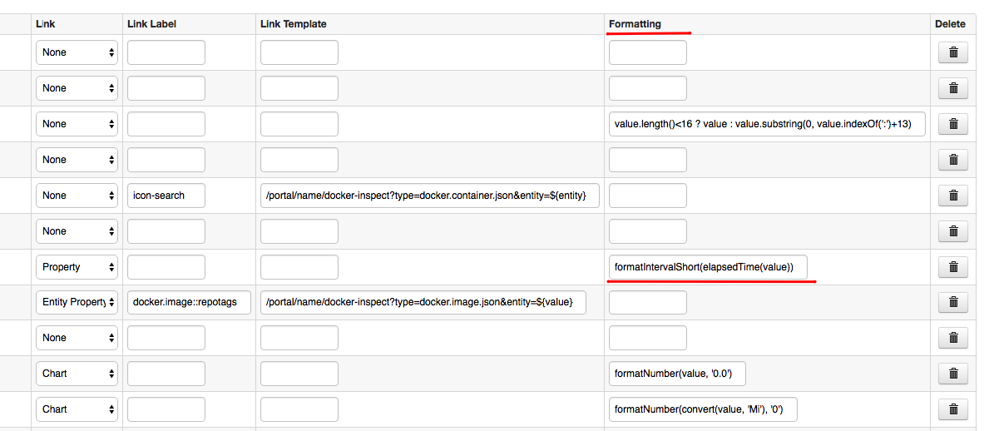
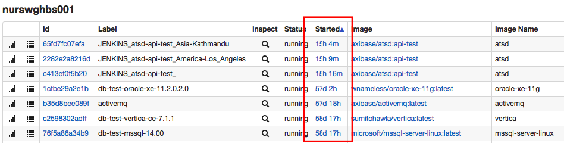
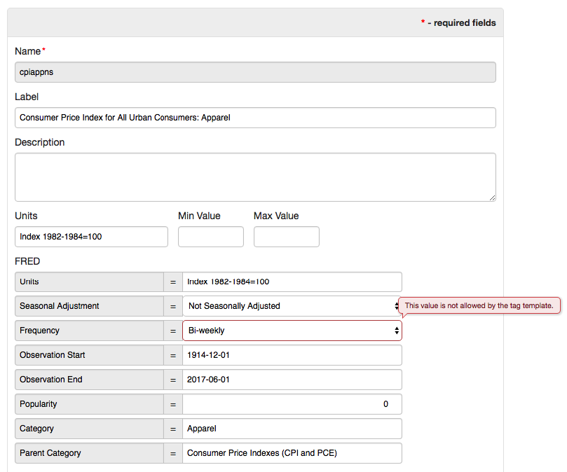
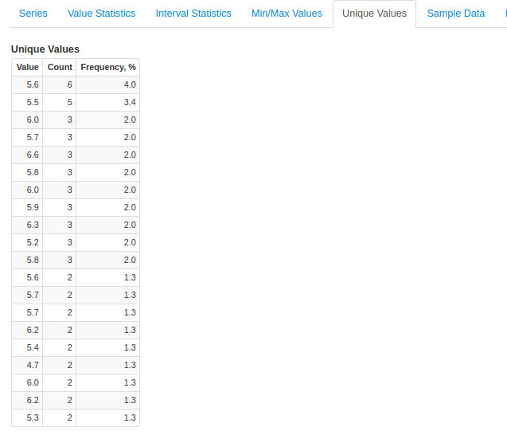
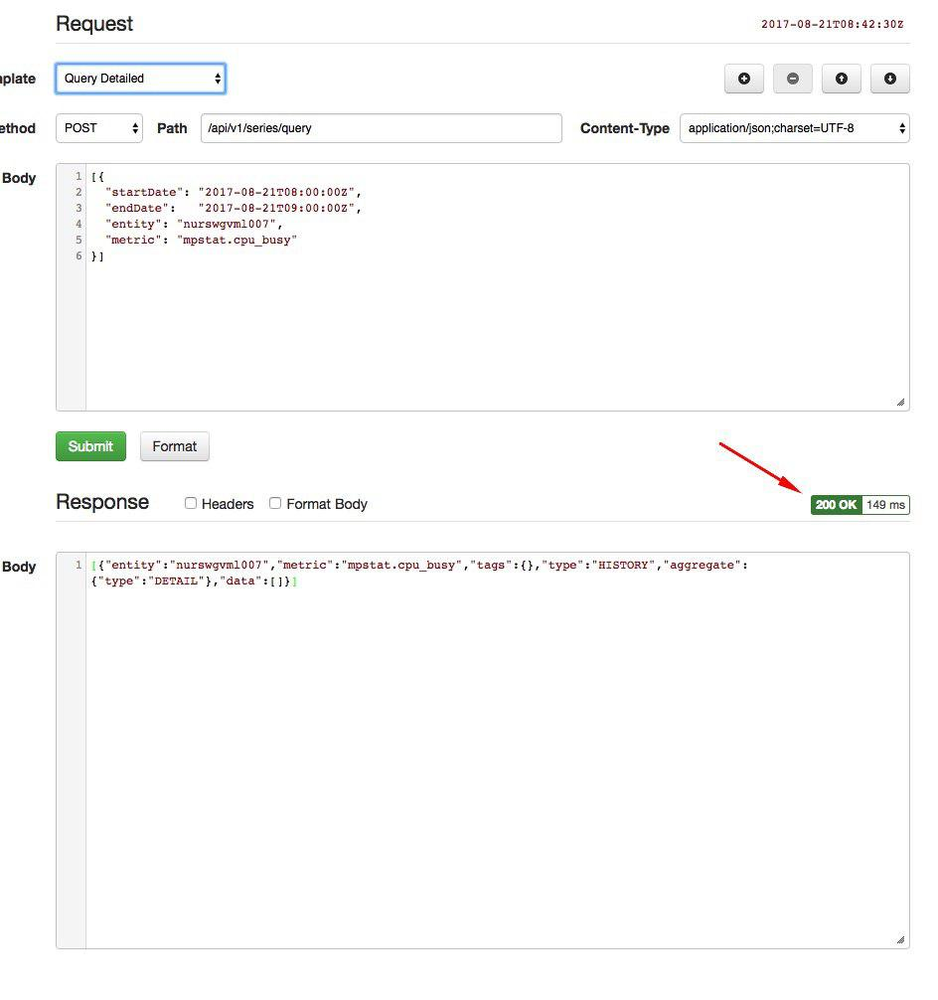
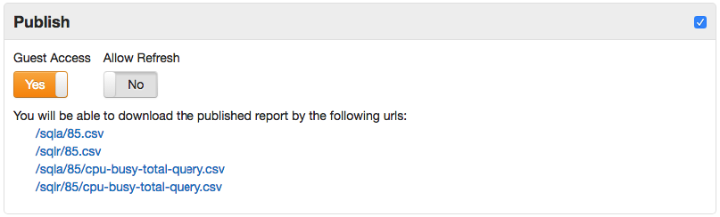
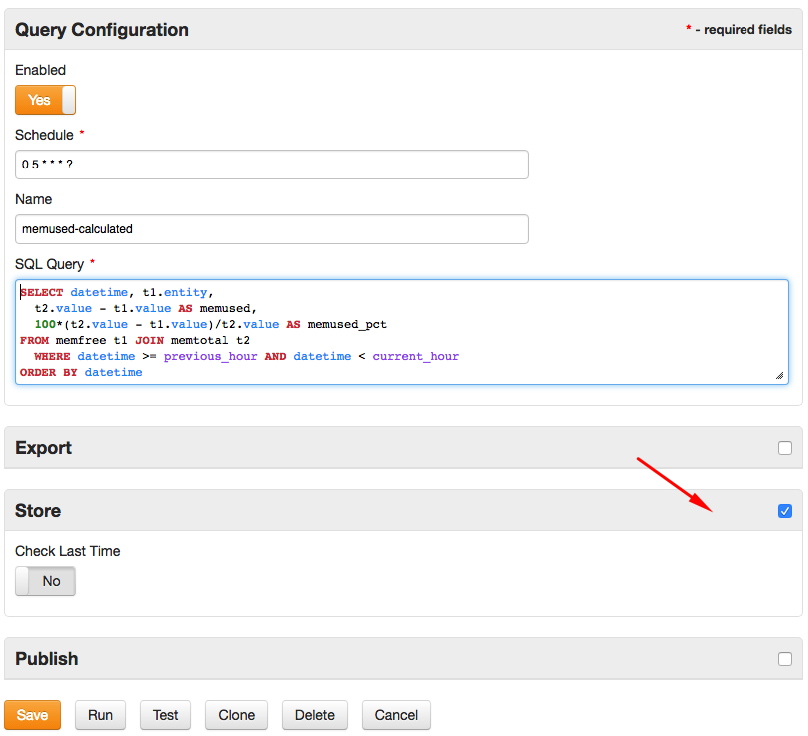

# Monthly Change Log: August 2017

## ATSD

| Issue| Category    | Type    | Subject              |
|------|-------------|---------|----------------------|
| 4512 | core | Bug | Normalize compression algorithm names supported by <br>`hbase.compression.type` and `hbase.compression.type.raw` settings: `none`, `gz`, `lzo`. |
| 4493 | core | Bug | Fixed an issue with region boundaries in the [Migration Reporter](../../administration/migration/reporter.md). |
| 4498 | core | Bug | Added warning if Zookeeper returns TableExistsException which requires clearing [Zookeeper cache](../../administration/restarting.md#invalid-zookeeper-cache). |
| 4496 | entity_views | Bug | Fixed an error which created duplicate entity views on each database start. |
| 4481 | core | Bug | Fixed an error caused by a parent tag template referencing a child tag template in a loop. |
| [4480](#issue-4480) | entity_views | Feature | Implement `formatInterval` and `formatIntervalShort` [functions](../../rule-engine/functions-date.md) in Entity Views. |
| 4479 | UI | Bug | Fix multiple UI issues with tag templates. |
| 4478 | entity | Bug | Add support for entity names containing commas in **Entity Group** editor. |
| [4476](#issue-4476) | api-rest | Feature | Apply [`limit`](../../sql/README.md#limiting) parameter when querying [forecast](../../api/data/series/examples/query-named-forecast.md) data.
| 4470 | administrator | Feature | Collect disk usage [metrics](../../administration/monitoring.md#collected-metrics) from the server where ATSD is installed. |
| 4467 | api-rest | Feature | Allow access to [entity group list](../../api/meta/entity-group/get-entities.md) method if API guest access is enabled. |
| 4466 | metric | Bug | Add support for `timePrecision`, `persistent`, `retentionIntervalDays` fields in the [metric](../../api/network/metric.md) command. |
| 4465 | metric | Bug | Add validation for [Invalid Action](../../api/meta/metric/list.md#invalid-actions) field in the [metric](../../api/network/metric.md) command. |
| [4464](#issue-4464) | api-rest | Feature | Speed up series queries with [tag expressions](../../api/data/series/query.md#tag-filter) such as `tags.mount_point LIKE '/*'`. |
| 4456 | security | Feature | Update ATSD dependencies (used packages and libraries) to resolve known security issues in `netty`, `Spring`, `httpclient`, `xstream`, `commons-fileupload`. |
| 4452 | UI | Bug | Fix response body formatting in the built-in API client. |
| 4443 | email | Bug | Add support for UTF-8 characters in email subjects. |
| 4435 | UI | Feature | Display alert message on Users and Entity Group pages if `api.guest.access.enabled` is enabled. |
| 4433 | UI | Bug | Fix **Delete** button in the portal editor. |
| 4432 | installation | Bug | Read hostname from `/proc/sys/kernel/hostname` if the hostname command is not installed on the Linux server. |
| 4428 | installation | Bug | Set file ownership to `axibase:axibase` instead of `axibase:root` when installing ATSD from deb/rpm package. |
| 4421 | sql | Bug | Revert a change which caused empty results to be returned for a non-existing table without raising an error. |
| [4420](#issue-4420) | sql | Bug | Return data type as `bigint` for columns classified as `long`. |
| [4406](#issue-4406) | UI | Feature | Highlight error if tag value is not allowed by a dictionary tag specified in the metric or entity tag template. |
| 4405 | UI | Feature | Add support for exporting and importing tag templates into XML on the **Settings > Tag Templates** page. |
| [4395](#issue-4395) | jdbc | Feature | Add support for [wildcards](https://github.com/axibase/atsd-jdbc/blob/master/README.md#database-metadata) in `getTables` and `getColumns` methods. |
| [4389](#issue-4389) | jdbc | Feature | Add support for inserting metric and entity [tags and fields](https://github.com/axibase/atsd-jdbc/blob/master/insert.md#metric-metadata-columns) in `INSERT` statements. |
| [4388](#issue-4388) | jdbc | Feature | Add support for local [timestamp](https://github.com/axibase/atsd-jdbc/blob/master/insert.md#date) format `yyyy-MM-dd HH:mm:ss[.fffffffff]` in `INSERT` statements. |
| 4385 | jdbc | Feature | Add `missingMetric` [connection property](https://github.com/axibase/atsd-jdbc/blob/master/README.md#jdbc-connection-properties-supported-by-driver) to control driver behavior in case of unknown table.|
| 4383 | jdbc | Bug | Include the reserved `atsd_series` if `tables=*` [connection property](https://github.com/axibase/atsd-jdbc/blob/master/README.md#jdbc-connection-properties-supported-by-driver) selects all tables. |
| 4379 | jdbc | Bug | Fixed an error with `NULL` values in [`INSERT`](https://github.com/axibase/atsd-jdbc/blob/master/insert.md) statements. |
| 4374 | sql | Feature | [SQL Metadata API](../../sql/api-meta.md) method must return metadata for the pre-defined columns even if the metric does not exist.|
| [4373](#issue-4373) | jdbc | Bug | Raise exception if parameter data type is not valid.  |
| [4372](#issue-4372) | jdbc | Bug | Add support for [inserting series tags](https://github.com/axibase/atsd-jdbc/blob/master/insert.md#insert-syntax). |
| 4371 | jdbc | Bug | Fix bug with `INSERT` statements if the table name is quoted. |
| 4370 | jdbc | Bug | Avoid sending a duplicate [metadata](../../sql/api-meta.md) query when inserting data. |
| 4369 | jdbc | Feature | Add support for [`timestamptz`](https://github.com/axibase/atsd-jdbc/blob/master/insert.md#time-zone) connection property to control how timestamps are parsed and formatted when inserting data. |
| 4368 | sql | Bug | Handle placeholders in prepared statements in [SQL Metadata API](../../sql/api-meta.md) method. |
| 4366 | jdbc | Feature | Refactor [JDBC URL](https://github.com/axibase/atsd-jdbc/blob/master/README.md#jdbc-url). |
| 4365 | sql | Bug | Fixed a bug which caused the server to use an incorrect time zone in `GROUP BY PERIOD` [queries](../../sql/README.md#period) if the database is running in a user-defined time zone. |
| 4363 | sql | Feature | Implement an `/api/sql/meta` method to obtain [query metadata](../../sql/api-meta.md) without executing the query. |
| 4345 | forecast | Bug | Add support for tag wildcards in [series queries](../../api/data/series/query.md) for forecast data: `type=FORECAST`. |
| [4328](#issue-4328) | sql | Feature | Add support for [`LAG`](../../sql/README.md#lag) function in `JOIN` queries. |
| [4303](#issue-4303) | jdbc | Feature | Add support for inserting data with JDBC driver using [`INSERT` and `UPDATE`](https://github.com/axibase/atsd-jdbc/blob/master/insert.md) queries. |
| 4278 | core | Bug | Fix a bug causing the data compaction to hang when multiple detailed column families are present. |
| 3983 | api-rest    | Bug |    Data API: tags are incorrectly concatenated with [`group`](../../api/data/series/group.md) processor. |
| 3874 | api-network | Bug | Data API: `series` command fails to overwrite value when inserted in batch with [append](../../api/network/series.md#text-append) option. |
| [4454](#issue-4454) | api-rest | Feature | Standardize period alignment when period is measured in years. |
| 4453 | security | Bug | User without necessary entity permissions can view series records on the Search tab. |
| 4445 | message | Bug | Fixed a bug which caused [message retention](../../api/data/messages/delete.md#description) to not work. |
| 4434 | security | Feature | Add option for administrators to impersonate another user account. The **Impersonate** button is available on the user settings page. |
| 4424 | UI | Bug | Fix XML serialization in backup and export XML files if the database is using a file encoding other than UTF-8. |
| 4407 | search | Bug | Fix a memory leak in HBase region servers during full search indexing. |
| [4386](#issue-4386) | sql | Feature | Add support for querying `datetime` column using standard Timestamp format `yyyy-MM-dd[ HH:mm:SS]`. |
| [4382](#issue-4382) | UI | Feature | Unique Values tab added to the **Series Statistics** page. |
| [4460](#issue-4460) | UI | Feature | Display request execution time in the built-in API client. |
| [4415](#issue-4415) | UI | Feature | Refactor metric and entity list editors to support group actions.   |
| 4408 | UI | Bug | Refactor Metrics and Entity tabs. |
| 4362 | client | Feature | Add support for HTTP `HEAD` method in the built-in API client. |
| [4317](#issue-4317) | sql | Feature | Added support for [publishing](../../sql/scheduled-sql.md) scheduled SQL report files.|
| [4297](#issue-4297) | sql | Feature | Added support for [storing derived series](../../sql/scheduled-sql-store.md). |
| 4459 | UI | Bug | Apply syntax highlighting in the **Data > Replacement Table** editor. |
| 4451 | UI | Bug | Standardize form button order throughout web interface. |
| 4444 | sql | Bug | Fix metadata error which caused negative integers to be classified as Double columns. |
| [4133](#issue-4133) | sql | Feature | Add support for [inline views](../../sql/README.md#inline-views). |
| 4111 | UI | Bug | Fix error message if unknown tags are displayed on the Export tab. |
| 3948 | api-rest | Bug | Set correct headers for `OPTIONS` requests. |

---

### Issue 4480

```java
formatInterval(elapsedTime(value)) + " ago"
```





### Issue 4476

```json
[
  {
    "entity": "nurswgvml007",
    "metric": "cpu_busy",
    "type": "FORECAST",
    "startDate": "2016-10-01T00:00:00Z",
    "endDate": "2016-11-01T00:00:00Z",
    "limit": 1
  }
]
```

The Limit setting controls the number of samples contained in the result set.

### Issue 4464

```json
[
  {
    "startDate": "1970-01-01T00:00:00Z",
    "endDate": "now",
    "entity": "nurswgvml007",
    "metric": "disk_used",
    "tagExpression": "tags.mount_point LIKE '/*'",
    "limit": 1,
    "seriesLimit": 1
  }
]
```

### Issue 4454

```json
[
  {
    "entity": "us.irs",
    "metric": "Expatriated.Citizens",
    "aggregate": {
      "types": [
        "SUM"
      ],
      "period": {
        "count": 1,
        "unit": "YEAR",
        "align": "END_TIME"
      }
    },
    "startDate": "2000-07-01T00:00:00Z",
    "endDate": "2017-07-01T00:00:00Z"
  }
]
```

### Issue 4420

```sql
SELECT time FROM jvm_memory_used LIMIT 1
```

```json
{
  "columnIndex": 1,
  "name": "time",
  "titles": "time",
  "datatype": "bigint",
  "table": "jvm_memory_used",
  "propertyUrl": "atsd:time",
  "dc:description": "Sample Unix time in milliseconds"
}
```

Now all columns that returned `long` are returning `bigint`.

```sql
SELECT COUNT(*) FROM test_m
```

```json
{
  "columnIndex": 1,
  "name": "count(*)",
  "titles": "count(*)",
  "datatype": "long",
  "propertyUrl": "atsd:count"
}
```

### Issue 4406



### Issue 4395

 The expression uses `%` and `_` wildcards to match tables and columns by name.

```java
// Match tables disk_used, disk_used_percent
ResultSet rs = dmd.getTables(null, null, "_isk_%", null);
```

### Issue 4389

```sql
INSERT INTO "temperature"
         (entity, datetime, value, tags.surface, metric.units, entity.tags.location)
  VALUES ('sensor-01', '2017-08-21T00:00:00Z', 24.5, 'Outer', 'Celsius', 'SVL')
```

### Issue 4388

```sql
INSERT INTO 'my-metric' (entity, value, datetime) VALUES ('e-1', 123, '2017-07-12 04:05:00.34567')
```

### Issue 4373

```java
final String sql = "INSERT INTO metric1 (time, entity, value, tags) VALUES (?,?,?,?)";
try (PreparedStatement stmt = connection.prepareStatement(sql)) {
    stmt.setLong(1, System.currentTimeMillis());
    stmt.setString(2, "entity1");
    stmt.setString(3, "Hello"); //must be a number
    stmt.setString(4, null);
    stmt.executeUpdate();
}
```

### Issue 4372

Multiple tag pairs must be separated by semi-colon or inserted with [`setTags`](https://github.com/axibase/atsd-jdbc/blob/master/insert.md#parameterized-queries) method.

```css
tag1=abc;tag2=cde
```

```java
String query = "INSERT INTO minsert1 (datetime, entity, value, tags) VALUES (?, ?, ?, ?)";
PreparedStatement st = conn.prepareStatement(query);
st.setTimestamp(1, new Timestamp(time));
st.setString(2, entityName);
st.setDouble(3, val);
st.setString(4, "tag1=abc;tag2=cde");
```

### Issue 4365

```sql
SELECT time, date_format(time, 'yyyy-MM-dd HH:mm', 'Europe/Vienna')
  FROM m1
GROUP BY period(1 DAY, 'Europe/Vienna')
```

### Issue 4328

```sql
SELECT t1.tags.company_name, datetime,
  t1.value, t2.value,
  t1.value - t2.value,
  t1.value - LAG(t1.value)
FROM assets t1
  JOIN liabilities t2
WHERE t1.tags.company_name = 'Mutual of Omaha Insurance Company'
  --ORDER BY datetime
  WITH ROW_NUMBER(t1.tags.company_name ORDER BY datetime) <= 2
```

### Issue 4303

The JDBC driver provides support for writing data into ATSD using INSERT and UPDATE statements. These statements are parsed by the driver into network commands which are inserted into the database with the Data API [command](../../api/data/ext/command.md) method.

```sql
INSERT INTO temperature (entity, datetime, value, tags.surface)
                 VALUES ('sensor-01', '2017-08-21T00:00:00Z', 24.5, 'Outer')
```

```sql
UPDATE temperature SET value = 24.5
  WHERE entity = 'sensor-01' AND datetime = '2017-08-21T00:00:00Z' AND tags.surface = 'Outer'
```

```ls
series e:sensor-01 d:2017-08-21T00:00:00Z m:temperature=24.5 t:surface=Outer
```

### Issue 4386

The supported format is `yyyy-MM-dd HH:mm:SS[.NNNNNNNNN]`. The dates are parsed according to the database time zone.

```sql
SELECT *
  FROM cpu_busy
WHERE ((datetime >= '2017-07-10 10:06:56.065') AND (datetime <= '2017-07-11 18:49:33.408941'))
  LIMIT 5
```

### Issue 4382



### Issue 4460



Query execution time highlighted above.

### Issue 4415


### Issue 4317

Files produced by an SQL report can be made available for [downloading](../../sql/scheduled-sql.md) by end users. The report files contain records prepared by the server when the scheduled task last executed.



### Issue 4297

The Store option enables [writing the results](../../sql/scheduled-sql-store.md) of the query back into the database.



### Issue 4133

* [Inline View](../../sql/README.md#inline-views) allows a nested sub-query to be operated on by the containing query.

* Sub-query values must use reserved column names such as `datetime` and `value`.

* Unlimited sub-queries are supported.

Sample Query:

```sql
SELECT datetime, AVG(value) AS "daily_average"
  FROM -- actual table replaced with subquery
  (
    SELECT datetime, MAX(value) AS "value"
      FROM "mpstat.cpu_busy" WHERE datetime >= CURRENT_WEEK
    GROUP BY PERIOD(1 HOUR)
  )
GROUP BY PERIOD(1 DAY)
```

Results:

```ls
| datetime            | daily_average |
|---------------------|---------------|
| 2017-08-14 00:00:00 | 96.1          |
| 2017-08-15 00:00:00 | 96.6          |
| 2017-08-16 00:00:00 | 98.8          |
| 2017-08-17 00:00:00 | 95.4          |
| 2017-08-18 00:00:00 | 98.3          |
| 2017-08-19 00:00:00 | 96.1          |
| 2017-08-20 00:00:00 | 93.8          |
```