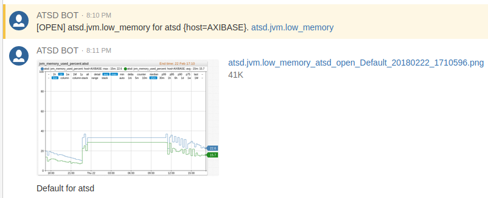

# Monthly Change Log: December 2017

## ATSD

| Issue| Category    | Type    | Subject              |
|------|-------------|---------|----------------------|
| 4831    | security    | Support    | Update dependencies to next minor versions. |
| 4829    | rule engine    | Bug    | `ElUtils.preProcess` fails while processing empty list. |
| 4824    | email    | Bug    | [Enforce max limit](../../rule-engine/functions-text.md#truncate) to the message subject. |
| 4819    | api-rest    | Feature    | Implement incoming [webhook](../../api/data/messages/webhook.md) functionality. |
| 4817    | rule engine    | Feature    | Add administrative setting to allow command execution. |
| 4816    | api-rest    | Bug    | Series query: fix [PREVIOUS](../../api/data/series/interpolate.md#function) interpolation. |
| 4815    | entity    | Feature    | Entity groups: add field to specify the default tag template. |
| 4811    | portal    | Feature    | Use entity and metric labels in the default rule engine portal. |
| 4808    | rule engine    | Feature    | Implement [access to metric values by name](../../rule-engine/functions-value.md#value) if metrics are in the same `series` command. |
| 4807    | rule engine    | Feature    | Webhooks: implement [AWS API](../../rule-engine/notifications/README.md#integration-webhooks) webhook. |
| 4803    | sql    | Bug    | Refactor setting to allow [filling interpolated values](../../sql/README.md#fill) with any value. |
| 4790    | rule engine    | Bug    | Webhooks: UI Enhancements. |
| 4784    | rule engine    | Bug    | Improve the contents and formatting of the default alert [details table](../../rule-engine/details-table.md#examples). |
| 4765    | rule engine    | Feature    | Implement [derived commands](../../rule-engine/derived.md#derived-commands). |
| 4749    | UI    | Bug    | Delete entity error after delete is cancelled. |
| 4711    | UI    | Feature    | UI: Multiple Enhancements. |
| 3560    | core    | Feature    | Implement [`units`](../../api/meta/metric/list.md#fields) field in the Metric class. |
| 2613    | portal    | Feature    | Implement a [redirect to view portal](../../portals/portals-overview.md#portal-links) by name as well as by id. |
| 4809 | administration | Bug | Enforce `UTF-8` file encoding in ATSD start scripts. |
| [4808](#issue-4808) | rule engine | Feature | Implement [`value('metricName')`](../../rule-engine/functions-value.md) function to access other metrics in the same `series` command by name. |
| 4798 | rule engine | Feature | Outgoing webhooks: add support for [proxy and reverse-proxy](../../rule-engine/notifications/README.md#network-settings) network connections to external cloud services. |
| [4796](#issue-4796) | rule engine | Feature | Portal: add Freemarker functions to check user role and group membership. |
| [4795](#issue-4795) | rule engine | Feature | Implement [`BETWEEN AND`](../../rule-engine/operators.md#text-operators) clause. |
| [4794](#issue-4794) | rule engine | Feature | Implement [`random selector`](../../rule-engine/functions.md#random) functions. |
| [4793](#issue-4793) | rule engine | Feature | Implement statistical functions [with interval/count](../../rule-engine/functions.md#statistical): `avg('1 minute')`, `max(10)`. |
| [4792](#issue-4792) | rule engine | Feature | Implement statistical functions [with conditions](../../rule-engine/functions.md#statistical): `countIf`, `sumIf`, `avgIf`. |
| [4785](#issue-4785) | rule engine | Feature | Implement [`AWS SQS`](../../rule-engine/notifications/aws-sqs.md) notification. |
| [4741](#issue-4741) | rule engine | Feature | Implement [`AWS SNS`](../../rule-engine/notifications/aws-sns.md) notification. |
| 4705 | administration | Bug | ATSD does not start after update via `docker exec`. |
| 4788 | rule editor | Feature | Add endpoint links in the webhook drop-down. |
| 4787 | rule editor | Bug | Set default values for empty fields in [`CUSTOM`](../../rule-engine/notifications/custom.md) webhook type. |
| 4782 | security | Bug | Prevent browser auto-complete to submit user credentials on the outgoing webhook form. |
| 4779 | api-rest | Bug | Series query: invalid JSON returned if `addMeta` parameter for unknown metric is specified. |
| [4778](#issue-4778) | rule editor | Feature | Implement placeholders for the [Details Table](../../rule-engine/details-table.md#details-table). |
| 4776 | rule engine | Feature | Extract functions from the [`db_last`](../../rule-engine/functions-series.md#db_last) and [`db_statistic`](../../rule-engine/functions-series.md#db_statistic) functions to include in webhook charts. |
| 4775 | rule editor | Bug | Raise error on invalid syntax in [database](../../rule-engine/functions-series.md) functions. |
| 4773 | api-rest | Bug | Series query: fix for empty response when `seriesLimit` is enforced. |
| [4772](#issue-4772) | rule editor | Feature | Add setting **Group by All Tags**. |
| 4767 | rule engine | Bug | Webhooks: Timeout waiting for connection from pool on CircleCI. |
| [4765](#issue-4765) | rule engine | Feature | Implement [derived](../../rule-engine/derived.md) commands. |
| 4757 | rule engine | Bug | Remove excessive rounding in variables. |
| 4754 | rule engine | Feature | Add [window](../../rule-engine/window.md) viewer. |
| 4753 | rule engine | Bug |  Alert does not reopen when `Message on Cancel` is empty. |
| 4728 | portal | Bug | Charts and portals: ensure `LTR` layout regardless of the browser setting. |
| 4717 | api-rest | Bug | Series query: wrong below median `PERCENTILE_*` calculations (equals to `MIN`). |
| 4713 | api-rest | Bug | Series query with `FORECAST` type: add support for `addMeta` parameter. |
| [4781](#issue-4781) | rule engine | Feature | Implement [HipChat Data Center](../../rule-engine/notifications/hipchat.md) notifications. |
| 4738 | rule engine | Feature | Implement [`WEBHOOK`](../../rule-engine/notifications/webhook.md) notifications. |
| 4579a | rule engine | Feature | Implement [`CUSTOM`](../../rule-engine/notifications/custom.md) notifications. |
| [4579b](#issue-4579b) | rule engine | Feature | Implement [`SLACK`](../../rule-engine/notifications/slack.md) notifications. |
| [4579c](#issue-4579c) | rule engine | Feature | Implement [`TELEGRAM`](../../rule-engine/notifications/telegram.md) notifications. |
| [4579d](#issue-4579d) | rule engine | Feature | Implement [`DISCORD`](../../rule-engine/notifications/discord.md) notifications. |
| 4774 | rule engine | Bug | Invalid URL validation error for `.site` domain. |
| 4769 | rule engine | Bug | Rule does not update when the linked webhook changes. |
| 4767 | rule engine | Bug | [`CUSTOM`](../../rule-engine/notifications/custom.md) webhook: timeout waiting for connection from pool. |
| 4764 | rule engine | Bug | Do not show entity information in entity non-grouped alert details. |
| 4762 | rule engine | Feature | Simplify [`DISCORD`](../../rule-engine/notifications/discord.md) webhook configuration. |
| 4761 | rule editor | Bug | **Add override** link not creating a row in the [Overrides](../../rule-engine/overrides.md) table. |
| 4760 | api-rest | Bug | [`series query`](../../api/data/series/query.md) method: entity expression error when using `name` field. |
| 4759 | rule editor | Bug | Buttons disappear when the rule configuration contains errors. |
| 4758 | rule editor | Bug | Error when saving webhook using HTTP protocol. |
| 4756 | api-rest | Bug | Data API: Minimum date for [`series query`](../../api/data/series/query.md) with `FORECAST` type. |
| [4755](#issue-4755) | rule engine | Feature | Implement `db_message` functions for correlation. |
| 4744 | rule engine | Bug | Add chart link to webhook message if chart error is raised. |
| 4725 | api-rest | Bug | Processing error in [`series query`](../../api/data/series/query.md) method with `END_TIME` alignment. |
| 4713 | api-rest | Bug | [`series query`](../../api/data/series/query.md) with `FORECAST` type ignores `addMeta` parameter. |

---

## Charts

| Issue| Category    | Type    | Subject              |
|------|-------------|---------|----------------------|
| 4805    | api    | Feature    | [Interpolation field](https://axibase.com/docs/charts/configuration/aggregators.html#interpolation-functions) in series configuration. |

---

## Collector

| Issue| Category    | Type    | Subject              |
|------|-------------|---------|----------------------|
| 4830    | core    | Bug    | Security Fixes. |
| 4780 | docker | Bug | Collector CPU is abnormally high if TCP checks are enabled.  |
| 4742 | docker | Bug | Add `atsd-url` parameter validation.  |
| 4552 | json | Feature | JSON job: add support for thousand items and more. |

---

### Issue 4755

The `db_message_count` and `db_message_last` functions allow one to correlate different types of data, time series and messages.

#### [`db_message_count`](../../rule-engine/functions-message.md#db_message_count) Function

* Calculate the number of messages matching the specified parameters.

```java
db_message_count(S interval, S type, S source [, S tags, [S entity]])
```

> `tags` and `entity` arguments are optional.
> If the `type`, `source`, or `tags` fields are set to empty string, they are ignored when matching messages.
> If the `entity` is not specified, the request retrieves messages for the current entity.

  Example:

```java
// Check if the average exceeds 20 and the 'compaction' message was not received within the last hour for the current entity.
avg() > 20 && db_message_count('1 hour', 'compaction', '') == 0
```

```java
// Check if the average exceeds 80 and there is an event with type=backup-error received within the last 15 minutes for entity 'nurswgvml006'.
avg() > 80 && db_message_count('15 minute', 'backup-error', '', '', 'nurswgvml006') > 0
```

#### [`db_message_last`](../../rule-engine/functions-message.md#db_message_last) Function

* Returns the most recent [message](../../api/data/messages/query.md#fields-1) object matching the specified parameters.

```java
db_message_last(S interval, S type, S source[, S tags, [S entity]])
```

> `tags` and `entity` arguments are optional.
> If the `type`, `source`, or `tags` fields are set to empty string, they are ignored when matching messages.
> If the `entity` is not specified, the request retrieves messages for the current entity.

The returned object contains `type`, `source`, and `tags.{name}` fields of string type and the `date` field of long data type. The `date` field is returned as Unix time in milliseconds.

  Example:

```java
last_msg = db_message_last('60 minute', 'logger', '')
// Check that the average exceeds 50 and the severity of the last message with type 'logger' for the current entity is greater or equal `ERROR`.
value > 50 && last_msg != null && last_msg.severity.toString() >= "6"
```

### Issue 4808

The value functions provide access to other metrics submitted within the same `series` command or parsed from the same row in the CSV file.

```javascript
value > 1.5 && value('temperature') > 50
```

```ls
series e:sensor01 m:pressure=3.5 m:temperature=80
```

Assuming the rule is created for the pressure metric, the below condition evaluates to `true` for the above `series` command.

```javascript
3.5 > 1.5 && 80 > 50
```

### Issue 4796

The functions simplify the design of role-based portals.

```javascript
// Returns true if the user belongs to the specified user group.
userInGroup(String userGroupname)

// Returns true if the user has read permissions for the specified entity.
userAllowEntity(String entityName)

// Returns true if the user has the specified role: USER, EDITOR, etc.
userHasRole(String roleName)

// Returns true if the user has READ permissions to the specified entity group.
userAllowEntityGroup(String entityGroupName)
```

### Issue 4795

```javascript
value BETWEEN 75 AND 90
```

```javascript
dateStr BETWEEN '18:30:00' AND '18:34:59'
```

### Issue 4794

```javascript
randomKey(replacementTable('oncall-person'))
```

```javascript
randomKey(excludeKeys(replacementTable('oncall-person'),['John Doe']))
```

```javascript
randomItem(collection('ip_white_list'))
```

### Issue 4793

```javascript
avg('1 minute') / avg() > 2
```

```javascript
max(5) == max()
```

### Issue 4792

```javascript
countIf('value > 10') < 5
```

### Issue 4785

* SQS


### Issue 4741

* SNS


### Issue 4778

The alert details table can embedded into the target document using the same format as the host document.

```bash
${detailsTable('markdown')}
${detailsTable('ascii')}
${detailsTable('html')}
${detailsTable('property')}
${detailsTable('csv')}
${detailsTable('json')}
```

### Issue 4772

The new settings automatically creates as many series as there are incoming series to simplify the initial configuration. For `message` and `property` commands, the setting is set to **No Tags**.


### Issue 4765

The derived command action allows storing new calculated metrics in the database by executing custom command templates in the [Network API](../../api/network/README.md) syntax.

```bash
series e:${entity} m:jvm_memory_free_avg_percent=${round(100 - avg(), 3)}
```

The new commands can be executed at the frequency of incoming commands or decreased with a custom repeat interval.


### Issue 4781

HipChat Data Center notifications.



### Issue 4579b

Slack notifications.


### Issue 4579c

Telegram notifications.


### Issue 4579d

Discord notifications.


