# Monthly Change Log: February 2017

## ATSD

| Issue| Category    | Type    | Subject                                                                              |
|------|-------------|---------|--------------------------------------------------------------------------------------|
| 3951 | sql         | Feature | Granted permissions to users with `USER` role to cancel the own queries.                             |
| 3942 | core        | Bug     | Fixed `PermGen` Error by setting `MaxPermGen` in start script.                                   |
| [3938](#issue-3938) | administrator       | Bug     | Added `PermGen` memory usage metrics.                                     |
| 3934 | administrator       | Support | Set `MaxPermGen` to 128 MB in `start-atsd` scripts.                           |
| 3929 | api-rest    | Bug     | Fixed double/float datatype cast rounding error in `DELTA` and `COUNTER` aggregators. |
| 3925 | api-rest        | Feature     | Added column alias to metadata with [`metadataFormat=COMMENTS`](../../sql/api.md#parameters) and `outputFormat=csv`.|
| [3919](#issue-3919) | csv        | Feature | Added an option to ignore top-N header lines in [CSV Parser](../../parsers/csv/README.md).|
| 3898 | rule engine     | Bug     | Fixed incorrect error validation of user-defined `column` aliases.|
| [3889](#issue-3889) | rule engine     | Bug     | Fixed `entity.label` field not accessible in filter [`expressions`](../../rule-engine/filters.md).                                                                 |
| 3912 | sql            | Bug     | Fixed NullPointerException in [`JOIN`](../../sql/README.md#joins) queries without a `WHERE` condition.                                                                                                          |
| 3910 | rule engine    | Bug     | Invalid rules are logged with rule name to simplify troubleshooting.                                    |
| [3909](#issue-3909) | rule engine    | Feature | Added a `Discard Previous Values` filter option to control processing of commands with a timestamp earlier than the most recent one.                                                                                                               |
| 3902 | api-network    | Bug     | Fixed deletion of annotations by batched [series](../../api/network/series.md#series-command) commands with the [append](../../api/network/series.md#text-append) option.                                            |
| 3894 | rule engine    | Bug     | Fixed validation of user-defined variables. |
| 3893 | sql            | Bug     | Fixed delta aggregator behavior with filtered dates.                                  |
| 3892 | sql            | Bug     | Fixed usage of the [CASE](../../sql/README.md#case-expression) statement in `SELECT` clauses with grouping by the `time` column.    |
| 3890 | sql            | Bug     | Fixed tag encoding error in high-cardinality metrics.                                 |
| 3887 | UI             | Bug     | Added HTML-escaping for columns on SQL Queries page.                                  |
| 3885 | api-network    | Bug     | Fixed annotation append behavior by batched [series](../../api/network/series.md#series-command) commands with the [append](../../api/network/series.md#text-append) option.                                             |
| 3883 | rule engine    | Bug     | Variables are now allowed to be referenced by other variables.                            |
| 3880 | sql            | Bug     | Fixed NullPointerException in [`JOIN`](../../sql/README.md#joins) queries when aggregating `null` values.   |
| [3879](#issue-3879) | rule engine    | Feature | Added time filter to control how historical and future records are discarded.                                                                    |
| 3872 | sql            | Bug     | Fixed a merge issue with [`JOIN USING entity`](../../sql/README.md#join-syntax) clause.              |
| 3860 | api-rest       | Bug     | [series](../../api/network/series.md#series-command) query now returns text values with [cache=true](../../api/data/series/query.md#control-fields) field.                                                             |
| 3844 | sql            | Bug     | The [`ISNULL`](../../sql/README.md#other-functions) function is now allowed to be a part of expression.               |
| 3508 | log_aggregator | Feature | Added ability to limit maximum event message size.                                          |
| 3878 | api-network | Bug     | [series](../../api/network/series.md#series-command) command does not support line break in tag value and in x (annotation) field.     |
| 3874 | api-network | Bug     | [series](../../api/network/series.md#series-command) command fails to overwrite value when inserted in batch with `append` option.|
| 3873 | sql         | Bug     | Malformed tag names in a [`JOIN`](../../sql/README.md#joins) query. |
| 3870 | rule engine | Bug     | Rule expression evaluation error is propagated to inserting clients. |
| 3869 | sql         | Bug     | Tag value encoding overflow for metrics with greater than 1K series. |
| 3862 | rule engine | Bug     | Add HTML escape for variable (alias) expressions. |
| 3861 | client      | Feature | [ATSD Python client](https://github.com/axibase/atsd-api-python#sql-queries). Add support for SQL to `dataframe` retrieval.|
| 3858 | sql         | Bug     | Decimal precision sometimes ignored in scheduled [SQL reports](../../sql/scheduled-sql.md).|
| 3854 | rule engine | Feature | Extend [date](../../rule-engine/functions-date.md) functions to allow custom time format.|
| 3853 | sql         | Bug     | Keyword [`QUARTER`](../../api/data/series/time-unit.md#time-unit) not supported. |
| 3851 | data-in     | Bug     | UDP server disconnects on malformed command. |
| 3843 | sql         | Bug     | [Time/Period](../../sql/README.md#reserved-words) keywords are not case-insensitive. |
| 3841 | sql         | Bug     | [`CAST`](../../sql/README.md#cast) expression in `WHERE` condition changes results. |
| 3840 | sql         | Bug     | [`ORDER BY`](../../sql/README.md#ordering) not applied when using column alias. |

----

## Collector

| Issue| Category    | Type    | Subject                                                                              |
|------|-------------|---------|--------------------------------------------------------------------------------------|
| 3876 | socrata     | Bug     | Job fails even if filter expression is valid. |
| 3866 | socrata     | Bug     | Configuration form refactoring. |
| 3865 | socrata     | Bug     | Time heuristics. |
| 3849 | socrata     | Bug     | Numeric field with non-standard `NaN` constant must be classified as numeric. |
| 3848 | socrata     | Bug     | Extract command time from the built-in `updated_at` field.|
| 3826 | socrata     | Feature | Add support for series [annotation](../../api/network/series.md#series-tags-text-value-messages) (x:) field. |
| 3903 | socrata        | Bug     | Implemented filtering and trimming of tag values before saving.                                      |
| [3899](#issue-3899) | socrata        | Feature | Added capability to launch an automated job from dataset URL.                                                |
| 3877 | socrata        | Bug     | Annotations are added under numeric metric names.                                         |
| [3864](#issue-3864) | socrata        | Feature | Added a summary table displayed in `Test` mode.                                            |
| [3859](#issue-3859) | socrata        | Feature | Added a URL wizard.                                                                   |
| [3936](#issue-3936) | json        | Feature | Added a text area for custom user commands.                                    |
| 3928 | data-source | Feature | Added the separate Protocol field to data source configuration page. |
| [3926](#issue-3926) | json        | Feature | Provided an ability to extract Time, Metric Name & Value fields by index from an array. |
| 3771 | docker      | Bug     | Fixed database locks in Docker Data Reader.                                        |
| 3895 | socrata         | Bug     | Added heuristics to automatically classify and ignore fields in Socrata data sources. |
| 3891 | docker          | Bug     | Fixed missing `entity` command for a new container when 'Life Cycle event monitoring' is disabled.|

----

## Charts

| Issue| Category    | Type    | Subject                                                                              |
|------|-------------|---------|--------------------------------------------------------------------------------------|
| [3958](#issue-3958) | core   | Bug | Improved performance of legend rendering.                                    |
| [3921](#issue-3921) | widget-settings | Bug     | Added [`escape()`](https://axibase.com/docs/charts/syntax/control-structures.html#listescape) method to `list` and `var` arrays to escape commas in elements.|
| 3917 | widget-settings | Bug     | Added the ability to escape commas and backslashes in settings which contain a list.|
| [3897](#issue-3897) | table      | Feature | Added [`auto-height`](https://axibase.com/docs/charts/widgets/shared-table/#auto-height) setting.|
| 3896| table      | Feature | Added a setting to hide table headers.|
| 3791| table      | Bug     | Fixed slider un-focus behavior after data update.|
| 3908 | table          | Bug     | Fixed row sorting when conditional [`display: none`](https://axibase.com/docs/charts/configuration/display-filters.html#display-filters) style is used.                                      |
| [3901](#issue-3901) | portal    | Support | Added ability to hide rows if no alert is raised for all metrics in a row.          |
| [3792](#issue-3792) | box       | Feature | Implemented [`metro`](https://axibase.com/docs/charts/widgets/box-chart/#class) class setting.                                                            |
| 3839 | time-chart  | Bug     | Negative style not applied to marker color. |
| 3836 | bar         | Bug     | Remove on-load animation in bar and pie widgets. |
| 3794 | box         | Bug     | Fix [`tooltip`](https://axibase.com/docs/charts/widgets/shared/#tooltip) issues. |

----

### Issue 3938

The new metrics `jvm_permgen_max`, `jvm_permgen_used`, `jvm_permgen_used_percent` have been introduced to collect `PermGen` memory usage statistics.

The values can also be seen in `atsd.log`

```txt
2017-02-27 10:32:10,327;INFO;reaperScheduler-1;c.a.t.s.m.GarbageCollectionPoller;Memory Pool="Code Cache" type="Non-heap memory": 9 mb, Memory Pool="PS Eden Space" type="Heap memory": 484 mb, Memory Pool="PS Survivor Space" type="Heap memory": 9 mb, Memory Pool="PS Old Gen" type="Heap memory": 103 mb, Memory Pool="PS Perm Gen" type="Non-heap memory": 63 mb
```

### Issue 3936

Custom network commands specified in **Raw Commands** textarea can be executed.

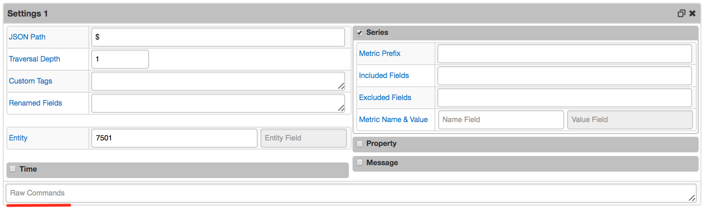

The following [placeholders](https://axibase.com/docs/axibase-collector/jobs/json.html#placeholders) together with [string functions](https://axibase.com/docs/axibase-collector/jobs/json.html) are supported:

* ITEM
* PATH
* FILE
* DIRECTORY
* [JSON Path expressions](https://github.com/jayway/JsonPath#operators)

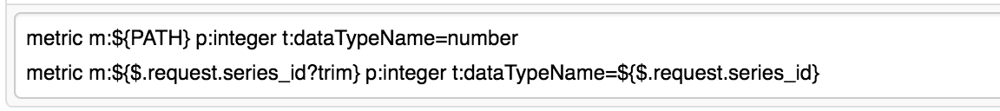
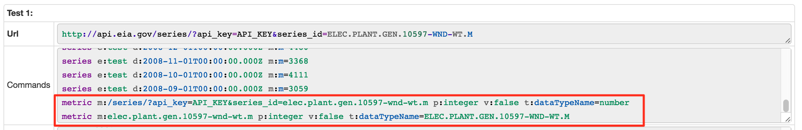

### Issue 3926

Fields accessed by the array index have been added to drop-down list.

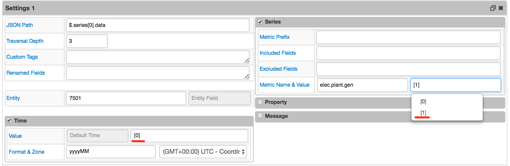
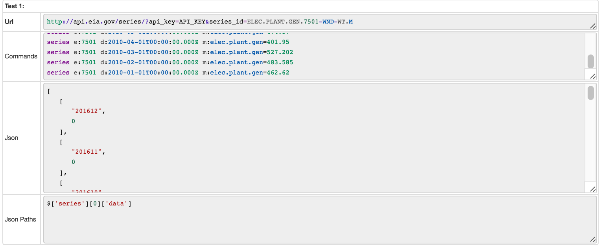

## Charts

### Issue 3958

Rendering time of a [chart with about 300 legend units](https://apps.axibase.com/chartlab/259e3907)

| Before | After |
|--------|-------|
|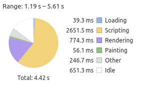 | 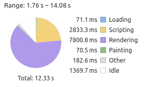 |

### Issue 3919

The option allows ignoring top-N header lines in the imported CSV file. This enables skipping multi-line headers or metadata sections in CSV files.

* Example: Skip 1 line `Title: "ORO.csv"` since it contains no separators.

```txt
Title: "ORO.csv"
1148,PST,'RESERVOIR ELEVATION (feet)'
20130101,0000,828.09
20130101,0100,828.11
20130101,0200,828.13
```

* Example 2. Skip 8 lines (empty and prefixed with `:`) to start processing the following line.

```txt
.A ORO 20160312 PS DH0000 /LSH 2325491
```

```txt
:CDEC data from OROVILLE DAM
:RESERVOIR STORAGE af
:Station ID ORO, sensor number 15, duration H
:Specified start date '03/12/2016 00:00' and ending date '03/14/2016 00:00'
:Note:  All data is PST and is displayed in 4-digit year format to comply with Y2K requirements.
:
:  sta yyyymmdd PS DHhhmm /code value
.A ORO 20160312 PS DH0000 /LSH 2325491
```

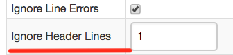

### Issue 3889

The `entity.label` parameter is now supported in the rule filter.

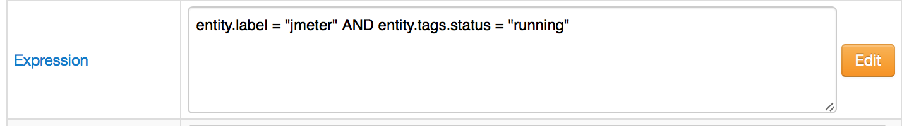

### Issue 3921

Added an `escape()` method to `list` and `var` arrays, to ensure that these collections are serialized as follows  `@{arrayName.escape()}`. The `escape()` method escapes commas and backslashes in each element in an array.

```ls
[dropdown]
  options = @{countries.escape()}
  change-field = series.tags.ctyname
```

[ChartLab](https://apps.axibase.com/chartlab/ff94d98d/2/)

### Issue 3897

New generic table settings:

| Setting | Description |
|---|---|
| auto-height    | Calculate row height automatically based on amount of vertical space allocated to the widget and the number of rows.|
| font-scale    | Ratio of font height to row height when auto-height is enabled. Minimum row height is 10px, maximum row height is 64px. |
| table-header-style    | Custom CSS style applied to table header, including a style to hide the header altogether. |
| header-style    | Custom CSS style applied to widget header, including a style to hide the widget header altogether. |

[ChartLab](https://apps.axibase.com/chartlab/e02b8303/3/)

[ChartLab](https://apps.axibase.com/chartlab/e02b8303/4)

[ChartLab](https://apps.axibase.com/chartlab/e02b8303/5)

[ChartLab](https://apps.axibase.com/chartlab/e02b8303/6)

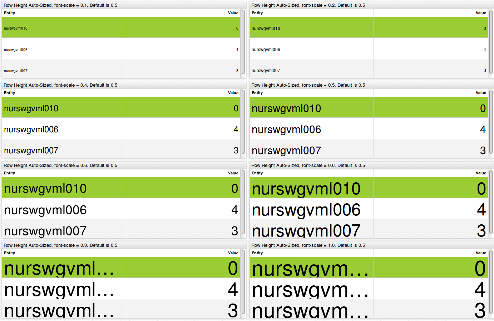

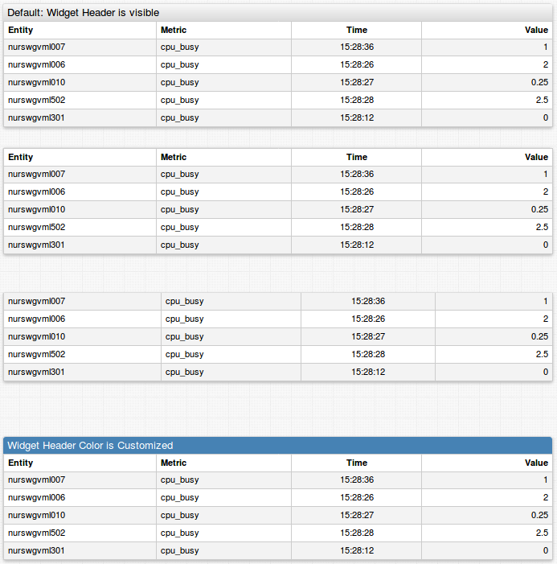

## Issue 3909

The **Discard Previous Values** option allows you to discard commands timestamped earlier than the time of the most recent event in the given window.
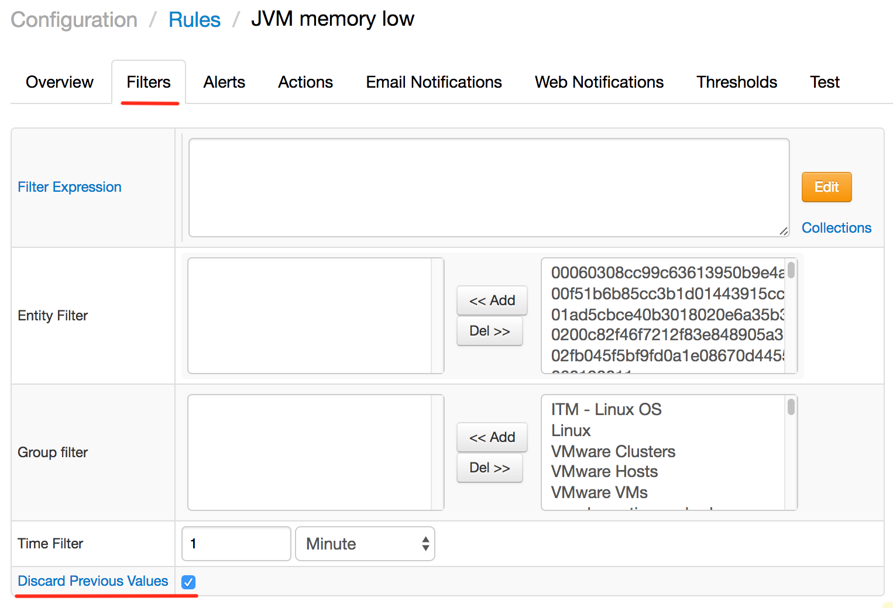

### Issue 3879

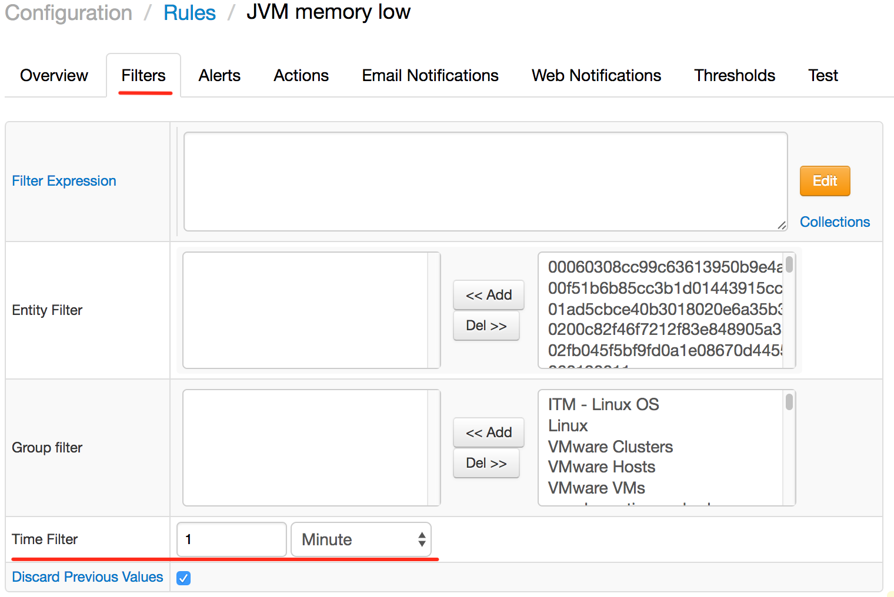

### Issue 3899

An example for launching a `Socrata` job can be found in [this tutorial](https://axibase.com/use-cases/integrations/socrata/python/).

### Issue 3864

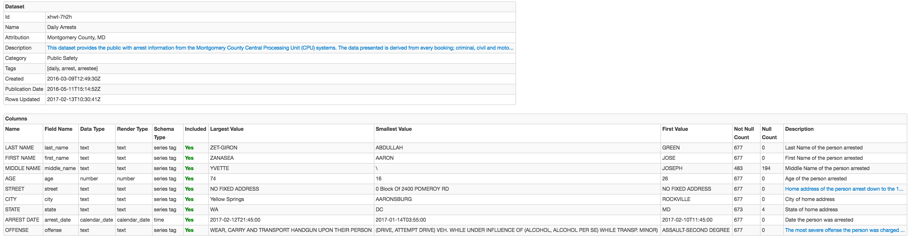

### Issue 3859

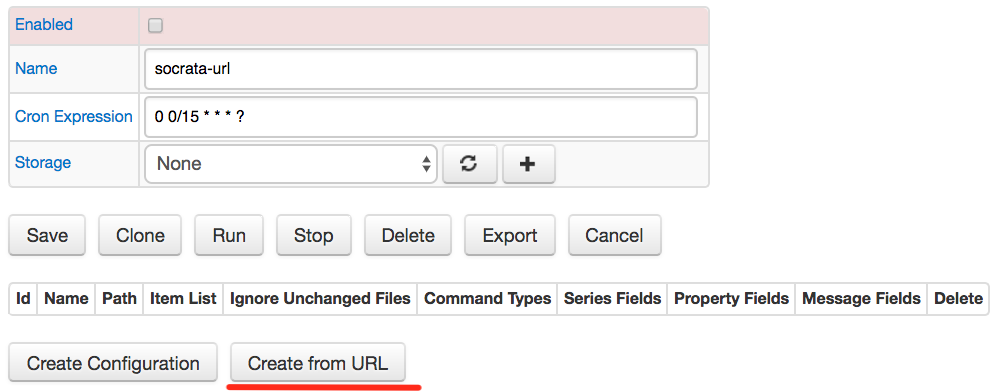

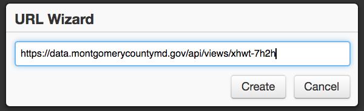

The generated configuration:

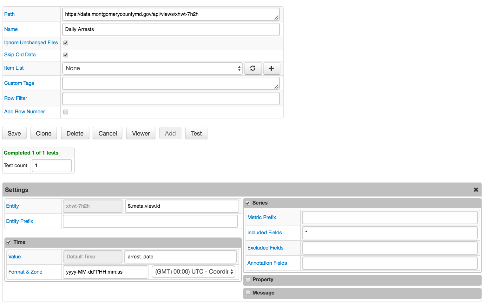

## Charts

### Issue 3901

[Example portal](https://apps.axibase.com/chartlab/bb65c060) where rows without alerts get hidden:

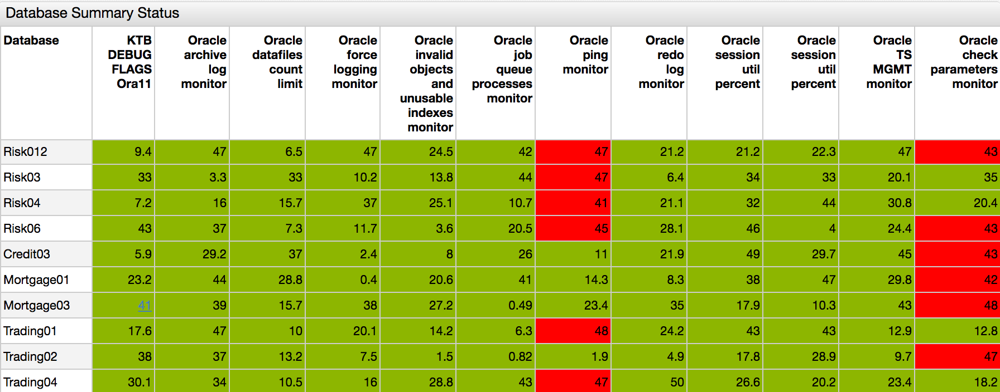

### Issue 3792

[Example of `Metro` class](https://apps.axibase.com/chartlab/6d6ae13c/2/):

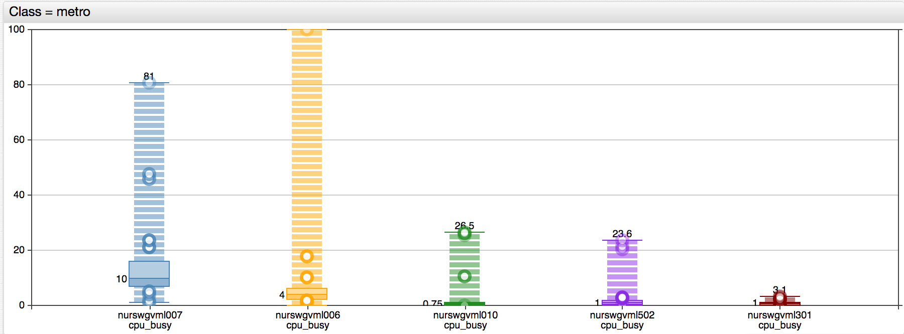