# Monthly Change Log: January 2017

## ATSD

| Issue| Category    | Type    | Subject                                                                              |
|------|-------------|---------|--------------------------------------------------------------------------------------|
| 3831 | api-rest    | Bug     | Fixed metric [`series`](../../api/meta/entity/get.md#entity-get) request processing if series count exceeds 1000. Added a warning message to web UI when the threshold is reached. |
| 3825 | sql         | Bug     | Removed additional rows from the result set when the [`VALUE {n}`](../../sql/examples/interpolate-extend.md#interpolate-with-extend) interpolation function is specified in a `GROUP BY` period clause. |
| 3816 | UI          | Bug     | Fixed ordering of timestamps on the Interval tab on the **Series Statistics** page. Intervals smaller than the median minus standard deviation are now not displayed. |
| 3813 | UI          | Bug     | Fixed `series not found` issue when displaying series with multiple tags on the **Series Statistics** page. |
| 3808 | metric      | Bug     | Corrected a defect where an incorrect `NaN` count is shown on the **Series Statistics** page. |
| [3742](#issue-3742) | UI          | Feature | Added a **Text Column** button to the UI Export form. |
| 3797 | sql             | Feature | Implemented support for the [`ROW_NUMBER`](../../sql/examples/partition-row-number.md#partition---row-number) condition after the `GROUP BY` clause. |
| 3796 | api-network     | Feature | Added support for the [`append`](../../api/network/series.md#text-append) option to concatenate text values for the same timestamp. |
| 3795 | sql             | Feature     | Implemented support for entity tags in the [`GROUP BY`](../../sql/README.md#grouping) clause. |
| 3786 | statistics      | Bug     | Added the [`LIMIT 100`](../../sql/README.md#limiting) clause for pre-defined SQL query on the [series statistics](#issue-3680) page. |
| 3783 | sql             | Bug     | Removed additional comma if all columns contain `null` (empty string). |
| 3781 | jdbc            | Bug     | Fixed empty row issue for the JDBC Driver. |
| 3753 | jdbc            | Bug     | Corrected error in handling metadata when creating a ResultSet. |
| 3691 | rule engine     | Feature | Added functions to convert string date to a date object or to Unix time. |
| [3680](#issue-3680) | statistics      | Feature | Created a page to show series characteristics, such as value and interval statistics and histograms. |
| [3756](#issue-3756)          | sql             | Bug     | Tag filter for the 2nd table removes all rows in `JOIN` queries.                          |
| [3751](#issue-3751)          | api-rest        | Bug     | `isEmpty()` function causes parse error in the series [query](../../api/data/series/query.md) method.                                               |
| [3749](#issue-3749)          | sql             | Bug     | `LOCATE` function raises NPE in the `WHERE` clause.                                     |
| 3748          | test            | Support | CE web tests failing.                                                           |
| [3747](#issue-3747)          | sql             | Feature | `CAST` does not allow `date_format`.                                                 |
| [3746](#issue-3746)          | sql             | Feature | `u` pattern in the `date_format` function.                                            |
| [3741](#issue-3741)          | sql             | Bug     | `JOIN USING entity` fails to correctly merge rows with tags.                                                              |
| [3740](#issue-3740)          | api-rest        | Bug     | Series [query](../../api/data/series/query.md) for versioned metrics does not provide a history of text values. |
| [3738](#issue-3738)          | sql             | Bug     | Math function `ABS()` does not accept 2nd aggregate expressions. |
| [3721](#issue-3721)          | sql             | Feature | `LIKE` comparator optimized.                                                                |
| [3711](#issue-3711)          | sql             | Bug     | Slow parsing of queries with 30+ arguments in arithmetic expressions in the `SELECT` clause. |
| [3695](#issue-3695)          | sql             | Bug     | `GROUP BY` with join fails to return records.                                     |
| [3661](#issue-3661)          | sql             | Feature | [`CAST`](../../sql/README.md#cast) function implemented. |
| 3527          | jdbc            | Bug     | DbVisualizer hangs after repetitive query cancellations with the ATSD JDBC driver.  |

---

## Charts

| Issue| Category        | Type    | Subject                                                                             |
|------|-----------------|---------|-------------------------------------------------------------------------------------|
| 3481| widget-settings | Feature | Implemented a JavaScript replacement for the Freemarker `getSeries` method. |
| 3078 | widget-settings | Feature | Added support for new series settings [`exact-match`](https://axibase.com/products/axibase-time-series-database/visualization/widgets/configuring-the-widgets/) and [`interpolate-extend`](https://axibase.com/products/axibase-time-series-database/visualization/widgets/configuring-the-widgets/). |
| [3754](#issue-3754)          | bar             | Bug     | Columns not created for series with statistic and wildcard matches.                          |
| [3654](#issue-3654)          | widget-settings | Feature | Support for meta fields in label-format.                                           |
| [3636](#issue-3636)          | data-loading    | Bug     | Series not displayed if requested for the entity group or with the entity expression.                                         |
| [3143](#issue-3143)          | table           | Bug     | Value and time columns of series with shorter periods are not displayed.         |
| 2928 | widget-settings | Feature | Changed setting name from `interpolate` to [`fill-value`](https://axibase.com/products/axibase-time-series-database/visualization/widgets/time-chart/) to prevent collision.|
| [2528](#issue-2528) | property        | Feature | Implemented support for the `column-label-format` setting to transform column headers. |
| [1926](#issue-1926) | box             | Feature | Added mouse-over tooltips for box charts. |

---

## Collector

| Issue| Category    | Type    | Subject                                                                              |
|------|-------------|---------|--------------------------------------------------------------------------------------|
| 3823 | socrata     | Bug     | Added a record to the **Statistics Detail** page to display tasks with active downloads. |
| 3821 | socrata     | Bug     | Added **Add Row Number** field to add an additional metric with the name `{prefix}row_number` added to `series` commands in case the data row does not contain any numeric columns. |
| 3820 | docker      | Bug     | Fixed missing `path` entity tag for volumes. |
| 3819 | docker      | Feature     | Updated to construct volume label from the container label instead of the container name. |
| [3818](#issue-3818) | socrata     | Feature | In `Test` mode, added a table displaying columns from the metadata section. |
| 3812 | socrata     | Bug     | Removed `http` pool from the configuration tab. Now, only the dataset path is displayed. |
| 3811 | socrata     | Bug     | Fixed auto-complete defect affecting configuration form fields. |
| 3810 | socrata     | Bug     | Updated settings to support a field specified in **Custom Tags** and not specified in **Included Fields** is not sent as a metric.|
| 3804 | socrata     | Bug     | Excluded `null` values from custom tags or any other fields in commands for both JSON and Socrata jobs. |
| 3803 | socrata     | Bug     | Fixed issue where time fields stored as metrics. |
| 3802 | socrata     | Bug     | Corrected issues with statistics display showing inaccurate command counters. |
| 3801 | socrata     | Bug     | Handled an error caused by trailing slashes in the Path field. |
| 3799 | socrata     | Bug     | Removed form jitter. |
| 3798 | socrata     | Bug     | Updated time parser for JSON and Socrata jobs to accept the `yyyyw` time format. |
| 3793 | socrata     | Bug     | Added heuristics to the Socrata job. |
| [3743](#issue-3743)          | pi              | Feature | Developed PI Server emulator for `picomp2` and `pipoint2` tables.                   |
| 3773 | sql             | Bug     | Implemented rules for numeric precedence in queries against the [`atsd_series`](../../sql/examples/select-atsd_series.md) table. If the query requests several metrics with different datatypes, no precision loss occurs. |
| 3770 | api-rest        | Bug     | Removed versioning tags from [`exactMatch`](../../api/data/series/query.md#tag-filter) comparison to prevent empty result sets when querying data for versioned metrics. |
| 3769 | sql             | Feature     | Extended the [`LOOKUP`](../../sql/README.md#lookup) function to accept series, entity, and metric tags as parameters. |
| 3768 | sql             | Feature | Extended the [`CONCAT`](../../sql/README.md#string-functions) function to accept numeric arguments. |
| 3767 | sql             | Feature | Extended the [`CAST`](../../sql/README.md#cast) function to convert numbers to strings. |
| 3764 | sql             | Bug     | Fixed `NullPointerException` error for data requested with the [series query](../../api/data/series/query.md) method for a newly created metric without any data. |
| 3763 | sql             | Bug     | Updated the [`SELECT 1`](../../sql/api.md#connection-query) validation query implementation to return exactly one row. |
| 3480 | api-rest        | Feature | Added support for the [`text`](../../api/data/series/query.md#value-object) field in the [series query](../../api/data/series/query.md) method. The `text` field allows annotating numeric samples with text.|
| [3772](#issue-3772) | Socrata     | Feature | Created new Socrata job to query [Socrata](https://socrata.com/) data. |
| [3784](#issue-3784)| jdbc            | Feature | Added the [`${SPLIT_CONDITION}`](https://axibase.com/docs/axibase-collector/jobs/jdbc.html#job-configuration) placeholder support in the JDBC job to allow fetching large result sets in multiple iterations. |
| 3656 | socrata         | Bug     | Refactored the Socrata job to support a dataset with more than 100,000 rows or more than 100 MB without an `OutOfMemory` error. |
| 3755 | docker          | Feature | Added [container size metrics](https://axibase.com/docs/axibase-collector/jobs/docker.html) for Docker containers. |
| 3752 | docker          | Bug     | Fixed issues with mis-matched volume labels by removing old records from the embedded database. |
| 3734 | docker          | Bug     | Fixed issue with stopped container status not being instantly sent into ATSD. |
| 3733 | docker          | Bug     | Eliminated table locks in the embedded database, which resulted in the collection of all statistics being stopped. |

---

### Issue 3742

Added **Text Column** button to the export form. By enabling this button, a text column is displayed for data exported in CSV and HTML formats.

Now, a [text value](../../api/network/series.md#series-tags-text-value-messages) can be used to annotate a numeric observation without changing the series primary key. See Issue 3480 above for more information.

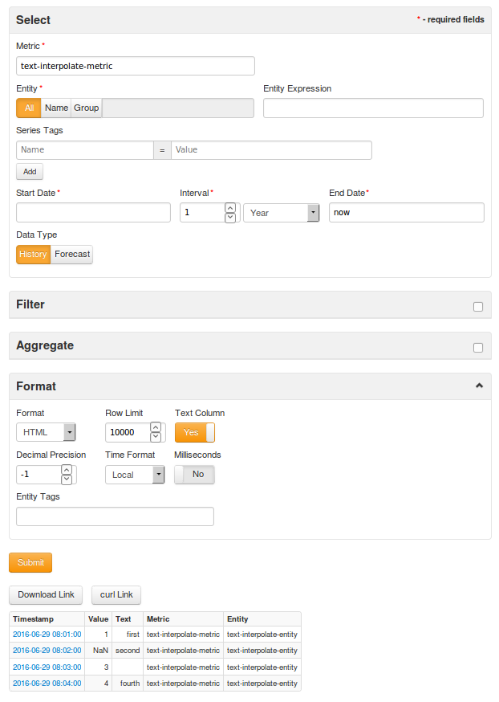

### Issue 3818

The [Test] result now includes a list of columns from the underlying dataset and information on how they are mapped into command fields. The table contains column attributes as well as the following fields:

* Schema Type: classifies how the column is processed in ATSD commands, for example metric, series tag, time, property type, etc.
* Included: determines if the column is included in ATSD commands or is excluded (ignored).

```json
"columns" : [ {
    "id" : 266155015,
    "name" : "Proficient",
    "dataTypeName" : "number",
    "description" : "Number of students tested and considered proficient - meeting standard score metric associated with the grade and content.  A null value identified by SCS (small cell size) indicates redacted data to ensure privacy standards are met.",
    "fieldName" : "proficient_1",
    "position" : 7,
    "renderTypeName" : "number",
    "tableColumnId" : 23073592,
    "width" : 149,
    "cachedContents" : {
      "largest" : "1552",
      "non_null" : 57924,
      "average" : "74.43671017194945",
      "null" : 1666,
      "top" : [ {
        "item" : "0",
        "count" : 20
      }, {
        "item" : "18",
        "count" : 19
      }, {
        "item" : "54",
        "count" : 18
      }, {
        "item" : "44",
        "count" : 17
      }, {
        "item" : "12",
        "count" : 16
      }, {
        "item" : "37",
        "count" : 15
      }, {
        "item" : "39",
        "count" : 14
      }, {
        "item" : "27",
        "count" : 13
      }, {
        "item" : "32",
        "count" : 12
      }, {
        "item" : "17",
        "count" : 11
      }, {
        "item" : "9",
        "count" : 10
      }, {
        "item" : "43",
        "count" : 9
      }, {
        "item" : "47",
        "count" : 8
      }, {
        "item" : "25",
        "count" : 7
      }, {
        "item" : "24",
        "count" : 6
      }, {
        "item" : "21",
        "count" : 5
      }, {
        "item" : "15",
        "count" : 4
      }, {
        "item" : "13",
        "count" : 3
      }, {
        "item" : "90",
        "count" : 2
      }, {
        "item" : "113",
        "count" : 1
      } ],
      "smallest" : "0",
      "sum" : "4311672"
    },
    "format" : {
      "precisionStyle" : "standard",
      "noCommas" : "false",
      "align" : "right"
    }
  }
]
```

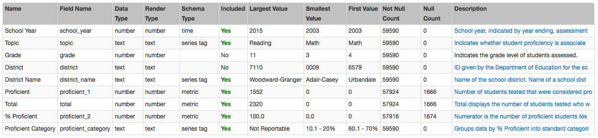

### Issue 3772

To simplify processing of JSON documents created with [Open Data](https://project-open-data.cio.gov/v1.1/schema/) schema, we implemented a new [Socrata](https://axibase.com/docs/axibase-collector/jobs/socrata.html) job. Support for Socrata format has been removed from the JSON job as a result.

The configuration options implemented in the Socrata job allow you to convert the dataset into series, property, and message fields in ATSD.

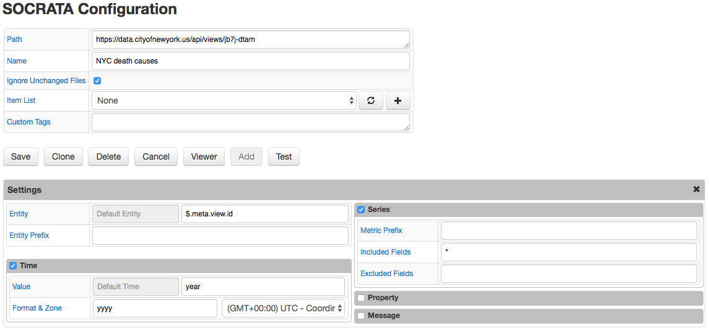

### Issue 3680

The series list now includes a **Statistics** link to characterize the selected series.

The following characteristics are available.

* Value Statistics: provides summary statistics for values of the time series for the specified time interval. There are three tables included within this tab: **Timespan**, **Value Statistics**, and **Value Percentiles**. **Timespan** provides the dates for the first and last value of the time series and their respective values. **Value Statistics** provides the Count (total number of samples), `NaN` count (number of Not-a-Number samples), as well as the Average, Standard Deviation, and Sum of all values. **Value Percentiles** provides a list of the maximum and minimum values of the series, with the corresponding percentages of observations which fall beneath the specific listed value (ie 75% of all values in this series fall below 7.1).

  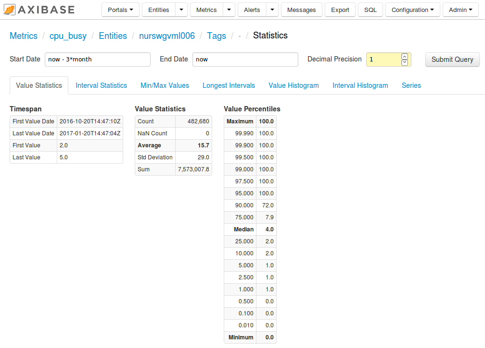

* Interval Statistics: provides time duration statistics for values included in the specific time interval. All values are presented in two forms: as milliseconds and in a human readable format (ie, 1d 2h 3m 4s). Two tables are included in under this tab: **Interval Statistics, ms** and **Interval Percentiles, ms**. The **Interval Statistics** table provides a concise summary of the time characteristics of the series, including the Count (number of intervals between the samples), the average interval time, the total time range for the series (difference between last and first value), among several other points. The **Interval Percentiles, ms** table provides a list of the maximum and minimum time intervals of the series, with the corresponding percentages of observations which fall beneath the specific listed value (ie 99.9% of all time intervals in this series fall under 18 seconds).

  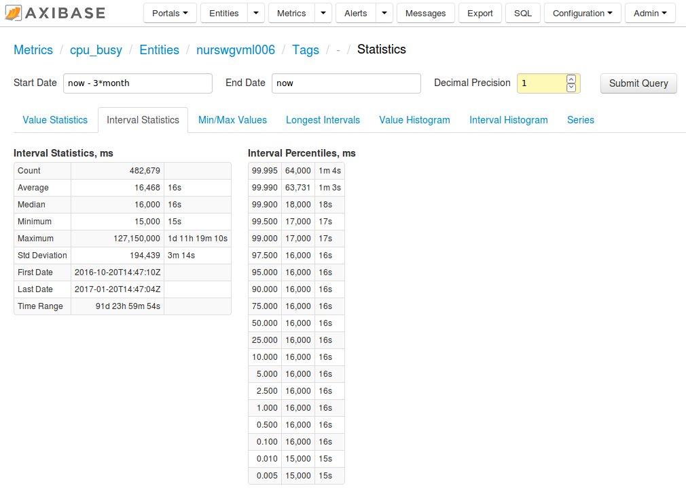

* Min/Max Values: provides the 20 maximum and minimum values of the series. Included are the value, count, and first and last occurrences of these values.

  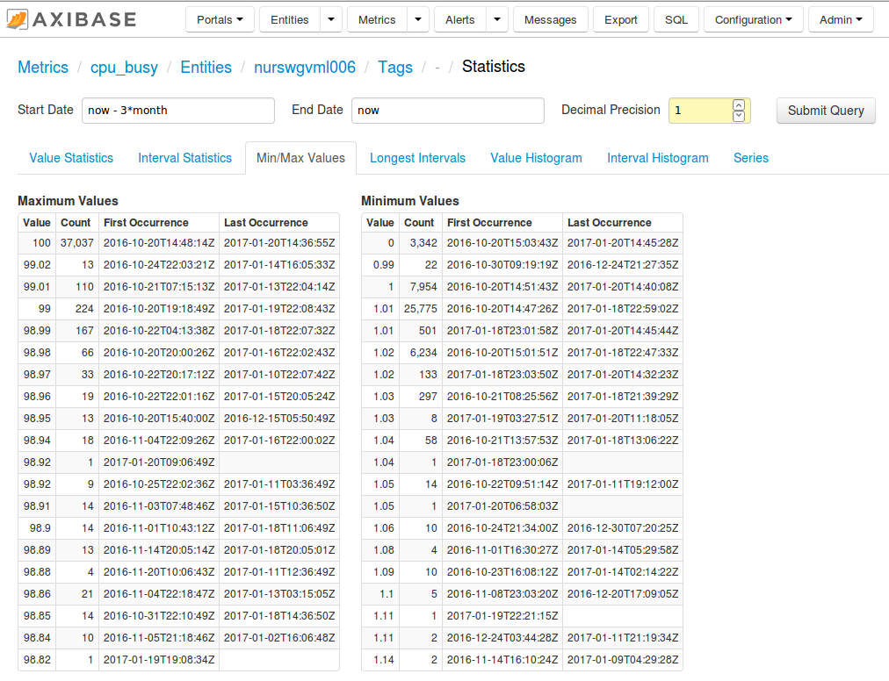

* Longest Intervals: provides the maximum 20 time intervals between time series samples. Provided in milliseconds and in human readable format.

  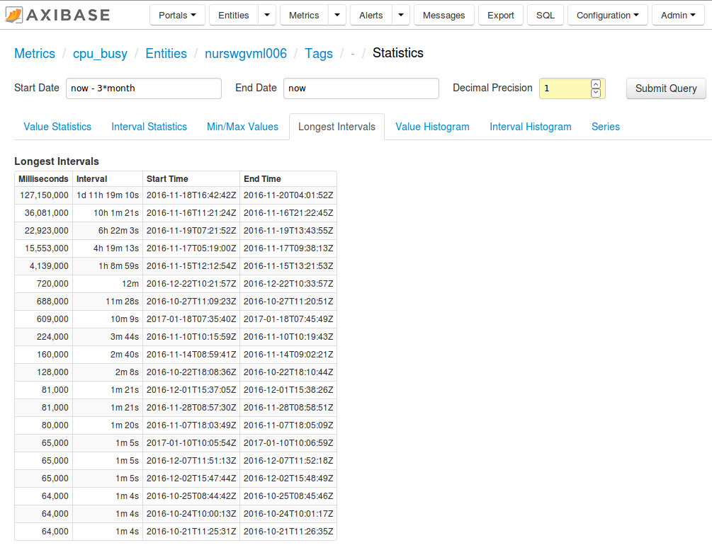

* Value Histogram: provides a breakdown of the distribution of the values within the specified series. You need to specify the **Min Value**, **Max Value**, and **Interval Count** fields,
  and then click **Submit**.

  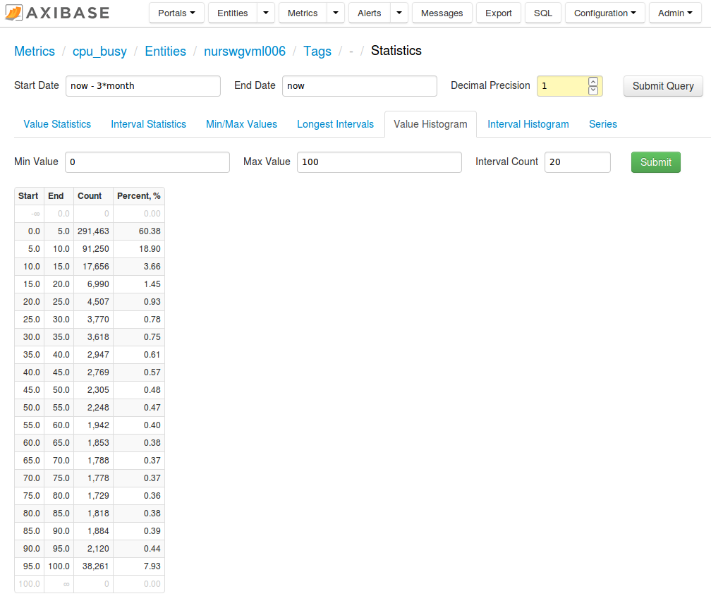

* Interval Histogram: provides a breakdown of the distribution of the values within the specified series. You need to specify the **Min Value**, **Max Value**, and **Interval Count**
  fields, and then click **Submit**.

  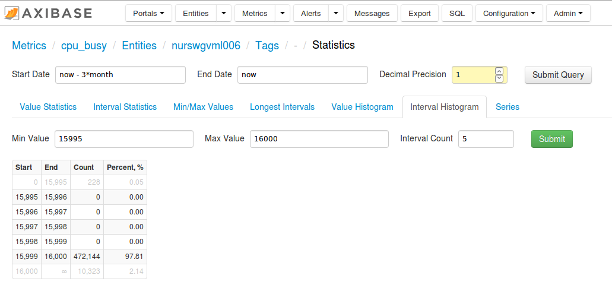

* Series: provides links to the Metric and Entity labels. Additionally, allows the user to export the series data, open the [SQL Console](../../sql/sql-console.md), and to view a Chart Lab graph showing the
  distribution of the data.

  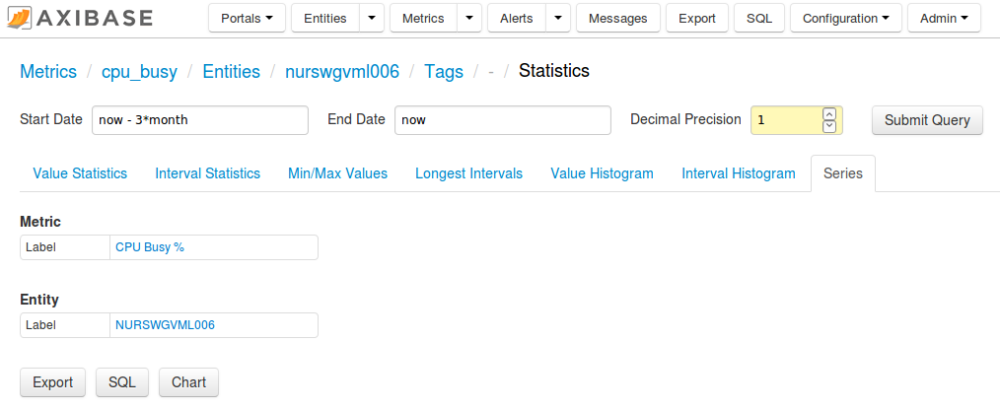

### Issue 3784

If a SQL query returns millions of rows, it can be useful to split it into multiple queries. This can be accomplished by including `${SPLIT_CONDITION}` in the query text and specifying multiple split conditions, one per line.

```sql
SELECT tag, descriptor, zero, zero + span as maxvalue, engunits,
CASE WHEN step = 0 THEN 'linear' ELSE 'previous' END AS interp,
CASE WHEN pointtypex = 'float64' THEN 'double'
     WHEN pointtypex IN ('float16', 'float32') THEN 'float'
     ELSE 'long'
END AS atsd_type
FROM pipoint..pipoint2
WHERE ${SPLIT_CONDITION}
```

Split Conditions:

```sql
tag LIKE 'AB%'
tag LIKE 'AC%'
tag LIKE 'DA%'
NOT (tag LIKE 'AB%' OR tag LIKE 'AC%' OR tag LIKE 'DA%')
```

This causes 4 queries to be executed, with first query results being filtered with `tag LIKE 'AB%'` condition:

```sql
SELECT tag, descriptor, zero, zero + span as maxvalue, engunits,
CASE WHEN step = 0 THEN 'linear' ELSE 'previous' END AS interp,
CASE WHEN pointtypex = 'float64' THEN 'double'
     WHEN pointtypex IN ('float16', 'float32') THEN 'float'
     ELSE 'long'
END AS atsd_type
FROM pipoint..pipoint2
WHERE tag LIKE 'AB%'
```

The last condition is typically included to select all remaining rows other than those fetched with previous conditions.

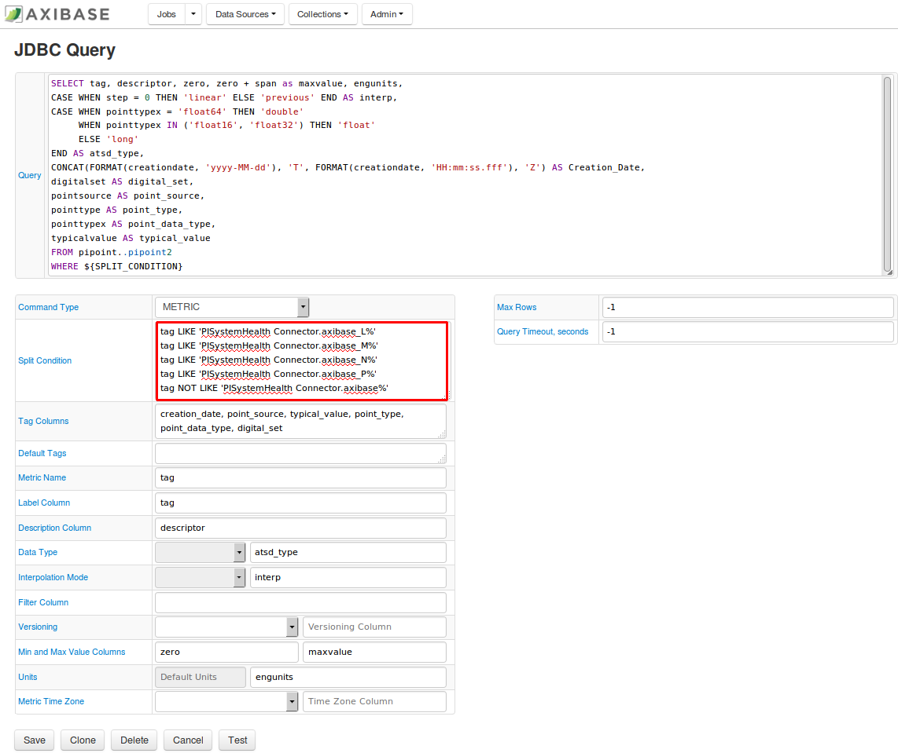

### Issue 2528

To reduce rename or transform multiple similar column headers with one setting, support added to the `column-label-format` setting for property and table widgets. For example, in
order to remove a common prefix from a column label, add the following code snippet to your configuration:

```javascript
column-label-format = value.replace(/^systemproperties./, "")
```

[ChartLab](https://apps.axibase.com/chartlab/1ee27e2e/4/)

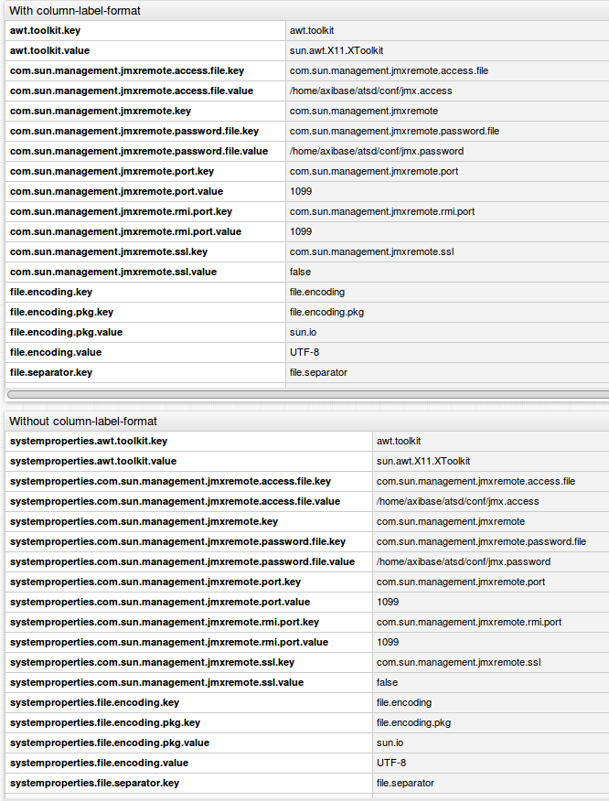

### Issue 1926

On mouse over for box charts, metric names are displayed at the top of the box and the distribution of the series (minimum, maximum, count, and value percentiles) is displayed next to its respective series.

[ChartLab](https://apps.axibase.com/chartlab/46e8b4ec)

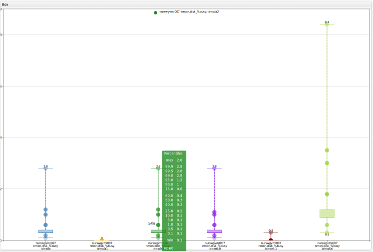

### Issue 3756

Fixed the SQL executor to return correct results for a query containing a tag filter on a joined table (`t64o.tags.city = 'New York'`).

```sql
SELECT t1.datetime, count(t1.value), count(t2.value)
  FROM dmv_incidents t1
  JOIN dmv_registrations t2
WHERE t1.entity = 'mr8w-325u'
  AND t1.tags.city = 'New York'
  AND t2.tags.city = 'New York'
GROUP BY t1.tags, t1.period(1 year)
```

### Issue 3751

Addressed an error for `entityExpression` in [series](../../api/data/series/query.md) query method when `isEmpty()` is specified with round brackets.

```json
[{
  "startDate": "2016-12-27T09:59:30Z",
  "endDate":   "2016-12-27T10:00:00Z",
  "entityGroup": "nmon-sub-group",
  "entityExpression": "property_values('asset::function').isEmpty()",
  "metric": "cpu_busy"
}]
```

### Issue 3749

Fixed the SQL parser to allow [`LOCATE`](../../sql/README.md#string-functions) function to be used in the `WHERE` clause.

```sql
SELECT sum(value)
  FROM df.disk_used
WHERE datetime > now - 1 * minute
  AND LOCATE('/', tags.file_system) > 0
```

### Issue 3747

The [`CAST`](../../sql/README.md#cast) function now accepts output of the [`date_format`](../../sql/README.md#date_format) function as the argument, for example:

```sql
SELECT date_format(time, 'eee HH') AS 'hour_in_day',
  avg(value)
FROM mpstat.cpu_busy
  WHERE datetime >= current_week
  AND CAST(date_format(time, 'H') AS number) >= 9 AND CAST(date_format(time, 'H') AS number) < 18
GROUP BY date_format(time, 'eee HH')
  ORDER BY 2 DESC
```

### Issue 3746

Updated the `u` pattern to return a numeric value representing the [day number](../../shared/time-pattern.md) within a week (1 = Monday, ..., 7 = Sunday).

```sql
SELECT date_format(time, 'e'),
  avg(value)
FROM mpstat.cpu_busy
  WHERE datetime >= previous_week
GROUP BY date_format(time, 'u')
  ORDER BY date_format(time, 'u')
```

### Issue 3741

Rows not merged as expected for tag names with the same names but different values by [`JOIN USING ENTITY`](../../sql/README.md#join-syntax). For example, the same tag `tag1` with different values `a` and `b`.

```ls
series d:2016-12-23T00:00:00.000Z e:e1 m:m3=1 t:tag1=a
series d:2016-12-23T00:00:00.000Z e:e1 m:m4=1 t:tag1=b
```

```sql
SELECT *
  FROM m3
  JOIN USING ENTITY m4
```

### Issue 3740

Fixed API processor to return the history of the `text` field for versioned metrics.

```ls
series e:e-vers-text d:2016-12-22T00:00:00Z x:vers-text-m=hello1
... wait, then insert again a different text value
series e:e-vers-text d:2016-12-22T00:00:00Z x:vers-text-m=hello2
```

```json
[{
  "startDate": "2016-12-20T00:00:00Z",
  "endDate":   "now",
  "entity": "*",
  "metric": "vers-text-m",
  "versioned": true
}]
```

```json
[
  {
    "entity": "e-vers-text",
    "metric": "vers-text-m",
    "data": [
      {
        "d": "2016-12-22T00:00:00.000Z",
        "v": "NaN",
        "x": "hello1",
        "version": {
          "d": "2016-12-22T14:00:37.743Z"
        }
      },
      {
        "d": "2016-12-22T00:00:00.000Z",
        "v": "NaN",
        "x": "hello2",
        "version": {
          "d": "2016-12-22T14:00:42.137Z"
        }
      }
    ]
  }
]
```

### Issue 3738

The `ABS()` function produces an error when an expression is submitted:

```sql
SELECT ABS(max(value)*avg(value))
  FROM mpstat.cpu_busy
WHERE datetime > previous_minute
```

### Issue 3721

Optimized `LIKE` operator to filter out series using the last insert table. The below query now provides similar performance such as for `tags.city = 'Philadelphia'`.

```sql
SELECT count(*)
  FROM dmv_incidents
WHERE entity = 'mr8w-325u'
  AND tags.city LIKE 'Philadelphia'
```

### Issue 3711

Upgraded lexer to resolve slow parsing of queries such as shown below:

```sql
SELECT value+value+value+value
  +value+value+value+value
  +value+value+value+value
  +value+value+value+value
  +value+value+value+value
  +value+value+value+value
  +value+value+value
FROM 'testmetric'
```

### Issue 3695

Fixed a defect with the `GROUP BY` and `JOIN` clauses to return results for the following queries:

```sql
SELECT sum(t1.value), sum(tot.value)
  FROM dmv_incidents tot
JOIN dmv_registrations t1
  WHERE tot.entity = 'mr8w-325u'
  AND tot.tags.city = 'New York'
GROUP BY tot.period(1 year)
```

### Issue 3661

The `CAST` function transforms a string into a number which can then be used in arithmetic expressions.

```sql
CAST(inputString AS Number)
```

```sql
SELECT datetime, value, entity, tags,
  value/CAST(LOOKUP('disk-size', concat(entity, ',', tags.file_system)) AS Number) AS 'pct_used'
FROM disk.stats.used
  WHERE datetime > current_hour
```

### Issue 3743

Released an initial version of the PI Server emulator, which returns results for queries against the virtual `picomp2` and `pipoint2` tables.
The emulator operates via the ATSD JDBC driver (not the PI JDBC driver).

```sql
SELECT *
FROM pipoint..pipoint2
```

### Issue 3754

Columns not created for series with a statistic and wildcard match: [ChartLab](https://apps.axibase.com/chartlab/506da7c3)

### Issue 3654

Added support for meta fields in label-format (and series tooltips) to ensure that that `meta.metric.tag` and `meta.entity.tag` can be replaced with metadata values, loaded from the server.

Meta-data examples are documented [here](https://axibase.com/products/axibase-time-series-database/visualization/widgets/metadata/).

[ChartLab](https://apps.axibase.com/chartlab/506da7c3)

### Issue 3636

Updated charts to display series if requested for an entity group or with an entity expression: [ChartLab](https://apps.axibase.com/chartlab/480bd642)

### Issue 3143

Fixed an issue which caused the value and time columns of series with shorter period to not be displayed: [ChartLab](https://apps.axibase.com/chartlab/adce7a9c)
