# Monthly Change Log: July 2017

## ATSD

| Issue| Category    | Type    | Subject              |
|------|-------------|---------|----------------------|
| 4419 | sql | Bug | IndexOutOfBoundsException fixed in queries that referred to a non-existent metric. |
| 4417 | sql | Bug | Fixed a NullPointerException if all columns selected for a new metric without any samples. |
| [4416](#issue-4416) | api-network | Feature | `Invalid Action (a)` string field added to the [`metric`](../../api/network/metric.md#metric-command) command
| 4409 | export | Bug | Added `metrics.unit` to the list of fields in the backup XML files. |
| 4400 | sql | Bug | Fixed illegal syntax error when querying table names containing dots. |
| [4398](#issue-4398) | UI | Feature | Refactored the **[Metrics]** tab to improve usability. |
| 4359 | forecast | Bug |  Fixed a [Forecast](../../forecasting/README.md) calculation error if the settings specify an [calendar](../../shared/calendar.md) keyword in the future.|
| 4390 | sql | Bug | Fixed [`CAST`](../../sql/README.md#reserved-words) conversion error with the built-in `time` column. |
| [4375](#issue-4375) | sql | Feature | Added support for [`CURRENT_TIMESTAMP`](../../sql/README.md#current_timestamp) and [`DBTIMEZONE`](../../sql/README.md#dbtimezone) functions. |
| [4360](#issue-4360) | forecast | Feature | Added support for additional aggregation functions in [forecast](../../forecasting/README.md) settings: `AVG`, `MIN`, `MAX`, `SUM`, `COUNT`.  |
| 4352 | SQL| Feature | Standardized the list of columns for wildcard [`SELECT *`](../../sql/examples/select-all-tags.md) expressions. |
| 4350 | SQL| Bug | Metadata `titles` field now contains column labels instead of column names. JDBC driver compatibility is v.1.3.+. |
| 4347 | Search| Feature | Full search re-indexing can be scheduled separately from incremental (delta) re-indexing. |
| 4346 | JDBC | Feature | Database and ResultSet metadata standardized [JDBC driver](https://github.com/axibase/atsd-jdbc#jdbc-driver) for compatibility.  |
| 4344 | SQL | Bug | Remove unnecessary quotes from CSV files produced with the [SQL Console](../../sql/README.md#sql) export option. |
| 4343 | JDBC | Feature | `assignColumnNames=true|false` setting added to control the behavior of `getColumnName()` and `getColumnLabel()` methods in the [JDBC](https://github.com/axibase/atsd-jdbc#jdbc-connection-properties-supported-by-driver) driver. |
| 4335 | sql | Feature | Optimize metadata queries with a `false` condition, for example `WHERE 1=0`. The queries are used by some BI tools (Tableau) to retrieve column information. |
| [4331](#issue-4331) | UI | Feature | Implement right-to-left Text Direction layout for Arabic and Hebrew languages. |
| 4327 | search | Feature | Implement [Synonym Search](../../search/synonyms.md). |
| [4327a](#issue-4327a) | search | Feature | Implement [Series Search](../../search/README.md). |
| 4313 | export | Bug | Modify Excel files produced by ATSD to increase compatibility with analytics tools such as IBM SPSS. |
| 4312 | sql | Bug | Fix a NullPointerException in the [SQL Console](../../sql/sql-console.md) when results contain [`NULL`](../../sql/README.md#null) values. |
| [4320](#issue-4320) | Search | Feature | Live search added to ATSD to quickly find series with metadata queries. |
| [4226](#issue-4226) | SQL | Feature | Support added for [`COALESCE`](../../rule-engine/functions-text.md#coalesce) function.|
| 4117 | SQL | Bug | Fixed a defect with some [metric columns](../../sql/README.md#metric-columns) not accessible in [`WHERE`](../../sql/README.md#where-clause)/[`HAVING`](../../sql/README.md#having-filter) filters, for example `WHERE metric.units = 'Celcius'`. |
| 3888 | SQL | Bug | Fixed a defect with some [entity columns](../../sql/README.md#entity-columns) not accessible in [`WHERE`](../../sql/README.md#where-clause)/[`HAVING`](../../sql/README.md#having-filter) filters, for example `WHERE entity.label = 'SVL'`. |
| [4286](#issue-4286) | sql | Feature | Formalize boolean logic in SQL queries. |
| [4403](#issue-4403) | sql | Bug | Added syntax validation for the [`IN`](../../sql/README.md#where-clause) clause to require enclosing within round brackets. |
| [4377](#issue-4377) | sql | Feature | Add support for selecting all columns in [inline views](../../sql/README.md#inline-views). |
| [4361](#issue-4361) | sql | Feature | Add support for compressed CSV files in scheduled [SQL query export](../../sql/scheduled-sql.md) |
| [3918](#issue-3918) | api-rest | Bug | Replace `last=true` with `limit=1` in Series [Get](../../api/data/series/get.md) method. |

---

### Issue 4416

**[`metric`](../../api/network/metric.md#metric-command) Command Syntax**:

```css
metric m:{metric} b:{enabled} p:{data-type} l:{label} d:{description} i:{interpolate} u:{units} f:{filter} z:{timezone} v:{versioning} a:{invalid_action} min:{minimum_value} max:{maximum_value} t:{tag-1}={text} t:{tag-2}={text}
```

### Issue 4403

This query causes an error:

```sql
SELECT * FROM jvm_memory_used
  WHERE value IN 169328488
  AND datetime > NOW - 10*HOUR
```

The correct syntax is to use round brackets:

```sql
SELECT * FROM jvm_memory_used
  WHERE value IN (169328488)
  AND datetime > NOW - 10*HOUR
  ### Issue 4398
```

### Issue 4398

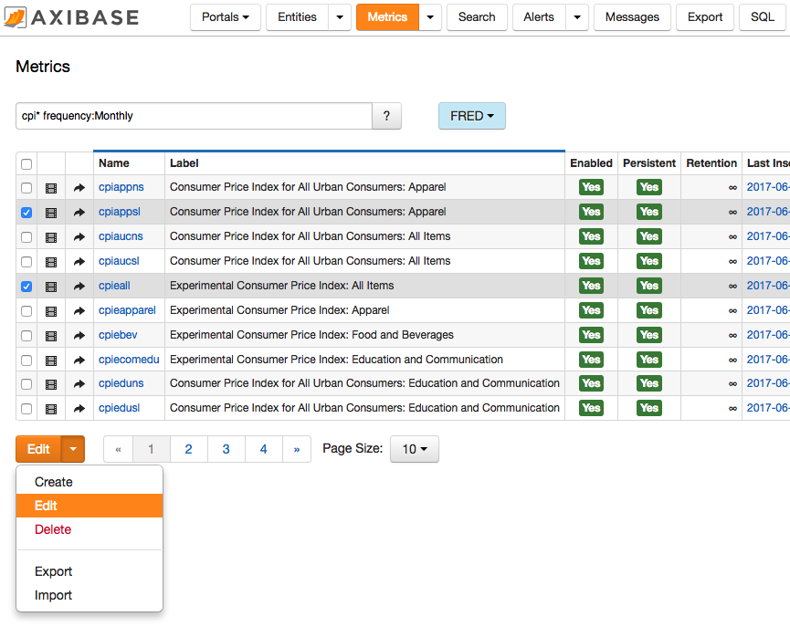

**Feature Details**:

* Flexible search expression
* Tag sets to display common sets of metric tags
* State stored in cookies
* Button toolbar simplified

### Issue 4375

The `CURRENT_TIMESTAMP` function returns current database date and time in [ISO format](../../shared/date-format.md) similar to the [`NOW`](../../sql/README.md#reserved-words)
function which returns current database time as Unix time in milliseconds.

The [`DBTIMEZONE`](../../sql/README.md#dbtimezone) function returns the current database time zone name or GMT offset.

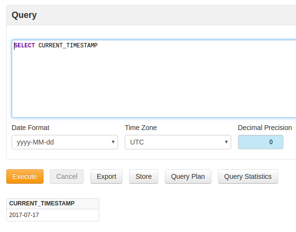

### Issue 4360

A custom aggregation function such as `MAX` can now be selected in **Forecast** settings. Previously only supported `AVG` function. Aggregation functions are applied to regularize the underlying time series prior to applying Holt-Winters or ARIMA algorithms.

#### `AVG`

Averages the values during a period.

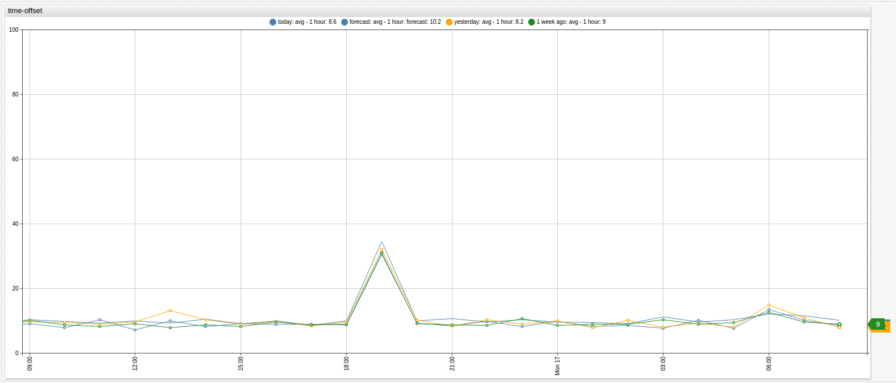

#### `MAX`

Displays the maximum value during a period.

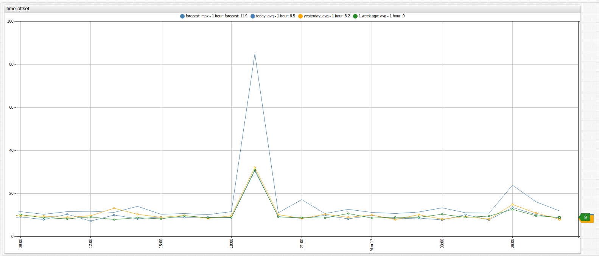

#### `MIN`

Displays the minimum value during a period.

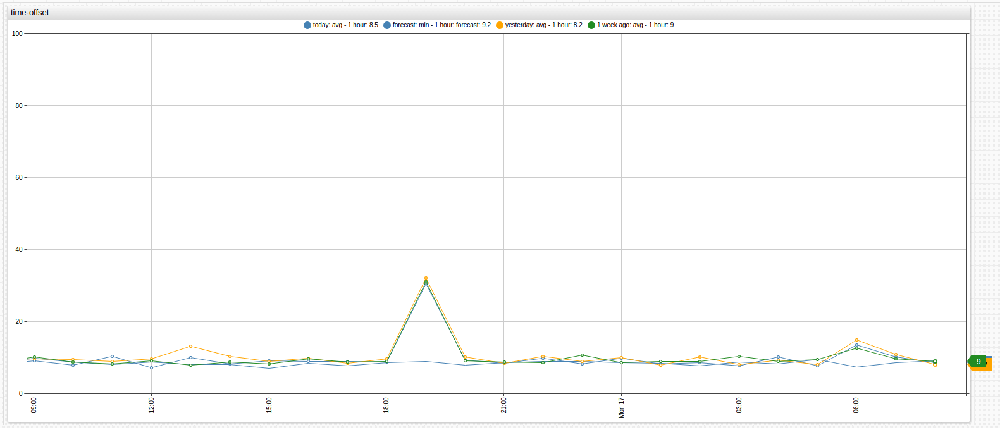

#### `SUM`

Sums the values during a period.

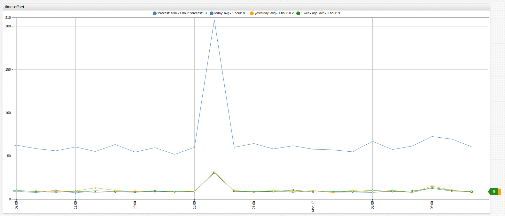

#### `COUNT`

Displays the number of samples for a period.

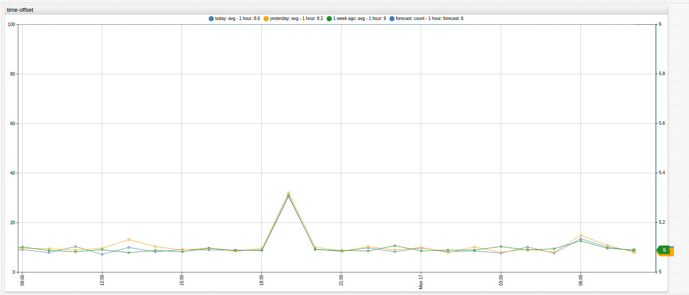

### Issue 4331

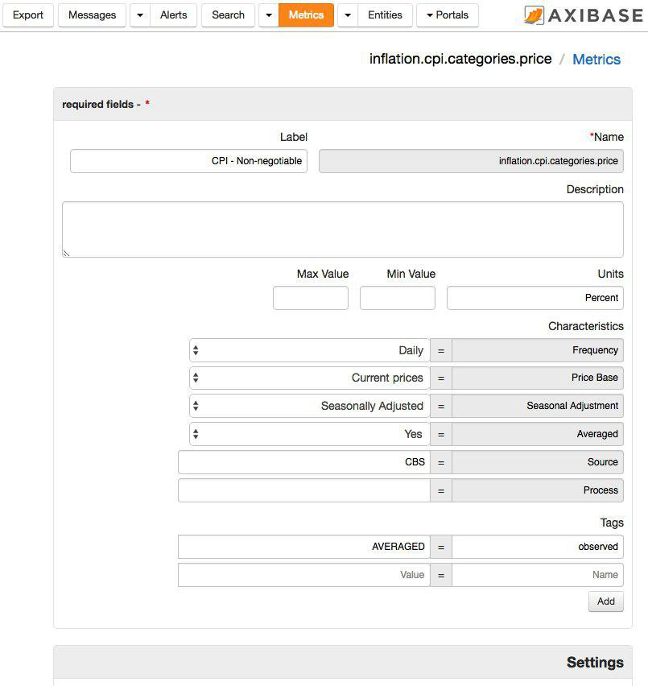

### Issue 4327a

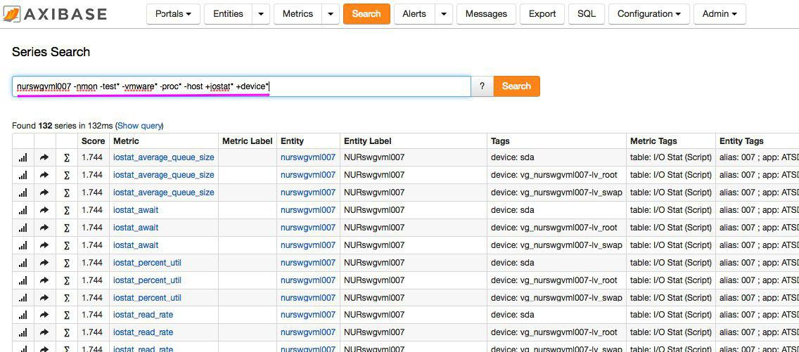

### Issue 4286

Truth Tables for Logical Operators:

Table 1.1

| X | Not X |
|:---:|:-----:|
|`true`| `false` |
| `false` | `true` |
| `NULL` | `NULL` |

Table 1.2

| X | Y | X and Y | X or Y |
|:---:|:---:|:-------:|:------:|
| `true` | `true` | `true` | `true` |
| `true` | `false` | `false` | `true` |
| `false` | `false` | `false` | `false` |
| `true` | `NULL` | `NULL` | `true` |
| `false` | `NULL` | `false` | `NULL` |
| `NULL` | `NULL`| `NULL` | `NULL` |

### Issue 4377

Add support for selecting all columns with an asterisk (`*`) symbol in inline views:

```sql
SELECT TableauSQL.datetime AS datetime,
  TableauSQL.value AS value
FROM ( select * from table_size ) TableauSQL
  LIMIT 10
```

### Issue 4361

Compression for CSV report files can be selected on the **SQL > Scheduled Queries** page.


### Issue 3918

 `last=true` is replaced with `limit=1` and `direction=DESC`.

```json
[{
  "startDate": "2017-02-28T19:00:00Z",
  "endDate":   "2017-02-28T20:00:00Z",
  "entity": "nurswgvml007",
  "metric": "cpu_busy",
  "limit": 1
}]
```

### Issue 4320

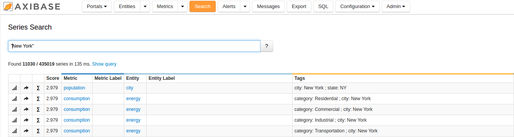

Live Search Search

### Issue 4226

The `COALESCE` function returns the first argument that is not `NULL` or `NaN`.

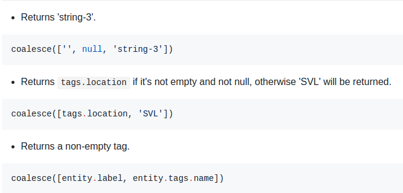
